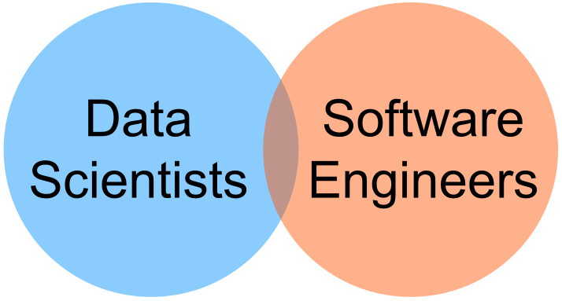

<div class="chapter">Chapter 1</div>

# Introduction

Machine learning (ML) has enabled incredible advances in the capabilities of software products, allowing us to design systems that would have seemed like science fiction only one or two decades ago, such as personal assistants answering voice prompts, medical diagnoses outperforming specialists, autonomous delivery drones, and tools creatively manipulating photos and video with natural language instructions. Machine learning also has enabled useful features in existing applications, such as suggesting [personalized playlists](https://engineering.atspotify.com/2020/01/16/for-your-ears-only-personalizing-spotify-home-with-machine-learning/) for video and music sites, generating [meeting notes](https://fireflies.ai) for video conferences, and identifying animals in [camera traps](https://github.com/agentmorris/camera-trap-ml-survey). Machine learning is an incredibly popular and active field, both in research and actual practice.

Yet, building and deploying products that use machine learning is incredibly challenging. Consultants report that [87 percent](https://venturebeat.com/2019/07/19/why-do-87-of-data-science-projects-never-make-it-into-production/) of machine-learning projects fail and [53 percent](https://www.gartner.com/en/newsroom/press-releases/2020-10-19-gartner-identifies-the-top-strategic-technology-trends-for-2021) do not make it from prototype to production. Building an accurate model with machine-learning techniques is already difficult, but building a product and a business requires also collecting the right data, building an entire software product around the model, protecting users from harm caused by model mistakes, and successfully deploying, scaling, and operating the product with the machine-learned models. Pulling this off successfully requires a wide range of skills, including *data science* and *statistics*, but also *domain expertise* and *data management* skills, *software engineering* capabilities, *business* skills, and often also knowledge about *user experience design*, *security*, *safety,* and *ethics*. 

In this book, we focus on the engineering aspects of building and deploying software products with machine-learning components, from using simple decision trees trained on some examples in a notebook, to deep neural networks trained with sophisticated automated pipelines, to prompting large language models. We discuss the new challenges machine learning introduces for software projects and how to address them. We explore how data scientists and software engineers can better work together and better understand each other to build not only prototype models but production-ready systems. We adopt an *engineering mindset*: building systems that are usable, reliable, scalable, responsible, safe, secure, and so forth—but also doing so while navigating trade-offs, uncertainty, time pressure, budget constraints, and incomplete information. We extensively discuss how to *responsibly engineer* products that protect users from harm, including safety, security, fairness, and accountability issues.

## Motivating Example: An Automated Transcription Start-up


Let us illustrate the challenges of building a product with machine-learning components with an illustrative scenario, set a few years ago when deep neural networks first started to dominate speech recognition technology. 

Assume that, as a data scientist, Sidney has spent the last couple of years at a university pushing the state of the art in speech recognition technology. Specifically, the research was focused on making it easy to specialize speech recognition for specific domains to detect technical terminology and jargon in that domain. The key idea was to train neural networks for speech recognition with lots of data (e.g., PBS transcripts) and combine this with transfer learning on very small annotated domain-specific datasets from experts. Sidney has demonstrated the feasibility of the idea by showing how the models can achieve impressive accuracy for transcribing doctor-patient conversations, transcribing academic conference talks on poverty and inequality research, and subtitling talks at local Ruby programming meetups. Sidney managed to publish the research insights at high-profile academic machine-learning conferences.

During this research, Sidney talked with friends in other university departments who frequently conduct *interviews* for their research. They often need to transcribe recorded interviews (say forty interviews, each forty to ninety minutes long) for further analysis, and they are frustrated with current transcription services. Most researchers at the time used transcription services that employed other humans to transcribe the audio recordings (e.g., by hiring crowdsourced workers on Amazon’s Mechanical Turk in the back end), usually priced at about $1.50 per minute and with a processing time of several days. At this time, a few services for machine-generated transcriptions and subtitles existed, such as YouTube’s automated subtitles, but their quality was not great, especially when it came to technical vocabulary. Similarly, Sidney found that conference organizers were increasingly interested in providing *live captions* for talks to improve accessibility for conference attendees. Again, existing live-captioning solutions often either had humans in the loop and were expensive or they produced low-quality transcripts.

Seeing the demand for automated transcriptions of interviews and live captioning, and having achieved good results in academic experiments, Sidney decides to try to commercialize the domain-specific speech-recognition technology by creating a start-up with some friends. The goal is to sell domain-specific transcription and captioning tools to academic researchers and conference organizers, undercutting the prices of existing services at better quality.

Sidney quickly realizes that, even though the models trained in research are a great starting point, it will be a long path toward building a business with a stable product. To build a commercially viable product, there are lots of challenges:

  * In academic papers, Sidney’s models outperformed the state-of-the-art models on accuracy measured on test data by a significant margin, but audio files received from customers are often noisier than those used for benchmarking in academic research. 

  * In the research lab, it did not matter much how long it took to train the model or transcribe an audio file. Now customers get impatient if their audio files are not transcribed within 15 minutes. Worse, live captioning needs to be essentially instantaneous. Making model inference faster and better scalable to process many transcriptions suddenly becomes an important focus for the start-up. Live captioning turns out to be unrealistic after all unless expensive specialized hardware is shipped to the conference venue to achieve latency acceptable in real-time settings.

  * The start-up wants to undercut the market significantly with transcriptions at very low prices. However, both training and inference (i.e., actually transcribing an audio file with the model) are computationally expensive, so the amount of money paid to a cloud service provider substantially eats into the profit margins. It takes a lot of experimentation to figure out a reasonable and competitive price that customers are willing to pay and still make a profit.

  * Attempts at using new large language models to improve transcripts and adding new features, like automated summaries, run quickly into excessive costs paid to companies providing the model APIs. Attempts to self-host open-source large language models were frustratingly difficult due to brittle and poorly maintained libraries and ended up needing most of the few high-end GPUs the start-up was able to buy, which were all desperately needed already for other training and inference tasks.

  * While previously fully focused on data-science research, the team now needs to build a website where users can upload audio files and see results—with which the team members have no experience and which they do not enjoy. The user experience makes it clear that the website was an afterthought—it is tedious to use and looks dated. The team now also needs to deal with payment providers to accept credit card payments. Realizing in the morning that the website has been down all night or that some audio files have been stuck in a processing queue for days is no fun. They know that they should make sure that customer data is stored securely and privately, but they have little experience with how to do this properly, and it is not a priority right now. Hiring a front-end web developer has helped make the site look better and easier to change, but communication between the founders and the newly hired engineers turns out to be much more challenging than anticipated. Their educational backgrounds are widely different and they have a hard time communicating effectively to ensure that the model, back end, and user interface work well together as an integrated product.

  * The models were previously trained with many manual steps and a collection of scripts. Now, every time the model architecture is improved or a new domain is added, someone needs to spend a lot of time re-training the models and dealing with problems, restarting jobs, tuning hyperparameters, and so forth. Nobody has updated the Tensorflow library in almost a year, out of fear that something might break. Last week, a model update went spectacularly wrong, causing a major outage and a long night of trying to revert to a previous version, which then required manually re-running a lot of transcription jobs for affected customers.

  * After a rough start, customer feedback is now mostly positive, and more customers are signing up, but some customers are constantly unhappy and some report some pretty egregious mistakes. One customer sent a complaint with several examples of medical diagnoses incorrectly transcribed with high confidence, and another wrote a blog post about how the transcriptions for speakers with African American vernacular at their conference are barely intelligible. Several team members spend most of their time chasing problems, but debugging remains challenging and every fixed problem surfaces three new ones. Unfortunately, unless a customer complains, the team has no visibility into how the model is really doing. They also only now start collecting basic statistics about whether customers return.


Most of these challenges are probably not very surprising and most are not unique to projects using machine learning. Still, this example illustrates how going from an academic prototype showing the feasibility of a model to a product operating in the real world is far from trivial and requires substantial engineering skills.

For the transcription service, the machine-learned model is clearly the essential core of the entire product. Yet, this example illustrates how, when building a production-ready system, there are many more concerns beyond training an accurate model. Even though many non-ML components are fairly standard, such as the website for uploading audio files, showing transcripts, and accepting payment, as well as the back end for queuing and executing transcriptions, they nonetheless involve substantial engineering effort and additional expertise, far beyond the already very specialized data-science skills to build the model in the first place.

This book will systematically cover engineering aspects of building products with machine-learning components, such as this transcription service. We will argue for a broad view that considers the entire system, not just the machine-learning components. We will cover requirements analysis, design and architecture, quality assurance, and operations, but also how to integrate work on many different artifacts, how to coordinate team members with different backgrounds in a planned process, and how to ensure responsible engineering practices that do not simply ignore fairness, safety, and security. With some engineering discipline, many of the challenges discussed previously can be anticipated; with some up-front investment in planning, design, and automation many problems can be avoided down the road.

## Data Scientists and Software Engineers

Building production systems with machine-learning components requires many forms of expertise. Among others, 

  * We need *business skills* to identify the problem and build a company.

  * We need *domain expertise* to understand the data and frame the goals for the machine-learning task.

  * We need the *statistics and data science skills* to identify a suitable machine-learning algorithm and model architecture. 

  * We need the *software engineering skills* to build a system that integrates the model as one of its many components.

  * We need *user-interface design skills* to understand and plan how humans will interact with the system (and its mistakes). 

  * We may need *system operations skills* to handle system deployment, scaling, and monitoring.

  * We may want help from *data engineers* to extract, move and prepare data at scale.

  * We may benefit from experience with *prompting* large language models and other foundation models, following discoveries and trends in this fast moving space.

  * We may need *legal expertise* from lawyers who check for compliance with regulations and develop contracts with customers.

  * We may need specialized *safety and security expertise* to ensure the system does not cause harm to the users and environment and does not disclose sensitive information.

  * We may want *social science skills* to study how our system could affect society at large.

  * We need *project management skills* to hold the whole team together and keep it focused on delivering a product. 


To keep a manageable scope for this book, we particularly focus on the roles of developers—specifically *data scientists* and *software engineers* working together to develop the core technical components of the system. We will touch on other roles occasionally, especially when it comes to deployment, human-AI interaction, project management, and responsible engineering, but generally we will focus on these two roles.

<figure>



<figcaption>

The central theme of this book: how to get data scientists and software engineers to each contribute their distinct expertise while effectively working together.

</figcaption>
</figure>

Data scientists and software engineers tend to have quite different skills and educational backgrounds, which are both needed for building products with machine-learning components. 

Data scientists tend to have an educational background (often even a PhD degree) in statistics and machine-learning algorithms. They usually prefer to focus on building models (e.g., feature engineering, model architecture, hyperparameter tuning) but also spend a lot of time on gathering and cleaning data. They use a science-like exploratory workflow, often in computational notebooks like *Jupyter*. They tend to evaluate their work in terms of accuracy on held-out test data, and maybe start investigating fairness or robustness of models, but tend to rarely focus on other qualities such as inference latency or training cost. A typical data-science course either focuses on how machine-learning algorithms work or on applying machine-learning algorithms to develop models for a clearly defined task with a provided dataset. 

In contrast, software engineers tend to focus on delivering software products that meet the user’s needs, ideally within a given budget and time. This may involve steps like understanding the user’s requirements; designing the architecture of a system; implementing, testing, and deploying it at scale; and maintaining and improving it over time. Software engineers often work with uncertainty and budget constraints, and they constantly apply engineering judgment to navigate trade-offs between various qualities, including usability, scalability, maintainability, security, development time, and cost. A typical software-engineering curriculum covers requirements engineering, software design, and quality assurance (e.g., testing, test automation, static analysis), but also topics like distributed systems and security engineering, often ending with a capstone project to work on a product for a customer.

The described distinctions between data scientists and software engineers are certainly oversimplified and overgeneralized, but they characterize many of the differences we observe in practice. It is not that one group is superior to the other, but they have different, complementary expertise and educational backgrounds that are both needed to build products with machine-learning components. For our transcription scenario, we will need data scientists to build the transcription models that form the core of the application, but also software engineers to build and maintain a product around the model.

Some developers may have a broad range of skills that include both data science and software engineering. These types of people are often called “*unicorns*,” since they are rare or even considered mythical. In practice, most people specialize in one area of expertise. Indeed, many data scientists report that they prefer modeling but do not enjoy infrastructure work, automation, and building products. In contrast, many software engineers have developed an interest in machine learning, but research has shown that without formal training, they tend to approach machine learning rather naively with little focus on feature engineering, they rarely test models for generalization, and they think of *more data* and *deep learning* as the only next steps when stuck with low-accuracy models.

In practice, we need to bring people with different expertise who specialize in different aspects of the system together in *interdisciplinary teams*. However, to make those teams work, team members from different backgrounds need to be able to understand each other and appreciate each other's skills and concerns. This is a central approach of this book: rather than comprehensively teaching software engineering skills to data scientists or comprehensively teaching data science skills to software engineers, we will provide a broad overview of all the concerns that go into building products, involving both data science and software engineering parts. We hope this will provide sufficient context that data scientists and software engineers appreciate each other’s contributions and work together, thus educating *T-shaped team members*. We will return to many of these ideas in the chapter *[Interdisciplinary Teams](21-interdisciplinary-teams.md)*.

<figure>


<figcaption>

Characterizing team members based on depth of expertise (vertically) and breadth of expertise (horizontally): T-Shaped team members combine deep expertise in one topic with broad knowledge of others. They are ideal members in interdisciplinary teams, since they can effectively understand and collaborate with others.

</figcaption>
</figure>

## Machine-Learning Challenges in Software Projects

There is still an ongoing debate within the software-engineering community on whether machine learning fundamentally changes how we engineer software systems or whether we essentially just need to rigorously apply existing engineering practices that have long been taught to aspiring software engineers.

Let us look at three challenges introduced by machine learning, which we will explore in much more detail in later chapters of this book.

### Lack of Specifications

In traditional software engineering, abstraction, reuse, and composition are key strategies that allow us to decompose systems, work on components in parallel, test parts in isolation, and put the pieces together for the final system. However, a key requirement for such decomposition is that we can come up with a *specification* of what each component is supposed to do, so that we can divide the work and separately test each component against its specification and rely on other components without having to know all their implementation details. Specifications also allow us to work with opaque components where we do not have access to the source in the first place or do not understand the implementation.

<figure>

```python
def compute_deductions(agi, expenses):
    """
    Compute deductions based on provided adjusted gross income 
    and expenses in customer data.
    
    See tax code 26 U.S. Code A.1.B, PART VI.
    
    Adjusted gross income must be a positive value. 
    Returns computed deduction value.
    """
```

<figcaption>

Example of a textual specification for a traditional software function as common in software projects, describing what the function does and how to compute the results (pointing to another document for details in this case). A developer can implement this function according to the specification, without needing to understand the rest of the system. Another developer working on another part of the system can rely on this function without having access to its implementation.

</figcaption>
</figure>

With machine learning, we have a hard time coming up with good specifications. We can generally describe the task, but not how to do it, or what the precise expected mapping between inputs and outputs is—it is less obvious how such a description could be used for testing or to provide reliable contracts to the clients of the function. With foundation models like GPT-4, we even just provide natural language prompts and hope the model understands our intention. We use machine learning precisely because we do not know how to specify and implement specific functions. 

<figure>

```python
def transcribe(audio_file):
    """
    Return the text spoken within the audio file.

    ????
    """
```

<figcaption>

Example of a possible inference function for a model, which is difficult to specify. The documentation indicates the purpose of the function, but it is less obvious when an implementation would be considered “correct” or “good enough.” Whether a learned model is good enough depends on how and for what it is used in the system.

</figcaption>
</figure>

Machine learning introduces a fundamental shift from *deductive reasoning* (mathy, logic-based, applying logic rules) to *inductive reasoning* (sciency, generalizing from observation). As we will discuss at length in the chapter *[Model Quality](15-model-quality.md)*, we can no longer say whether a component is *correct*, because we do not have a specification of what it means to be correct, but we evaluate whether it works *well enough* (on average) on some test data or in the context of a concrete system. We actually do not expect a perfect answer from a machine-learned model for every input, which also means our system must be able to tolerate some incorrect answers, which influences the way we design the rest of the system and the way we validate the systems as a whole.

While this shift seems drastic, software engineering has a long history of *building safe systems with unreliable components*—machine-learned models may be just one more type of unreliable component. In practice, comprehensive and formal specifications of software components are rare. Instead, engineers routinely work with missing, incomplete, and vague textual specifications, compensating with agile methods, with communication across teams, and with lots of testing. Machine learning may push us further down this route than what was needed in many traditional software projects, but we already have engineering practices for dealing with the challenges of missing or vague specifications. We will focus on these issues throughout the book, especially in the quality assurance chapters.

### Interacting with the Real World

Most software products, including those with machine-learning components, often interact with the environment (aka “the real world”). For example, shopping recommendations influence how people behave, autonomous trains operate tons of steel at high speeds through physical environments, and our transcription example may influence what medical diagnoses are recorded with potentially life-threatening consequences from wrong transcriptions. Such systems often raise *safety* concerns: when things go wrong, we may physically harm people or the environment, cause stress and anxiety, or create society-scale disruptions. 

Machine-learned models are often trained on data that comes from the environment, such as voice recordings from TV shows that were manually subtitled by humans. If the observation of the environment is skewed or observed actions were biased in the first place, we are prone to run into *fairness* issues, such as transcription models that struggle with certain dialects or poorly transcribe medical conversations about diseases affecting only women. Furthermore, data we observe from the environment may have been influenced by prior predictions from machine-learning models, resulting in potential *feedback loops*. For example, YouTube used to recommend conspiracy-theory videos much more than other videos, because its models realized that people who watch these types of videos tend to watch them a lot; by recommending these videos more frequently, YouTube could keep people longer on the platform, thus making people watch even more of these conspiracy videos and making the predictions even stronger in future versions of the model. YouTube eventually fixed this issue not with better machine learning but by hard-coding rules around the machine-learned model. 

As a system with machine-learning components influences the world, users may adapt their behavior in response, sometimes in unexpected ways, changing the nature of the very objects that the system was designed to model and predict in the first place. For example, conference speakers could modify their pronunciation to avoid common mistranscriptions by our transcription service. Through *adversarial attacks*, users may identify how models operate and try to game the system with specifically crafted inputs, for example, [tricking face recognition algorithms](https://www.ece.cmu.edu/news-and-events/story/2016/11/cylab-printable-eyeglasses.html) with custom glasses. User behavior may shift over time, intentionally or naturally, resulting in *drift* in data distributions.

Yet, software systems have always interacted with the real world. Software without machine learning has caused harm, such as delivering [radiation overdoses](https://en.wikipedia.org/wiki/Therac-25) or [crashing planes](https://en.wikipedia.org/wiki/Lufthansa_Flight_2904) and [crashing spaceships](https://en.wikipedia.org/wiki/Cluster_(spacecraft)). To prevent such issues, software engineers focus on *requirements engineering*, *hazard analysis,* and *threat modeling*—to understand how the system interacts with the environment, to anticipate problems and analyze risks, and to design safety and security mechanisms into the system. The use of machine learning may make this analysis more difficult because we are introducing more components that we do not fully understand and that are based on data that may not be neutral or representative. These additional difficulties make it even more important to take requirements engineering seriously in projects with machine-learning components. We will focus on these issues extensively in the requirements engineering and responsible engineering chapters.

### Data Focused and Scalable

Machine learning is often used to train models on massive amounts of data that do not fit on a single machine. Systems with machine-learning components often benefit from scale through the *machine-learning flywheel* effect: with more users, the system can collect data from those users and use that data to train better models, which again may attract more users. To operate at scale, models are often deployed using distributed computing, on devices, in data centers, or with cloud infrastructure. 

<figure>


<figcaption>

The machine-learning flywheel.

</figcaption>
</figure>

Increasingly large models, including large language models and other foundation models, require expensive high-end hardware even just for making predictions, causing substantial operating challenges and cost and de facto enforcing that models are not only trained but also deployed on dedicated machines and accessed remotely. 

That is, when using machine learning, we may put much more emphasis on operating with huge amounts of data and expensive computations at a massive scale, demanding substantial hardware and software infrastructure and causing substantial complexity for data management, deployment, and operation. This may require many additional skills and may require close collaboration with operators.

Yet, data management and scalability are not entirely new challenges either. Systems without machine-learning components have been operated in the cloud for well over a decade and have managed large amounts of data with data warehouses, batch processing, and stream processing. However, the demands and complexity for an average system with machine-learning components may well be higher than the demands for a typical software system without machine learning. We will discuss the design and operation of scalable systems primarily in the design and architecture chapters.

### From Traditional Software to Machine Learning

Our conjecture in this book is that machine learning introduces many challenges to building production systems, but that there is also a vast amount of prior software engineering knowledge and experience that can be leveraged. While training models requires unique insights and skills, we argue that few challenges introduced by machine learning are uniquely new when it comes to building production systems around such models. However, importantly, the use of machine learning often introduces complexity and risks that call for more careful engineering.

Overall, we see a spectrum from low-risk to high-risk software systems. We tend to have a good handle on building simple, low-risk software systems, such as a restaurant website or a podcast hosting site. When we build systems with higher risks, such as medical records and payment software, we tend to step up our engineering practices and are more attentive to requirement engineering, risk analysis, quality assurance, and security practices. At the far end, we also know how to build complex and high-risk systems, such as control software for planes and nuclear power plants; it is just very expensive because we slow down and invest heavily in strong engineering processes and practices. 

<figure>


<figcaption>

Our conjecture: more software products with machine-learning components tend to fall toward the more complex and more risky end of the spectrum of possible software systems, compared to traditional products without machine learning, calling for more investment in rigorous engineering practices.

</figcaption>
</figure>

Our conjecture is that we tend to attempt much more ambitious and risky projects with machine learning. We tend to introduce machine-learned models for challenging tasks, even when they can make mistakes. It is not that machine learning automatically makes projects riskier—and there certainly are also many low-risk systems with machine-learning components—but commonly projects use machine learning for novel and disruptive ideas at scale without being well prepared for what happens if model predictions are wrong or biased. We argue that *we are less likely to get away with sloppy engineering practices in machine-learning projects*, but will likely need to level up our engineering practices. We should not pretend that systems with machine-learning components, including our transcription service example, are easy and harmless projects when they are not. We need to acknowledge that they may pose risks, may be harder to design and operate responsibly, may be harder to test and monitor, and may need substantially more software and hardware infrastructure. Throughout this book, we give an overview of many of these practices that can be used to gain more confidence in even more complex and risky systems.

## A Foundation for MLOps and Responsible Engineering

In many ways, this is also a book about *MLOps* and about *responsible ML engineering* (or *ethical AI*), but those topics are necessarily embedded in a larger context.

**MLOps.**
 MLOps and related concepts like DevOps and LLMOps describe efforts to automate machine-learning pipelines and make it easy and reliable to deploy, update, monitor, and operate models. MLOps is often described in terms of a vast market of tools like *[Kubeflow](https://www.kubeflow.org)* for scalable machine-learning workflows, *[Great Expectations](https://greatexpectations.io)* for data quality testing, *[MLflow](https://mlflow.org)* for experiment tracking, *[Evidently AI](https://www.evidentlyai.com)* for model monitoring, and *[Amazon Sagemaker](https://aws.amazon.com/sagemaker/)* as an integrated end-to-end ML platform—with many tutorials, talks, blog posts, and books covering these tools.

In this book, we discuss the underlying fundamentals of MLOps and how they must be considered as part of the entire development process. However, those fundamentals are necessarily cutting across the entire book, as they touch equally on requirements challenges (e.g., identifying data and operational requirements), design challenges (e.g., automating pipelines, building model inference services, designing for big data processing), quality assurance challenges (e.g., automating model, data, and pipeline testing), safety, security, and fairness challenges (e.g., monitoring fairness measures, incidence response planning), and teamwork and process challenges (e.g., culture of collaboration, tracking technical debt). While MLOps is a constant theme throughout the book, the closest the book comes to dedicated coverage of MLOps is (a) the chapter *[Planning for Operations](13-planning-for-operations.md)*, which discusses proactive design to support deployment and monitoring and provides an overview of the MLOps tooling landscape, and (b) the chapter *[Interdisciplinary Teams](21-interdisciplinary-teams.md)*, which discusses the defining culture of collaboration in MLOps and DevOps shaped through joint goals, joint vocabulary, and joint tools.

**Responsible ML engineering and ethical AI.**
 Stories of unfair machine-learning systems discriminating against female and Black users are well represented in machine-learning discourse and popular media, as are stories about unsafe autonomous vehicles, robots that can be tricked with fake photos and stickers, algorithms creating fake news and exacerbating societal-level polarization, and fears of superintelligent systems creating existential risks to human existence. Machine learning gives developers great powers but also massive opportunities for causing harm. Most of these harms are not intentional but are caused through negligence and as unintended consequences of building a complex system. Many researchers, practitioners, and policymakers explore how machine learning can be used responsibly and ethically, associated with concepts like safety, security, fairness, inclusiveness, transparency, accountability, empowerment, human rights and dignity, and peace.

This book extensively covers responsible ML engineering. But again, responsible engineering or facets like safety, security, and fairness cannot be considered in isolation or in a model-centric way. There are no magic tools that can make a model secure or ensure fairness. Instead, responsible engineering, as we will relentlessly argue, requires a holistic view of the system and its development process, understanding how a model interacts with other components within a system and how that system interacts with the environment. Responsible engineering necessarily cuts across the entire development life cycle. Responsible engineering must be deeply embedded in all development activities. While the final seven chapters of this book are explicitly dedicated to responsible engineering tools and concepts, they build on the foundations laid in the previous chapters about understanding and negotiating system requirements, reasoning about model mistakes, considering the entire system architecture, testing and monitoring all parts, and creating effective development processes with well-working teams having broad and diverse expertise. These topics are necessarily interconnected. Without such grounding and broad perspective, attempts to tackle safety, security, or fairness are often narrow, naive, and ineffective.

**From decision trees to deep learning to large language models.**
 Machine-learning innovations continue at a rapid pace. For example, in recent years, first the introduction of deep learning on image classification problems and then the introduction of the transformer architecture for natural language models shifted the prevailing machine-learning discourse and enabled new and more ambitious applications. At the time of this writing, we are well into another substantial shift with the introduction of *large language models* and other *foundation models*, changing practices away from training custom models to prompting huge general-purpose models trained by others. Surely, other disruptive innovations will follow. In each iteration, new approaches like deep learning and foundation models add tools with different capabilities and trade-offs to an engineer’s toolbox but do not entirely replace prior approaches.

Throughout this book, rather than chasing the latest tool, we focus on the underlying enduring ideas and principles—such as (1) understanding customer priorities and tolerance for mistakes, (2) designing safe systems with unreliable components, (3) navigating conflicting qualities like accuracy, operating cost, latency, and time to release, (4) planning a responsible testing strategy, and (5) designing systems that can be updated rapidly and monitored in production. These and many other ideas and principles are deeply grounded in a long history of software engineering and remain important throughout technological advances on the machine-learning side. For example, as we will discuss, large language models substantially shift trade-offs and costs in system architectures and raise new safety and security concerns, such as generating propaganda and prompt injection attacks—this triggered lots of new research and tooling, but insights about hazard analysis, architectural reasoning about trade-offs, distributed systems, automation, model testing, and threat modeling that are foundational to MLOps and responsible engineering remain just as important. 

This book leans into the interconnected, interdisciplinary, and holistic nature of building complex software products with machine-learning components. While we discuss recent innovations and challenges and point to many state-of-the-art tools, we also try to step back and discuss the underlying big challenges and big ideas and how they all fit together.

## Summary

Machine learning has enabled many great and novel product ideas and features. With attention focused on innovations in machine-learning algorithms and models, the engineering challenges of transitioning from a model prototype to a production-ready system are often underestimated. When building products that could be deployed in production, a machine-learned model is only one of many components, though often an important or central one. Many challenges arise from building a system around a model, including building the right system (requirements), building it in a scalable and robust way (architecture), ensuring that it can cope with mistakes made by the model (requirements, user-interface design, quality assurance), and ensuring that it can be updated and monitored in production (operations).

Building products with machine-learning components requires a truly interdisciplinary effort covering a wide range of expertise, often beyond the capabilities of a single person. It really requires data scientists, software engineers, and others to work together, understand each other, and communicate effectively. This book hopes to help facilitate a better understanding.

Finally, machine learning may introduce characteristics that are different from many traditional software engineering projects, for example, through the lack of specifications, interactions with the real world, or data-focused and scalable designs. Machine learning often introduces additional complexity and possibly additional risks, that call for responsible engineering practices. Whether we need entirely new practices, need to tailor established practices, or just need more of the same is still an open debate—but most projects can clearly benefit from more engineering discipline.

The rest of this book will dive into many of these topics in much more depth, including requirements, architecture, quality assurance, operations, teamwork, and process. This book extensively covers MLOps and responsible ML engineering, but those topics necessarily cut across many chapters.

## Further Readings

  * An excellent book that discusses many engineering challenges for building software products with machine-learning components based on a decade of experience in big-tech companies, which provided much of the inspiration for our undertaking: 🕮 Hulten, Geoff. *[Building Intelligent Systems: A Guide to Machine Learning Engineering](https://www.buildingintelligentsystems.com/).* Apress. 2018.

  * There are many books that provide an excellent introduction to machine learning and data science. As a practical introduction, we recommend 🕮 Géron, Aurélien. *[Hands-On Machine Learning with Scikit-Learn, Keras, and TensorFlow](https://bookshop.org/p/books/hands-on-machine-learning-with-scikit-learn-keras-and-tensorflow-concepts-tools-and-techniques-to-build-intelligent-systems-aurelien-geron/18369970?ean=9781098125974)*. 3nd Edition, O'Reilly, 2022.

  * An excellent book discussing the business aspects of machine learning: 🕮 Ajay Agrawal, Joshua Gans, Avi Goldfarb. *[Prediction Machines: The Simple Economics of Artificial Intelligence](https://bookshop.org/books/prediction-machines-the-simple-economics-of-artificial-intelligence/9781633695672).* Harvard Business Review Press, 2018.

  * Recent articles discussing whether and to what degree machine learning actually introduces new or harder software engineering challenges: 🗎 Ozkaya, Ipek. “[What Is Really Different in Engineering AI-Enabled Systems?](https://ieeexplore.ieee.org/abstract/document/9121629)” *IEEE Software* 37, no. 4 (2020): 3–6. 🗎 Shaw, Mary, and Liming Zhu. “[Can Software Engineering Harness the Benefits of Advanced AI?](https://ieeexplore.ieee.org/document/9928179)” *IEEE Software* 39, no. 6 (2022): 99–104.

  * In-depth case studies of specific production systems with machine-learning components that highlight various engineering challenges beyond just training the models: 🗎 Passi, Samir, and Phoebe Sengers. “[Making Data Science Systems Work](https://journals.sagepub.com/doi/full/10.1177/2053951720939605).” *Big Data & Society* 7, no. 2 (2020). 🗎 Sculley, D., Matthew Eric Otey, Michael Pohl, Bridget Spitznagel, John Hainsworth, and Yunkai Zhou. 2011. “[Detecting Adversarial Advertisements in the Wild](https://doi.org/10.1145/2020408.2020455).” *Proceedings of the International Conference on Knowledge Discovery and Data Mining*.  🗎 Sendak, Mark P., William Ratliff, Dina Sarro, Elizabeth Alderton, Joseph Futoma, Michael Gao, Marshall Nichols et al. “[Real-World Integration of a Sepsis Deep Learning Technology into Routine Clinical Care: Implementation Study](https://www.ncbi.nlm.nih.gov/pmc/articles/PMC7391165/).” *JMIR Medical Informatics* 8, no. 7 (2020): e15182.

  * A study of software engineering challenges in machine-learning projects at Microsoft: 🗎 Amershi, Saleema, Andrew Begel, Christian Bird, Robert DeLine, Harald Gall, Ece Kamar, Nachiappan Nagappan, Besmira Nushi, and Thomas Zimmermann. “[Software Engineering for Machine Learning: A Case Study](https://andrewbegel.com/papers/Software_Engineering_for_ML.pdf).” In *International Conference on Software Engineering: Software Engineering in Practice (ICSE-SEIP)*, pp. 291–300. IEEE, 2019.

  * A study highlighting the challenges in building products with machine-learning components and how many of them relate to poor engineering practices and poor coordination between software engineers and data scientists: 🗎 Nahar, Nadia, Shurui Zhou, Grace Lewis, and Christian Kästner. “[Collaboration Challenges in Building ML-Enabled Systems: Communication, Documentation, Engineering, and Process](https://dl.acm.org/doi/10.1145/3510003.3510209).” *Proc. International Conference on Software Engineering*, 2022.

  * A study of software engineering challenges in deep learning projects: 🗎 Arpteg, Anders, Björn Brinne, Luka Crnkovic-Friis, and Jan Bosch. “[Software Engineering Challenges of Deep Learning](https://www.datascienceassn.org/sites/default/files/Software%20Engineering%20Challenges%20of%20Deep%20Learning.pdf).” In *Euromicro Conference on Software Engineering and Advanced Applications (SEAA)*, pp. 50–59. IEEE, 2018.

  * A study of how people without data science training (mostly software engineers) build models: 🗎 Yang, Qian, Jina Suh, Nan-Chen Chen, and Gonzalo Ramos. “[Grounding Interactive Machine Learning Tool Design in How Non-experts Actually Build Models](http://www.audentia-gestion.fr/MICROSOFT/Machine_Teaching_DIS_18.pdf).” In *Proceedings of the Designing Interactive Systems Conference*, pp. 573–584. 2018.

  * An interesting study of engineering challenges when it comes to building machine-learning products in everyday companies outside of Big Tech: 🗎 Hopkins, Aspen, and Serena Booth. “[Machine Learning Practices Outside Big Tech: How Resource Constraints Challenge Responsible Development](http://www.slbooth.com/papers/AIES-2021_Hopkins_and_Booth.pdf).” In *Proceedings of the Conference on AI, Ethics, and Society*, 2021.

  * Attempts to quantify how commonly machine-learning projects fail:  🔗 VenureBeat. “Why Do 87% of Data Science Projects Never Make It into Production?” 2019. [https://venturebeat.com/ai/why-do-87-of-data-science-projects-never-make-it-into-production/](https://venturebeat.com/ai/why-do-87-of-data-science-projects-never-make-it-into-production/). 🔗 Gartner on AI Engineering: [https://www.gartner.com/en/newsroom/press-releases/2020-10-19-gartner-identifies-the-top-strategic-technology-trends-for-2021](https://www.gartner.com/en/newsroom/press-releases/2020-10-19-gartner-identifies-the-top-strategic-technology-trends-for-2021). 

  * An example of an evasion attack on a face recognition model with specifically crafted glasses: 🗎 Sharif, Mahmood, Sruti Bhagavatula, Lujo Bauer, and Michael K. Reiter. “[Accessorize to a Crime: Real and Stealthy Attacks on State-of-the-Art Face Recognition](https://dl.acm.org/doi/abs/10.1145/2976749.2978392).” In *Proceedings of the Conference on Computer and Communications Security*, pp. 1528–1540. 2016.

  * Examples of software disasters that did not need machine learning, often caused by problems when the software interacts with the environment: 🗎 Leveson, Nancy G., and Clark S. Turner. “[An Investigation of the Therac-25 Accidents](https://ieeexplore.ieee.org/abstract/document/274940).” *Computer* 26, no. 7 (1993): 18–41. 🔗 Software bugs with significant consequences: [https://en.wikipedia.org/wiki/List_of_software_bugs](https://en.wikipedia.org/wiki/List_of_software_bugs). 


---
*As all chapters, this text is released under <a href="https://creativecommons.org/licenses/by-nc-nd/4.0/">Creative Commons BY-NC-ND 4.0</a> license.*
*Last updated on 2024-06-13.*
