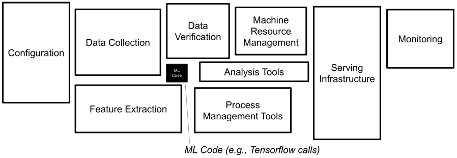
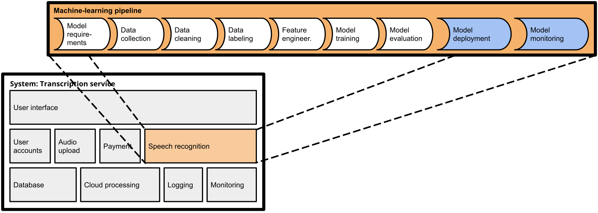
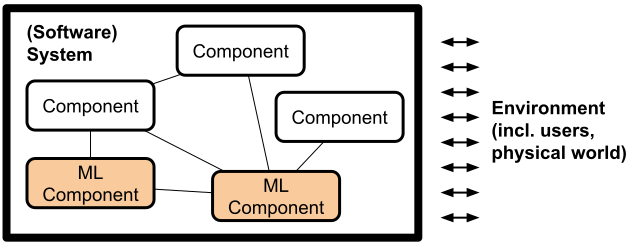

Chapter 2

# From Models to Systems

In software products, machine learning is almost always used as a component in a larger system—often a very important component, but usually still just one among many components. Yet, most education and research on machine learning has an entirely *model-centric view*, focusing narrowly on the learning algorithms and building models, but rarely considering how the model would actually be used for a practical goal.

Adopting a *system-wide view* is important in many ways. We need to understand the goal of the system and how the model supports that goal but also introduces risks. Key design decisions require an understanding of the full system and its environment, such as whether to act autonomously based on predictions or whether and when to check those predictions with non-ML code, with other models, or with humans in the loop. Such decisions matter substantially for how a system can cope with mistakes and has implications for usability, safety, and fairness. Before the rest of the book looks at various facets of building software systems with ML components, we dive a little deeper into how machine learning relates to the rest of the system and why a system-level view is so important.

## ML and Non-ML Components in a System

In production systems, machine learning is used to train models to make predictions that are used in the system. In some systems, those predictions are the very core of the system, whereas in others they provide only an auxiliary feature.

In the transcription service start-up from the previous chapter, machine learning provides the very core functionality of the system that converts uploaded audio files into text. Yet, to turn the model into a product, many other (usually non-ML) parts are needed, such as (a) a user interface to create user accounts, upload audio files, and show results, (b) a data storage and processing infrastructure to queue and store transcriptions and process them at scale, (c) a payment service, and (d) monitoring infrastructure to ensure the system is operating within expected parameters.

<figure>

<figcaption>

An architecture sketch of a transcription system, illustrating the central ML component for speech recognition and many non-ML components.

</figcaption>
</figure>

At the same time, many traditional software systems use machine learning for some extra “add-on” functionality. For example, a traditional end-user tax software product may add a module to predict the audit risk for a specific customer, a word processor may add a better grammar checker, a graphics program may add smart filters, and a photo album application may automatically tag friends. In all these cases, machine learning is added as an often relatively small component to provide some added value to an existing system.

<figure>

<figcaption>

An architecture sketch of the tax system, illustrating the ML component for audit risk as an addition to many non-ML components in the system.

</figcaption>
</figure>

### Traditional Model Focus (Data Science)

Much of the attention in machine-learning education and research has been on learning accurate models from given data. Machine-learning education typically focuses either on how specific machine-learning algorithms work (e.g., the internals of SVM, deep neural networks, or transformer architectures) or how to use them to train accurate models from provided data. Similarly, machine-learning research focuses primarily on the learning steps, trying to improve the prediction accuracy of models trained on benchmark datasets (e.g., new deep neural network architectures, new embeddings).

<figure>

<figcaption>

Typical steps of a machine-learning process. Mainstream machine-learning education and research focuses on the modeling steps itself with provided datasets.

</figcaption>
</figure>

Comparatively little attention is paid to how data is collected and labeled. Similarly, little attention is usually paid to how the learned models might actually be used for a real task. Rarely is there any discussion of the larger *system* that might produce the data or use the model’s predictions. Many researchers and practitioners have expressed frustrations with this somewhat narrow focus on model training due to various incentives in the research culture, such as Wagstaff’s 2012 essay [“Machine Learning that Matters”](https://arxiv.org/abs/1206.4656) and Sambasivan et al.’s 2021 study [“Everyone wants to do the model work, not the data work.”](https://research.google/pubs/pub49953/) Outside of BigTech organizations with lots of experience, this also leaves machine-learning practitioners with little guidance when they want to turn models into products, as can often be observed in many struggling teams and failing start-ups.

### Automating Pipelines and MLOps (ML Engineering)

With the increasing use of machine learning in production systems, engineers have noticed various practical problems in deploying and maintaining machine-learned models. Traditionally, models might be learned in a notebook or with some script, then serialized (“pickled”), and then embedded in a web server that provides an API for making predictions. This seems easy enough at first, but real-world systems become complex quickly.

When used in production systems, scaling the system with changing demand becomes increasingly important, often using cloud infrastructure. To operate the system in production, we might want to monitor service quality in real time. Similarly, with very large datasets, model training and updating can become challenging to scale. Manual steps in learning and deploying models become tedious and error-prone when models need to be updated regularly, either due to continuous experimentation and improvement or due to routine updates to handle various forms of distribution shifts. Experimental data science code is often derided as being of low quality by software engineering standards, often monolithic, with minimal error handling, and barely tested—which is not fostering confidence in regular or automated deployments. 

<figure>

<figcaption>

Machine-learning practitioners working on production systems increasingly widen their focus from modeling to the entire ML pipeline, including deployment and monitoring, with a heavy focus on automation.

</figcaption>
</figure>

All this has put increasing attention on distributed training, deployment, quality assurance, and monitoring, supported with *automation of machine-learning pipelines*, often under the label *MLOps*. Recent tools automate many common tasks of wrapping models into scalable web services, regularly updating them, and monitoring their execution. Increasing attention is paid to scalability achieved in model training and model serving through massive parallelization in cloud environments. While many teams originally implemented this kind of infrastructure for each project and maintained substantial amounts of infrastructure code, as described prominently in the well-known 2015 [technical debt](https://proceedings.neurips.cc/paper/2015/hash/86df7dcfd896fcaf2674f757a2463eba-Abstract.html) article from a Google team, nowadays many competing open-source MLOps tools and commercial MLOps solutions exist.

<figure>

<figcaption>

The amount of code for actual model training is comparably small compared to lots of infrastructure code needed to automate model training, serving, and monitoring. These days, much of this infrastructure is readily available through off-the-shelf MLOps tools. Figure from 🗎 Sculley, David, Gary Holt, Daniel Golovin, Eugene Davydov, Todd Phillips, Dietmar Ebner, Vinay Chaudhary, Michael Young, Jean-Francois Crespo, and Dan Dennison. “[Hidden Technical Debt in Machine Learning Systems](http://papers.nips.cc/paper/5656-hidden-technical-debt-in-machine-learning-systems.pdf).” In Advances in Neural Information Processing Systems, pp. 2503–2511. 2015.

</figcaption>
</figure>

In recent years, also the nature of machine-learning pipelines has changed in some projects. Foundation models have introduced a shift from training custom models toward prompting large general-purpose models, often trained and controlled by external organizations. Increasingly, multiple models and prompts are chained together to perform tasks, and multiple ML and non-ML components together can perform sophisticated tasks, such as combining search and generative modes in *retrieval-augmented generation*. This increasing complexity in machine-learning pipelines is supported by all kinds of emerging tooling.

Researchers and consultants report that shifting a team's mindset from *models* to *machine-learning pipelines* is challenging. Data scientists are often used to working with private datasets and local workspaces (e.g., in computational notebooks) to create models. Migrating code toward an automated machine-learning pipeline, where each step is automated and tested, requires a substantial shift of mindsets and a strong engineering focus. This engineering focus is not necessarily valued by all team members; for example, data scientists frequently report resenting having to do too much infrastructure work and how it prevents them from focusing on their models. At the same time, many data scientists eventually appreciate the additional benefits of being able to experiment more rapidly in production and deploy improved models with confidence and at scale.

### ML-Enabled Software Products

Notwithstanding the increased focus on automation and engineering of machine-learning pipelines, this pipeline view and MLOps are entirely *model-centric*. The pipeline starts with model requirements and ends with deploying the model as a reliable and scalable service, but it does not consider other parts of the system, how the model interacts with those, or where the model requirements come from. Zooming out, the entire purpose of the machine-learning pipeline is to create a model that will be used as one component of a larger system, potentially with additional components for training and monitoring the model.

<figure>

<figcaption>

The ML pipeline corresponds to all activities for producing, deploying, and updating the ML component. The resulting ML component is part of a larger system.

</figcaption>
</figure>

As we will discuss throughout this book, key challenges of building production systems with machine-learning components arise *at the interface between these ML components and non-ML components* within the system and how they, together, form the system behavior as it interacts with the environment and pursues the system goals. There is a constant tension between the goals and requirements of the overall system and the requirements and design of individual ML and non-ML components: Requirements for the entire system influence model requirements as well as requirements for model monitoring and pipeline automation. For example, in the transcription scenario, user-interface designers may suggest model requirements to produce confidence scores for individual words and alternative plausible transcriptions to provide a better user experience; operators may suggest model requirements for latency and memory demand during inference. Such model requirements originating from the needs of how the model is integrated into a system may constrain data scientists in what models they can choose. Conversely, the capabilities of the model influence the design of non-ML parts of the system and guide what assurances we can make about the entire system. For example, in the transcription scenario, the accuracy of predictions may influence the user-interface design and to what degree humans must be kept in the loop to check and fix the automatically generated transcripts; inference costs set bounds on what prices are needed to cover operating costs, shaping possible business models. In general, model capabilities shape what system quality we can promise customers.

### Systems Thinking

Given how machine learning is part of a larger system, it is important to pay attention to the entire system, not just the machine-learning components. We need a *system-wide* approach with an interdisciplinary team that involves all stakeholders.

*Systems thinking* is the name for a discipline that focuses on how systems interact with the environment and how components within the system interact. For example, [Donella Meadows](https://bookshop.org/books/thinking-in-systems-international-bestseller/9781603580557) defines a system as “a set of inter-related components that work together in a particular environment to perform whatever functions are required to achieve the system's objective.” System thinking postulates that everything is interconnected, that combining parts often leads to new emergent behaviors that are not apparent from the parts themselves, and that it is essential to understand the dynamics of a system in an environment where actions have effects and may form feedback loops.

<figure>

<figcaption>

A system consists of components working together toward the system goal. The system is situated in and interacts with the environment.

</figcaption>
</figure>

As we will explore throughout this book, many common challenges in building production systems with machine-learning components are really system challenges that require understanding the interaction of ML and non-ML components and the interaction of the system with the environment.

## Beyond the Model

A model-centric view of machine learning allows data scientists to focus on the hard problems involved in training more accurate models and allows MLOps engineers to build an infrastructure that enables rapid experimentation and improvement in production. However, the common model-centric view of machine learning misses many relevant facets of building high-quality products using those models.

### System Quality versus Model Quality

Outside of machine-learning education and research, model accuracy is almost never a goal in itself, but a means to support the goal of a system or a goal of the organization building the system. A common system goal is to satisfy some user needs, often grounded in an organizational goal of making money (we will discuss this in more detail in chapter *[Setting and Measuring Goals](05-setting-and-measuring-goals.md)*). The accuracy of a machine-learned model can directly or indirectly support such a system goal. For example, a better audio transcription model is more useful to users and might attract more users paying for transcriptions, and predicting the audit risk in tax software may provide value to the users and may encourage sales of additional services. In both cases, the system goal is distinct from the model’s accuracy but supported more or less directly by it. 

Interestingly, improvements in model accuracy do not even have to translate to improvements in system goals. For example, experience at the hotel booking site Booking.com has shown that improving the accuracy of models predicting different aspects of a customer’s travel preferences used for guiding hotel suggestions does not necessarily improve hotel sales—and in some cases, improved accuracy even impacted sales negatively. It is not always clear why this happens, as there is no direct causal link between model accuracy and sales. One possible explanation for such observations offered by the team was that the model becomes too good up to a point where it becomes creepy: it seems to know too much about a customer’s travel plans when they have not actively shared that information. In the end, more accurate models were not adopted if they did not contribute to overall system improvement.

<figure>

<figcaption>

Observations from online experiments at Booking.com show that model accuracy improvement (“Relative Difference in Performance”) does not necessarily translate to improvements in system outcomes (“Conversion Rate”). From Bernardi et al. “[150 Successful Machine Learning Models: 6 Lessons Learned at Booking.com](https://dl.acm.org/doi/abs/10.1145/3292500.3330744).” In Proceedings of the ACM SIGKDD International Conference on Knowledge Discovery & Data Mining, 2019.

</figcaption>
</figure>

Accurate predictions are important for many uses of machine learning in production systems, but it is not always the most important priority. Accurate predictions may not be critical for the system goal and *“good enough” predictions may actually be good enough*. For example, for the audit prediction feature in the tax system, roughly approximating the audit risk is likely sufficient for many users and for the software vendor who might try to upsell users on additional services or insurance. In other cases, marginally better model accuracy may come at excessive costs, for example, from acquiring or labeling more data, from longer training times, and from privacy concerns—a simpler, cheaper, less accurate model might often be preferable considering the entire system. Finally, other parts of the system can mitigate many problems from inaccurate predictions, such as a better user interface that explains predictions to users, mechanisms for humans to correct mistakes, or system-level non-ML safety features (see chapter *[Planning for Mistakes](07-planning-for-mistakes.md)*). Those design considerations beyond the model may make a much more important contribution to system quality than a small improvement in model accuracy.

A narrow focus only on model accuracy that ignores how the model interacts with the rest of the system will miss opportunities to design the model to better support the overall system goals and balance various desired qualities.

### Predictions have Consequences

Most software systems, including those with machine-learning components, interact with the environment. They aim to influence how people behave or directly control physical devices, such as sidewalk delivery robots and autonomous trains. As such, predictions can and should have consequences in the real world, positive as well as negative. Reasoning about interactions between the software and the environment outside of the software (including humans) is a system-level concern and cannot be done by reasoning about the software or the machine-learned component alone.

From a software-engineering perspective, it is prudent to consider every machine-learned model as an unreliable function within a system that sometimes will return unexpected results. The way we train models by fitting a function to match observations rather than providing specifications makes mistakes unavoidable (it is not even clear that we can always clearly determine what constitutes a mistake). Since we must accept eventual mistakes, it is up to other parts of the system, including user interaction design or safety mechanisms, to compensate for such mistakes.

<figure>

<figcaption>

A smart toaster may occasionally burn some toast, but it shall never burn down the entire kitchen.

</figcaption>
</figure>

Consider Geoff Hulten’s example of a *smart toaster* that uses sensors and machine learning to decide how long to toast some bread, achieving consistent outcomes to the desired level of toastedness. As with all machine-learned models, we should anticipate eventual mistakes and the consequences of those mistakes on the system and the environment. Even a highly accurate machine-learned model may eventually suggest toasting times that would burn the toast or even start a kitchen fire. While the software is not unsafe itself, the way it actuates the heating element of the toaster could be a safety hazard. More training data and better machine-learning techniques may make the model more accurate and robust and reduce the rate of mistakes, but it will not eliminate mistakes entirely. Hence, the system designer should look at means to make the system safe even despite the unreliable machine-learning component. For the toaster, safety mechanisms could include (1) non-ML code to cap toasting time at a maximum duration, (2) an additional non-ML component using a temperature sensor to stop toasting when the sensor readings exceed a threshold, or (3) installing a thermal fuse (a cheap hardware component that interrupts power when it overheats) as a non-ML, non-software safety mechanism. With these safety mechanisms, the toaster may still occasionally burn some toast when the machine-learned model makes mistakes, but it will not burn down the kitchen.

Consequences of predictions also manifest in feedback loops. As people react to a system’s predictions at scale, we may observe that predictions of the model reinforce or amplify behavior the models initially learned, thus producing more data to support the model’s predictions. Feedback loops can be positive, such as in public health campaigns against smoking when people adjust behavior in intended ways, providing role models for others and more data to support the intervention. However, many feedback loops are negative, reinforcing bias and bad outcomes. For example, a system predicting more crime in an area overpoliced due to historical bias may lead to more policing and more arrests in that area—this then provides additional training data reinforcing the discriminatory prediction in future versions of the model even if the area does not have more crime than others. Understanding feedback loops requires reasoning about the entire system and how it interacts with the environment.

Just as safety is a system-level property that requires understanding how the software interacts with the environment, so are many other qualities of interest, including security, privacy, fairness, accountability, energy consumption, and user satisfaction. In the machine-learning community, many of these qualities are now discussed under the umbrella of *responsible AI.* A model-centric view that focuses only on analyzing a machine-learned model without considering how it is used in a system cannot make any assurances about system-level qualities such as safety and will have difficulty anticipating feedback loops. Responsible engineering requires a system-level approach.

### Human-AI Interaction Design

System designers have powerful tools to shape the system through user interaction design. A key question is whether and how to keep humans in the loop in the system. Some systems aim to *fully automate a task*, by making automated decisions and automatically actuating effects in the real world. However, often we want to keep *humans in the loop* to give them agency by either asking them up front whether to take an action or by giving them a path to appeal or reverse an automated decision. For example, the audit risk prediction in the tax software example prompts users with a question of whether to buy audit insurance whereas an automated fraud-detection system on an auction website likely should automatically take down problematic content but provide a path to appeal. 

Well-designed systems can appear magically and simply work, releasing humans from tedious and repetitive tasks, while still providing space for oversight and human agency. But as models can make mistakes, automation can lead to frustration, dangerous situations, and harm. Also, humans are generally not good at monitoring systems and may have no chance of checking model predictions even if they tried. Furthermore, machine learning can be used in dark ways to manipulate humans in subtle ways, persuading them to take actions that are not in their best interest. All this places a heavy burden on responsible system design, considering not only whether a model is accurate but also how it is used for automation or to interact with users. 

<figure>

<figcaption>

A smart safe browsing feature uses machine learning to warn of malicious websites. The list of sites may or may not be reviewed by experts. The end-user interaction is designed to automatically stop the user from reaching the pack, who still can deliberately override the warning though.

</figcaption>
</figure>

A model-centric approach without considering the rest of the system misses many important decisions and opportunities for user interaction design that build trust, provide safeguards, and ensure the autonomy and dignity of people affected by the system. Model qualities, including its accuracy and its ability to report confidence or explanations, shape possible and necessary user interface design decisions; conversely, user design considerations may influence model requirements.

### Data Acquisition and Anticipating Change

A model-centric view often assumes that data is given and representative, even though system designers often have substantial flexibility in deciding what data to collect and how. Furthermore, in contrast to the fixed datasets in course projects and competitions, data distributions are rarely stable over time in production.

Compared to feature engineering and modeling and even deployment and monitoring, data collection and data quality work is often undervalued. Data collection must be an integral part of system-level planning. This is far from trivial and includes many considerations, such as educating the people collecting and entering data, training labelers and assuring label quality, planning data collection up front and future updates of data, documenting data quality standards, considering cost, setting incentives, and establishing accountability.

It can be very difficult to acquire representative and generalizable training data in the first place. In addition, data distributions can drift as the world changes (see chapter *[Data Quality](16-data-quality.md)*), leading to outdated models that perform increasingly worse over time unless updated with fresh data. For example, the tax software may need to react when the government changes its strategy for whom it audits, especially after certain tax evasion strategies become popular; the transcription service must update its model regularly to support new names that recently started to occur in recorded conversations, such as names of new products and politicians. Anticipating the need to continuously collect training data and evaluate model and system quality in production will allow developers to prepare a system proactively.

System design, especially the design of user interfaces, can substantially influence what data is generated by the system. For example, the provider of the tax software may provide a free service to navigate a tax audit to encourage users to report whether an audit happened, to then validate or improve the audit risk model. Even just observing users downloading old tax returns may provide some indication that an audit is happening, and the system could hide access to the return behind a pop-up dialog asking whether the user is being audited. In the transcription scenario, providing an attractive user interface to show and edit transcription results could allow us to observe how users change the transcript, thereby providing insights about probable transcription mistakes; more invasively, we could directly ask users which of multiple possible transcriptions for specific audio snippets is correct. All these designs could potentially be used as a proxy to measure model quality and also to collect additional labeled training data from observing user interactions.

Again, a focus on the entire system rather than a model-centric focus encourages a more holistic view of aspects of data collection and encourages *design for change*, preparing the entire system for constant updates and experimentation.

### Interdisciplinary Teams

In the introduction, we already argued how building products with machine-learning components requires a wide range of skills, typically by bringing together team members with different specialties. Taking a system-wide view reinforces this notion further: machine-learning expertise alone is not sufficient, and even engineering skills and MLOps expertise to build machine-learning pipelines and deploy models cover only small parts of a larger system. At the same time, software engineers need to understand the basics of machine learning to understand how to integrate machine-learned components and plan for mistakes. When considering how the model interacts with the rest of the system and how the system interacts with the environment, we need to bring together diverse skills. For collaboration and communication in these teams, machine-learning literacy is important, but so is understanding system-level concerns like user needs, safety, and fairness.

## On Terminology

Unfortunately, there is no standard term for referring to building software products with machine-learning components. In this quickly evolving field, there are many terms, and those terms are not used consistently. In this book, we adopt the term *“ML-enabled product”* or simply the descriptive *“software product with machine-learning components”* to emphasize the broad focus on an entire system for a specific purpose, in contrast to a more narrow model-centric focus of data science education or MLOps pipelines. The terms “ML-enabled system,” “ML-infused system,” and “ML-based system” have been used with similar intentions. 

In this book, we talk about *machine learning* and usually focus on supervised learning. Technically, machine learning is a subfield of artificial intelligence, where machine learning refers to systems that learn functions from data. There are many other artificial intelligence approaches that do not involve machine learning, such as constraint satisfaction solvers, expert systems, and probabilistic programming, but many of them do not share the same challenges arising from missing specifications of machine-learned models. In colloquial conversation and media, machine learning and artificial intelligence are used largely interchangeably and AI is the favored term among public speakers, media, and politicians. For most terms discussed here, there is also a version that uses AI instead of ML, for example, “AI-enabled system.”

The software-engineering community sometimes distinguishes between *“Software Engineering for Machine Learning”* (short SE4ML, SE4AI, SEAI) and *“Machine Learning for Software Engineering”* (short ML4SE, AI4SE). The former refers to applying and tailoring software-engineering approaches to problems related to machine learning, which includes challenges of building ML-enabled systems as well as more model-centric challenges like testing machine-learned models in isolation. The latter refers to using machine learning to improve software-engineering tools, such as using machine learning to detect bugs in code or to automatically generate code. While software-engineering tools with machine-learned components technically are ML-enabled products too, they are not necessarily representative of the typical end-user-focused products discussed in this book, such as transcription services or tax software.

The term *“AI Engineering”* and the job title of an *“ML engineer”* are gaining popularity to highlight a stronger focus on engineering in machine-learning projects. They most commonly refer to building automated pipelines, deploying models, and MLOps and, hence, tend to skew model-centric rather than system-wide, though some people use the terms with a broader meaning. The terms *ML System Engineering* and *MLSys* (and sometimes AI Engineering) refer to the engineering of infrastructure for machine learning, such as building efficient distributed learning algorithms and scalable inference services. *Data engineering* usually refers to roles focused on data management and data infrastructure at scale, typically deeply rooted in database and distributed-systems skills.

To further complicate terminology, *ModelOps,* *AIOps,* and *DataOps* have been suggested and are distinct from MLOps. *ModelOps* is a business-focused rebrand of MLOps, tracking how various models fit into an enterprise strategy. *AIOps* tends to refer to the use of artificial intelligence techniques (including machine learning and AI planning) during the operation of software systems, for example, to automatically scale cloud resources based on predicted demand. *DataOps* refers to agile methods and automation in business data analytics.

## Summary

To turn machine-learned models into production systems requires a shift of perspective. Traditionally, practitioners and educators focus most of their attention on the model and its training. More recently, practitioners started paying more attention to building reliable and repeatable pipelines to produce and deploy models. Yet, those MLOps efforts tend to be still model-centric in that they provide an API for the rest of the system but do not look beyond that API. To build products responsibly, we need to understand the *entire system*, including the various ML and non-ML components and their interactions. We also need to understand the interactions between the system and the environment, how the system affects the environment and interacts with users. The unreliable nature of machine-learned components places heavy emphasis on understanding and designing the rest of the system to achieve the system’s goals despite occasional wrong predictions, without serious harm or unintended consequences when predictions are wrong. This requires interdisciplinary collaboration, bringing together many important skills.

## Further Readings

  * A book discussing the design and implementation of ML-enabled systems, including coverage of considerations for user interaction design and planning for mistakes beyond a purely model-centric view: 🕮 Hulten, Geoff. *[Building Intelligent Systems: A Guide to Machine Learning Engineering](https://www.buildingintelligentsystems.com/).* Apress. 2018

  * An essay arguing about how the machine-learning community focuses on ML algorithms and improvements on benchmarks, but should do more to focus on impact and deployments (as part of systems): 🗎 Wagstaff, Kiri. “[Machine Learning That Matters](https://arxiv.org/abs/1206.4656).” In *Proceedings of the 29th International Conference on Machine Learning*, 2012.

  * An interview study revealing how the common model-centric focus undervalues data collection and data quality and how this has downstream consequences for the success of ML-enabled systems: 🗎 Sambasivan, Nithya, Shivani Kapania, Hannah Highfill, Diana Akrong, Praveen Paritosh, and Lora M. Aroyo. “[‘Everyone Wants to Do the Model Work, Not the Data Work’: Data Cascades in High-Stakes AI](https://research.google/pubs/pub49953/).” In *Proceedings of the Conference on Human Factors in Computing Systems (CHI)*, 2021.

  * An interview study revealing conflicts at the boundary between ML and non-ML teams in production ML-enabled systems, including differences in how different organizations prioritize models or products: 🗎 Nahar, Nadia, Shurui Zhou, Grace Lewis, and Christian Kästner. “[Collaboration Challenges in Building ML-Enabled Systems: Communication, Documentation, Engineering, and Process](https://arxiv.org/abs/2110.10234).” In *Proceedings of the International Conference on Software Engineering (ICSE)*, 2022.

  * On ML pipelines: A short paper reporting how machine-learning practitioners struggle with switching from a model-centric view to considering and automating the entire ML pipeline: 🗎 O'Leary, Katie, and Makoto Uchida. “[Common Problems with Creating Machine Learning Pipelines from Existing Code](https://research.google/pubs/pub48984.pdf).” In *Proceedings of the Third Conference on Machine Learning and Systems (MLSys)* 2020.

  * On ML pipelines: A well-known paper arguing for the need to pay attention to the engineering of machine-learning pipelines: 🗎 Sculley, David, Gary Holt, Daniel Golovin, Eugene Davydov, Todd Phillips, Dietmar Ebner, Vinay Chaudhary, Michael Young, Jean-Francois Crespo, and Dan Dennison. “[Hidden Technical Debt in Machine Learning Systems](http://papers.nips.cc/paper/5656-hidden-technical-debt-in-machine-learning-systems.pdf).” In *Advances in Neural Information Processing Systems*, pp. 2503–2511. 2015.

  * An experience report from teams at *booking.com*, with a strong discussion about the difference between model accuracy improvements and improving system outcomes: 🗎 Bernardi, Lucas, Themistoklis Mavridis, and Pablo Estevez. “[150 Successful Machine Learning Models: 6 Lessons Learned at Booking.com](https://blog.kevinhu.me/2021/04/25/25-Paper-Reading-Booking.com-Experiences/bernardi2019.pdf).” In *Proceedings of the International Conference on Knowledge Discovery & Data Mining*, pp. 1743–1751. 2019.

  * A position paper arguing from a human-computer interaction how important having a system-level vision is for ML-enabled systems and how a model-focused view often leads to poor user experiences: 🗎 Yang, Qian. “[The Role of Design in Creating Machine-Learning-Enhanced User Experience](https://www.aaai.org/ocs/index.php/SSS/SSS17/paper/viewPaper/15363).” In *AAAI Spring Symposium Series*. 2017.

---
*As all chapters, this text is released under <a href="https://creativecommons.org/licenses/by-nc-nd/4.0/">Creative Commons BY-NC-ND 4.0</a> license.*
*Last updated on 2024-06-13.*
