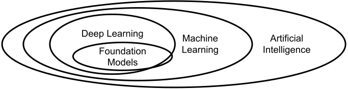
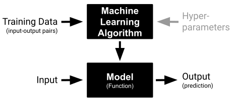
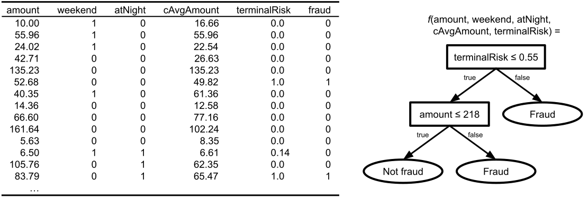

<div class="chapter">Chapter 3</div>

# Machine Learning in a Nutshell for Software Engineers

While we expect that most readers are familiar with machine learning basics, in the following, we briefly define key terms to avoid ambiguities. We additionally briefly describe core machine-learning concepts from a software-engineering perspective and introduce the changes recently triggered by foundation models.

## Basic Terms: Machine Learning, Models, Predictions

*Machine learning* is the subfield of *artificial intelligence* that deals with learning functions from observations (*training data*). *Deep learning* describes a specific class of machine-learning approaches based on large neural networks. Deep learning shares many fundamental challenges with other machine-learning approaches and tends to add additional ones, as we will discuss.

<figure>



<figcaption>

Machine learning is a subfield of the more general field of artificial intelligence and deep learning is a specific machine-learning approach. Foundation models are a specific kind of large models, typically learned with deep-learning approaches.

</figcaption>
</figure>

A *machine-learning algorithm* (sometimes also called *modeling technique*), implemented in a *machine-learning library* or *machine-learning framework*, such as *sklearn* or *Tensorflow*, defines the training procedure of how the function is learned from the observations. The learned function is called a *model* – we often use the term *machine-learned model* to distinguish it from the many other kinds of models common in software engineering, which are usually manually created rather than learned. The action of feeding observations into a machine-learning algorithm to create a model is called *model training.* In this book, we mostly talk about *supervised* machine-learning algorithms, which learn from observations in the form of pairs of data and corresponding *label*, where the label describes the expected output for that data. The learned model computes outputs for inputs from the same domain as the training data – for example, a model trained to generate captions for images takes an image and returns the caption. These outputs are often called *predictions*, and the process of computing a prediction for an input is called *model inference*. 

<figure>



<figcaption>

Conceptual steps of machine learning: Given training data, the machine-learning algorithm learns a function, the model, then can then be used to compute the “predicted” outputs for new inputs. This function would be used as a component in some system.

</figcaption>
</figure>

Notice the difference between the machine-*learning* algorithm used during model training and the machine-*learned* model used during model inference. The former is the technique used to create the latter; the latter is what is usually used in the running software system. 

## Technical Concepts: Model Parameters, Hyperparameters, Model Storage

There are many different machine-learning algorithms. In the context of this book, their internals and theory largely do not matter beyond the insight that the choice of the machine-learning algorithm can drastically influence model capabilities and various quality attributes. 

The process of training a model is often computationally intensive, up to years of machine time for large neural networks in deep learning like GPT-4. Models to be learned typically follow a certain basic internal structure specific to that learning algorithm, such as if-then-else chains in decision trees and sequences of matrix multiplications in deep neural networks. In deep learning, this internal structure is called *model architecture*. During training, the machine-learning algorithm then identifies the values of constants and thresholds within the internal structure, such as learning the conditions of the if-then-else statements or the values of the matrices – those constants and thresholds are called *model parameters* in the machine-learning community. Machine-learned models can have hundreds or millions of these learned parameters. 

For many machine-learning algorithms, the learning process itself is non-deterministic, that is, repeated learning on the same training data may produce slightly different models. Configuration options that control the learning process itself, such as when to stop learning, are called *hyperparameters* in the machine-learning community. For simplicity, we consider the model architecture choices of deep neural networks also as hyperparameters. The machine-learned models themselves tend to be side-effect-free, pure, and deterministic functions. For large deep learning models, computing a single prediction can require substantial computation effort, performing millions of floating point computations, but for most other models inference is fast.

<figure>



<figcaption>

Example of a decision tree model for fraud detection in credit card transactions. Learning was controlled with a hyperparameter allowing a maximum nesting of two levels in the tree. The learned function f (model) consists of two nested if-then-else statements (internal structure) with two specific decision boundaries for ‘terminalRisk’ and ‘amount’ (model parameters).

</figcaption>
</figure>

From a software-engineering perspective, consider the following analogy: Where a compiler takes source code to generate an executable function, a machine-learning algorithm takes data to create a function (model). Just like the compiler, the machine-learning algorithm is no longer used at runtime, when the function is used to compute outputs for given inputs. In this analogy, hyperparameters correspond to compiler options. 

Machine-learned models are typically not stored as binary executables, but in an intermediate format (“*serialized”* or “*pickled”*) describing the learned parameters for a given model structure. The model in this intermediate format can be loaded and interpreted by some runtime environment. This is not unlike Java, where the compiler produces bytecode, which is then interpreted at runtime by the Java virtual machine. Some machine-learning infrastructure also supports compiling machine-learned models into native machine code for faster execution.

## Machine Learning Pipelines

Using a machine-learning algorithm to train a model from data is usually one of several steps in the process of building machine-learned models. This process is typically characterized as a *pipeline,* as illustrated in chapter *[From Models to Systems](02-from-models-to-systems.md)*.

Once the purpose or goal of the model is clear (*model requirements*), but before the model can be trained, we have to acquire training data (*data collection*), identify the expected outcomes for that training data (*data labeling*), and prepare the data for training (*data cleaning* and *feature engineering*). The preparation often includes steps to identify and correct mistakes in the data, fill in missing data, and generally convert data into a format that the machine-learning algorithms can handle well. After the model has been *trained* with a machine-learning algorithm, it is typically *evaluated*. If the model is deemed good enough, it can be *deployed*, and may be *monitored* in production.

The entire process of developing models is highly iterative, incrementally tweaking different parts of the pipeline toward better models, as we will discuss. For example, if the model evaluation is not satisfactory, data scientists might try different machine-learning algorithms or different hyperparameters, might try to collect more data, or might prepare data in different ways.

Most steps of the machine-learning pipeline are implemented with some code. For example, data preparation is often performed with programmed transformations rather than manual changes to individual values, for example, programmatically removing outlier rows and normalizing values in a column. Depending on the machine-learning algorithm, training is typically done with very few lines of code calling the machine-learning library to set up hyperparameters, including the model architecture in deep learning, and pass in the training data. Deployment and monitoring may require substantial infrastructure, as we will discuss.

During exploration, data scientists typically work on code snippets of various stages, one snippet at a time. Code snippets tend to be short and rely heavily on libraries for data processing and training. *Computational notebooks* like *Jupyter* are common for exploratory development with code cells for data cleaning, feature engineering, training, and evaluation. The entire process from receiving raw data to deploying and monitoring a model can be automated with code. This is typically described as *pipeline automation*. 

## Foundation Models and Prompting

The recent rise of *large language models* like GPT-3 has triggered a shift in how some projects approach machine learning. Rather than learning a model for each task, organizations train very large general-purpose models, called *foundation models* as an umbrella term for large language models and other large general-purpose models. Those foundation models can be instructed to perform specific tasks with *prompts*. For example, instead of developing a toxicity detection model trained on examples of toxic and non-toxic language, we can send a prompt like *“Answer only yes or no. Is the following sentence toxic: [input]”* to a foundation model and expect it to answer without any specific training for toxicity. 

<figure>


<figcaption>

Foundation models are general-purpose models created with machine learning algorithms and a prompt customizes the specific prediction for a given input.

</figcaption>
</figure>

Foundation models are usually trained using deep-learning algorithms on extremely large datasets, like the majority of English-language text available on the Internet. Such models have learned surprising capabilities to answer all kinds of questions with natural-language prompts. They are usually used for generative tasks, such as generating answers to natural language questions, but they can also be used for classification tasks as in the toxicity example above. Training of foundation models is very expensive and only a few organizations build them, but they are intended to be used broadly for many tasks. Usually, third-party foundation models are used over an API, but some (open-source) foundation models can also be hosted locally.

Foundation models do not have access to proprietary or recent information that was not part of the training data and they may not have learned the capabilities for all tasks. For example, they cannot provide answers about private emails and may not have a good understanding of what is considered toxic language in recent slang used in gaming forums. To customize and extend foundation models, common strategies are (1) to *fine-tune* a copy of the model with custom training data (e.g., train it on internal email or gaming forum messages) and (2) to use *in-context learning* where additional information or instructions is provided as part of the prompt. In particular, the latter is common where internal data is provided as part of the prompt (see *retrieval-augmented generation* in chapter *[Thinking like a Software Architect](08-thinking-like-a-software-architect.md)*) or additional examples are provided to give the model more context.

<figure>

```
Classify the sentence into toxic or non-toxic. 
Text: We need to kill this process.
A: non-toxic
Text: RTFM
A: toxic
[more examples]
Text: [sentence to analyze]
A:
```

<figcaption>

Example of a few-shot prompt, a form of in-context learning, that provides several examples about specific jargon before the actual sentence to analyze.

</figcaption>
</figure>

Foundation models shift the focus of what data scientists do significantly and shift various quality considerations compared to traditional machine learning. There is less attention on training models with custom training data and more focus on developing prompts and finding solutions to provide context for general-purpose models. Especially when it comes to analyzing and generating natural language and images, they can outperform traditional models on many tasks, but model size and inference costs can become a challenge, as we will discuss.

## On Terminology

Machine learning emerged from ideas from many different academic traditions and terminology is not always used consistently. Different authors will refer to the same concepts with different words or even use the same word for different concepts. This becomes especially common and confusing when crossing academic disciplines or domains. Above and in later chapters of the book, we introduced concepts explicitly with common and internally consistent terms, pointing out potential pitfalls, such as the meaning of “parameter” and “hyperparameter.” We generally try to use consistent terms and resolve ambiguity where terms may have multiple meanings, such as using “machine-learned model” or “software-architecture model” for distinct meanings of “model” and “prediction accuracy” or “inference latency” for distinct meanings of “performance,” even if this sometimes means using longer or slightly unusual terms. 

## Summary

It is important to distinguish the machine-learning algorithm that defines how to learn a model from data, usually as part of a pipeline, from the learned model itself, which provides a function typically used for predictions by other parts of the system. Most steps of the machine learning pipeline have relatively little code; the entire pipeline to train a model can be automated. With foundation models, attention shifts from training models to developing prompts for general-purpose models.

## Further Readings

  * There are many books that provide an excellent introduction to machine learning and data science. For a technical and hands-on introduction, we like 🕮 Géron, Aurélien. "[Hands-On Machine Learning with Scikit-Learn, Keras, and TensorFlow: Concepts, Tools, and Techniques to Build Intelligent Systems](https://bookshop.org/books/hands-on-machine-learning-with-scikit-learn-keras-and-tensorflow-concepts-tools-and-techniques-to-build-intelligent-systems/9781492032649 )". 2nd Edition, O'Reilly Media, 2019.

  * Many machine-learning books additionally focus on how machine-learning algorithms work internally and the theory and math behind them. Interested readers might seek dedicated textbooks, such as 🕮 Flach, Peter. [Machine Learning: The Art and Science of Algorithms That Make Sense of Data](https://bookshop.org/books/machine-learning-the-art-and-science-of-algorithms-that-make-sense-of-data/9781107422223). Cambridge University Press, 2012 🕮 Goodfellow, Ian, Yoshua Bengio, and Aaron Courville. [Deep Learning](https://www.deeplearningbook.org/). MIT Press, 2016.

  * A position paper discussing the nature of foundation models, their various applications and promises, and some challenges: 🗎 Bommasani, Rishi, Drew A. Hudson, Ehsan Adeli, Russ Altman, Simran Arora, Sydney von Arx, Michael S. Bernstein et al. "[On the opportunities and risks of foundation models](https://arxiv.org/abs/2108.07258)." arXiv preprint 2108.07258, 2021.


---
*As all chapters, this text is released under <a href="https://creativecommons.org/licenses/by-nc-nd/4.0/">Creative Commons BY-NC-ND 4.0</a> license.*
*Last updated on 2024-03-05.*
