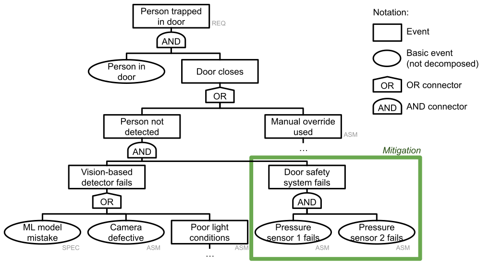

Chapter 7

# Planning for Mistakes

Predictions from machine-learned models in a software system may be wrong. Depending on the system design, wrong predictions can cause the system to display misleading information or take problematic actions, which can cause problems and harms, from confusing users, to discrimination, to financial loss, to injury and death. Better models may make fewer mistakes, but mistakes are generally inevitable. Mistakes of machine-learned models also are not generally understandable or anticipatable—it is better to think of them simply as unreliable components. As a consequence, it is important to consider how to design an overall system that provides value and mitigates risks even in the presence of inevitable model mistakes.

It is often difficult to anticipate specific mistakes of a model—and it may often not even be clear what the “correct” prediction would be, as we will discuss at length in chapter *[Model Quality](15-model-quality.md)*. Yet, it is possible and advisable to plan for what happens when the model makes mistakes. In this chapter, we discuss techniques to identify possible mistakes and their consequences in the system, as well as design options to minimize risks and harms from a model.

<figure>

<figcaption>

The Docklands Light Railway system in London has operated trains without a driver since 1987. Many modern public transportation systems use increasingly sophisticated automation, including the Paris Métro Line 14 and the Copenhagen Metro (Picture CC BY 2.0 by [Matt Brown](https://flickr.com/photos/londonmatt/16967528674/in/photolist-rRn28Q-5sYsHC-2jyQ5eS-4HW1Xd-DJhHaN-5sU5nK-2njUYgo-dxvEe-5ktzAC-5NVk7v-EdEDEM-5NViA2-5NVkza-5NVoqK-5NVjHp-yPh6nQ-5NVpuk-GGk2i-9hRM6i-5xrgUB-uffEa-9J4ter-B7CsaH-4SZ5Zv-9J4ojp-4ciobk-dxvEc-5RuRm7-5tcXev-5RuRmb-oomBgW-uffzG-9J7gU5-5NVnuH-XvVrx5-5NVmux-GvRYkX-2jHQ4EH-zsMLHH-9fCye3-GRsrtK-2TQpgA-HiZyrb-HmrbXV-GwP6mm-HswHXi-RB1xwE-5yX5XH-9J4ptH-aiAqh)). [Online-only figure.]

</figcaption>
</figure>

Throughout this chapter, we use two running examples with different degrees of risks: (1) An autonomous light rail system like London’s [Docklands Light Railway](https://en.wikipedia.org/wiki/Docklands_Light_Railway) operating driverless since 1987 and (2) an extension to an email client suggesting answers to emails like in Google’s Gmail.

<figure>

<figcaption>

Suggestions for email responses in Gmail augment the user interface rather than automating responses or prompting users.

</figcaption>
</figure>

## Mistakes Will Happen

It is a useful abstraction to consider a machine-learned model as an *unreliable component* within a system that may make mistakes for unknown reasons at unknown times. A system designer should always anticipate that a model’s prediction will eventually be wrong, whether it detects obstacles in the path of a train or suggests answers for an email. With that assumption that the model is unreliable, the challenge is then to design a system such that mistakes of the machine-learning components do not cause problems in the overall system.

### Why ML Models Fail

There are many reasons why models may learn wrong concepts or have blind spots without being aware of them. It is tempting to try to understand all possible causes for mistakes with the goal of eliminating them. Indeed, understanding some common causes can provide insights into how to test and improve models. Similarly, understanding some underlying causes of mistakes helps to appreciate how unavoidable mistakes are in practice. We highlight a few common causes of mistakes without trying to be comprehensive.

**Correlation vs. causation.**
 Machine learning largely relies on correlations in data. It cannot generally identify which correlations are due to an underlying *causal* relationship and which may stem merely from noise in the data or decisions in the data collection process. For example, there are lots of examples where object detection models use the background of an image to identify what is in the foreground, such as [identifying dogs in snow as wolves](https://arxiv.org/abs/1602.04938) and [not identifying cows when on a beach](https://openaccess.thecvf.com/content_ECCV_2018/html/Beery_Recognition_in_Terra_ECCV_2018_paper.html). The model relies on a shortcut based on a correlation: certain animals are commonly photographed with similar backgrounds in the training data. The background is not causal for identifying the animal though; it is not the abstraction a human would use to recognize the visual appearance of animals. Humans often have an idea of what causal relationships are plausible or expected. In contrast, most machine-learning algorithms work purely with correlations in training data and cannot judge which correlations are reliable to make predictions.

**Confounding variables.**
 Machine learning (and also human researchers) may attribute effects to correlated but not causally linked variables, while missing the causal link to a confounding variable. For example, several studies analyzing patient data found a correlation between male baldness and symptomatic COVID infections, but plausibly the effect may be explained with age being a confounder that *causes* both baldness and higher COVID risk. If the confounding variable is contained in the data, the machine-learning algorithm may have a chance to identify the real relationship and compensate for the confounding variable, but often the confounding variable may not be present. 

<figure>

<figcaption>

A causal relationship with a third confounding variable may explain spurious correlation in the data.

</figcaption>
</figure>

**Reverse causality.**
 Machine learning might attribute causality in the wrong direction when finding a correlation. For example, early chess programs trained with Grandmaster games were reported to have learned that sacrificing a queen is a winning move, because it occurred frequently in winning games; a machine-learning algorithm may observe that hotel prices are high when there is high demand and thus recommend to set a high price to create demand—in both cases misunderstanding the causality underlying the correlations and making wrong predictions with high confidence.

**Missing counterfactuals.**
 Training data often does not indicate what would have happened if different actions were taken, which makes attributing causality difficult. For example, we can observe past stock prices to attempt to predict future ones, but we do not actually know whether a merger was causing a stock price to rise, since we do not know what would have happened without the merger. Machine learning might try to observe causality from differences among many similar observations, but it is often challenging to collect convincing “what if” data.

**Out of distribution data.**
 Machine-learned models are generally more confident in making predictions about data similar to data seen during training. We speak of *out-of-distribution* inputs when the input diverges strongly from the training distribution. A model may extrapolate learned rules to new data without realizing that additional rules are needed for this kind of data. For example, a model in an autonomous train may accurately detect adult pedestrians on the track in camera images, but does not detect children or unicyclists when those were never part of the training data. Humans are often much better at handling out-of-distribution data through common sense reasoning beyond correlations found in some training data. 

**Other causes.**
 Many other problems are caused by insufficient training data, low-quality training data, insufficient features in training data, biased training data, overfitting and underfitting of models, and many other issues. We can often identify specific problems and improve models, but we cannot expect models to be perfect and should always anticipate that mistakes may happen.

### Mistakes Are Usually Not Random

When reasoning about failures in physical processes, we usually assume an underlying random process about which we can reason probabilistically. For example, statistical models can predict how likely a steel axle of a train is to break over time under different conditions and corrosion levels; whether an axle breaks is largely independent of other axles breaking, which allows us to stochastically reason about the reliability of structures with redundancies. Software bugs do not usually have this nature: software does not randomly fail for some inputs. Instead, software fails for specific inputs that trigger a bug. And multiple copies of the software will fail for the same inputs. Even multiple independent implementations of the same algorithm have often been observed to contain similar bugs and fail for many of the same inputs.

While it is tempting to reason about mistakes of machine-learned models stochastically, given how we report accuracy as percentages, this is a dangerous path. Mistakes of models are not usually randomly distributed. Mistakes may be associated in non-obvious ways with specific characteristics of the input or affect certain subpopulations more than others (see also chapters *[Model Quality](15-model-quality.md)* and *[Fairness](26-fairness.md)*). For example, a train’s obstacle detection system may work well in almost all cases except for difficulty recognizing wheelchair users; it may have an average accuracy of 99.99 percent but still fails consistently to detect wheelchair users. We can monitor mistakes in production to get a more reliable idea of the frequency of real mistakes compared to offline evaluations (see chapter *[Testing and Experimenting in Production](19-testing-and-experimenting-in-production.md)*). Still, today's mistakes may not be representative of tomorrow’s in terms of frequency or severity.

While many machine-learning algorithms are nondeterministic during training, they mostly produce models that are deterministic during inference. Deterministic inference means that the model will consistently make the same mistake for the same input. Also, multiple models trained on the same data tend to make similar mistakes, relying on the same spurious correlations.

Complicating matters further, attackers can attempt to deliberately craft or manipulate inputs to induce mistakes. This way, even a model with 99.99 percent accuracy in an offline evaluation can produce *mostly* wrong predictions when attacked. For example, an attacker might trick the obstacle detection model of an autonomous train with a sticker on the platform, which is consistently recognized incorrectly as an obstacle to block the train’s operation—a [previously demonstrated adversarial attack](https://openaccess.thecvf.com/content_cvpr_2018/html/Eykholt_Robust_Physical-World_Attacks_CVPR_2018_paper) discussed in chapter *[Security and Privacy](28-security-and-privacy.md)*.

Also, confidence scores by models must be interpreted carefully. Even highly confident predictions can be wrong. In the best-case scenario, model *calibration* can ensure that confidence scores correspond (on average) with the actual accuracy of the prediction, which may open a path to some careful probabilistic reasoning.

Overall, we recommend that system designers simply consider mistakes as inevitable without being able to accurately anticipate the distribution or even frequency of mistakes in future deployments. While we can attempt to learn better models that make fewer mistakes, considering machine-learned models simply as unreliable components where every single prediction may be wrong is a good mental model for a system designer.

## Designing for Failures

Just because the model is an unreliable component in a system that may make mistakes does not mean the entire system is necessarily faulty, unsafe, or unreliable. For example, even if the obstacle detection model used in the autonomous train sometimes mistakenly reports obstacles or misses obstacles, the rest of the system may be able to ensure that the train avoids collisions and unnecessary delays with high confidence. The key is understanding the interaction between the ML components and other components and the environment. This is why *understanding the requirements for the entire system* is so important to design systems that meet the users’ needs even if machine-learned components regularly make mistakes.

### Human-AI Interaction Design (Human in the Loop)

Systems use machine learning typically to influence the world in some way, either by acting autonomously or by providing information to users who can then act on it. Using machine learning often has the key goal of reducing human involvement in decisions or actions: to reduce cost, to improve response time or throughput, to reduce bias, or to remove tedious activities—thus freeing humans to focus on more interesting tasks. Nonetheless, including *humans in the loop* to notice and correct mistakes is a common and often natural approach to deal with mistakes of machine-learned models—humans act as monitors that judge the correctness of predictions and override wrong ones. 

Yet, designing human-AI interactions in systems is challenging—there is a vast design space of possible options. Users can interact with predictions from machine-learning components in different ways. As a starting point, let us consider three common modes of interactions, as outlined by Geoff Hulten:

  * **Automate:** The system takes action on the user’s behalf based on a model’s prediction without involving the user in the decision. For example, the autonomous train automates doors, a spam filter automatically deletes emails, a smart thermostat automatically adjusts the home temperature, and a trading system automatically buys stocks. Automation takes humans out of the loop and allows for greater efficiency and faster reaction time, but it also does not give humans a chance to check predictions or actions. Automation is most useful when we have high confidence in correct predictions or when the potential costs from mistakes are low or can be mitigated in other ways.

  * **Prompt:** The system prompts a user to take action, which the user can follow or decline. For example, an object detection system may alert a train operator to potential obstacles and ask for confirmation before leaving the station, a tax software’s model may suggest checking certain deductions before proceeding, a navigation system might suggest that it is time for a break and ask whether to add a nearby roadside attraction as a stop, and a fraud detection system may ask whether a recent credit card transaction was fraudulent. Prompts keep humans in the loop to check predictions or recommended actions, giving responsibility for the action to the user. However, prompts can be disruptive, requiring users to invest cognitive effort into a decision *right now*. Too frequent prompts can be annoying and lead to *notification fatigue,* where users become complacent and ignore or blindly click away prompts. Often, with such attention problems, humans are poor monitors for machines. Prompts are suitable when a model’s confidence is low or the costs from a mistake are high, and when prompts do not occur too frequently. 

  * **Organize, annotate, or augment:** The system uses a model to decide what information to show users and in what order. The system may show information prominently in the user interface or in more subtle ways. It may show predictions or recommend actions. Yet, users ultimately decide *whether* and *how* to act. For example, in all these cases, users can act or ignore suggestions: Gmail suggests possible answers for an email, a safety system highlights passengers near doors in a train operator's camera feeds, a music streaming service offers personalized playlists, and a grammar checker underlines detected problems. Alternatively, the system may provide curated information when prompted by the user. For example, a search engine’s model responds to a query with ranked results and a  cancer prognosis model highlights areas for the radiologist to explore more closely when invoked on an image. Compared to prompts, these approaches are less intrusive and do not demand immediate action. Since humans are making final decisions, such approaches may work well when mistakes are common or it is unclear how to act on predictions.

Notice how these designs differ significantly in how forceful  the interactions are, from full automation to merely providing information. More forceful interactions may help the system achieve its goals more directly, but may also cause more direct consequences when a prediction is wrong. Of course, hybrid modes are possible and common: for example, the autonomous system in a train may automate most operations, but fall back on prompting a (possibly remote) human operator when a detected obstacle in front of the train does not move away within twenty seconds. Overall, many factors go into deciding on a design, but understanding the expected frequency and cost of interactions, the value of a correct prediction, the cost of a wrong prediction, and the degree to which users have the ability and knowledge to make decisions with the provided information will guide designers to make better decisions. 

Generally, more automated designs are common for tedious and repetitive tasks with limited potential for harm or where harm can be mitigated with other means. In contrast, high-stakes tasks that need accountability or tasks that users enjoy performing will tend to keep humans in the loop. Furthermore, as we will discuss in chapter *[Explainability](25-explainability.md)*, providing explanations with predictions can strongly influence how humans interact with the system and to what degree they develop trust or are manipulated into overtrusting the system. 

In this book, we will not dive deeper into the active and developing field of human-AI interaction design. However, there are many more questions, such as (1) whether users have a good mental model of how the system or the model works and how to convey a suitable model, (2) how to set reasonable expectations for what the system can and cannot do and why mistakes may be inevitable, and (3) how to communicate how users can improve or customize the system with additional feedback in case of mistakes.

### Undoable Actions

If actions taken by a system or its users based on wrong predictions are reversible, harms may be minor or temporary. For example, if a smart thermostat automatically sets the room temperature, a user can simply override a wrong action and soon return to a comfortable temperature; if a smart presentation designer changes the slide layout, users can simply undo the step to restore the previous design. It may also be possible to design the system in such a way that actions taken based on (unreliable) model predictions are explicitly reversible, such as tracking a document’s history or providing free return shipping for a system that curates and automatically ships personalized clothing. Clearly, making actions undoable does not work for all actions, since many have permanent consequences. For example, undoing structural damage from a train collision might be possible with substantial repair costs, but a life lost in the collision cannot be undone.

Users can often undo actions as part of their regular interactions with the system, such as resetting the thermostat’s temperature or undoing slide design changes. In other cases, system designers may provide explicit paths to appeal and overturn automated decisions, typically involving human reviewers or extra steps. For example, a fraud detection system may block a seller identified as a bot on an online platform, but the system may provide a mechanism to appeal to human oversight or to upload a picture of a government ID for identity verification.

### Guardrails

In many systems, machine-learned models may be used to inform possible decisions, but the prediction is processed with several additional steps and considered only as one of multiple factors in a decision. These additional steps can serve as guardrails against wrong predictions.

Guardrails are common in production systems. For example, when suggesting automated responses for emails, guardrails can be used to avoid inappropriate or offensive recommendations by filtering responses using a list of banned words. Similarly, in contemporary autonomous train systems, guardrails are ubiquitous: (1) these train systems usually run on their own separated and fenced-off track, reducing the chance of obstacles substantially; (2) [platform screen doors](https://en.wikipedia.org/wiki/Platform_screen_doors) in stations that only open when a train is in the station prevent passengers from falling on tracks; and (3) pressure sensors in doors prevent trapping passengers between doors, even when a vision model fails. 

<figure>

<figcaption>

Metro station Cour Saint-Émilion in Paris with automated platform screen doors that only open when a train is in the station (CC BY-SA 4.0 by [Chabe01](https://en.wikipedia.org/wiki/Paris_M%C3%A9tro_Line_14#/media/File:Station_M%C3%A9tro_Cour_St_%C3%89milion_Paris_13.jpg)). [Online-only figure.]

</figcaption>
</figure>

Guardrails often rely on non-ML mechanisms, such as restricting predictions to hardcoded ranges of acceptable values, providing overrides for common mistakes or known inputs, applying hardcoded heuristic rules (such as filtering select words), or using hardware components such as platform screen doors and pressure sensors. Guardrails can be quite sophisticated. For example, the autonomous train may adjust tolerance for mistakes in obstacle detection based on the current speed and make further adjustments based on risk information from a map. 

Using machine learning to implement guard rails is also possible and common. For example, to identify and filter suggested email responses that are problematic, we could use a sentiment analysis model or a toxicity detection model. Of course, there can still be problems when the original model and the model used as a guardrail both make a mistake. Still, if these models are largely independent and trained for different tasks, the risk of both models making mistakes is much lower than of having just the original model fail.

### Mistake Detection and Recovery

System designers often consider some mechanism to *detect* when things go wrong. Once a problem is detected, the system may initiate actions to *recover*. For example, a monitoring system observes that a server is no longer responsive and initiates a reboot; an autonomous train detects unusual g forces and slows down the train. Overall, there are a large number of safety design strategies that rely on the ability to detect problems to mitigate harm or recover.

**Doer-checker pattern.**
 The doer-checker pattern is a classic safety strategy where a component performing actions, the doer, is monitored by a second component, the checker. Suppose the checker can determine the correctness of the doer’s work to some degree. In that case, it can intervene with corrective action when a mistake is detected, even if the doer is untrusted and potentially faulty or unreliable. Corrective actions can include providing new alternative outputs, providing a less desirable but safe fallback response, or shutting down the entire system. 

The doer-checker pattern relies fundamentally on the system’s ability to detect mistakes. Because directly detecting a wrong prediction is usually hard (otherwise we might not need the prediction in the first place), detection often relies on indirect signals, such as a user’s reaction or independent observations of outcomes. For example, in an autonomous train where speed is controlled by a machine-learned model (doer), a safety controller (checker) might observe from a gyro sensor that the train is dangerously leaning when traveling through a curve at speed. Once the problem is detected, the safety controller (checker) can intervene with corrective braking commands. Here the checker does not directly check the acceleration command outputs or speed, but their effect on the train, as assessed by independent gyro sensors. Similarly, the pressure sensors in the train’s doors can be seen as a checker for the vision-based door control system, overriding unsafe behavior.

**Graceful degradation (fail-safe).**
 When a component failure is detected, graceful degradation is an approach to reduce functionality and performance at the system level to maintain safe operation. That is, rather than continuing to operate with the known faulty component or shutting down the system entirely, the system relies on backup strategies to achieve its goal, even if it does so at lower quality and at lower speed. For example, when the email response suggestion service goes down, the email system simply continues to operate without that feature. As a more physical example, if the LiDAR sensor in the autonomous train fails, the train may continue to operate with a vision-based system, but only at lower speeds while maintaining larger distances to potential obstacles.

**Out-of-distribution detection.**
 Whereas guardrails often check the output of a model and the doer-checker pattern relies on external ways of detecting failure, out-of-distribution detection can check that inputs conform to expectations. If inputs are unusual, rather than relying on low-confidence model predictions, we can decide not to use a model or to interpret its results as low confidence.

For example, we could detect very dark, low-contrast, or blurry camera images for which we expect poor accuracy in obstacle detection, and hence know not to rely on the obstacle detection model in those situations—we may rely on backups instead or gracefully degrade the system’s functionality. Similarly, we could detect unusual, possibly manipulated inputs that try to attack the model (see chapter *[Security and Privacy](28-security-and-privacy.md)*). Checks on inputs can be hardcoded or can be delegated to other models. In particular, many machine-learning approaches exist to detect out-of-distribution inputs for a model, to detect unnatural inputs and attacks, and to calibrate the confidence scores of models.

### Redundancy

Implementing redundancy in a system is a common strategy to defend against random errors. For example, installing two cameras to monitor doors in an autonomous train ensures that the system continues to operate even if the hardware of one camera fails—the system simply switches to use the other camera after detecting the failure, a pattern known as *hot standby*. Redundancy can also be used beyond just swapping out components that fail entirely (and detectably) by making decisions based on comparing the outputs of multiple redundant components. For example, in the autonomous train, we could use three independent components to detect obstacles and use the median or worst-case value.

Unfortunately, redundancy does not help if the redundant parts fail under the same conditions: running multiple instances of the same machine-learned model typically produces the same outputs. In practice, even independently implemented algorithms and models that are independently trained on the same data often exhibit similar problems, making redundancy less effective for software than for hardware. Many machine-learning algorithms, such as random forest classifiers, already use some form of redundancy and voting internally to improve predictions, known as *ensemble learning*. Generally, redundancy is more effective if the different redundant computations are substantially different, such as combining data from different sensors. For example, the autonomous train may use long-range radar, short-range radar, LiDAR, vision, and a thermal camera, combined with information from maps, GPS, accelerometers, and a compass.

Note, though, that redundancy can be expensive. Additional sensors in an autonomous vehicle can add substantial hardware cost, and the existing onboard hardware is often already pushed to the limit with existing computations. System designers will need to consider trade-offs between reducing mistakes and increasing hardware cost and computational effort (see also chapters *[Thinking like a Software Architect](08-thinking-like-a-software-architect.md)* and *[Quality Attributes of ML Components](09-quality-attributes-of-ml-components.md)*).

### Containment and Isolation

A classic strategy to design a system with unreliable components is to contain mistakes of components and ensure that they do not spread to other parts of the system. A traditional example is separating (a) the fly-by-wire system to control a plane from (b) the entertainment system for the passengers. This way, the entertainment system, which is built to much lower quality standards, can crash and be rebooted without affecting the safety of the plane. Similarly, we would likely separate the control system for the autonomous train from components for station announcements and on-board advertisement. There are lots of examples of past disasters where systems performed poor containment, such as a [US Navy ship](https://medium.com/dataseries/when-smart-ships-divide-by-zer0-uss-yorktown-4e53837f75b2) requiring a 3h long reboot after some data entry in a database application caused a division-by-zero error that propagated and crashed a central control component of the ship, or [cars](https://www.wired.com/2015/07/hackers-remotely-kill-jeep-highway/) being hacked and stopped through the entertainment system. As a general principle, unreliable and low-critical components should not impact high-critical components.

With machine learning, we do not usually worry about inputs crashing the inference service or exploits causing the inference service to manipulate data in other components. Hence, traditional isolation techniques such as sandboxing, firewalls, and zero-trust architectures seem less relevant for containing model-inference components. Rippling effects usually occur through data flows when a model makes a wrong prediction that causes problems in other components. Therefore, it is prudent to carefully consider what parts of the system depend on the predictions of a specific model, what happens when the model is not available, and how wrong predictions can cause downstream effects. In addition, we might worry about timing-related consequences when the model-inference service responds late or is overloaded. For all of this, the hazard analysis and risk analysis tools we discuss next can be helpful.

## Hazard Analysis and Risk Analysis

Traditional safety engineering methods can help to anticipate mistakes and their consequences. They help understand how individual mistakes in components can result in failures and bad outcomes at the system level. Many of these safety engineering methods, including those discussed here, have a long history and are standard tools in traditional safety-critical domains such as avionics, medical devices, and nuclear power plants. With the introduction of machine learning as unreliable components, anticipating and mitigating mistakes gets a new urgency, even in systems that are not traditionally safety-critical: As discussed in the introduction, with machine learning, we tend to try to solve ambitious problems with models that we do not fully understand and that may make mistakes. So, even seemingly harmless web applications or mobile apps can take poor actions based on wrong model predictions, causing various forms of harm, such as stress, financial loss, discrimination, pollution, or bodily harm (see also chapters on Responsible ML Engineering). Investing some effort in anticipating these problems early on can improve the user experience, avoid bad press, and avoid actual harm.

Note that none of the methods we discuss will provide formal guarantees or can assure that all failures are avoided or at least anticipated. These methods are meant to provide structure and a deliberate process in a best-effort approach. These methods all foster deliberate engagement with thinking through possible failures and their consequences and thinking about how to avoid them before they cause harm. Through a collaborative process, they can guide groups of people, including engineers, domain experts, safety experts, and other stakeholders. The resulting documents are broadly understandable and can be updated and referenced later. While not perfect, such a best-effort approach is better than (a) no analysis or (b) analysis performed with ad hoc practices, such as unstructured brainstorming. 

### Fault Tree Analysis

Fault tree analysis is a method for describing what conditions can lead to a system failure that violates a system requirement. Fault trees are typically represented as a diagram that displays the relationship between a system failure at the root with its potential causes as children, where causes can be, among others, component failures or unanticipated environmental conditions. In the presence of safety mechanisms, there are typically chains of multiple events that must occur together to trigger the system failure. Also, there are often multiple independent conditions that can trigger the same system failure. Fault trees can explore and document these complex relationships. 

Fault trees are commonly used to analyze a past failure by identifying the conditions that led to the failure and the alternative conditions that would have prevented it. It can then be used to discuss how this and similar system failures are preventable, usually by making changes to the system design.

**Creating fault trees.**
 To create a fault tree, we start with an event describing the *system failure*. Note that wrong predictions of models are component mistakes that can lead to a system failure, but they are not system failures themselves—a system failure should describe a *requirements* violation of the entire system *in terms of real-world behavior*. Typically system failures are associated with harms, from stress and pollution to bodily injury. For example, the autonomous train might collide with an obstacle or trap a passenger in the door, and the email response system may suggest or even send an offensive message. 

Starting with this system failure event, we then break down the event into more specific events that were required to trigger the system failure. In the graphical notation *and* and *or* gates describe whether multiple subevents are required to trigger the parent event or whether a single event is sufficient. Breaking down events into smaller contributing events continues recursively as far as useful for the analysis (deciding when to stop requires some judgment). Events that are not further decomposed are called *basic events* in the terminology of fault tree analysis.

Consider the following example in the context of the autonomous train. We are concerned about the system failure of trapping a passenger in the door (a violation of a safety requirement). This failure can only occur when the vision-based model does not detect the passenger in the door and also the pressure sensor in the door fails. Alternatively, this can also occur if a human operator deactivates the safety systems with a manual override. We can further decompose each of these subevents. For example, the vision-based system may fail due to a wrong prediction of the model or due to a failure of the camera or due to bad lighting conditions near the door. The pressure sensors in the door may fail if the sensor malfunctions or the software processing the sensor signals crashes. Each of these events can be decomposed further, for example, by considering possible causes of poor lighting or possible causes for inappropriate manual overrides. 

<figure>

<figcaption>

A partial example of a fault tree diagram for the system failure of trapping a person in the door of an autonomous train.

</figcaption>
</figure>

Generally, as discussed, we should consider machine-learned models as unreliable, so they tend to show up prominently as events in a fault tree. While we can speculate about some reasons for failure, we can rarely precisely attribute causes. Hence, we recommend typically treating failure of a machine-learned model as a basic event, without further decomposition.

The untangling of requirements into system requirements (REQ), environmental assumptions (ASM), and software specifications (SPEC), as discussed in chapter *[Gathering Requirements](06-gathering-requirements.md)*, can be very useful in considering possible failures from different angles. The top-level event corresponds to a requirements violation of the system (in the real world), but events that contribute to this top event can usually be found in wrong assumptions or unmet specifications. While it is often intuitive to include specification violations in the fault tree (software bugs, wrong model predictions), it is also important to question environmental assumptions and consider their violation as events as well. For example, we may have assumed that lighting conditions are good enough for the camera or that human operators are very careful when overriding the door safety system—and violations of these assumptions can contribute to the system failure.

**Analyzing fault trees and designing mitigations.**
 Fault trees show the various conditions that lead to a system failure and are good at highlighting mitigation mechanisms or the lack thereof. It is straightforward to derive the conditions under which the system fault occurs by listing the set of basic events necessary to trigger the fault—such a set is called a *cut set.* In our example, *“Person in door”* + *“Camera defective”* + *“Pressure sensor fails”* is one possible cut set among many. Cut sets that cannot be further reduced, because removing any one basic event would prevent the failure, are called *minimal cut sets*. Now a system designer can inspect these conditions and identify cases where additional mitigations are possible. 

Typically mitigations add additional basic events to a minimal cut set, so that more events need to happen to trigger a mistake, for example with design changes to introduce safeguards, recovery mechanisms, redundancy, or humans in the loop. In our example, we can also harden the system against the failure of a single pressure sensor by installing two pressure sensors; now two pressure sensor failures need to occur at the same time to cause the system failure, increasing the size of the minimal cut set and making failure less likely. There is often little we can do about the possibility of mistakes from the machine-learned model, but we can make sure that additional events are needed to trigger the system fault, such as having both a vision-based and a pressure-sensor-based safety control for the door, as we already do in the design of our example. In some cases, it may also be possible to entirely eliminate a basic event, so that it can no longer trigger a fault. In our example, it seems problematic that a crash of a software module can lead to the door closing. Hence, through a system redesign, we should change the default action and prevent the door from closing when the software reading the door sensor is not responsive, thus removing this basic event and thus a failure condition. In practice, adding additional basic events is more common than removing basic events.

<figure>

<figcaption>

An updated example of the previous partial fault tree with two mitigations: now two pressure sensors need to fail to trigger “Door safety system fails” and the basic event for software crashes is entirely removed.

</figcaption>
</figure>

A typical fault tree analysis process goes through multiple iterations of (1) analyzing requirements including environmental assumptions and specifications, (2) constructing or updating fault trees for each requirement violation of concern, (3) analyzing the tree to identify cut sets, and (4) considering design changes to increase the size of cutsets with additional events or eliminate basic events.

Note that fault trees are never really complete. Even with careful requirements analysis, we may miss events that contribute to a failure (“unknown unknowns” or “[black swan events](https://en.wikipedia.org/wiki/Black_swan_theory)”). Domain expertise is essential for creating fault trees and judging how and how far to decompose events. Practitioners may revise fault trees as they learn more from discussions with domain experts or from analyzing past system failures. Also, our mitigations will rarely be perfect, especially if we still have to deal with the unreliable nature of machine-learning components and the complexities of reasoning about the real world and human behavior from within software.  However, even if fault trees are incomplete, they are a valuable tool to think through failure scenarios and deliberate about mitigations as part of the requirements and design process of the system to reduce the chance of failures occurring in practice.

### Failure Modes and Effects Analysis (FMEA)

Where fault trees help reason from a system failure backward to events that cause or contribute to the failure, the method *Failure Modes and Effects Analysis (FMEA)* reasons forward from component failures to possible system failures. Where backward search in fault tree analysis is particularly useful to analyze accidents and anticipated failures to harden systems, forward search with FMEA is useful to identify new unanticipated problems.

Rather than starting with requirements, FMEA starts by identifying the components of the system, then enumerates the potential failure modes of each component, and finally identifies what consequences each component failure can have on the rest of the system and how this could be detected or mitigated. Understanding the consequences of a component failure typically requires a good understanding of how different components in the system interact and how a component contributes to the overall system behavior. FMEA is a natural fit for systems with machine-learning components: since we can always assume that the model may make mistakes, FMEA guides us through thinking through the consequences of these mistakes for each model.

In the autonomous train’s door example, the vision-based system can fail by not detecting a person in the door or by detecting a person where there is none. Thinking through the consequences of these mistakes, we can find that the former can lead to possibly harming a person when closing the door and the latter can result in preventing the train from departing, causing delays. From here, we can then directly consider mitigations, such as adding a pressure sensor at the door or adding the ability for human (remote) operators to override the system. Alternatively, we can use fault tree analysis to better understand the newly identified failure and its conditions and mitigations. In our other scenario of suggested email responses, it may be worth thinking through failure modes in more detail than just “provides a wrong prediction” and analyze the ways in which the prediction may be wrong: it may be off topic, incomprehensible, misspelled, impolite, offensive, gender biased, slow to compute, or wrong in other ways. For each kind of mistake, resulting failures and harms, but also mitigations, may then be investigated separately. For many machine-learning tasks, classifications of common mistakes already exist that can guide the analysis, such as [common mistakes in object detection](https://dhoiem.web.engr.illinois.edu/publications/eccv2012_detanalysis_derek.pdf), [common mistakes in pedestrian detection](https://www.cv-foundation.org/openaccess/content_cvpr_2016/papers/Zhang_How_Far_Are_CVPR_2016_paper.pdf), and [common mistakes in natural language inference](https://arxiv.org/pdf/1806.00692).

FMEA is commonly documented in a tabular form, with one row per failure mode of each component. The row describes the component, the component’s failure mode, the resulting effects on the system, potential causes, potential strategies to detect the component failure (if any), and recommended actions (or mitigations). Typically also the severity of the issue is judged numerically to prioritize problems and mitigations.

<figure>

<figcaption>

An excerpt of an FMEA table for analyzing three components in an autonomous train, adapted from 🗎 David Robert Beachum. Methods for Assessing the Safety of Autonomous Vehicles. University of Texas Theses and Dissertations (2019).

</figcaption>
</figure>

As fault tree analysis, FMEA does not provide any guarantees, but provides structured guidance on how to systematically think through a problem, explicitly considering the many ways each component can fail. While this may not anticipate all possible system failures, it helps to anticipate many.

### Hazard and Operability Study (HAZOP)

Hazard and Operability Study (HAZOP) is another classic method that, similarly to FMEA, performs a forward analysis from component mistakes to system failures. HAZOP is fairly simple and can be considered a guided creativity technique to identify possible failure modes in components or intermediate results: it suggests that analysts think about the components with specific *guidewords* to identify possible failure modes.

While guidewords may be customized in a domain-specific way, common guidewords include:

  * NO OR NOT: Complete negation of the design intent

  * MORE: Quantitative increase

  * LESS: Quantitative decrease

  * AS WELL AS: Qualitative modification/increase

  * PART OF: Qualitative modification/decrease

  * REVERSE: Logical opposite of the design intent

  * OTHER THAN / INSTEAD: Complete substitution

  * EARLY: Relative to the clock time

  * LATE: Relative to the clock time

  * BEFORE: Relating to order or sequence

  * AFTER: Relating to order or sequence

Some researchers have suggested machine-learning specific guidewords, such as WRONG, INVALID, INCOMPLETE, PERTURBED, and INCAPABLE.

An analysis with HAZOP now considers each component or component output in combination with each of the guidewords. For example, what might it mean if the obstacle detection component in the autonomous train does *not* detect the obstacle, does detect *more* of an obstacle, does detect *part of* an obstacle, does detect the obstacle *late*, or does increasingly make *more* mistakes over time as data distributions drift. Not every guideword makes sense with every component (*reverse* of detecting an obstacle?) and some combinations might require some creative interpretation (*after?*), but they can lead to meaningful failure modes that had not been considered before. The guidewords can also be applied to other parts of the system, including training data, runtime data, the training pipeline, and the monitoring system, for example, guiding to think about the consequences of wrong labels, of not enough training data, of delayed camera inputs, of perturbed camera inputs, of drifting distributions, and of missing monitoring. Once possible component failures are identified, FMEA can help to reason about possible system failures.

## Summary 

Machine-learned models will always make mistakes; there is no way around it. We may have an intuition for why some mistakes happen, but others are completely surprising, weird, or stem from deliberate attacks. Improving models is a good path toward improving systems, but it will not eliminate all mistakes. Hence, it is important to consider system design and mitigation strategies that ensure that mistakes from machine-learned models do not result in serious faults of the system that may cause harm in the real world. Responsible engineers will explicitly consider the consequences of model mistakes on their system to anticipate problems and design mitigations.

Classic safety engineering techniques such as fault tree analysis, FMEA, and HAZOP can help to analyze the causes of (potential) system failures and the consequences of component failures. While not providing guarantees, these techniques help to anticipate many problems and help to design a system to avoid problems or make them less likely to occur.

Once problems are anticipated, there are often many design strategies to compensate for model mistakes in the rest of the system with humans in the loop, safeguards, recovery mechanisms, redundancy, and isolation. For example, with suitable user interaction design, we can ensure that humans retain agency and can override mistakes occurring from models, for example, by offering suggestions rather than fully automating actions or by allowing humans to undo automated actions.

## Further Readings

  * Chapters 6, 7, 8, and 24 of this book discuss mistakes that models make, different user interaction design strategies, and approaches to mitigate model mistakes: 🕮 Hulten, Geoff. *[Building Intelligent Systems: A Guide to Machine Learning Engineering](https://bookshop.org/books/building-intelligent-systems-a-guide-to-machine-learning-engineering/9781484234310).* Apress, 2018.

  * A position paper discussing safety engineering techniques for ML-enabled systems and challenges with their adoption in practice (e.g., incentives, culture, tooling) based on eight interviews: 🗎 Martelaro, Nikolas, Carol J. Smith, and Tamara Zilovic. “[Exploring Opportunities in Usable Hazard Analysis Processes for AI Engineering](https://arxiv.org/abs/2203.15628).” In *AAAI Spring Symposium Series Workshop on AI Engineering: Creating Scalable, Human-Centered and Robust AI Systems*, 2022.

  * Safety engineering techniques like fault trees analysis, FMEA, and HAZOP are covered in many standard textbooks for software and engineering more broadly, such as: 🕮 Bahr, Nicholas J. *[System Safety Engineering and Risk Assessment: A Practical Approach](https://bookshop.org/books/system-safety-engineering-and-risk-assessment-a-practical-approach-second-edition/9781138893368)*. CRC Press, 2014. 🕮 Koopman, Philip. *Better Embedded System Software*. Drumnadrochit Education, 2010.

  * An example of customizing HAZOP in order to reason about machine-learning components and training data: 🗎 Qi, Yi, Philippa Ryan Conmy, Wei Huang, Xingyu Zhao, and Xiaowei Huang. “[A Hierarchical HAZOP-Like Safety Analysis for Learning-Enabled Systems](https://arxiv.org/abs/2206.10216).” In *AISafety2022 Workshop*, 2022.

  * A thesis discussing several safety engineering techniques with concrete examples in the context of autonomous vehicles: 🗎 Beachum, David Robert. “[Methods for Assessing the Safety of Autonomous Vehicles](https://repositories.lib.utexas.edu/handle/2152/76125).” MSc thesis, 2019.

  * A survey of various strategies to design for failures: Myllyaho, Lalli, Mikko Raatikainen, Tomi Männistö, Jukka K. Nurminen, and Tommi Mikkonen. “[On Misbehaviour and Fault Tolerance in Machine Learning Systems](https://researchportal.helsinki.fi/files/169040886/1_s2.0_S016412122100193X_main.pdf).” *Journal of Systems and Software* 183 (2022).

  * Guidance on human-AI design, especially when anticipating that models make mistakes: 🕮 Google PAIR. *[People + AI Guidebook](https://pair.withgoogle.com/guidebook)*. 2019, especially the chapters “Errors + Graceful Failure” and “Mental Models.”

  * An interesting example of a study on user interaction design that makes sure users understand the capability and limitations of machine learning in a system: 🗎 Kocielnik, Rafal, Saleema Amershi, and Paul N. Bennett. “[Will You Accept an Imperfect AI? Exploring Designs for Adjusting End-user Expectations of AI Systems](https://www.microsoft.com/en-us/research/uploads/prod/2019/01/chi19_kocielnik_et_al.pdf).” In *Proceedings of the Conference on Human Factors in Computing Systems (CHI)*, 2019.

  * Curated and empirically validated guidelines on human-AI interactions from researchers at Microsoft: 🗎 Amershi, Saleema, Dan Weld, Mihaela Vorvoreanu, Adam Fourney, Besmira Nushi, Penny Collisson, Jina Suh et al. “[Guidelines for Human-AI Interaction](http://www.erichorvitz.com/Guidelines_Human_AI_Interaction.pdf).” In *Proceedings of the Conference on Human Factors in Computing Systems (CHI)*, 2019.

  * An easy-to-read discussion of various causes of failures from machine-learned models and when machine learning is a good fit in terms of well-understood problems or unanticipated mistakes: 🕮 Agrawal, Ajay, Joshua Gans, and Avi Goldfarb. *[Prediction Machines: The Simple Economics of Artificial Intelligence](https://bookshop.org/books/prediction-machines-the-simple-economics-of-artificial-intelligence/9781633695672)*. Harvard Business Review Press, 2018, Chapter 6.

  * A position paper on human-AI interaction design arguing for the importance of responsible engineering and organizational culture and the need to look beyond just model development at the entire system: 🗎 Shneiderman, Ben. “[Bridging the Gap Between Ethics and Practice: Guidelines for Reliable, Safe, and Trustworthy Human-Centered AI Systems](https://dl.acm.org/doi/abs/10.1145/3419764).” *ACM Transactions on Interactive Intelligent Systems* 10, no. 4 (2020): 1–31.

---
*As all chapters, this text is released under <a href="https://creativecommons.org/licenses/by-nc-nd/4.0/">Creative Commons BY-NC-ND 4.0</a> license.*
*Last updated on 2024-06-13.*
