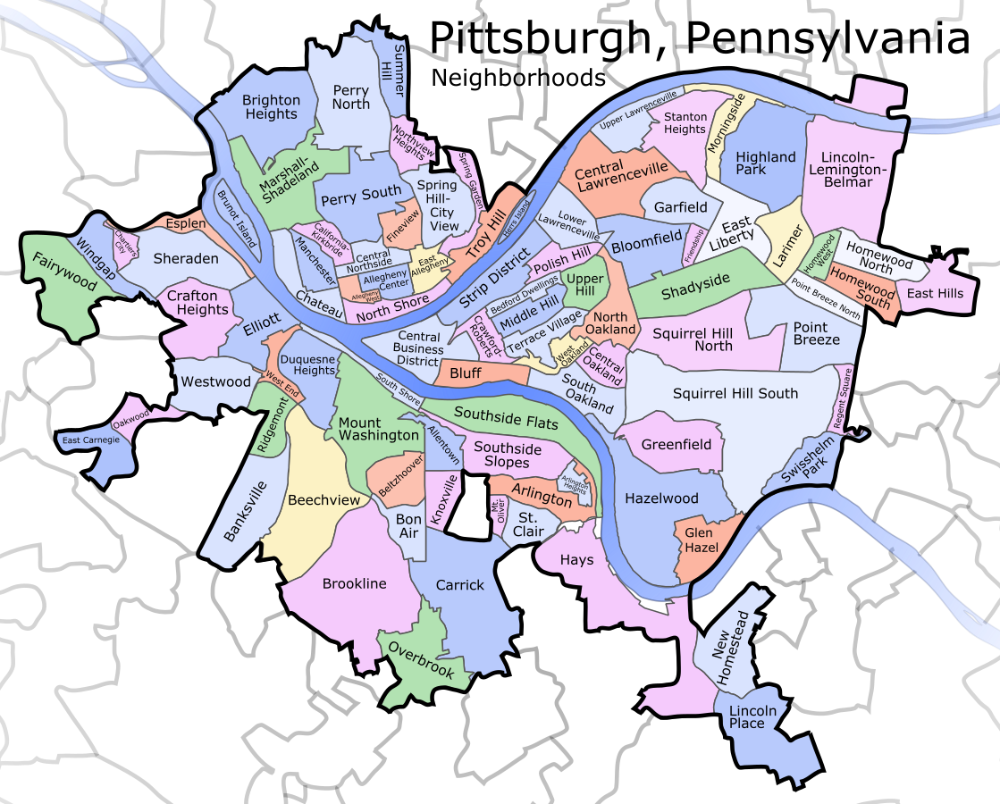
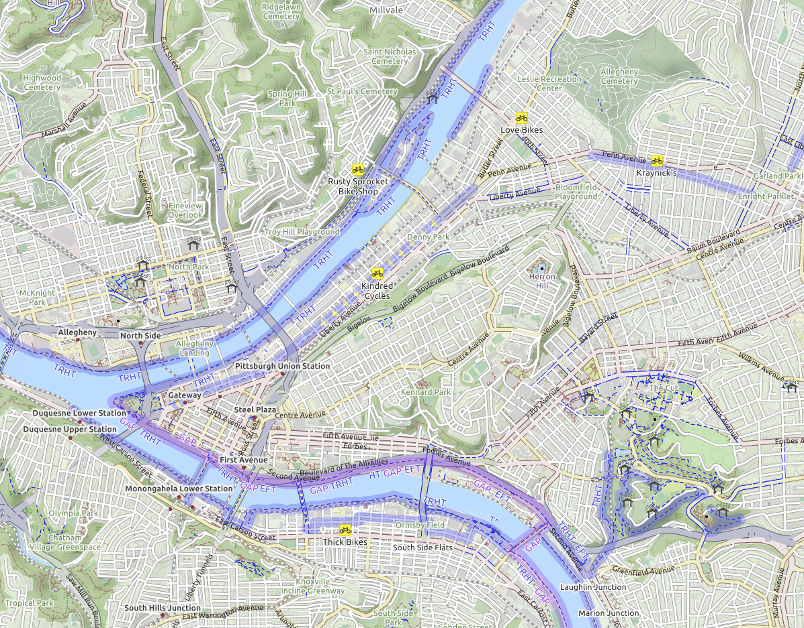

Chapter 8

# Thinking like a Software Architect

There are many texts that cover how to implement specific pieces of software systems and ML pipelines. However, when building production systems with machine-learning components (and pretty much all software systems really), it is important to plan what various pieces are needed and how to fit them together into a system that achieves the overall system goals. Programmers have a tendency to jump right into implementations, but this risks building systems that do not meet the users’ needs, that do not achieve the desired qualities, that do not meet the business goals, and that are hard to change when needed. Machine learning introduces additional complications with various additional ML components and their interactions with the rest of the system. The importance of taking time to step back and plan and design the entire system is one of the core lessons of software engineering as a discipline—such emphasis on design is arguably even more important when building systems that use machine learning.

*Software architecture* is the part of the design process that focuses on those early decisions that are most important for achieving the *quality requirements* of a system (e.g., scalability, flexibility). Conversely, those quality requirements that can only be met with careful planning of the entire system are known as *architecturally significant requirements.* Architectural design decisions are fundamental and hard to change later without fully redesigning the system. Yet, those decisions are often difficult to get right in the first place, requiring a good understanding of requirements, of consequences of different designs, and of the trade-offs involved. Experienced software architects think about system qualities and system designs and know what questions to ask early and what information to gather with prototypes or experiments. 

Architectural design is not without cost, though. The tension between architecture and agility is well documented: On the one hand, planning and architecture help to avoid costly mistakes and build the system with the right qualities that can be evolved later. On the other hand, in a race to a minimal viable product, too much architecture may slow down the project as it invests in qualities that are not relevant until the project is truly successful, at which point more resources for a full redesign may be available. Experienced software engineers and software architects can help navigate this space, focusing on the key qualities early while giving enough flexibility for later change. This skill is equally or even more important when introducing machine learning with many additional design decisions and new quality requirements into software systems.

## Quality Requirements Drive Architecture Design

The fundamental insight of software architecture is to seriously consider a system’s quality requirements early on and design the system to support those qualities. Once fundamental decisions are locked into the system implementation, they are difficult to change, making it very hard to fix qualities like scalability, security, or changeability in an existing system without a substantial rewrite.

<figure>

<figcaption>

Architecture is the binding element that guides the implementation to meet the (quality) requirements of the system.

</figcaption>
</figure>

In the design process, we often need to collect additional information to make informed decisions, and we will realize that we cannot equally achieve all desired requirements. Almost always, we will not be able to meet all requirements optimistically envisioned by the customer fully, but will need to make hard trade-off decisions. However, by deliberately considering alternatives at a design stage, we can deliberate about trade-offs and make deliberate choices, rather than locking in trade-offs from ad hoc implementation decisions. Given how difficult it is to change early decisions (often requiring a full redesign), it is risky to make those decisions based on ad hoc implementation choices without considering alternatives.

When designing the system, we have hopefully already identified important quality requirements for the system; if not, design time is a good opportunity to reflect again on the relative importance of various qualities. Typical important qualities include availability and scalability, development cost and time to release, modifiability, response time and throughput and operating cost, security and safety, and usability. With machine learning, common additional qualities of concern are accuracy, training and inference costs, training and inference latency, reproducibility and data provenance, fairness, and explainability—more on this later.

The primary objective of architectural design is to make important decisions that support the key quality goals. For example, if availability is important, developers should consider redundancy and mechanisms to detect and resolve outages early, even if it increases development and operating costs. If getting to market quickly is more important, it is likely worth intentionally relying on basic infrastructure, even if it accrues technical debt and may inhibit scalability later. As we will discuss, many desired qualities have implications on the kind of machine-learning techniques that are feasible in a project.

### Every System is Different

Ideally, we would like to describe a common architecture of integrating machine learning into a software system, but systems differ widely in their needs and quality requirements. Hence, designers and engineers need to understand the quality requirements of a particular system and design a solution that fits this problem. To illustrate the point, let us just contrast four different examples:

  * A *personalized recommendation*  component for a music streaming service needs to provide recommendations fast and at scale and needs to be flexible enough to allow frequent experimentation and automatic updates. We can plausibly deploy the model inference service as a microservice in some massively parallel cloud infrastructure. Pipeline automation and monitoring will be important to foster regular updates and experiments. Reliability may be less important, given that it is easy to instead provide cached previous recommendations or non-personalized global-top-10 recommendations as a backup. 

  * A *transcription service*  that uses speech-to-text models to transcribe audio files does not need to provide real-time results, but should be elastic to scale with changing demands. Each user only occasionally interacts with the system in irregular intervals, uploading audio files when needed. Inference itself is computationally expensive and requires specialized hardware. Cloud resources and a working queue are likely a reasonable fit to schedule and balance the work. At the same time, model updates are not as frequent, so human steps and manual testing in the update and deployment process may be acceptable if safeguards against mistakes are in place.

  * An *autonomous train* typically uses dozens of models that need to work on onboard computers in real-time. Locally available hardware sets hard constraints on what is computationally feasible. Mistakes can be fatal, so non-ML components will provide significant logic to ensure safety, interacting closely with the ML components. While model updates are possible, their rollout might be slow and inconsistent across the fleets of trains of various customers. Experimenting with different model versions in practice is limited by safety concerns, but lots of data can be collected for later analysis and future training—so much data in fact that collecting and processing all the data may be a challenge. 

  * A privacy-focused *smart keyboard*  on a mobile phone may continuously train a model for autocompletion and autocorrection locally on the phone. Here, not only inference, but also data processing and training happens locally on a battery-powered device, possibly using novel federated machine-learning algorithms. When collecting telemetry to monitor whether updates lead to better predictions, developers have to make careful decisions about what data to collect and share.

These few examples already illustrate many kinds of differences in quality requirements that will inform many design decisions, including (1) different degrees of importance of machine learning to the system’s operation affecting reliability requirements, (2) different frequency, latency requirements, and cost of model inference requests, (3) different amount of data to process during model inference or model training, (4) different frequency of model updates, (5) different opportunities and requirements for collecting telemetry data and conducting experiments in production, and (6) different levels of privacy and safety requirements based on different levels of risk. As a consequence, these systems all face very different challenges and will explore different design decisions that serve their specific needs.

### Twitter Case Study

For an illustrative (non-ML) example of the role of software architecture and quality requirements, consider the complete [redesign of Twitter](https://blog.twitter.com/engineering/en_us/a/2013/new-tweets-per-second-record-and-how) in 2011–2012: Twitter was originally designed as a monolithic database-backed web application, written in Ruby on Rails by three friends. Once Twitter became popular, it became slow and hard to scale. Developers introduced caches throughout the application and bought many machines to keep up with the load, but they could not handle spikes in traffic. After the system was already built with fundamental design deeply baked into the system (e.g., monolithic code base, single database, codebase in Ruby), it was hard to change the system to increase performance. Worse, changes that marginally improved performance often made the system harder to maintain and debug, and it became increasingly harder to fix bugs or implement new features. Since scaling was mostly achieved by buying more hardware, the company was paying a large amount of money on operating costs, which was not sustainable for the business. 

After 2010, Twitter decided to step back and redesign and reimplement the entire system—this is fairly rare and typically a last resort for most companies. For the redesign, they explicitly considered four primary quality goals: (1) improve latency and operating cost, (2) improve reliability by isolating failures, (3) improve maintainability with clearer boundaries between modules, and (4) improve modifiability to allow small teams to quickly release new features. Note how all these goals fundamentally relate to system qualities.

None of these goals could be achieved with the existing system design. Instead, a completely new system structure was designed from scratch. Instead of a monolithic system (one process running all functionality), a microservice architecture was designed (a distributed system where each functionality is isolated in separate processes that can be independently scaled); Ruby on Rails was replaced with Scala to improve performance; a completely new storage solution was designed that avoided a single bottleneck for writing tweets; and reliability and scalability strategies such as automated failover, monitoring, and load balancing were built into the infrastructure used for all remote procedure calls. While this redesign was expensive, it served all four quality goals much better than the previous system. The new system was more complex (inherent in distributed systems) and more costly to develop, but this was deemed a necessary trade-off for achieving the primary four quality goals. This design was also remarkably robust when Twitter changed ownership in 2022 and was then operated by a much smaller team.

Notice how the key architecture decisions (microservices, monitoring, data storage strategy) affect the entire system, not just individual modules. All key decisions are driven by explicit quality goals and provide a scaffolding for the design of the rest of the application and its modules. Architectural decisions were deliberated carefully, considering trade-offs between alternative designs and accepting some drawbacks for achieving the primary quality goals. Also, notice that the quality goals of the systems had changed since its inception—when Twitter was first started, scalability was likely less important than releasing a prototype quickly to gain venture funding and users, so the monolithic Ruby application may have been appropriate at a time, just not future proof given how difficult to change architectural decisions are later.

## The Role of Abstraction

Software architecture tends to focus on the big important decisions, while abstracting less important details. To reason effectively at scale, abstractions are necessary. What specific abstractions are useful depends entirely on the targeted qualities and decisions. In the software architecture community, such abstractions are commonly called *architectural views*.

To illustrate different views of a system, consider different maps of a city, such as a typical street map, a cycling map, a tourist map, and a map of flood zones. They are all different *abstractions* that represent specific aspects of the same real-world city. They show streets, cycle paths, tourist attractions, and flood zones, each useful for reasoning about the city in different ways for different goals. For example, when trying to find a good cycling path between two locations, the cycling map is obviously much more useful than the others, but that map is fairly useless when trying to map how to explore a new city in an afternoon as a tourist. Each map abstracts away some details and focuses on others relevant to a task, for example, streets or location names, topography, and flooding risk.

<figure>

<figcaption>

Neighborhoods of Pittsburgh by [Andrew Somerville](https://en.wikipedia.org/wiki/File:Pittsburgh_Pennsylvania_neighborhoods_fade.svg) [Online-only figure.]

</figcaption>
</figure>

<figure>

<figcaption>

[OpenCycleMap](https://www.opencyclemap.org/?zoom=14&lat=40.44652&lon=-79.96264&layers=B0000) of Pittsburgh [Online-only figure.]

</figcaption>
</figure>

<figure>

<figcaption>

Map of Downtown Pittsburgh (CC BY-SA 1.0, [PerryPlanet](https://commons.wikimedia.org/wiki/File:Pittsburgh_downtown_map.svg)) [Online-only figure.]

</figcaption>
</figure>

In line with the map analogy, software architecture decisions benefit from specific abstractions of a system. For example, some decisions to optimize performance benefit from understanding processes, how they exchange messages, and the timing involved to find bottlenecks, but they do not need to know about the internals of the processes. Another decision to structure a system to best support future extensions may benefit from understanding the structure of the system in terms of modules and plug-in interfaces. Yet, other decisions are optimizing for security and need to understand how the system is deployed across different networks and across different trust boundaries. In each case, we would typically collect information that is relevant to reason about a specific quality in that abstraction; for example, we would measure performance behavior, gather information about needed extensions, or collect information about network topology and existing security measures. Software architects often draw diagrams, often using informal purpose-specific notations, but it is not necessary to visualize abstractions graphically.

For example, an architectural diagram might depict various machine-learned models in a complex system like a self-driving car and how they exchange information. Such diagram abstracts all kinds of other details, but allows us to reason about how models rely on the outputs of other models—which might be useful for debugging and for reasoning about feedback loops. The same diagram would usually not have enough information to reason about real-time properties or capacities of various CPUs and GPUs on the car; for this, other abstractions could be designed and corresponding information could be collected.

<figure>

<figcaption>

The architecture of the Apollo self-driving car system depicting the various ML models and how they exchange information. From 🗎 Peng, Zi, Jinqiu Yang, Tse-Hsun Chen, and Lei Ma. “A First Look at the Integration of Machine Learning Models in Complex Autonomous Driving Systems: A Case Study on Apollo.” In Proceedings of the 28th ACM Joint Meeting on European Software Engineering Conference and Symposium on the Foundations of Software Engineering, pp. 1240–1250. 2020.

</figcaption>
</figure>

## Common Architectural Design Challenges for ML-Enabled Systems

There are many design challenges in every system, and the specifics will be different from system to system. Yet, there are several common architectural design strategies that are common across most systems and some additional ones that are particularly common in systems using ML components. Later chapters will discuss solutions in much more depth; here we only provide an overview of common architectural challenges.

**Divide and conquer.**
 A fundamental decision that needs to be made early in the development process is how to decompose the system, such that different teams can work on different components of the project (see also chapters *[Data Science and Software Engineering Process Models](20-data-science-and-software-engineering-process-models.md)* and *[Interdisciplinary Teams](21-interdisciplinary-teams.md)*). The various ML and non-ML components in a system interact, often in subtle ways. For example, predictions of a model are used in non-ML business logic, influencing user interactions, which produce telemetry, which may be used for monitoring and updating models. Also, local design decisions in individual components influence other components, such as a small model enabling different deployment choices than a large one. To effectively design a system, we need to understand how we can structure and divide the work and where coordination is still required.

Ideally, all major components and their interactions are identified early in the design and architecture process, all components and their interfaces are described, and all responsibilities are assigned. Of course, many specifics can be changed and renegotiated later, but a careful architectural design can provide a strong foundation that supports the desired quality requirements and guides the implementation. Clearly understanding interactions also helps to identify where continued coordination is needed across teams.

A component’s *interface* plays a crucial role in the collaboration between teams building a system as a negotiation and collaboration point. The interface is where teams (re-)negotiate how to divide work and how to assign responsibilities. Team members often seek information that may not be captured in interface descriptions, as interfaces are rarely fully specified. In an idealized development process, interfaces are defined early based on what is assumed to remain stable, because changes to interfaces later are expensive and require the involvement of multiple teams. Machine learning introduces a number of additional components and interfaces. For example, we may need to negotiate and document, as part of an interface, who is responsible for data quality—(a) the component providing the data or (b) the machine-learning pipeline consuming it. While the machine-learned model is relatively straightforward to integrate as an isolated model inference component with a clear interface, the machine-learning pipeline may interact with other components in more intricate ways, as we will discuss.

**Facilitating experimentation and updates with confidence.**
 Even though architectural planning is sometimes derided for too much up-front investment that assumes stable requirements and cannot react to change with enough agility, proper architectural planning can actually prepare for changes and make it easier to evolve the system. Anticipating what parts of the system are more likely to change or what qualities will become more important in the future allows it to design the system such that those changes are easier when needed. For example, anticipating running a web browser on low-memory embedded devices in the future may encourage modularizing the memory-hungry rendering engine to enable swapping it out easily later. Anticipating and encapsulating change such that future changes can happen locally without affecting the rest of the system is the core idea behind *information hiding*. It isolates change to individual teams and reduces disruptive ripple effects across the entire system implementation.

In addition, designing the system such that it can be updated easily and frequently with confidence in the updates will lower barriers to change and increase confidence in deployments. Design strategies typically include automating testing, virtualizing software in containers, automating deployments, and monitoring systems, typically using *DevOps* tooling.

With the introduction of machine learning in software systems, regular change may be even more important. Most systems will want to anticipate the constant need to update models and machine-learning pipelines, for example, (1) to fix common mistakes the model makes, (2) to react to new ideas for feature engineering or hyperparameter selection, (3) to incorporate new machine-learning technologies, (4) to train with new data and handle various forms of drift, or (5) to accommodate evolving quality requirements (e.g., latency, explainability, fairness). Therefore, it is prudent to consider early on how to design the system to continuously learn with new data and learn from feedback, to deploy updates with confidence, and to allow rapid experimentation and rapid reaction to changes in data or user behavior, all without disrupting system development and operation. As we will discuss,  including deploying machine-learned models as independent services, building robust machine-learning pipelines, model and infrastructure testing, testing in production including canary releases and A/B testing, versioning of data and models, and system and model monitoring all support updating and experimenting regularly and with confidence. However, not all systems need the same level of experimentation and updates, and some might be better off with simpler designs.

**Operating at scale or with limited resources.**
 Many ML-enabled systems operate with very large amounts of data and should be deployed at massive scale in the cloud. Distributed computing will be unavoidable as data and computations exceed the capabilities of even the fastest supercomputers. In addition to the technical complexities and new failure points introduced with distributed computing, designers must now balance latency, throughput, and fault tolerance depending on the system’s quality requirements. Monitoring the entire distributed system becomes particularly important in these systems.

At the same time, other systems may deploy machine-learned models on  embedded devices with limited resources. This may require creative solutions to operate with limited resources and still provide opportunities for collecting telemetry and updating the system. In other cases, we may need to prepare to operate entirely offline.

## Codifying Design Knowledge

Designers and architects accumulate tacit and codified knowledge based on their own experience and best practices shared in the community. For example, an experienced software architect might know three common designs for a specific problem and the trade-offs between those choices (e.g., how to detect when a system malfunctions). This way, when approaching a new system, they do not start from scratch but with experience and a design vocabulary, focusing directly on the specific qualities relevant to the trade-offs.

### Common System Structures

At the highest level of organizing components in a system architecture, there are common system structures shared by many systems. These system structures are also known as architectural styles to software architectures. There are several common system structures that will appear repeatedly throughout the next chapters. Understanding such common system structures is useful for considerations of how to fit machine-learning components into a system. The most common system structures include: 

**Client-server architecture.**
 Computations are split across multiple machines. A server provides functionality to multiple clients, typically over a network connection. This way, computational resources can be shared centrally for many users, whereas clients can remain relatively simple. The client invokes communication with the server. 

**Multi-tier architecture.**
 Computation and data storage is organized into multiple layers or *tiers* (on the same or different machines): Clients make requests to servers, which make requests to other servers, and so forth. Higher tiers send requests to lower tiers, but not the other way around. The most common structure is a three-tier architecture with a presentation tier, a logic tier, and a data tier—the data tier manages data storage; the logic tier implements business logic such as processing transactions to change data; and the presentation tier provides the user interface through which clients interact with the system. This three-tier design separates concerns regarding user interface from how requests are processed from how data is stored. This structure is common for business and web applications and can be conceptually extended with components related to machine learning (as we will show in chapter *[Deploying a Model](10-deploying-a-model.md)*).

<figure>

<figcaption>

A typical representation of a three-tier architecture.

</figcaption>
</figure>

**Service-oriented architectures and microservices.**
 A system is organized into multiple self-contained services (processes) that call other services through remote procedure calls. The services are not necessarily organized into layers, and typically each service represents a cohesive piece of functionality and is responsible for its own data storage. This design allows independent deployment, versioning, and scaling of services and flexible routing of requests at the network level. Many modern, scalable web-based systems use this design, as we will discuss in chapter *[Scaling the System](12-scaling-the-system.md)*. 

<figure>

<figcaption>

A sketched architecture of an audiobook app with media purchasing and streaming services, composed of many (micro-)services each with a specific and narrow focus. Each service stores its own data. To increase throughput and reliability, multiple instances per service can be offered with partitioned or shared data storage. Adapted from a figure in Meiklejohn, Christopher. “[Dynamic Reduction: Optimizing Service-Level Fault Injection Testing With Service Encapsulation](https://christophermeiklejohn.com/filibuster/2021/10/14/filibuster-4.html)” [blog], 2021.

</figcaption>
</figure>

**Event-based architecture.**
 Individual system components listen to messages broadcasted by other components, typically through some message bus. Since the component publishing a message does not need to know who consumes it, this architecture strongly decouples components in a system and makes it easy to add new components. Many robotics systems follow this design, processing components subscribing to messages published from sensor readings. We will see this architecture style when discussing stream processing systems in chapter *[Scaling the System](12-scaling-the-system.md)*. 

**Data-flow architectures.**
 The system is organized around data, often in a sequential pipeline, where data produced by one component is used as input by the next component. This design, also known as pipe-and-filter architecture, allows flexible changes of components and flexible composition of pipelines from different subsets of components. Unix shell commands can be composed through pipes to perform more complex tasks, and machine-learning pipelines often follow this design of multiple transformations to a dataset arranged in a sequence or directed acyclic graph. Machine-learning pipelines tend to follow this data-flow style, as do batch processing systems for very large datasets. 

<figure>

<figcaption>

A simple sketch of a dataflow program illustrated with shell commands. The output of one command flows into the next.

</figcaption>
</figure>

**Monolithic system.**
 The system is composed of a single unit where internals are interwoven rather than clearly separated, as in the original Twitter code. Internally there might be modules and libraries, but they are usually not intentionally arranged as services or in layers. Machine-learning components may be interwoven in such systems, often using libraries. System development is initially simple and local without the need for networked communication and the complexities of distributed systems. This design is often derided for being hard to evolve and scale once the system grows.

All of these common system structures will also reappear in the context of ML-enabled systems. We will see examples of deploying machine-learned models as services as well as deploying them as libraries in monolithic systems (chapter *[Deploying a Model](10-deploying-a-model.md)*), we will see event-based architectures in the context of processing large amounts of data with stream processing (chapter *[Scaling the System](12-scaling-the-system.md)*), and we will see data-flow architectures within pipelines to train models (chapter *[Automating the Pipeline](11-automating-the-pipeline.md)*). 

### Design Patterns

In software engineering, codified design knowledge is best known in the form of *design patterns*. A design pattern names and describes a common solution to a known design problem and the known advantages and pitfalls. For example, the *observer* pattern is a common object-oriented design pattern to describe a solution how objects can be notified when another object changes (e.g., when a button is clicked) without strongly coupling these objects to each other. Entire catalogs of design patterns are often published in books or online. 

The idea of design patterns originally emerged from the field of architecture (as in designing buildings, not software) and has been popularized in software engineering initially around object-oriented programming, but has since been applied to many other design challenges, such as software architecture, parallel programming, distributed programming, big data systems, security, designing community organizations, and recently also machine learning. At a smaller scale, design patterns describe solutions for design challenges among objects in a program; at the much larger scale of software architecture, patterns may discuss interactions among subsystems (including the system structures described earlier in this chapter). Independent of the scale at which these patterns are discussed, the key idea of codifying design knowledge is the same. Next, we illustrate four different examples of patterns in different domains and at different levels of granularity.

Patterns typically follow a similar structure of name, problem, solution, alternatives, and trade-offs. Establishing widely shared names for patterns enables more effective communication. For example, instead of a conversation “maybe we should decouple these objects by introducing an interface with a single method and letting the other objects keep a list of instances of this interface, to then call the interface rather than the individual objects when something changes,” we might just say “maybe we should use the observer pattern to decouple these objects.” If the people involved know the pattern, the term “observer pattern” compactly refers to lots of underlying knowledge, including the shape of the solution and its implications and trade-offs. That is, thinking and communicating in terms of design patterns raises the design process to a much higher level of abstraction, building on accumulated design experience.

Regarding machine learning in software systems, we are still at an early stage of encoding design knowledge as design patterns. Although many academic articles, books, and blog posts try to suggest patterns related to machine learning in software systems, we are not yet at a stage where a stable catalog of patterns has emerged and has become more broadly adopted. As of this writing, the suggested patterns are all over the place—some focus on system organization broadly and some focus on specific components, such as how to encode features during model training. Most patterns are not well defined, do not have broadly-agreed names, and are not well grounded. In the following chapters, we selectively mention some emerging patterns related to the concerns we discuss, but we do not try to comprehensively cover ML-related design patterns.

**Example object-oriented design pattern: The Observer design pattern**

  * *Name:* Observer (aka publish-subscribe). 

  * *Intent:* Define a one-to-many dependency between objects so that when one object changes state, all its dependents are notified and updated automatically.

  * *Motivation:* [This would include an illustrative example of a user interface that needs to update multiple visual representations of data whenever input data changes, such as multiple diagrams in a spreadsheet.] 

  * *Solution:* [This would include a description of the technical structure with an observer interface implemented by observers and an observable object managing a list of observers and calling them on state changes.]

  * *Benefits, costs, trade-offs:* Decoupling of the observed object and observers; support of broadcast communication. Implementation overhead; observed objects unaware of consequences and costs of broadcast objects. [Typically this would be explained in more detail with examples.]

**Example of an architectural pattern for availability: The Heartbeat tactic**

  * *Name:* Heartbeat (aka dead-man timer). 

  * *Intent:* Detect when a component is unavailable to trigger mitigations or repair.

  * *Motivation:* Detect with low latency when a component or server becomes unavailable to automatically restart it or redirect traffic.

  * *Solution:* The observed component sends heartbeat messages to another component monitoring the system in regular predictable intervals. When the monitoring component does not receive the message, it assumes the observed component is unavailable and initiates corrective actions.

  * *Options:* The heartbeat message can carry data to be processed. Standard data messages can stand in for heartbeat messages so that extra messages are only sent when no regular data messages are sent for a period.

  * *Benefits, costs, trade-offs:* Component operation can be observed. Only unidirectional messaging is needed. The observed component defines heartbeat frequency and thus detection latency and network overhead. Higher detection latency can be achieved at the cost of higher network traffic with more frequent messages; higher confidence in detection can be achieved at the cost of lower latency by waiting for multiple missing messages. 

  * *Alternatives:* Ping/echo tactic where the monitoring component requests responses.

**Example of a machine-learning design pattern for reuse: The Feature Store pattern**

  * *Name:* Feature Store. 

  * *Intend:* Reuse features across projects by decoupling feature creation from model development and serving.

  * *Motivation:* The same feature engineering code is needed during model training and model serving; inconsistencies are dangerous. In addition, some features may be expensive to compute but useful in multiple projects. Also, data scientists often need the same or similar features across multiple projects, but often lack a systematic mechanism for reuse.

  * *Solution:* Separate feature engineering code and reuse it both in the training pipeline and the model inference infrastructure. Catalog features with metadata to make them discoverable. Cache computed features used in multiple projects. Typically implemented in open-source infrastructure projects.

  * *Benefits:* Reusable features across projects; avoiding redundant feature computations; preventing training-serving skew; central versioning of features; separation of concerns.

  * *Costs:* Nontrivial infrastructure; extra engineering overhead in data science projects.

  * This concept is discussed in more depth in chapter *[Deploying a Model](10-deploying-a-model.md)*.

**Example of a machine-learning design pattern for large language models: The Retrieval-Augmented Generation (RAG) pattern**

  * *Name:* Retrieval-Augmented Generation (RAG).

  * *Intend:* Enabled a generative model to generate content more accurately or to generate answers about proprietary or recent information that was not used for model training.

  * *Motivation:* Provide a generative model performing tasks such as question answering with relevant context information or enhance a search with powerful summarization techniques of a large language model. Generative models are trained on large datasets but often do not have access to proprietary or recent information or may hallucinate answers when factual information is already available in documents. 

  * *Solution:* Decompose the problem into two steps, search and generation. In the search step, relevant context information is located (e.g., using traditional search or a modern retrieval model backed by a vector database). The search results are then provided as part of the context in a prompt to the generative model.

  * *Benefits, costs, trade-offs:* Enables generating answers about recent or proprietary information without retraining the model. The generative model’s answer is focused and grounded in the search result provided as context, reducing the risk for hallucinations. Nontrivial infrastructure and expensive inference cost and additional latency for search and generation. Requires access to relevant data to search in. The model may leak proprietary information from the context.

These patterns are examples to illustrate the range of design knowledge that can be encoded in pattern catalogs. Software architects are usually well familiar with standard patterns in their field.

## Summary

Going from requirements to implementation is hard. Design and architecture planning can help to bridge the gap. The key is to think and plan before coding to focus on the qualities that matter and which may be very hard to fix later in a poorly designed system. Architectural design is deeply driven by quality attributes, such as scalability, changeability, and security. It focuses on core abstractions, gathering relevant information, and deliberating about important design decisions to achieve the quality goals. In the process, decomposing the system and deciding how to divide the work is a key step. Planning for evolution as part of the early system design and making deployment of new versions easy can enable organizations to move much faster later and to experiment more easily.

## Further Readings

  * A great introduction to software architecture and how it supports software design with quality goals as first-class entities; including also a catalog of architectural tactics (including the heartbeat tactic): 🕮 Bass, Len, Paul Clements, and Rick Kazman. *[Software Architecture in Practice](https://www.oreilly.com/library/view/software-architecture-in/9780132942799/)*. Addison-Wesley Professional, 3rd edition, 2012.

  * An interview study with software architects about challenges faced in software systems with ML components: 🗎 Serban, Alex, and Joost Visser. “[An Empirical Study of Software Architecture for Machine Learning](https://arxiv.org/abs/2105.12422).” In *Proceedings of the International Conference on Software Analysis, Evolution and Reengineering*, 2022.

  * A concrete example of an architecture of a chatbot involving both ML and non-ML components: 🗎 Yokoyama, Haruki. “[Machine Learning System Architectural Pattern for Improving Operational Stability](https://www.computer.org/csdl/proceedings-article/icsa-c/2019/08712157/1a3x2Rj0Mnu).” In *International Conference on Software Architecture Companion*, pp. 267–274. IEEE, 2019.

  * A classic software engineering paper on the power of designing a system in a modular way that anticipates change: 🗎 Parnas, David L. “[On the Criteria to Be Used in Decomposing Systems into Modules](https://kilthub.cmu.edu/articles/journal_contribution/On_the_criteria_to_be_used_in_decomposing_systems_into_modules/6607958/files/12098510.pdf).” In *Communications of the ACM*, vol. 15, no. 12, 1972.

  * The idea of design patterns in software engineering was popularized by this book in the context of object-oriented programming (which also discusses the observer pattern in depth): 🕮 Gamma, Erich, Richard Helm, Ralph Johnson, and John Vlissides. *[Design Patterns: Abstraction and Reuse of Object-Oriented Design](https://bookshop.org/books/design-patterns-elements-of-reusable-object-oriented-software/9780201633610)*. Addison-Wesley Professional, 1994.

  * An early exploration of different styles of system architectures and how to organize them: 🕮 Shaw, Mary, and David Garlan. *[Software Architecture: Perspectives on an Emerging Discipline](https://archive.org/details/softwarearchitec0000shaw/page/n9/mode/2up)*. Prentice Hall, 1996.

  * A recent book proposing and discussing design patterns in the context of ML pipelines (including the feature store pattern): 🕮 Lakshmanan, Valliappa, Sara Robinson, and Michael Munn. *[Machine Learning Design Patterns](https://bookshop.org/books/machine-learning-design-patterns-solutions-to-common-challenges-in-data-preparation-model-building-and-mlops/9781098115784)*. O'Reilly Media, 2020.

  * A survey of antipatterns in developing systems with ML components, collected from the perspective of technical debt: 🗎 Bogner, Justus, Roberto Verdecchia, and Ilias Gerostathopoulos. “[Characterizing Technical Debt and Antipatterns in AI-Based Systems: A Systematic Mapping Study](https://robertoverdecchia.github.io/papers/TechDebt_2021.pdf).” In *International Conference on Technical Debt*, pp. 64–73. IEEE, 2021.

  * Interview studies discussing the vast differences between different production ML-enabled system projects and the teams involved, highlighting that many architectural challenges and problems occuring at the interfaces between components: 🗎 Lewis, Grace A., Ipek Ozkaya, and Xiwei Xu. "Software Architecture Challenges for ML Systems." In *International Conference on Software Maintenance and Evolution (ICSME)*, pp. 634–638. 2021. 🗎 Nahar, Nadia, Shurui Zhou, Grace Lewis, and Christian Kästner. “[Collaboration Challenges in Building ML-Enabled Systems: Communication, Documentation, Engineering, and Process](https://arxiv.org/abs/2110.10234).” In *Proceedings of the International Conference on Software Engineering (ICSE)*, 2022. 

  * A technical description of the retrieval-augmented generation approach and a survey of various variations in the field: 🗎 Lewis, Patrick, Ethan Perez, Aleksandra Piktus, Fabio Petroni, Vladimir Karpukhin, Naman Goyal, Heinrich Küttler et al. “[Retrieval-Augmented Generation for Knowledge-Intensive NLP Tasks](https://proceedings.neurips.cc/paper/2020/hash/6b493230205f780e1bc26945df7481e5-Abstract.html).” *Advances in Neural Information Processing Systems* 33 (2020): 9459–9474. 🗎 Gao, Yunfan, Yun Xiong, Xinyu Gao, Kangxiang Jia, Jinliu Pan, Yuxi Bi, Yi Dai, Jiawei Sun, and Haofen Wang. “[Retrieval-Augmented Generation for Large Language Models: A Survey](https://arxiv.org/abs/2312.10997).” arXiv preprint 2312.10997, 2023.

  * A blog post describing the architectural considerations that went into the complete redesign of Twitter: 📰 Krikorian, Raffi. “[New Tweets per Second Record, and How!](https://blog.twitter.com/engineering/en_us/a/2013/new-tweets-per-second-record-and-how)” Twitter Engineering Blog, 2013.

---
*As all chapters, this text is released under <a href="https://creativecommons.org/licenses/by-nc-nd/4.0/">Creative Commons BY-NC-ND 4.0</a> license.*
*Last updated on 2024-08-08.*
