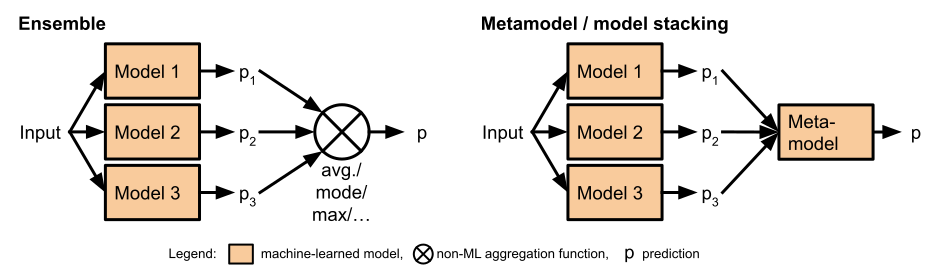

<div class="chapter">Chapter 10</div>

# Deploying a Model

Production systems that use machine learning will at some point deploy one or more machine-learned models and use them to make predictions. The step of using a machine-learned model to make a prediction for some given input data is typically called *model inference*. While seemingly simple, there are lots of design decisions and trade-offs when considering how to deploy a model, depending on system requirements, model qualities, and interactions with other components. A common form is to provide a model inference service as a microservice, called through remote procedure calls by other components of the system, but models may also be embedded as libraries on client devices or even deployed as precomputed tables. Quality requirements for model inference, such as the need to scale to many requests or to frequently experiment with changes, drive design choices for deployment.

## Scenario: Augmented Reality Translation


Consider a big tech company wanting to give smart glasses another chance. Those glasses can record audio and video and project images with an optical head-mounted display. Smart glasses are best known for Google’s 2013-2015 *Google Glass* product. In contrast to virtual reality goggles, smart glasses aim for augmented reality, where information is overlayed over the real world. To support the upcoming release of the new smart glasses, the company wants to develop an augmented-reality-translation app that can translate text in the real world, for example, translating signs while walking through a city in a foreign country as a tourist.

<figure>


<figcaption>

Google Glass, 2014 (CC BY-SA 3.0 [Mikepanhu](https://en.wikipedia.org/wiki/Google_Glass#/media/File:Google_Glass_with_frame.jpg)) <span title="Online-only figure; not part of the printed book.">[Online-only figure.]</span>

</figcaption>
</figure>

There are many existing building blocks for such an application. Text translation is standard these days, as is optical character recognition (OCR). There are also several products, including Google Translate for smartphones that can already automatically recognize and translate text in live video, overlaying the translation over the original text in a live camera feed. Also, image stabilization modules are well researched.

<figure>


<figcaption>

Korean signs in central Seoul (by [8minwoo](https://pixabay.com/photos/nightlife-republic-of-korea-jongno-2162772/)). Foreigners would likely benefit from translations. <span title="Online-only figure; not part of the printed book.">[Online-only figure.]</span>

</figcaption>
</figure>

To build an augmented reality translation app for smart glasses then, we need to decide how to customize, integrate, and deploy the various components of the system. The glasses themselves may not have enough computation power and battery to run all models, but they can communicate with a smartphone over Bluetooth, which may talk to a cloud-backed server over Wi-Fi or a cellular connection.

<figure>


<figcaption>

An architectural model of the augmented reality translation scenario, where three models could be deployed on different hardware.

</figcaption>
</figure>

## Model Inference Function

At their bare essentials, most machine-learned models have a really simple interface for prediction, which can be encapsulated as a simple side-effect-free function. They take as input a *feature vector* of values and produce as output a prediction using the previously learned model. The feature vector is a sequence of numbers representing the input, say, the colors of pixels of an image or numbers representing characters or words. The inference computations of the model usually follow a relatively simple structure composed of matrix multiplications, additions, and *if* statements, often in long sequences, with the constants and cutoffs (the model parameters) learned during model training.  In our augmented-reality-translation scenario, the OCR model might take an image represented as a vector of numbers and return a probability score and bounding box for each detected character. Models are typically stored in a serialized format in files and are loaded into memory when needed for inference tasks. These kinds of inference functions can now be used by other parts of the system to make predictions.

<figure>

```python
from sklearn.linear_model import LogisticRegression
model = ... # learn model or load serialized model ...
def infer(feature1, feature2):
     return model.predict(np.array([[feature1, feature2]])
```

<figcaption>

An inference function for a simple classification model taking two numeric feature inputs in scikit learn.

</figcaption>
</figure>

## Feature Encoding

<figure>


<figcaption>

Feature encoding is an important step in the inference process that may happen within (dotted box) or outside (dashed box) the scope of the inference function.

</figcaption>
</figure>

In almost all settings, there is a *feature encoding* step that takes the original input, such as a JPEG image, a GPS coordinate, a sentence, or a row from a database, and converts it into the feature vector in the format that the model expects. Feature engineering can be simple, such as just normalizing a value representing a person’s age to a range between -1 and 1. It can also involve more sophisticated computations, doing nontrivial transformations, nontrivial data aggregation, or even applying other machine-learned models. In our augmented-reality-translation scenario, we need to at least convert the pixels of the camera input into a vector presenting the three color components of each pixel (e.g., a vector of 2,764,800 bytes representing the three colors of 1280 x 720 pixels). In this scenario, we might additionally (1) use the current geo-location to guess probable character sets to recognize, (2) use a [saliency model](https://en.wikipedia.org/wiki/Salience_(neuroscience)) to crop the image to its focus areas, or (3) write database queries to identify past translations at the same location. 

<figure>

```python
import tensorflow as tf
detector_model = ... # load serialized model...
def detect_objects_in_img(path):
    img = tf.image.decode_jpeg(tf.io.read_file(path), channels=3)
    # feature encoding with library call
    converted_img  = tf.image.convert_image_dtype(img, tf.float32)[tf.newaxis, ...]
    result = detector_model(converted_img)
    return set(result['detection_class_entities'].numpy())

```

<figcaption>

An inference function for object detection with TensorFlow, which requires some feature encoding.

</figcaption>
</figure>

When thinking of model inference as a function within a system, feature encoding can (1) happen with the model-inference function or (2) be the client's responsibility. That is, the client provides either raw inputs such as image files or feature vectors to the inference service. Feature encoding and model inference could even be two separate services that are called in sequence by the client. Which alternative is preferable is a design decision that may depend on a number of factors, for example, whether and how the feature vectors are stored in the system, how expensive computing the feature encoding is, how often feature encoding changes, and how many models use the same feature encoding. For instance, for our OCR model, having feature encoding be part of the inference service is convenient for clients and makes it easy to update the model without changing clients; in contrast, if color is not needed for OCR, it might be more efficient to send only compact feature vector over the network instead of the raw image.

A similar discussion also applies to postprocessing of prediction results, as common to normalize outputs when using large language models for classification tasks. For example, when using a large language model for sentiment analysis, a postprocessing step would recognize “positive,” “1,” and longer text containing “positive” in the first few words all as positive sentiment and return a boolean value. Such postprocessing can happen within or outside of the inference service. For more sophisticated processing of outputs with some business logic, it is more common though to separate that processing into a separate module.

### Feature Encoding During Training and Inference 

The same feature encoding must be used during training and inference.  Inconsistencies are dangerous and can lead to wrong predictions as the runtime data does not match the training data. This can span from minor inconsistencies, such as inconsistent scaling of a single feature, to completely scrambling the inputs, like changing the order in which colors are encoded changes. To prevent inconsistent encoding between training and inference, known as *training–serving skew*, a common practice is to write feature encoding code as a function used both in training and at inference time. This could be as simple as a Python function imported from both the training and inference code. That code must be versioned together with the model (see also chapter *[Versioning, Provenance, and Reproducibility](24-versioning-provenance-and-reproducibility.md)*).

<figure>


<figcaption>

The feature encoding code used for training must be the same as the code used for encoding runtime data during inference on that model. It is useful to factor the shared code into a reusable library.

</figcaption>
</figure>

### Feature Stores

In large organizations, it may also be desirable to collect and reuse code for feature extraction and feature encoding so that it can be reused across different projects. For example, multiple models may need to recognize local languages from GPS coordinates. Rather than having multiple teams reimplement the same or similar feature extraction and feature encoding implementations, it can be beneficial to collect them in a central place and make them easily discoverable. This is particularly true for more challenging encodings that may involve other machine-learned models, such as using a saliency model to decide how to crop an image, and encodings using nontrivial database queries. Documenting the different pieces of feature engineering code may further help to discover and reuse them across multiple models and projects.

In addition, if features are reused across multiple projects or need to be extracted from the same data repeatedly over time, it may be worth precomputing or caching the feature vectors. For example, multiple models may need similar features computed for all our registered users.

Many companies have adopted *feature stores* to solve both problems: Feature stores catalog reusable feature-engineering code and can help to compute, precompute, and cache feature vectors, especially when operating with large amounts of data and expensive feature encoding operations. There are many competing open-source and commercial projects, such as *[Feast](https://feast.dev/), [Tecton](https://www.tecton.ai/),* and *[AWS SageMaker Feature Store](https://aws.amazon.com/sagemaker/feature-store/)*.

## Model Serving Infrastructure

Models can be integrated into a system in various different ways—from local deployment to scalable distributed cloud deployment on specialized hardware. Feature-encoding code and model inference are almost always *free of side effects* (also called *stateless* or *pure*): they do not store any information between multiple invocations, so all function invocations are independent. If state or context is required across multiple inferences, it is usually passed as part of each inference’s inputs. The lack of side effects makes it easy to parallelize feature encoding and inference code, answering separate requests from different processes without any required synchronization—the problem is *[embarrassingly parallel](https://en.wikipedia.org/wiki/Embarrassingly_parallel)*.

**Common forms of serving a model.**
 At least four designs for serving a model within a system are common.

  * *Model inference as a library.* The model and inference function can simply be embedded as a *local function* or *library* in the target system. The model is loaded into memory, and inference is performed with a local function call. The model may be shipped as part of the system binaries or loaded over the network. For example, OCR models like *[Tesseract](https://github.com/tesseract-ocr/tesseract)* are readily available as libraries. In addition, various libraries facilitate embedding serialized models, such as TensorFlow Lite for mobile apps and TensorFlow.js for client-side browser deployments.

  * *Model inference as a service.* Likely the most common form of deploying a machine-learned model is to provide a dedicated server that responds to networked client requests over a REST API, as we will illustrate. Depending on the model, we might benefit from specialized hardware for the service. To scale the system, multiple instances of such *model inference service* can be distributed across multiple machines, locally or in some cloud infrastructure, often using some container virtualization. 

  * *Batch processing.* If the model is smaller than the data, it is more efficient to perform model inference where the data is stored rather than sending data to an inference service. *Batch processing* can move a model to the data and perform inference in bulk (see chapter *[Scaling the System](12-scaling-the-system.md)*).

  * *Cached Predictions.* When predictions are expensive but not many distinct inputs need to be predicted, it can be worth *caching* or even *precomputing* all predictions. This way, inference can be reduced to looking up previous predictions of the model in some database—such as translations for common words. 


Of course, hybrid approaches for all of these exist.

**Model inference as a service in the cloud.**
 In recent years, much infrastructure has been developed to deploy and scale computations in the cloud, which enables flexibly adding more computational resources as needed. Many cloud providers also provide different hardware options, allowing developers to assign certain computations to dedicated machines with high memory, fast CPUs, or GPUs. Particularly *microservices* and *serverless functions* are common patterns for deploying computations to the cloud that are a good match for providing *model inference as a service*. 

In a nutshell, a microservice is an independently deployable process that provides functions that can be called by other components of the system over the network, usually with [REST](https://en.wikipedia.org/wiki/Representational_state_transfer)-style HTTP requests. A typical microservice is small, focusing on a single function or a set of closely related functions. It can be developed independently from other services, possibly by a different team and with a different technology stack. An inference service for a single model is a natural fit for the concept of a microservice—it provides a single function for making predictions. Scalability is achieved by running multiple instances of a service behind a load-balancer (see chapter *[Scaling the System](12-scaling-the-system.md)*). The service can be scaled elastically with demand by adding or removing additional instances as needed. In addition, *serverless computing* is a common pattern to deploy services in the cloud, where the cloud infrastructure fully automatically scales the service to meet requests, charging per request rather than per provisioned instance.

Offering model inference as a service is straightforward with modern infrastructure. Typically, developers wrap the model inference function behind an API that can be called remotely, set up the service in a container, and deploy the service’s container to virtual machines or cloud resources.

**Writing a custom model inference service.**
 While many frameworks automate these steps, it is illustrative to understand how to build a custom inference service. For example, a simple Python program can load the model and implement the model inference function, with or without feature encoding code; it can then use the library *flask* to accept HTTP requests on a given port, and for each request run the inference function and return the result as the HTTP response.  The model is loaded only once when the process is started and can serve multiple inference requests with the same model. Multiple processes can be started to share the load. Of course, such an API can also be designed to batch multiple predictions in a single call to save on network overhead. 

<figure>

```python
from flask import Flask, request, jsonify
app = Flask(__name__)
translation_model = ... # load model
@app.route('/translate', methods=['POST'])
def pred():
  text_to_translate = request.json.get('text')
  target_lang = request.json.get('target')
  output_array = translation_model(text_to_translate, target_lang)
  return jsonify({"response": decode(output_array)})
```

<figcaption>

A simplified example of a model inference service for translations written with flask, responding to POST requests.

</figcaption>
</figure>

To make the inference service portable and easy to run on different machines, it is common to virtualize it in a container.

<figure>

```Dockerfile
FROM python:3.8-buster
RUN pip install uwsgi==2.0.20
RUN pip install numpy==1.22.0
RUN pip install tensorflow==2.7.0
RUN pip install flask==2.0.2
RUN pip install gunicorn==20.1.0
COPY models/model.pf /model/
COPY ./serve.py /app/main.py
WORKDIR ./app
EXPOSE 4040
CMD ["gunicorn", "-b 0.0.0.0:4040", "main:app"]
```

<figcaption>

An example of a Dockerfile create a virtual machine for our model and flask-based inference server.

</figcaption>
</figure>

**Infrastructure to deploy model inference services.**
 Model serving is a common problem, and much setup is similar for many model inference services with common ingredients: (1) an inference function, which almost always has the same structure of loading a model, invoking feature encoding, passing feature vectors to the model, and returning the result; (2) code to accept REST requests, invoke the inference function, and respond with the result; (3) container specifications to wrap the service for deployment; and (4) optionally additional infrastructure for monitoring, autoscaling, and A/B testing. All of these ingredients are fairly routine and repetitive, and thus they make good candidates for abstraction and automation. 

Many infrastructure projects make it easy to deploy code and models. For example, many cloud providers provide infrastructure for deploying *serverless functions* that wrap a function (like an inference function) with automatically generated code for serving requests through a REST API, usually already optimized for throughput, latency, robustness, and monitorability.  Some projects even generate the inference function automatically from metadata describing input and output formats without a single line of code. Some of these further integrate with model stores and discovery services that show lists of available models. Examples include *[BentoML](https://github.com/bentoml/BentoML)* for low code service creation, deployment, model registry, and dashboards; *[Cortex](https://www.cortex.dev/)* for automated deployment and scaling of models on AWS; Tensorflow’s *[TFX model serving](https://www.tensorflow.org/tfx/guide/serving)* infrastructure as high-performance framework for Tensorflow GRPC services; and *[Seldon Core](https://www.seldon.io/tech/products/core/)* as no-code model service with many additional services for monitoring and operations on Kubernetes. 

## Deployment Architecture Trade-offs

While the technical deployment of model inference as a library or service is often straightforward, deciding whether to deploy as a library or service and where to deploy can require nontrivial trade-offs in many systems.

### Server-Side Versus Client-Side Deployment

First, we distinguish between locations where the product’s code and model inference will be executed. While there are many different and complicated possible topologies, for simplicity, we consider (1) *servers* under the control of the application provider, whether in-house servers or cloud infrastructure, and (2) a *user-facing device* through which the user interacts with the system, such as a desktop computer, a mobile phone, a public terminal, a smart-home appliance, or our smart glasses. 

Computations are often split between server and user-facing devices. At one end of the spectrum, all computation can happen on the user-facing devices, without any connection to servers. For example, we could attempt to deploy the entire augmented-reality-translation system on the smart glasses to work offline without a phone or network connection. At the other end, almost all computations can be performed on some servers, and the user-facing device only collects inputs and shows outputs. For example, our smart glasses could stream video to a cloud server and receive the translations for the heads-up display. In hybrid settings, some computations will be performed on the user-facing device, whereas others will be delegated to a server, such as performing simple translations locally but sending words not recognized to the cloud.

**Server-side model deployment.**
 If model inference is deployed as a service on a server, other components can perform predictions with remote procedure calls, including components on user-facing devices. Server-side deployment makes it easy to provide *dedicated resources* for model inference and *scale* it independently, for example, autoscaling with a cloud infrastructure. This can be particularly useful if models are large or have resource demands on memory, energy, and GPU that exceed those of the user-facing devices. With large foundation models, server-side deployment is typically the only option. Conversely, server-side deployment places all computational *costs* for model inference on the server infrastructure, rather than distributing them to the user-facing devices.

For this approach to work, the user-facing devices need a network connection to the server. Hence, model inference *will not work offline,* and *network latency and bandwidth* can be a concern. If inputs for model inference are large, such as images, audio, and videos, this design can cause significant network traffic, both for clients and server operators. The network latency (roundtrip time for packages on the network) adds to the inference latency of the model itself and can vary significantly based on the network connection. For example, an obstacle avoidance feature in a drone can usually not afford to send a constant video stream to a server for inference.

On the server side, the model can be deployed together with business logic or separated. Deploying the model as a separate service provides flexibility during operations, for example, scaling model inference and business logic independently on different servers with different hardware specifications. 

**Client-side model deployment.**
 Alternatively, the model can be deployed on the client-facing device, typically bundled with the application as a binary resource. Client-side model deployment takes advantage of the computational resources of the user-facing device, thus saving operating costs for servers. Since no network connection is needed, model inference can be performed *offline*, and there are no concerns about network latency or bandwidth. Offline, on-device inference is also commonly seen as protecting *privacy*, since user data is not (necessarily) leaving the user-facing device. For example, a user may not want to send all text recognized from their glasses to a server not under their control.

When models are deployed client-side, the target devices need to have sufficient *computational resources* for model inference. Inference on user-facing devices is often slower than on a dedicated server with specialized hardware. For example, smartphones usually do not have powerful GPUs for expensive model inference tasks and may not even have sufficient memory to load large models. If the hardware of client devices is heterogeneous, for example, applications to be deployed on many different mobile phones, inference latency and user experience may vary substantially between users, leading to inconsistent user experiences. A homogeneous environment with predictable inference latency is usually only possible if the client-facing device is managed, such as public kiosks or autonomous trains, or the software is run only in select environments, such as supporting only two product generations of smart glasses from a single manufacturer. Embedded models also increase the download size and storage requirements for the applications that contain them, for example, increasing the size of mobile apps for downloads and updates substantially. Furthermore, the energy cost of model inference may create challenges for battery-powered devices.

If users have access to the client device, sophisticated users can gain access to the models themselves. For example, models embedded in desktop and mobile applications are difficult to protect. Possible access to model internals can raise concerns about *intellectual property* and *adversarial attacks—*it is much easier to craft malicious inputs with access to model internals than having to repeatedly probe a server-side model inference service (see also chapter *[Security and Privacy](28-security-and-privacy.md)*). 

**Hybrid model deployments.**
 There are many possible designs where models are deployed both on servers and user-facing devices or other infrastructure in a network. Different designs with split or redundant deployments can balance offline access, privacy protections, and network traffic and latency, for example, only using server-side models when the user-facing device has a fast network connection or a low battery. The deployment approach of *precomputed* and *cached predictions* can be particularly useful in a hybrid setting: Instead of deploying the model to a client, only a smaller lookup table with precomputed predictions is deployed. If an input of interest is covered by the table, the client can simply look up the result; if not, a request is sent to the server. This design also prevents leaking model internals to anybody inspecting the application on a user’s device.

### Considerations for Updates and Online Experimentation

Decisions about where to deploy a model can significantly influence how the model can be updated and how easy it is to experiment with different model variants. Conversely, a requirement for frequent model updates or flexible experimentation can influence what deployment decisions are feasible.

**Server-side updates.**
 For server-side model deployments, it is easy to deploy a new version of a model without having to modify the clients. If the input and output types of the different model versions are compatible, developers can simply replace the model behind an API endpoint. In our smart-glasses scenario, we could simply update a server-side translation model without changing any other part of the system. This way it is also possible to ensure that all users use the same version of the model, even if some users use an older release of the application.

As we will discuss in chapter *[Testing and Experimenting in Production](19-testing-and-experimenting-in-production.md)*, this flexibility to update the model independently from the application is also routinely used to experiment with different model variants in production. Since model inference is already performed on the server, it is also easy to collect telemetry data and monitor the model, including observing request frequency and the distribution of inputs and outputs—for example, whether a new OCR model recognizes more text in production.

**Client-side updates.**
 For client-side model deployments, updates and experimentation are more challenging and may require more planning. The key problems are (1) that updates may require transferring substantial amounts of data to the user-facing devices, especially with large models, and (2) that the devices may not all be connected with equally reliable and fast network connections and may not always be online. There are a couple of typical designs:

  * *Entirely offline, no updates:* In some cases, software is embedded in hardware, not networked, and never updated. For example, this may happen in cheap embedded devices, such as toys. Here a model may be embedded as a library and never updated. Also, since the system is offline, we cannot collect any feedback about how the model is behaving in production. 

  * *Application updates:* If models are embedded in the application deployed to the target device, users may be able to update the entire application, including the model. This could be done manually or through an auto-update mechanism. Each update downloads the entire application with the embedded model, ensuring that only deliberately deployed combinations of model and application versions are used in production.

  * *Separate model updates:* Some applications design update mechanisms specifically for their machine-learned models, allowing to update the model without updating the application itself—or conversely updating the application without re-downloading the model. For example, our translation app may download and update translation models for individual languages without updating the app or other models.


**Update strategy considerations.**
 Several design considerations may influence the deployment and update choices.

First, users may not be willing to install updates on client devices frequently. The amount of data downloaded for updates can be a concern, particularly on slow or metered network connections. If manual steps are required for an update, convincing users to perform them regularly may be challenging. If updates interfere with the user experience, for example, through forced reboots, users may resist frequent updates or intentionally delay updates, as often seen with security updates. For example, Facebook decided to update their mobile apps only once every two weeks, even though they update models and application code on their servers much more frequently, to avoid pushback from users over constant large updates.

Second, applications and models may be updated at different rates. If model updates are much more common than application updates, separate model updates avoid re-downloading the application for every model change. Conversely, if application code and model code are updated independently, additional problems can arise from combining model and application versions that have not been tested together, exposing possible inconsistencies. This is particularly concerning if feature-encoding code and model drift apart. 

Notice how system-level requirements can fundamentally influence system design and can trigger challenging trade-offs. For example, if model updates are very frequent, client-side deployments may not be feasible, but if offline operation is required, it is impossible to ensure that clients receive frequent and timely updates.

**Experimentation and monitoring on client devices.**
 Experimentation is much easier with server-side model deployments, as different models can easily be served to different users without changing the application. While it is possible to deploy different versions to different client devices, there is little flexibility for aborting unsuccessful experiments by rolling back updates quickly. While *feature flags* could be used to switch between multiple embed models (see chapter *[Testing and Experimenting in Production](19-testing-and-experimenting-in-production.md)*), this further increases the download size and still relies on network connections to change the feature flag that decides which model is used.

Unless the target device is entirely offline, telemetry data can be collected from client-side deployments. If the device is not permanently connected, telemetry data might be buffered locally until a sufficiently fast network connection is available. Furthermore, telemetry data might be curated or compressed on the device to minimize network traffic. Hence, fidelity and timeliness of telemetry may be significantly reduced with client-side deployments.

### Scenario Analysis

To illustrate the nontrivial trade-offs in many systems, let us take a closer look at our augmented-reality-translation scenario. As in every architectural discussion, it is important to start by understanding the quality requirements for the system: 

  * We want highly *accurate* translations of text in the video inputs. 

  * We need to offer translations relatively quickly (translation latency) as text comes in and out of view and we need to update the location of where text is displayed very quickly to avoid motion artifacts and *cybersickness*—a technology-induced version of motion sickness common in virtual and augmented reality occurring when perception and motion do not align. 

  * We want translations to provide an acceptable user experience *offline* or at least in situations with *slow mobile data connectivity*. 

  * Due to *privacy* concerns, we do not want to constantly send captured videos to the cloud. 

  * Given that both smartphone and glasses are battery powered, we need to be cognizant of *energy consumption*; we also need to cope with available *hardware resources* in the smart glasses and with a large diversity of hardware resources in smartphones. 

  * In contrast, we are not too concerned about operating cost of cloud resources and we do not have a need for frequent model updates (monthly updates or fewer could be enough). 

  * Telemetry is nice to have, but not a priority.


These requirements and quality goals already indicate that full server-side deployment of the OCR model is unlikely a good choice, unless we compromise on the privacy goal and the goal of being able to operate offline. At the same time, low priority for update frequency and telemetry allows us to explore client-side deployments as plausible options.

To further understand how different design decisions influence the qualities of interest, we will likely need to conduct some research and perform some experiments. This may include:

  * *Understanding hardware constraints:* The 2014 Google Glass had a 5-megapixel camera and a 640 x 360 pixel screen, 1 gigabyte of ram, and 16 gigabytes of storage. Performance testing can reveal hardware capabilities and energy consumption for model inference of various kinds of models. For example, we may explore: How often can we run a standard OCR model on an image of the glasses’ camera on the smart glasses with one battery charge? How often can we do this on a low-budget smartphone?

  * *Understanding latency requirements:* Existing literature can provide an initial understanding of what latency we need to pursue: 200 milliseconds latency is noticeable as speech pauses, 20 milliseconds is perceivable as video delay, and 5 milliseconds is sometimes referenced as the cybersickness threshold for virtual reality. In our augmented reality setting, we might get away with 10 milliseconds latency, but more testing is needed. It is likely prudent to conduct our own tests with simple demos or other applications on the target hardware, modifying the update frequency to test what is acceptable to test users and testing various image stabilization options, before designing and building the actual system.

  * *Understanding network latency:* Documentation suggests to expect Bluetooth latency between 40 milliseconds and 200 milliseconds for roundtrip messages. The latency of Wi-Fi and mobile internet connections can vary significantly. With experiments we can get a good sense of what latency is realistic in good and less ideal settings.

  * *Understanding bandwidth constraints:* Bluetooth has a bandwidth of up to 3 megabits per second, but video streaming requires 4 to 10 megabits per second for video of low to medium quality, and high-quality still images are 4 to 8 megabytes per image. Hardware tests are necessary to determine what is realistic on the given smart glasses.


It can be useful to create specific diagrams for architectural views for specific concerns to facilitate reasoning (see chapter *[Thinking like a Software Architect](08-thinking-like-a-software-architect.md)*). For example, even a simple diagram to summarize observations and measurement results can support understanding the system for discussing alternatives.

<figure>


<figcaption>

Another architecture diagram of the augmented reality translation scenario, which focuses on the network latency and bandwidth between the components.

</figcaption>
</figure>

Given bandwidth, latency, and resource problems, we want to explore a hybrid solution: use the image stabilization model on the glasses to move displayed text with the video with very low latency. This way, we do not need to perform OCR on every video frame and can accept lower latency. Translation only needs to be invoked whenever new text is detected—local caching of results may be very effective, but we may also be able to accept latency of up to a second or two until the translation is shown on the glasses (experiments may be needed to determine specific numbers). The translation itself could be delegated to a server-side model, where we can take advantage of more resources and possibly additional context data, such as text recognized for other users in the same location who looked at the same sign from a different angle. In addition, having a possibly smaller, less accurate client-side translation model on the phone or glasses allows the system to work also offline.

Deciding whether to conduct OCR on individual frames of the video on the glasses or the smartphone comes down to questions of model size, hardware capabilities, energy consumption, and the accuracy of different model alternatives. It may be possible to detect text in image snapshots on the glasses to crop the image to relevant pieces with untranslated text and send those to the phone or cloud for better OCR.  A final decision might only be made after extensive experimentation with alternative designs, including alternative deployments and alternative models.

While we cannot make a final recommendation without knowing the specifics of models and hardware, this kind of architectural design thinking—soliciting requirements, understanding constraints, collecting information, and discussing design alternatives—is representative of architectural reasoning. It informs requirements and goals for the models, for example, to explore not only the most accurate models but also models that could efficiently run on the glasses’ hardware constraints. It also helps to decide the entire system design, not just model requirements, such as exploring solutions where OCR and translation latency is compensated by motion stabilization functionality.

## Model Inference in a System

Model inference is an important component of an ML-enabled system, but it needs to be integrated with other components of a system, including non-ML components that request and use the predictions. It is worth deliberately structuring the system.

### Separating Models and Business Logic

Designers typically strive to separate concerns, such as separating the front end  from business logic and from data storage in a three-tier architecture (see chapter *[Thinking like a Software Architect](08-thinking-like-a-software-architect.md)*). When it comes to machine learning, it is common to clearly separate models from business logic within the system. Such separation, if done well, makes it easier to encapsulate change and evolve key parts of the system independently. 

The separation between models and business logic typically comes easy because model inference is naturally modular, and the code that implements the logic interpreting a model prediction uses different technologies than the model in the first place. While some applications are just thin wrappers around a model, many systems have sophisticated (business) logic beyond the model. For example, an inventory-management system may automate orders based on current inventory and forecasted sales using some hand-written rules; an autonomous train controller may plan acceleration and doors based on rules integrating predictions from multiple components with hard-coded safeguards. Clearly separating the model can help with planning for mistakes and testing the robustness of the system (see chapter *[System Quality](18-system-quality.md)*).

Similarly, the pipeline infrastructure for training a model and the infrastructure for collecting telemetry and training data can, and usually should, be separated from the non-ML parts of the system to isolate ML-related code and infrastructure and evolve it independently. 

<figure>


<figcaption>

An example architecture emphasizing the separation of ML-specific and business-logic-specific components in a three-tier architecture, adapted from 🗎 Yokoyama, Haruki. “Machine learning system architectural pattern for improving operational stability.” In International Conference on Software Architecture Companion (ICSA-C), pp. 267-274. IEEE, 2019. Notice how the inference engine is clearly separated from the business logic, how the infrastructure for collecting data is separated, and how data processing is reused for serving and training.

</figcaption>
</figure>

### Composing Multiple Models

Many ML-enabled systems use not just one, but multiple models. Composition can have many often nontrivial shapes and forms, but several common patterns exist to compose related models.

**Ensembles and metamodels.**
 To build ensembles, multiple models are independently trained for the same problem. For a given input, all models are asked for a prediction in parallel, and their results are integrated. For *ensemble models*, typically, the average result, the majority result, or the most conservative result is returned—this is best known from random forest models where multiple decision trees are averaged, but this can also be used to combine different kinds of models. In our augmented-reality-translation setting, we could just translate text recognized by multiple OCR models to reduce noise. Beyond a simple rule-based combination of results, *metamodels* are models that learn how to combine the predictions of multiple other models, possibly learning when to trust which model or model combination—this is also known as *model stacking*. For example, a metamodel in our smart-glasses scenario could learn which of multiple OCR models to trust in different light conditions or for different languages.

<figure>



<figcaption>

Ensemble models combine the predictions of multiple models according to an aggregation function. Metamodels combine the predictions using another machine-learned model.

</figcaption>
</figure>

**Decomposing the problem sequentially.**
 Multiple models work together toward a goal, where each model contributes a different aspect. For example, rather than translating text directly in an image, we decomposed our task into separate OCR and translation steps. With large language models, tasks are often decomposed into a sequence of prompts, such as first extracting relevant quotes from a text and then generating an answer based on those quotes, and then refining that answer (with tools like *[LangChain](https://github.com/langchain-ai/langchain)* and *[DSPy](https://github.com/stanfordnlp/dspy)* supporting this). With such an approach, we decompose a more complex problem into parts that can be learned or performed independently, possibly infusing domain knowledge about how to solve the problem, and often making the problem more tractable. It is also common to interleave models with non-ML business logic, such as hand-written rules and transformations between the various models. This interleaving is common in many approaches to autonomous driving, as visible in the architecture of *Apollo* previously shown in chapter *[Thinking like a Software Architect](08-thinking-like-a-software-architect.md)*; it is also a core feature of *in-context learning* and *retrieval-augmented generation* where a large-language-model prompt includes examples from non-ML sources like a traditional text search.

<figure>


<figcaption>

Sequential composition of three models for image captioning. Instead of learning captions in a single step, the problem is decomposed into problems that can be learned individually. This decomposition was suggested in 🗎 Fang et al. "[From Captions to Visual Concepts and Back](https://openaccess.thecvf.com/content_cvpr_2015/html/Fang_From_Captions_to_2015_CVPR_paper.html)." In Proceedings of the Conference on Computer Vision and Pattern Recognition, pp. 1473–1482. 2015.

</figcaption>
</figure>

**Cascade/two-phase prediction.**
 For two-phase predictions, multiple models are trained for the same problem, but instead of performing inference in parallel as in ensemble models, inference is first performed on one model and that model’s prediction determines whether additional inference is performed also on another model. This is commonly used to reduce inference costs, including the cost associated with sending requests to a cloud service. In a typical scenario, most predictions are made with a small and fast model, but a subset of the inputs are forwarded to a larger and slower model. This is particularly common with hybrid deployments where a small model is deployed on a client device and a larger model in the cloud. For example, voice-activated speakers often use a fast and specific model to detect an activation phrase (e.g., “Siri,” “Alexa,” and “okay Google”) on the device, sending only audio following such activation phrase to the larger models. 

<figure>


<figcaption>

Example of a two-phase prediction approach to detecting which instrument is audible in an audio snippet. A first model, small enough to be deployed in an app, classifies whether the audio contains any instrument (rather than voices or noise) and only if it detects any is a second larger model asked to identify the type of instrument. Note that the result of the first model is not used as input for the second, but it influences whether the second is asked at all. Example from 🕮 Lakshmanan, Valliappa, Sara Robinson, and Michael Munn. [Machine Learning Design Patterns](https://bookshop.org/books/machine-learning-design-patterns-solutions-to-common-challenges-in-data-preparation-model-building-and-mlops/9781098115784). O'Reilly Media, 2020.

</figcaption>
</figure>

## Documenting Model-Inference Interfaces

Whether provided as a library or web service, a model-inference service has an interface that clients can call to get predictions. In many systems, this interface is at the boundary between different teams—between the team that trains and operates the model and the team that builds the software using the model. These teams often have different backgrounds and need to coordinate. In some projects these teams are part of the same organization with little bureaucracy and can coordinate and negotiate requirements. In other projects, the organizational distance between the teams may be high, so software developers integrate the model with little chance of coordinating with the model creators or asking them questions.

In all cases, documentation at this interface is important, though often neglected. Using a model without understanding its quality or limits can lead to unfortunate quality problems in the resulting system. 

For traditional software components, interface documentation is common. Traditionally, interface descriptions include the type signature and a description of the functionality of each function in the interface. Descriptions of functionality are typically textual, whereas more formal descriptions of pre- and post-conditions are rare in practice. In addition, various qualities of the component and how it is operated, such as latency, extensibility, and availability, can be described in the interface documentation*.* 

<figure>

```js
{
  "mid": string,
  "languageCode": string,
  "name": string,
  "score": number,
  "boundingPoly": {
    object (BoundingPoly)
  }
}
```

<figcaption>

Excerpt of the kind of technical documentation often used to describe the interface of a model inference service, here from Google’s public [object detection API](https://cloud.google.com/vision/docs/object-localizer). The API describes the URL for the endpoint, authentication, and the format in which the request need to be sent (JSON object in which images are base64-encoded strings) and that the API will return identified objects as LocalizedObjectAnnotation object shown in this figure, describing the object, confidence, and bounding box.

</figcaption>
</figure>

**Documentation for model inference components and their quality attributes.**
 While it is fairly standard to provide a technical description of how to invoke a model inference function or service, what type of parameters it expects, and in what format it returns results, it can be very challenging to provide comprehensive documentation.

  * The *intended use cases* of a model and its *capabilities* may be obvious to the creator but not necessarily to an application developer looking for a model to support a specific task. For example, a translation model may be intended by its developers for translating typical text but not for slang, and it should not be relied on in safety-critical applications such as translating medical diagnoses. Documenting intended use cases can also foster deliberation about ethical concerns when using the model.

  * The supported *target distribution* for which the model was trained is often difficult to capture and describe. The target distribution is roughly equivalent to preconditions in traditional software and asks what kind of inputs are supported by the model and which are *out of scope*. For example, should an OCR model work on all kinds of images or does it expect the text to be horizontal? Are emojis part of the target distribution too? It may be hard to characterize any target distribution for foundation models, but most models trained for specific tasks have an explicit or implicit target distribution. It is common to describe the target distribution manually with text as well as to describe it indirectly by characterizing the training data’s distribution.

  * As we will discuss in later chapters, the *accuracy* of a model is difficult to capture and communicate. Yet, interface documentation should describe the expected accuracy in the target distributions and possibly also for more specific use cases. Typically this requires a description of how the model was evaluated, especially describing the evaluation data. This might include separate reporting of accuracy for different kinds of inputs, such as separate accuracy results for a voice recognition model across gender, age, and ethnic groups. 

  * *Latency*, *throughput*, and *availability* of model-inference services can be documented through conventional service level agreements if the inference component is hosted as a service. Also if provided as a library, documented timing-related qualities and resource requirements can provide useful information to users.

  * Other technical model qualities such as *explainability*, *robustness*, and *calibration* should be documented if available and evaluated.

  * Considering the various *risks* of using machine learning in production, responsible engineers should consider *ethics* broadly and *fairness*, *safety*, *security*, and *privacy* more specifically. Communicating corresponding considerations and evaluations for the model may help clients reason about how the model fits into a larger system.


Academics and practitioners have proposed several formats for documenting models. Best known is the *[Model Cards](https://arxiv.org/abs/1810.03993)* proposal: It suggests a template for a brief (one- to two-page) description of models, including intended use, training and evaluation data, considered demographic factors, evaluation results broken down by demographics, ethical considerations, and limitations. This proposal particularly emphasizes considerations around fairness. The *[FactSheets](https://arxiv.org/pdf/1808.07261.pdf)* proposal similarly recommends a template for model documentation, including intended applications, evaluation results, and considerations for safety, explainability, fairness, security, and lineage. 

<figure>


<figcaption>

An example of a one-page model documentation following the model card template, from the original model card paper: Mitchell, Margaret, Simone Wu, Andrew Zaldivar, Parker Barnes, Lucy Vasserman, Ben Hutchinson, Elena Spitzer, Inioluwa Deborah Raji, and Timnit Gebru. "[Model Cards for Model Reporting](https://arxiv.org/abs/1810.03993)." In Proceedings of the Conference on Fairness, Accountability, and Transparency, pp. 220–229. 2019.

</figcaption>
</figure>

<figure>


<figcaption>

Excerpt of the Limitations section of the model card documenting Google’s public Object Detection API at [https://modelcards.withgoogle.com/object-detection](https://modelcards.withgoogle.com/object-detection). The same model card also breaks down the prediction accuracy of the model by many different criteria, helping users assess whether the model fits their use case. <span title="Online-only figure; not part of the printed book.">[Online-only figure.]</span>

</figcaption>
</figure>

At this time, documentation for models and inference services is typically poor in practice. Model inference components are almost never documented explicitly in production projects within and between organizations, even though friction abounds at this interface between teams developing the model and teams using the model. Public APIs for models, such as Google’s Object Detection model, usually document how to invoke the service and what data types are transferred well, but not many APIs are documented with detailed information about other aspects, such as intended use, target distribution, evaluation, robustness, and ethical considerations. The *model card* and *fact sheet* proposals for model documentation are frequently discussed but only very rarely adopted—our own research showed that aside from less than one dozen flagship examples, even documentation following the model card template is often shallow.

We believe that documenting models (and other ML components) is one of the significant open practical challenges in building ML-enabled systems today. Documentation is undervalued and often neglected at this important coordination point between teams. Compared to traditional software documentation, the inductive nature of machine learning without clear specifications (see chapters *[Introduction](01-introduction.md)* and *[Model Quality](15-model-quality.md)*) raises new challenges when describing target distributions and expected accuracy and also many additional concerns around fairness, robustness, and security that can be challenging to capture precisely—if they have been considered and evaluated at all.

## Summary

Conceptually, model inference is straightforward and side-effect free, and hence easy to scale given enough hardware resources. Careful attention should be paid to managing feature-encoding code to be consistent between training and inference, possibly using *feature stores* as a reusable solution. Wrapping a model with a REST API and deploying it as a microservice is conceptually straightforward, and a large number of infrastructure projects have been developed to ease deployment and management of the service, often targeting cloud computing settings. With the right infrastructure, it is now possible to deploy a machine-learned model as a scalable web service on specialized hardware with a just few lines of configuration code.

Beyond just infrastructure, deciding where to deploy a model, how to integrate it with non-ML code and other models, and how to update it can be challenging when designing ML-enabled systems. There are many choices that influence operating cost, latency, privacy, ease of updating and experimentation, the ability to operate offline, and many other qualities. Sometimes design decisions are obvious, but in many projects, design requires careful consideration of alternatives, often after collecting information with extended experiments in early prototyping stages. Stepping back and approaching this problem like a software architect fosters design thinking beyond local model-focused optimizations.

Finally, many concepts and solutions discussed throughout this chapter have been described as patterns. Writings about deployment may discuss the *serverless serving function pattern* (i.e., deploying model inference in an auto-scalable cloud infrastructure), the *batch serving pattern* (i.e., applying model inference at scale as part of a batch job), and the *cached/precomputed serving pattern* (i.e., using tables to store predictions for common inputs) as deployment approaches, corresponding to the approaches discussed easier in this chapter. The idea of feature stores is occasionally described as the *feature store pattern*. The *two-phase prediction pattern* and the *decouple-training-from-serving pattern* refer to approaches to compose models and non-ML components.


## Further Readings

  * Extensive discussions of different deployment strategies and telemetry strategies, as well as model composition approaches: 🕮 Hulten, Geoff. *[Building Intelligent Systems: A Guide to Machine Learning Engineering](https://bookshop.org/books/building-intelligent-systems-a-guide-to-machine-learning-engineering/9781484234310)*. Apress, 2018.

  * The MLOps community has developed a vast amount of tools and infrastructure for easy deployment of machine-learned models, with good entry points: 🔗 [https://ml-ops.org/](https://ml-ops.org/) 🔗 [https://github.com/visenger/awesome-mlops](https://github.com/visenger/awesome-mlops) 🔗 [https://github.com/kelvins/awesome-mlops](https://github.com/kelvins/awesome-mlops). 

  * A book discussing several common solutions around deployment, including stateless serving functions, batch serving, feature stores, and model versioning as design patterns with illustrative code examples: 🕮 Lakshmanan, Valliappa, Sara Robinson, and Michael Munn. *[Machine Learning Design Patterns](https://bookshop.org/books/machine-learning-design-patterns-solutions-to-common-challenges-in-data-preparation-model-building-and-mlops/9781098115784).* O'Reilly Media, 2020.

  * A specific architecture suggestion for ML-enabled systems including separating business logic from model inference, complemented with an illustrative concrete example: 🗎 Yokoyama, Haruki. “Machine Learning System Architectural Pattern for Improving Operational Stability.” In *IEEE International Conference on Software Architecture Companion*, pp. 267–274. IEEE, 2019.

  * Proposals for templates for model documentation: 🗎 Mitchell, Margaret, Simone Wu, Andrew Zaldivar, Parker Barnes, Lucy Vasserman, Ben Hutchinson, Elena Spitzer, Inioluwa Deborah Raji, and Timnit Gebru. “[Model Cards for Model Reporting](https://arxiv.org/abs/1810.03993).” In *Proceedings of the Conference on Fairness, Accountability, and Transparency*, pp. 220–229. 2019. 🗎 Arnold, Matthew, Rachel K.E. Bellamy, Michael Hind, Stephanie Houde, Sameep Mehta, Aleksandra Mojsilović, Ravi Nair, Karthikeyan Natesan Ramamurthy, Darrell Reimer, Alexandra Olteanu, David Piorkowski, Jason Tsay, and Kush R. Varshney. “[FactSheets: Increasing Trust in AI Services through Supplier's Declarations of Conformity](https://arxiv.org/pdf/1808.07261.pdf).” *IBM Journal of Research and Development* 63, no. 4/5 (2019): 6–1.

  * An interview study finding model documentation challenges at the interface between teams: 🗎 Nahar, Nadia, Shurui Zhou, Grace Lewis, and Christian Kästner. “[Collaboration Challenges in Building ML-Enabled Systems: Communication, Documentation, Engineering, and Process](https://arxiv.org/abs/2110.10234).” In *Proceedings of the International Conference on Software Engineering (ICSE)*, 2022.


---
*As all chapters, this text is released under <a href="https://creativecommons.org/licenses/by-nc-nd/4.0/">Creative Commons BY-NC-ND 4.0</a> license.*
*Last updated on 2024-06-17.*
