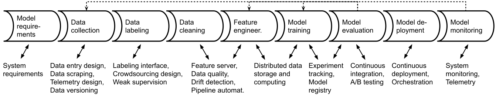
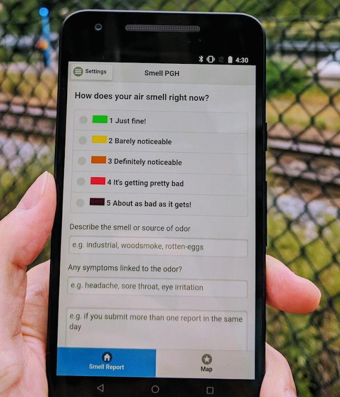
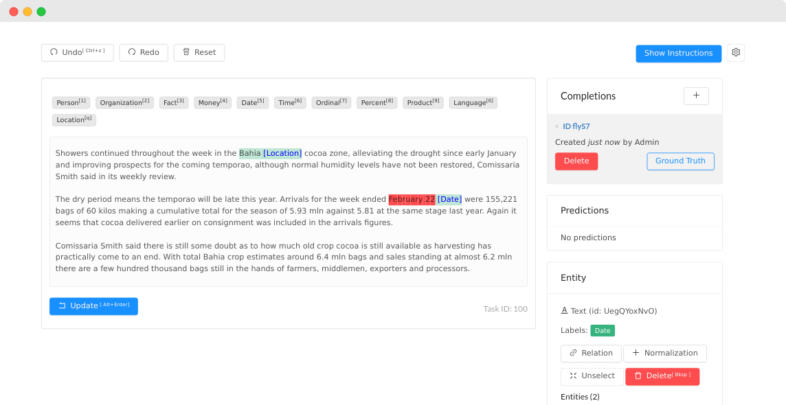
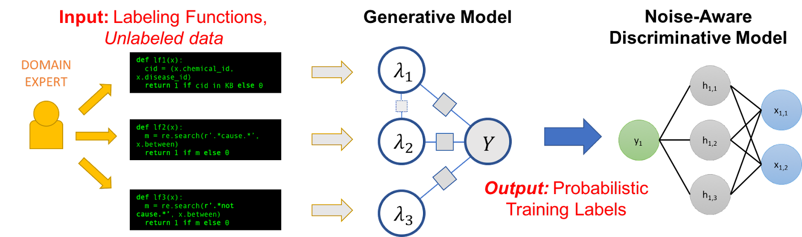

Chapter 11

# Automating the ML Pipeline

After discussing how and where to deploy a model, we now focus on the infrastructure to train that model in the first place. This infrastructure is typically described as a *pipeline* consisting of multiple *stages*, such as data cleaning, feature engineering, and model training. A *set-and-forget* approach where a model is trained once and never updated is rarely advisable for production systems and is usually considered an antipattern. Investing in the automation of the machine-learning pipeline eases model updates and facilitates experimentation. Poorly written machine-learning pipelines are commonly derided as *pipeline jungles* or *big-ass script architecture* antipatterns and criticized for *poor code quality* and *dead experimental code paths*. While the training process appears, on the surface, as a fairly local and modular activity by data scientists, it commonly interacts with many other components of an ML-enabled system, as we will show. This suggests the importance of careful planning of the machine-learning pipeline in the context of the entire system. 

Since the pipeline is such a central artifact in machine-learning projects, it naturally interacts with all kinds of other components in the system. Throughout this chapter, we will constantly refer to discussions in other chapters, while focusing on how the pipeline brings all of these concerns together in code that should be carefully designed.

<figure>

<figcaption>

A typical view of machine learning as a pipeline of multiple steps, additionally illustrating how different pipeline stages interact with many other parts of the system.

</figcaption>
</figure>

## Scenario: Home Value Prediction

Traditionally, home values are often judged by the values of nearby sales of comparable homes. Let us consider an online real-estate marketplace like [Zillow](https://www.zillow.com/), where we might want to show the fair value of homes on the market on the website. We could also show the value of homes not on the market to possibly convince some owners to sell their home on our marketplace. Predicting valuations based on past sales data is a fairly standard machine-learning problem, but it can be tricky in practice. For the purpose of this chapter, we explore how the pipeline that trains the model is interconnected with many other parts of such an online marketplace and how the model is anything but static.

## Supporting Evolution and Experimentation by Designing for Change

A core design principle in software engineering is to anticipate change and design software such that it is easy to change. The central idea in designing for change is to encapsulate the part of the system that is likely to change within a module but to design module interfaces such that the change will not affect the interface. Hence, anticipated changes can be performed locally within a module, without affecting other modules of the system.

In ML-enabled systems, we can anticipate that the machine-learned models will change regularly and should design the system accordingly. We can anticipate that we may want to update the model as data scientists continue to innovate, for example, with better feature engineering or better selection of hyperparameters. We may want to update the model as new versions of the used machine-learning library are released. We may want to update the model once we acquire new training data, possibly from production data. Especially when data distributions or labels change over time (drift, discussed in more detail in chapter *[Data Quality](16-data-quality.md)*) we expect to regularly retrain the model with new data in a form of *continuous learning* or *closed-loop intelligence*. In our home-value-prediction scenario, we certainly expect changes in market conditions and preferences over time and we can constantly gather more data from recent sales. Overall, automation of the pipeline and building the pipeline to be robust can facilitate easy change and experimentation.

Traditional software engineering strategies for *design for change* rely on modularity and strong abstractions at module interfaces. They are a good match also for ML-enabled systems:

  * The output of machine-learning pipelines are the learned models. Models are natural modules that encapsulate the model internals behind a simple and stable interface. While expected behaviors may be difficult to capture, the expected input and output formats and high-level goals of machine-learned models rarely change with updates or experiments. For example, to predict the value of a home, we provide information about the home (location, size, bedrooms, past sales) in a structured format and receive the predicted value as a number. Typical deployments as microservices (see chapter *[Deploying a Model](10-deploying-a-model.md)*) make it particularly easy to replace a model with an updated or alternative version in production without changing any other part of the deployed system. Stable automated machine-learning pipelines make it easy to update those models regularly.

  * The typical design of machine-learning pipelines (whether automated or not) as sequential stages, where each stage receives inputs from the previous stage, easily maps to modular implementations with one or more modules per stage. This style of passing data between subsequent modules corresponds to the traditional *data-flow architectural style* in software architecture. Thanks to this modularity, different data scientists can experiment with changes in different stages largely independently without requiring rework in other stages; for example, data cleaning can be improved without changing how data is exchanged with later stages of feature engineering or model training.  

Although the default machine-learning setup is already amenable to modular implementations supporting change and experimentation, details are tricky. Pipeline stages may be separated by stable interfaces, but still interact. It is quite common that experimentation affects multiple stages, for example, combining changes to data cleaning with different feature encoding and different hyperparameters during model training. More importantly, decisions in the machine-learning pipeline interact with decisions in other (non-ML) parts of the system, for example, decisions regarding what data is collected or what infrastructure is available to scale may both affect model quality. None of the pipeline stages can be truly considered entirely in isolation without considering other stages and other parts of the larger system.

## Pipeline Thinking

Data scientists tend to work in an exploratory and iterative mode (see also chapter *[Data Science and Software Engineering Process Models](20-data-science-and-software-engineering-process-models.md)*), often initially on local machines with a static snapshot of the data. Computational notebooks are popular tools to support this form of exploratory data analysis and programming, allowing data scientists to easily organize computations in cells, visualize data, and incrementally recompute cells without running the entire pipeline. Notebooks are a well-supported environment to explore data and experiment on the way to produce the first model that can be deployed.

After the first model, most organizations will want to improve and update their models regularly. Yet, experimental data science code in notebooks is usually not stable and automated enough—updates become laborious and error prone when steps need to be executed manually, when manual steps such as cleaning outliers are needed, and when the code is not prepared for changes in data. Many experience reports show that organizations often find it difficult to transition from exploratory data-science code to robust pipelines that can be re-executed, that can ingest new data without modification, that integrate well with other parts of the system, and that may even run regularly, fully automated in production. This transition requires adopting an engineering stance, considering interactions between the pipeline and many non-ML parts of the system, and often bringing in substantial additional infrastructure and expertise. All of this has a nontrivial learning curve and may not pay off in the short term.

Importantly, most pipeline stages interact with other parts of the system and should be considered as part of a larger system-wide design process. This includes infrastructure shared with non-ML parts of the system (e.g., data processing, distributed computing, scheduling, monitoring), but also the specific design of how data arrives into the pipeline and how the resulting model is deployed into other system parts and observed in production.

Once pipelines are considered as a first-order artifact in the product, we can focus on engineering them robustly and evolving them deliberately. Here, we primarily discuss potential automation and the connections with other components, whereas, in chapters *[Pipeline Quality](17-pipeline-quality.md)* and *[System Quality](18-system-quality.md)*, we will discuss how to implement and test pipeline code and its integrations with the rest of the system.

## Stages of Machine-Learning Pipelines

Each stage of the pipeline has a different focus, different common tools and infrastructure, and different interfaces to other components in the system. In the following, we survey typical considerations in each stage and common automation approaches within the stage.

### Data Collection

In production systems, data is rarely static. Often we can acquire more data over time to improve models. If drift occurs, newer data better represents what should be learned. Observing users in the running system can be used to produce more valuable data that can then be used to improve the system’s models, known as *machine-learning flywheel* and the *closed-loop intelligence pattern*. Therefore, most systems should consider data as *dynamic*, should ensure that pipelines work on an *evolving dataset*, and should consider data collection *as part of the system*.

In many systems, there is substantial potential for automation in the data-collection stage, moving from working interactively with a local data file to fully automating transformations of a continuously evolving dataset. The evolving dataset is commonly stored in some external system, such as a database, and loaded into the pipeline through an API. 

The actual code performing data collection might be considered as part of the machine-learning pipeline or as a separate non-ML component in the system. In either case, data collection should be designed explicitly to understand implications for the rest of the pipeline and the rest of the system. There are at least three common forms of data collection: manual entry, external APIs, and telemetry.

When data is *entered manually*, whether by specialized individuals, paid crowd workers, or crowd-sourced to the public, it is worth it to very deliberately design the system regarding (1) how data is entered, (2) incentives and process integration for data entry, and (3) data quality control. In our home-value-prediction scenario, realtors may manually add new homes for sale to the site and may be willing to fill out extensive forms as a form to advertise the offered home; in a hospital setting, nurses may be asked to add results of blood tests additionally into a spreadsheet, creating an additional burden on already busy schedules. In both examples, we can explore how to make data entry easier, for example, by offering data imports from other real-estate websites and by providing a tool to automatically scan blood test results. Better data entry suport support can lower data entry efforts, increase compliance, and reduce mistakes. 

If data is manually entered in an (often unpaid) *crowd-sourcing* setting, often *gamification* mechanisms (e.g., a leaderboard) are used to incentivize participation. For example, our real-estate market may encourage general users to upload “missing photographs” of houses in their neighborhood with a “local hero” leaderboard or encourage people to add information to a listing after touring the home. *[Citizen science](https://en.wikipedia.org/wiki/Citizen_science)* initiatives, such as collecting pollution data or pictures of bird nests, often provide a dedicated app with badges, achievements, and rewards. It is also common to simply pay professionals and crowd-workers to create data. For example, our real-estate-market company could pay crowd-workers to enter data from scanned building permits into the system. 

<figure>

<figcaption>

Community citizen science project [SmellPGH](https://smellpgh.org/) provides a mobile application to the interested general public to record air pollution data, which is used as one of multiple data sources in the project. [Online-only figure.]

</figcaption>
</figure>

If data is collected from *external APIs*, such as collecting weather data or traffic data, we may plan for a robust system to continuously scrape the data. In our house-value-prediction scenario, we buy access to an API for home sales from a company aggregating public notices, which again may scrape public websites of city departments. When accessing external systems, it is almost always a good idea to invest in monitoring and to look for discontinuities and anomalies in the data. Such checks help to identify problems quickly, before silent mistakes affect later stages of the machine-learning pipeline. A robust pipeline can detect when the API is down, when its scraping system is down, and when the API or website has evolved and now publishes data in a different format.

In production, data is collected as *telemetry* from a running system, observing how users interact with the system and possibly how they respond to predictions (see chapter *[Testing and Experimenting in Production](19-testing-and-experimenting-in-production.md)* for an in-depth discussion of telemetry design). For example, simply by analyzing web logs of its own system, our real-estate marketplace can further estimate interest in various regions and which pictures of homes attract the most attention. Telemetry data is often collected in the form of raw log files, often in vast quantities. 

In summary, data collection can take many forms, and many systems collect data continuously from humans, from external systems, and from telemetry. The way data is collected differs widely from system to system, but it always involves designing non-ML parts of the system in a way to bring data into the pipeline. System designers who anticipate the need for continuous data can build the system in a way to support data collection, to integrate humans into the process as needed, to automate and monitor the process as much as possible.

### Data Labeling

If labels are needed for training, but are not directly provided as part of the data collection process, often human annotators provide labels. For example, experts may estimate home values for homes not yet sold. If new data is collected continuously, labeling cannot be a one-time ad hoc process, but needs to be considered as a continuous process too. Hence, the pipeline should be designed to support continuous high-quality labeling of new data.

Manual labeling tends to be laborious and expensive. Depending on the task, labeling needs to be done by experts (e.g., detecting cancer in radiology images) or can be *crowdsourced* more widely (e.g., detecting stop signs in photos). Most organizations will pay for labeling, by hiring labelers in their company or paying for individual labels on crowd-working platforms. In some settings, it may be possible to encourage people to label data without payment, for example, in the context of citizen science, gamification, or as part of performing another task. A classic example of labeling data while users perform another task is *[ReCAPTCHA](https://en.wikipedia.org/wiki/ReCAPTCHA)* asking humans to transcribe difficulty to read text from images as part of logging into a web page. In our scenario, we might collect the wisdom of the crowd by letting people vote on the web page of each home whether the shown value is too high or too low. 

To support manual labeling, it is common to provide a user interface for labelers to (1) provide labeling instructions, (2) show a data point, and (3) enter the label. In this user interface, depending on the task, labelers could select a value from a list of options, enter text, draw bounding boxes on images, or many others. Machine-learned models can be used to propose labels that the human labelers then confirm or refine, though user interfaces need to be designed carefully to avoid labelers simply confirming all suggestions. To assure the quality of the labels, a system will often ask multiple labelers to label a data point and assign the label only when it is confident that labelers agree. It may also use statistics to identify the reliability of individual labelers. If labelers often disagree, this could be a sign that the task is hard or that the instructions provided are unclear. For all these tasks, commercial and open-source infrastructure exists upon which a labeling interface and process can be built, such as [Label Studio](https://labelstud.io/).

<figure>

<figcaption>

Screenshot from the [Label Studio interface](https://labelstud.io/templates/named_entity.html) for labeling different named entities in text documents. [Online-only figure.]

</figcaption>
</figure>

*Programmatic labeling* is an emerging paradigm in which labeling is largely automated in the context of *weakly supervised learning*. In a nutshell, weak supervision is the idea to merge partial and often low-confidence labels about data from multiple sources to automatically assign labels to large amounts of data. Sources can include manual labels and labels produced by other models, but most commonly sources are *labeling functions* that were written as code based on domain expertise to provide partial labels for some of the data. For example, when labeling training data for a sentiment analysis model, a domain expert might write several small labeling functions to indicate that text with certain keywords is most likely negative. Each source is expected to make mistakes, but a weakly supervised learning system, such as *[Snorkel](https://www.snorkel.org/)*, will statistically identify which source is more reliable and will merge labels from different sources accordingly. Overall, produced labels may be lower quality than those provided by experts, but much cheaper. Once the system is set up and the labeling functions are written, labels can be produced for very large amounts of data at marginal cost. Experience has shown that, for many tasks, more data with lower-quality labels is better than less data with high-quality labels. Weak supervision shifts effort from a repetitive manual labeling process to an investment into domain experts and engineers writing code for automated labeling at scale.

<figure>

<figcaption>

Illustration of Snorkel: Domain experts provide labeling functions, typically as short code snippets that suggest partial labels for unlabeled data. Labels from those labeling functions are then combined into probabilistic training labels through a generative model that weights agreement between different labeling functions. The noise-aware discriminative model is the traditional model trained on this labeled data. Source: 🔗 [https://www.snorkel.org/blog/snorkel-programming](https://www.snorkel.org/blog/snorkel-programming) [Online-only figure.]

</figcaption>
</figure>

Again, notice the potential for automation and the need to integrate with non-ML parts of the system, such as a user interface for labeling data. In a system that is continuously updated and is regularly retrained with new data that needs to be labeled, having a robust labeling process is essential. Building and monitoring a robust infrastructure will provide confidence as the system evolves.

### Data Cleaning and Feature Engineering

The data cleaning and feature engineering stages, sometimes collectively described as *data wrangling*, typically involve various transformations of data, such as removing outliers, filling missing values, and normalizing data. Many transformations follow common patterns routinely performed with standard libraries, such as normalizing continuous variables between 0 and 1, [one-hot encoding](https://en.wikipedia.org/wiki/One-hot) of categorical variables, and using word embeddings. Other transformations may be complex and domain-specific, such as measuring similarity between homes or filling in missing property tax information based on local formulas. In addition, features are often created based on other machine-learned models, for example, estimating a home’s state of repair based on photos. In many projects, a lot of creative work of data scientists is invested in data cleaning and feature engineering, often requiring substantial domain knowledge. Data scientists often need to work together closely with domain experts, who may have very little machine-learning knowledge.

In early exploratory stages of a project, these transformations are often performed with short code snippets, or even by manually editing data. Transformation code in exploratory stages needs to work for the data considered at that moment but is rarely tested for robustness for any other potential future data. For example, if all current training data has well-formatted time entries, code is likely not tested for whether it would crash or silently produce wrong outputs if a row contained a time entry in an unexpected format (e.g., with timezone information). Researchers also found that data transformation in pipelines often contains subtle bugs, which are hard to notice because machine-learning code usually does not crash as a result of incorrect data transformation but simply learns less accurate models. When the pipeline is to be automated, it is worth seriously considering testing, error handling, and monitoring of transformation steps (see chapter *[Pipeline Quality](17-pipeline-quality.md)*).

Some projects need to *process very large amounts of data* and transform data in nontrivial and sometimes computationally expensive ways. In such settings, infrastructure for distributed data storage and distributed batch or stream processing will become necessary, as we will discuss in chapter *[Scaling the System](12-scaling-the-system.md)*. Hiring data engineers can provide relevant expertise for all nontrivial data management and transformation efforts.

In an organization, it is also not uncommon that multiple models are based (partially) on the same datasets. For example, our online real-estate marketplace may have multiple models about houses, such as predicting the value, predicting the time to sale, predicting what photos to show first, and predicting how to rank homes in search results. *Sharing and reusing transformation code* across machine-learning pipelines can help multiple teams avoid redundant work and benefit from the same improvements. Moreover, if features are expensive to compute (e.g., estimating the state of repair based on photos) but reused across multiple predictions or multiple models, it is worth caching them. *Feature stores,* discussed in chapter *[Deploying a Model](10-deploying-a-model.md)*, provide dedicated infrastructure for sharing data transformation code, facilitating reuse, discovery, and caching.

Finally, recall that all data transformation code needs to be shared between model training and model inference stages to avoid *training–serving skew* as discussed in chapter *[Deploying a Model](10-deploying-a-model.md)*.

In summary, the data cleaning and feature engineering stages also interact with other parts of the system, be it other machine-learned models, the model inference code, data processing infrastructure, or feature stores. Code for data cleaning and feature engineering that is often written in early exploratory stages usually benefits from being rewritten, documented, tested, and monitored when used in an automated pipeline.

### Model Training

Code for model training may be as simple as two lines of code to train a decision tree with scikit learn or a dozen lines of code for configuring a deep-learning job with Keras. This code is naturally modular, receiving training data and producing a model, and can be scheduled as part of a pipeline. This code may be frequently modified during experimentation to identify the right learning algorithm, hyperparameters, or prompt.

As with other stages, model training is also influenced by other parts of the system. Decisions are often shaped by requirements arising from system requirements and requirements from other components of the system, including requirements about prediction accuracy, training latency, inference latency, or explainability requirements, which we discussed in chapter *[Quality Attributes of ML Components](09-quality-attributes-of-ml-components.md)*. Experimentation in model training, including trying variations of machine-learning algorithms and hyperparameters, is often explored in concert with experimentation in feature engineering. 

For machine-learning algorithms that require substantial resources during training, training jobs need to be integrated into the processing infrastructure of the organization. Distributed training and training on specialized hardware are common in practice (briefly discussed in chapter *[Scaling the System](12-scaling-the-system.md)*) and introduce new failure scenarios that need to be anticipated. To achieve reliable pipelines in such contexts that still enable updates and experimentation with reasonably frequent iteration cycles, investment in nontrivial infrastructure is necessary, including distributed computing, failure recovery and debugging, and monitoring. For example, Facebook has reported the substantial data center infrastructure they provisioned and how they balance qualities such as cost, training latency, model-updated frequency needs from a business perspective, and ability to recover from outages. To a large degree, this kind of infrastructure has been commodified and is supported through open-source projects and available as cloud service offerings. 

With the trend toward adopting large foundation models, data scientists may train fewer models from scratch but rely more on fine-tuning and prompt engineering, which still require plenty of experimentation and similar integration with other parts of the system.

### Model Evaluation

We will discuss the evaluation of machine-learned models in detail in later chapters. Typical evaluations of prediction accuracy typically are fully automated based on some withheld labeled data. However, model evaluation may also include many additional steps, including (1) evaluation on multiple specifically curated datasets for certain populations or capabilities (see chapter *[Model Quality](15-model-quality.md)*), (2) testing interaction of the model with the rest of the system (see chapter *[System Quality](18-system-quality.md)*), and (3) testing in production (A/B testing, see chapter *[Testing and Experimenting in Production](19-testing-and-experimenting-in-production.md)*). 

Again, automation is key. Evaluation activities may need to be integrated with other parts of the system, including data collection activities and production systems. It can be worth considering working with an external quality assurance team.

### Model Deployment

As discussed in the previous chapter *[Deploying a Model](10-deploying-a-model.md)*, there are many design decisions that go into where and how to deploy a model. The deployment process can be fully automated, such that the pipeline will automatically upload the model into production once training is complete and the model has passed the model evaluation stage. To avoid degrading system quality with poor models, fully automated systems usually ensure that models can be *rolled back* to a previous revision after releases and often rely on a *canary release infrastructure*. In a canary release, the model is initially released only to a subset of users, monitoring whether degradations in model or system quality can be observed for those users, before rolling out the update incrementally to more users. We will return to canary releases in chapter *[Testing and Experimenting in Production](19-testing-and-experimenting-in-production.md)*.

Investing in a robust and automated infrastructure for deployment can enable fully automated regular model updates and provides opportunities for data scientists to experiment with model versions more rapidly.

### Model Monitoring

Monitoring is not part of the process of producing a model and can technically be considered its own component, but it is often depicted as a final step in machine-learning pipelines. The monitoring component observes the model in production and may trigger various interventions if it notices problems in production, such as rolling back a release or running the pipeline component to train an updated model. In our home-value-prediction scenario, a monitoring system may detect if the model recently produces poor estimates for sales in a region and either trigger retraining with more recent sales or alert data scientists to explore the problem manually.

Investing in system and model monitoring helps to understand how the system is doing in production and facilitates experimentation and operations generally, as we will discuss in chapters *[Planning for Operations](13-planning-for-operations.md)* and *[Testing and Experimenting in Production](19-testing-and-experimenting-in-production.md)*.

## Automation and Infrastructure Design

As discussed, each stage of the machine-learning pipeline can be carefully planned and engineered, and most stages will interact with other components of the system. Typically all stages together can be automated to run end to end, triggered manually, triggered in regular intervals by a scheduler, or triggered by a monitoring system.

### Modularity, Dependencies, and Interfaces

In the literature, a pipeline consisting of one or multiple ad hoc scripts is referred to as a *big-ass script architecture* antipattern. Except for the most trivial pipelines, dividing the pipeline into individual modules with clear inputs and outputs helps to structure, test, and evolve the system. In many cases, each stage can be represented by one or multiple functions or modules. In chapter *[Pipeline Quality](17-pipeline-quality.md)*, we will illustrate some concrete examples of such decomposition. 

Such decomposition helps to separate concerns, where different team members can work on different parts of the system, but still understand how the different parts interface with each other. Smaller components with clear inputs and outputs are also easier to test than code snippets deep within a larger block of code.

There is an abundance of open-source frameworks that aim to help write robust and modular pipelines. For example, [Kedro](https://kedro.org/) provides project templates for how to structure a product in multiple stages and encourages good engineering practices. Also, orchestration tools like [Airflow](https://airflow.apache.org/), [Luigi](https://github.com/spotify/luigi), and [Kubeflow](https://www.kubeflow.org/) by construction enforce modularizing pipeline stages so that code can be scheduled for execution; the same applies when using [DVC](https://dvc.org/), [Pachyderm](https://www.pachyderm.com), or [Flyte](https://flyte.org) for data versioning and data provenance tracking (see chapter *[Versioning, Provenance, and Reproducibility](24-versioning-provenance-and-reproducibility.md)*).

Documenting interfaces and dependencies between different modules as well as qualities of each component is important but often neglected in practice. Most modules of machine-learning pipelines have relatively simple interfaces, for example, receiving tabular data and producing a model. As we will discuss in chapter *[Data Quality](16-data-quality.md)*, while data formats at interfaces between components are easy to describe with traditional data types and schemas, describing distributions of data or assumptions about data quality is more challenging. For example, what assumptions can the feature engineering stage make about how the data was collected and subsequently cleaned? Does the data collection process sample fairly from different distributions? What confidence can we have in the labels, and has that changed recently? As with documenting models, practices for documenting datasets and data quality more broadly are not well developed and are still emerging. 

In addition to components emerging directly from the machine-learning pipeline, it is equally important to document interfaces and expectations on other components in the system, such as specifying the data logging in the user interface on which the data collection stage relies, specifying the crowd-sourcing platform used for labeling data, and specifying the cloud infrastructure into which the trained model is uploaded for deployment. Most of these can again be described using traditional interfaces and documentation. Documentation at these interfaces is particularly important when different teams are responsible for the components at either side of the interface, such as when the web-front-end team needs to work with the data-engineering team to collect the right telemetry data for future training.

### Code Quality and Observability

With a move to engineering a robust machine-learning pipeline and automation, code quality becomes much more important than for initial exploration and model prototyping. As the pipeline will be executed regularly in production with limited human oversight, monitoring becomes more important to notice problems early.

The code of pipeline components should undergo the same quality assurance steps as all other software components in a system. This may include unit testing, integration testing, static analysis, and code reviews. For example, the implementation of each stage can be tested in isolation, making sure that it is robust to missing or ill-formatted data and does not just silently fail if problems occur—we will discuss how to test for robustness in chapter *[Pipeline Quality](17-pipeline-quality.md)*. Code reviews can help adopt consistent coding conventions across teams, catch subtle bugs, and foster collective code ownership where multiple team members understand the code. Static analysis tools can catch common kinds of bugs and enforce conventions such as code style.

As code frequently changes during experimentation, it is worth adopting suitable strategies to track experimental code changes, such as developing in *branches* or using *feature flags* (rather than simply copy-pasting cells in a notebook). It is usually a good idea to explicitly track experiments and merge or remove the code once the experiment concludes, as we will discuss in chapter *[Versioning, Provenance, and Reproducibility](24-versioning-provenance-and-reproducibility.md)*.

Finally, monitoring should be extended into the machine-learning pipeline and its components, allowing data scientists and operators to observe how the model is trained (e.g., duration and success of each step, current use of cloud resources) and detect failures and anomalies.

### Workflow Orchestration

Finally, for full automation, the various components of the pipeline within the system need to be executed. Executions of pipelines can be nontrivial, with multiple stages executed in sequence or in parallel, often storing intermediate results at the interface between components in large files or databases, and sometimes executing different components on different hardware in large distributed systems. When stages fail, there are several error-handling strategies, such as simply retrying the execution or informing a developer or operator.

The antipatterns *pipeline jungles*, *undeclared consumers,* and *big-ass script architecture* all describe situations where the flow of data between components is not apparent. For example, it may be entirely not obvious that several scripts need to be executed in a specific order after deleting some temporary files. Some scripts may depend on specific files that nobody remembers how they were once created. Without automation or documentation, it may be difficult to reconstruct which steps need to be run and in which order to produce necessary files. 

It is common to adopt dedicated infrastructure to describe flows and automate the execution of complex pipeline implementations. In such infrastructure, configurations or code typically describe how multiple components are connected and in which order their computations are performed, and where. The infrastructure can then identify what components need to be executed and schedule the execution on various available machines. There are many open-source and commercial infrastructure tools available in the MLOps community, such as [Apache Airflow](https://airflow.apache.org/), Netflix’s [Metaflow](https://metaflow.org/), Spotify’s [Luigi](https://github.com/spotify/luigi), Google’s [Tensorflow Extended (TFX)](https://www.tensorflow.org/tfx/), and [Kubeflow Pipelines](https://www.kubeflow.org/docs/components/pipelines/overview/quickstart/). Commercial cloud-based machine-learning systems such as [AWS Sagemaker](https://aws.amazon.com/sagemaker/) or [Databricks](https://databricks.com/) tend to provide substantial infrastructure for all parts of the pipeline and their coordinated execution. 

In addition to automating and scheduling the various pipeline stages, a common goal is to ensure that the entire pipeline is versioned and reproducible, including source data, derived data, and resulting model. This also helps to keep different model versions apart and perform computations incrementally only as needed, while data scientists explore alternatives and experiment in production. We discuss this separately in chapter *[Versioning, Provenance, and Reproducibility](24-versioning-provenance-and-reproducibility.md)*, in the context of responsible machine-learning practices.

### Design for Experimentation

While building automated, robust pipelines requires a substantial engineering investment, it can pay off for data scientists in terms of improved ability to experiment. Workflow orchestration systems can not only support releasing models into production but also schedule multiple offline experiments in which different versions of a model are trained and evaluated. Automated and robust pipelines remove manual steps and common necessary error handling and debugging that otherwise slow down experiments. Investments into telemetry, system monitoring, and A/B testing infrastructure will allow data scientists to evaluate models in production, providing data scientists with fast feedback from real production data when exploring ideas for model improvements. We will discuss this further in chapter *[Testing and Experimenting in Production](19-testing-and-experimenting-in-production.md)*.

## Summary

In this chapter, we provided an overview of the design and infrastructure considerations of different stages of a typical machine-learning pipeline and how they interact with other ML and non-ML components of a typical ML-enabled system. When transitioning from an initial prototype to a production system, building automated, robust machine-learning pipelines is often essential to allow flexibility for updates and experimentation. The necessary infrastructure may require a substantial up-front engineering investment, but promises long-term payoffs through faster experimentation and fewer problems in operations.

We are not aware of many codified design patterns in this space beyond the *closed-loop intelligence pattern*, the *feature store pattern,* and occasional mentions of *workflow pipelines* for orchestration and *model versioning* as a pattern. However, poorly engineered machine-learning pipelines are often characterized with antipatterns, such as *pipeline jungle*, *dead experimental paths*, *big-ass script architecture*, *undeclared consumers*, and *set and forget*.

## Further Readings

  * A short experience report describing the challenges of adopting a pipeline-oriented engineering mindset in many organizations: 🗎 O'Leary, Katie, and Makoto Uchida. “[Common Problems with Creating Machine Learning Pipelines from Existing Code](https://research.google/pubs/pub48984.pdf).” In *Proceedings of the Third Conference on Machine Learning and Systems (MLSys),* 2020.

  * Extensive discussions of different deployment strategies and telemetry strategies: 🕮 Hulten, Geoff. *[Building Intelligent Systems: A Guide to Machine Learning Engineering](https://bookshop.org/books/building-intelligent-systems-a-guide-to-machine-learning-engineering/9781484234310)*. Apress, 2018.

  * An interview study on data quality challenges in ML-enabled systems, including design discussions related to planning for data collection: 🗎 Sambasivan, Nithya, Shivani Kapania, Hannah Highfill, Diana Akrong, Praveen Paritosh, and Lora M. Aroyo. “’[Everyone Wants to Do the Model Work, Not the Data Work’: Data Cascades in High-Stakes AI](https://research.google/pubs/pub49953/).” In *Proceedings of the Conference on Human Factors in Computing Systems (CHI)*, 2021.

  * A study of public data science code in notebooks, finding many subtle bugs in data transformation code: 🗎 Yang, Chenyang, Shurui Zhou, Jin L. C. Guo, and Christian Kästner. “[Subtle Bugs Everywhere: Generating Documentation for Data Wrangling Code](https://www.cs.cmu.edu/~ckaestne/pdf/ase21.pdf).” In *Proceedings of the International Conference on Automated Software Engineering (ASE)*, 2021.

  * A short paper motivating the use of automated code quality tools for computational notebooks after observing common style issues in public data science code: 🗎 Wang, Jiawei, Li Li, and Andreas Zeller. “[Better Code, Better Sharing: On the Need of Analyzing Jupyter Notebooks](https://arxiv.org/abs/1906.05234).” In *Proceedings of the International Conference on Software Engineering: New Ideas and Emerging Results*, pp. 53–56. 2020.

  * For programmatic labeling and weakly supervised learning, the Snorkel system is a good entry point, starting with the tutorials on the Snorkel web page and this overview paper: 🔗 [https://www.snorkel.org](https://www.snorkel.org) 🗎 Ratner, Alexander, Stephen H. Bach, Henry Ehrenberg, Jason Fries, Sen Wu, and Christopher Ré. “[Snorkel: Rapid Training Data Creation with Weak Supervision](https://arxiv.org/abs/1711.10160).” *Proceedings of the VLDB Endowment*, 11 (3), 269–282, 2017.

  * A discussion of the software and hardware infrastructure for learning and serving ML models at Facebook, including discussions of quality attributes and constraints that are relevant in operation, including cost, latency, model-updated frequency needs, large amounts of data, and ability to recover from outages: 🗎 Hazelwood, Kim, Sarah Bird, David Brooks, Soumith Chintala, Utku Diril, Dmytro Dzhulgakov, Mohamed Fawzy et al. “[Applied Machine Learning at Facebook: A Datacenter Infrastructure Perspective](https://research.fb.com/wp-content/uploads/2017/12/hpca-2018-facebook.pdf).” In *International Symposium on High Performance Computer Architecture (HPCA)*, pp. 620–629. IEEE, 2018.

  * The MLOps community has developed a vast amount of tools and infrastructure for easy deployment of machine-learned models, with good entry points: 🔗 [https://ml-ops.org/](https://ml-ops.org/) 🔗 [https://github.com/visenger/awesome-mlops](https://github.com/visenger/awesome-mlops) 🔗 [https://github.com/kelvins/awesome-mlops](https://github.com/kelvins/awesome-mlops). 

  * A book discussing several common design solutions for problems in and across various stages of the machine-learning pipeline, including feature engineering, model training, and achieving reproducibility: 🕮 Lakshmanan, Valliappa, Sara Robinson, and Michael Munn. *[Machine Learning Design Patterns](https://bookshop.org/books/machine-learning-design-patterns-solutions-to-common-challenges-in-data-preparation-model-building-and-mlops/9781098115784)*. O'Reilly Media, 2020.

---
*As all chapters, this text is released under <a href="https://creativecommons.org/licenses/by-nc-nd/4.0/">Creative Commons BY-NC-ND 4.0</a> license.*
*Last updated on 2024-06-13.*
