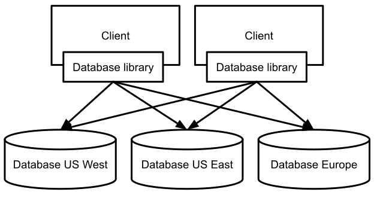
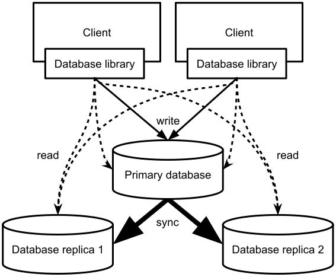

<div class="chapter">Chapter 12</div>

# Scaling the System

Many systems exceed the resources of a single machine and may need to be scaled across many machines. Most insights into how to design scalable and distributed systems are not specific to machine learning—software architects, performance engineers, and distributed-systems experts have gathered plenty of experience designing scalable software systems, such as clusters of servers that respond to millions of requests per second and databases that store petabytes of data across many machines. Technologies for distributed data storage and computation are well established and available as commodities, whether as open-source projects or as hosted cloud services, and they are commonly used as building blocks of ML-enabled systems.  

For many ML-enabled systems, scalability will be an important design challenge to be considered, be it (1) for collecting, storing, and transforming large amounts of training data, (2) for collecting and storing large amounts of telemetry data, (3) for processing large numbers of model inference requests, or (4) for running large distributed jobs to train models. Hence, software engineers and data scientists involved in developing ML-enabled systems benefit from understanding how to design scalable systems.

The key principles of how to design scalable systems are well understood. When building software systems, developers will almost always rely on existing abstractions and infrastructure, rather than implementing their own. For example, they may store petabytes of raw data in *[Azure Data Lake](https://azure.microsoft.com/en-us/solutions/data-lake/)*, run hour-long batch jobs using *[Apache Sparks](https://spark.apache.org/)* with hundreds of servers hosted by the *[Databricks](https://databricks.com/)* cloud infrastructure, or install *[Apache Kafka](https://kafka.apache.org/)* on multiple in-house servers for scalable stream processing. However, understanding the key concepts and their trade-offs will help to select the right technologies and design the system architecture in a way that makes it easier to scale later.

In this chapter, we provide an overview of the key ideas, while leaving details to other books. This follows our goal of educating T-shaped team members, who know key concepts and concerns of their colleagues, in addition to their own specialty, so that they can ask the right question, communicate effectively, and know when to bring in additional help. 

## Scenario: Google-Scale Photo Hosting and Search


Let us consider *image search* at the extreme scale of Google’s Photo Service, where users can upload and organize their photos on a webpage and mobile app. Google does not release detailed statistics, but Google reported in 2020 that they store more than 4 trillion photos from over a billion users and receive 28 billion new photos per week (that’s about 46 thousand photos uploaded per second). 

Google Photos shows uploaded photos online and in a mobile app, typically chronologically. It provides various ways to edit photos, for example, by applying filters, often based on machine learning. Google Photos provides many more ML-powered functions, such as running object detection to associate images with keywords for search, detecting images that could be cleaned up, suggesting ways of grouping pictures, identifying friends in pictures, and predicting which pictures likely represent happy memories.

<figure>


<figcaption>

Example of the Google Photos web interface searching for “trees” in uploaded personal images.

</figcaption>
</figure>

Back-of-the-envelope math reveals the necessary scale of the operation. Conservatively assuming 3 megabytes of storage per photo and 2020 upload numbers, we need to process 135 gigabytes of images per second. A typical hard disk can write 100 megabytes per second, that is, just storing the images would require writing to at least 1,400 disks in parallel. For object detection with a deep neural network, we need to resize each image and convert it into a feature vector and then perform a bunch of matrix computations during model inference and write the result back to some data storage. Fast object detection models (say *[YOLOv3](https://github.com/ultralytics/yolov3)*) currently have about 20 to 50 milliseconds inference latency per image in recent benchmarks, so we would need at least 2,780 parallel processes to keep up running predictions for new incoming images. If we ever decided to run an updated model on all photos, a single sequential process would need 2,536 years just for model inference on existing photos.

Some characteristics of the service will be important for design discussions later. The number of pictures uploaded will likely vary by time of day and season and differs significantly between users. Short outages and delays are likely not business or safety-critical but reflect poorly on the product. When uploading photos, users reasonably expect to see uploaded photos in their library immediately, sorted by date. The user would probably also expect that a user-interface element showing the total number of photos is updated immediately after the upload. In contrast, users will likely not notice if the search does not work immediately for new images. For suggesting filters and tagging friends, different user interface decisions require different response speeds in the background: if users are to accept filter suggestions or confirm friends within an upload dialog, suggestions need to be ready immediately; if filter suggestions can be shown in the app later, friends can be tagged in the background without user involvement, or the app could issue a notification when it suggests filters later. Reminding users of likely happy memories is scheduled for later times anyway.

## Scaling by Distributing Work

When facing situations where the capacity of a specific machine is no longer sufficient to serve the computing needs for a specific task, such as the photo hosting service in our running example, we typically have three options: (1) use more efficient algorithms, (2) use faster machines, or (3) use more machines. Initially, the first two options can be promising. Finding bottlenecks and optimizing implementations can speed up computations substantially, especially if the initial implementation was inefficient. Buying faster machines (faster CPUs, more memory, more storage space) can increase capacity without having to change the implementation at all. However, performance optimizations will only go so far, and better hardware quickly becomes very expensive and runs into physical limits—long, long before we reach the Google scale of our running example. Hence, true scalability is almost always achieved by distributing storage and computations across multiple machines. 

In the context of scalable ML-enabled systems, pretty much every part of the system may be distributed. In some cases, we adopt a distributed design simply because the application should be deployed on distributed hardware, such as mobile apps, edge computing, or cyber-physical systems. In many others, distribution is driven by scalability needs. Scalability needs may be driven by (1) massive amounts of training data (distributed storage, distributed data processing), (2) computationally expensive model training jobs possibly involving specialized hardware (distributed model training), (3) applying model inference to large amounts of data or using model inference while serving many users concurrently (distributed model inference), and (4) collecting and processing large amounts of telemetry data (distributed storage, distributed data processing). In our running example, we can see all these reasons in a single system: mobile apps, large amounts of training data, expensive model training jobs, lots of incoming photos in which we want to detect objects, and lots of users producing telemetry data about how they interact with the system, all spread across many ML and non-ML components.

While distributed systems are beneficial and often unavoidable, they come with significant challenges: distributed computing is inherently complex. It introduces new failure modes, such as dropped or delayed network connections and difficulty finding consensus across multiple machines. For example, users of our photo service would be surprised to find that some photos are sometimes missing when they open the app, just because requests were served by a different server that happened to be down when the photos were uploaded. Developers of distributed systems need to invest heavily into anticipating failures and designing strategies to handle them, from simply retry mechanisms to redundancy and voting, to transactions, to sophisticated distributed consensus protocols that can provide guarantees even in the face of unlikely network failures. Testing and debugging distributed systems is particularly difficult. Systems cannot guarantee seemingly simple properties such as that every item is processed exactly once when any part of a distributed system may go down at any time, including before it starts processing an item or before it sends us a confirmation that it has processed an item. On the positive side, distributed computing benefits from being able to buy many copies of standard hardware that is cheaper than specialized high-performance hardware. Rather than buying faster machines, we scale systems (often nearly linearly) simply by adding more hardware.

Fortunately, understanding a few important concepts and trade-offs makes it possible to design and implement distributed systems based on robust abstractions and building blocks. The task of an engineer is then primarily that of making appropriate trade-off and design decisions and choosing what infrastructure to build upon, without having to implement low-level retry mechanisms or consensus protocols.

## Data Storage at Scale

Data storage infrastructure has a long history and is generally well understood. Before we cover mechanics for distribution, let us revisit key abstractions.

### Data Storage Basics

The three most common forms of data storage approaches are relational data, document data, and unstructured data.

In a *relational data model,* data is structured into tables where all rows follow a consistent format defined in a schema. A common language to interact with relational databases is SQL, with which developers declaratively specify queries about what data should be received or modified. This model allows the database infrastructure to decide how to answer the query most effectively. To avoid redundancies in data storage when multiple elements share information such as multiple photos being taken by the same user or multiple users following the same public photo albums, data in one-to-many or many-to-many relationships is commonly normalized. That is, such relations are split into multiple tables referencing each other by keys. When data is queried, such information is joined from multiple tables as needed. Database engines typically also maintain indexes to query data efficiently. Examples of databases supporting the relational model are *Oracle database, MySQL, Microsoft SQL Server, Db2,* and *PostgreSQL*.

<figure>

```sql
select p.photo_id, p.path, u.photos_total 
from photos p, users u 
where u.user_id=p.user_id and u.account_name = "christian"
```

<figcaption>

An example of three tables in a relational data model and an SQL query connecting some of them via keys. The data is normalized in that user and camera data is stored only once but associated with multiple photos. Note that the query only describes what should be returned, but not how the data is retrieved efficiently.

</figcaption>
</figure>

In a *document data model,* data is stored in key-value pairs in collections, where values can be simple values (e.g., numbers, strings) or complex values such as nested object structures (JSON is commonly used). In most systems, structure is not enforced for values within one collection, providing flexibility. Data in a collection can be efficiently retrieved by the key. Often additional indexes support efficient lookup of values based on some parts of documents. Data in one-to-many or many-to-many relationships is typically not normalized in the document data model, but often stored redundantly—if not, a reference to a key in a different collection is stored as a field in the document. When joins across multiple collections are needed, the developer typically calls the database multiple times to retrieve the objects from the relevant collections, rather than having the database infrastructure perform joins internally during a query. Databases implementing such document models are typically called *NoSQL* databases; examples include [MongoDB](https://www.mongodb.com), [Redis](https://redis.io), [Apache Cassandra](https://cassandra.apache.org), [Amazon DynamoDB](https://aws.amazon.com/dynamodb/), and [Apache CouchDB](https://couchdb.apache.org).

<figure>

```js
{
    "_id": 133422131,
    "path": "/st/u211/1U6uFl47Fy.jpg",
    "upload_date": "2021-12-03T09:18:32.124Z",
    "user": {
        "account_name": "christian", 
        "account_id": "a/54351"
    },
    "size": "5.7",
    "camera": { 
        "manufacturer": "Google", 
        "print_name": "Google Pixel 5", 
        "settings": "f/1.8; 1/120; 4.44mm; ISO271" 
    }
}

db.getCollection('photos').find({ "user.account_name": "christian"})
```

<figcaption>

An example of data storage in the document model using the JSON format. Rather than as tables, data is stored as objects, with nested inner objects. Notice how user and camera data is stored redundantly with each photo. Data is accessed here by a search over an inner field in the document, within a single collection.

</figcaption>
</figure>

*Unstructured data* is simply stored in a file on a disk without any enforced structure and without any efficient access mechanism. For example, log files simply store lines of text without identifying keys or enforced structure. To find certain values in unstructured data, one typically has to search through all data and look for entries that match specific patterns—there is usually no index that would allow us to find data easily.

<figure>

```
02:49:12 127.0.0.1 GET /img13.jpg 200
02:49:35 127.0.0.1 GET /img27.jpg 200
03:52:36 127.0.0.1 GET /main.css 200
04:17:03 127.0.0.1 GET /img13.jpg 200
05:04:54 127.0.0.1 GET /img34.jpg 200
05:38:07 127.0.0.1 GET /img27.jpg 200
05:44:24 127.0.0.1 GET /img13.jpg 200
06:08:19 127.0.0.1 GET /img13.jpg 200
```

<figcaption>

An example of a log file of a web server indicating which files were accessed when and from which address.

</figcaption>
</figure>

There are many well-known trade-offs between these storage models. For example:

  * Both relation and document storage requires a certain amount of planning and preparation to organize and structure data and require APIs to write and access data, whereas it is easy to simply append data to files in an unstructured format. Both relational and document databases can organize the internal data storage to facilitate efficient retrieval; with suitable indexes it is possible to look up specific data quickly without reading the entire database.

  * Normalization in relational databases reduces redundancies, which reduces storage space and avoids inconsistencies, but comes with the additional complexity of joins at query time. In our document-storage example, user information and camera information are stored redundantly, which is space-inefficient and more challenging to update consistently in many places if data ever changes. Relational data models are well suited for expressing many-to-many relationships efficiently, but document databases excel at retrieving documents with nester inner structures without the need for complex queries. If joins are needed in document databases, for example, to express many-to-many relationships, they are often poorly supported, leading to more complex application code where developers implement queries manually without the benefit of an optimizing database engine. 

  * Enforced schemas of relational models help avoid some data quality issues (see also chapter *[Data Quality](16-data-quality.md)*) but can seem limiting when the structure of data varies frequently or the schema evolves frequently. Schema validation is offered as an optional feature in many document databases, but it is often not used in practice—it is more common that the client code checks that the retrieved document has the expected structure when using the data retrieved from a query. Unstructured data has no schema to enforce in the first place.

  * Nested object structures in document data models are often a natural match for complex objects used in programs, which would need to be reassembled from normalized tables with complex queries in relational data storage. In contrast, relational models are a good fit for tabular data often used in data science.


### Data Encoding

To store and exchange data, data is typically encoded. This helps to reduce data size for storage and network. The most common types of data encodings are:

  * Plain text (csv, log files): Data is stored in plain text format, readable to humans. This is easy to read and write without additional libraries, but not space-efficient, and schema enforcement would usually need to be implemented manually.

  * Semi-structured, schema-free (JSON, XML, YAML): Data is encoded as documents of possibly nested key-value pairs. Keys are usually represented as strings, and values may be text, numbers, lists, or other documents with key-value pairs.  JSON, as in the document database example above, is currently the most common format of these. JSON is human readable and can be easily read and written with most programming languages. Typically there is no schema enforcement that would require that a document contains certain keys—ensuring or checking the shape of the document is left to the client code that reads the documents.

  * Schema-based encodings (relational databases, [Apache Avro](https://avro.apache.org/), [Apache Thrift](https://thrift.apache.org/), [Protocol Buffers](https://developers.google.com/protocol-buffers/), and others): Data is stored in a space-efficient binary format for a given schema. The aim is to read and write data quickly and minimize storage size rather than human readability. Since all values follow a fixed schema, only the values but not the keys need to be stored, making storage more compact. Schema compliance is enforced by the database or library used for encoding or decoding the data. Encoding is used internally in most databases, and libraries are available for all popular programming languages. Schema updates must be planned carefully but are supported in some form by all implementations.


In machine-learning contexts, often a lot of information is extracted from log files stored in plain text. Data scientists often store their data tables in plain text CSV files during early exploration stages. Communication among components in a system often exchanges semistructured data; especially JSON is a common input and output format for many APIs, including model inference services. Once operating at scale, switching to schema-based encoding can substantially reduce network traffic and storage size in production systems. Schema-based encoding comes at the cost of needing to learn and use sophisticated libraries, to specify schemas, and to manage their evolution. This can be a steep learning curve initially but usually pays off in the long run, as schema evolution needs to be managed in one form or another anyway.

### Distributed Storage: Partitioning and Replication

When data storage and data processing need to scale beyond the capacity of a single machine, two important concepts are used as the building blocks for distributed data storage solutions: *Partitioning* is the idea of splitting data, such that different parts of the data is stored on different machines. *Replication* is the idea of storing data redundantly on multiple machines. Readers familiar with RAID technology for hard drive virtualization will find these concepts natural.

**Partitioning.**
 Partitioning is the process of dividing the data such that different subsets of the data are stored on different machines. The most common form is *horizontal partitioning*, where different *rows* of the data are stored on different machines. In our running example, we might store photos across many machines. It is also possible to partition data *vertically* so that different columns are stored on different machines, joined across machines by a unique key per row if needed. For example, we may store camera metadata separately from the photo itself. Horizontal partitioning is particularly effective if many queries affect only a few rows, and vertical partitioning is useful if different columns are needed in different queries.

Independent of how data is partitioned, some part of the data storage infrastructure or system at large needs to maintain connections to all partitions, know how to look up or compute where the data is stored, and send queries to all relevant partitions, composing the responses if needed. Typically, a client-side library for the data storage infrastructure will handle all of this transparently, so that the database appears as a single unit to clients.

<figure>



<figcaption>

The data is partitioned horizontally with a domain-specific partition criteria based on the customer address in the data. Clients may need to interact with all partitions for queries.

</figcaption>
</figure>

**Replication.**
 With replication, a distributed storage infrastructure will store replicas of data on multiple machines. When all machines have the same data, any machine can respond to a read query, increasing the system’s throughput for read requests.

The complexity of replication lies in how to perform write operations: when data is added or changed, this change needs to be reflected in all replicas. Unfortunately, we cannot guarantee that all replicas perform updates at exactly the same time and in the same order—if two clients independently try to change the same value at the same time or nearly at the same time, the different replicas may receive the changes in different orders resulting in different results. Worse, updates may fail on some but not all replicas for any reason (e.g., out of space, network outage, hardware failure). For all these reasons, there is a risk of *inconsistent data* across replicas, where different replicas hold different versions of the data and return different answers to queries. In our running example, a user might observe that a deleted photo occasionally reappears in the app, when the app reads from a replica where the delete operation failed.

There are many different approaches to ensuring consistency across replicas, all with different limitations and trade-offs, and all implemented in different readily available infrastructure solutions. The most common are:

  * *Leader and follower replication* is a common design where one replica is named the leader, and all others act as followers. All changes are performed by the leader, who has the official consistent view of the data. All followers receive changes from the leader, but are never changed directly by clients. Usually, changes are propagated asynchronously from leader to followers; hence, followers may be slightly out of date (stale) at any point, but they will always be in an internally consistent state copied from the leader. Infrastructure of this kind typically has extra functionality to handle an outage of the leader by electing a new leader. This design is built-in in many popular databases, including MySQL and MongoDB. It allows fast reads, but the leader is a bottleneck for write operations.


<figure>



<figcaption>

Leader (primary database) and followers (database replica) design. Clients can read from any database but need to write to the leader.

</figcaption>
</figure>

  * *Multi-leader replication* substantially increases internal complexity but overcomes the write bottleneck of systems with a single leader. Write operations can be applied to any of multiple leaders, and those leaders coordinate changes among each other. Typically leaders resolve write conflicts with a protocol, for example, by finding a consensus to decide in which order changes are applied. This conflict resolution ensures a consistent definitive version *eventually*, though not necessarily exactly the one a client would have expected from its local viewpoint. These kinds of protocols to eventually resolve write conflicts are also commonly used in offline apps that only occasionally synchronize with remote databases and in collaborative editing (e.g., Google Docs). The complexity lies in defining a conflict resolution strategy, sometimes in problem-specific ways.

  * *Leaderless replication* gives up on distinctions between leaders and followers entirely. To ensure that data is not lost when a replica goes down, clients send write operations to multiple replicas from where the infrastructure will take care of pushing them to all remaining ones. To ensure consistency and detect stale data however, data is versioned and read operations will ask multiple partitions, detecting problems at query time and repairing them on the fly as needed. This style of replication is common in some document databases, such as Amazon Dynamo, Cassandra, and Voldemort. This design sacrifices some read throughput for higher write throughput and a less complex implementation.


From a system developer’s perspective, the choice of the right replication strategy (and infrastructure that implements this strategy) depends on the relative importance of write and read throughput and the importance of immediate consistency and allowable lag until all clients will see an update.

In general, from a system-design perspective, it is much easier to achieve scalability when tolerating some inconsistencies or staleness. In machine-learning contexts, inconsistencies or slightly outdated versions of data are often acceptable as minor additional noise in the data, to which most machine-learning algorithms are fairly robust. For instance, in our running example, missing a few recent photos in the training data or missing one very recent additional label will likely not affect model accuracy much and might be fixed in the next model update anyway. 

**Partitioning + replication.**
 Naturally, partitioning and replication are often combined. Partitioning is often needed simply to handle volumes of data that exceed the capacity of a single machine. Replication is an effective way to scale read or write throughput, and it increases fault tolerance by building in redundancy. By partitioning the data and then replicating all partitions, we can achieve all those benefits—at the cost of needing more hardware and having to deal with inconsistency issues.

Even if additional throughput is not needed, adding replication to a partitioned system is important for fault tolerance. Otherwise, every single partition could fail and bring down the entire system. To avoid a single point of failure, each partition is typically replicated on at least two machines.

Pretty much all database systems support some combinations of partitioning and replication. For large files, the Google File System and Hadoop’s Distributed File System (HDFS) build on the same principles to store and access fragments of very large files.

**Transactions.**
 Transactions are a common database concept to perform *multiple* read and write operations as if they were executed in a single step, all or nothing. This prevents inconsistencies from multiple competing concurrent write operations and from write operations that are based on stale data that has been updated between the read and the write. Traditional database infrastructure offers transaction support and strong guarantees, even for distributed databases. 

While transaction support seems like a desirable feature, it comes with a substantial performance overhead. Similar to consistency in replicated storage, many systems can tolerate some inconsistencies, especially in machine-learning contexts, where systems must be robust to noise and wrong predictions in the first place. Hence, minor inconsistencies are often acceptable, allowing system designers to opt for simpler and faster technologies without transaction guarantees. For example, while transactions are absolutely essential when keeping accounts in a banking application, we can tolerate inconsistencies from multiple operations in our running photo scenario: We likely do not mind if the object detection feature has already read the old photo to infer keywords, while a filter is currently applied to the photo. 

### Data Warehouses and Data Lakes

Data warehouses and data lakes are two popular and very different design strategies for organizing data in a system at scale, both of which are common in ML-enabled systems. Each style is supported by plenty of dedicated tooling and commercial cloud offerings.

**Data warehouse.**
 A data warehouse—and its smaller but conceptually similar cousin, the *data mart*—is a dedicated database that stores data in an aggregate and uniform format optimized for data analysis. A data warehouse is typically separated from operational systems that process and store real-time transactions and updated only in batches, say once per day. Data warehouses are optimized for read access. They are usually read-only except for regular bulk updates.

In our running example, a data warehouse may aggregate upload and view counts of photos, how often suggested filters are applied, and what kind of objects are commonly detected, all organized by region, the user’s age, the user’s gender, and other account characteristics, and all tracked over time. This organization allows data analysts to create reports on how the system is doing on larger time scales and to drill down whether certain user groups are underserved. These kinds of analyses are performed at scale and computed in regular intervals. Traditionally, data warehouses are used to understand business cases and opportunities through reports, not to provide live monitoring.

In the process of entering data into a data warehouse, data is typically *extracted* from multiple sources, typically other databases, but possibly also log files or event streams. Data is then often *transformed* and merged into a form that is amenable to the subsequent analysis; for example, view data may be grouped by day or user demographic. The result is *loaded* into the database representing the warehouse and indexed, facilitating subsequent queries. Many open-source and commercial tools facilitate all parts of this *extract, transform, and load* *(ETL)* process. They are the core domain of *data engineers* in an organization.

Note that all these tasks are very similar to collecting and preparing data in a machine-learning pipeline (see chapter *[Automating the Pipeline](11-automating-the-pipeline.md)*), and data scientists can benefit from using robust [ETL tools](https://github.com/pawl/awesome-etl) or integrating data engineers in their team, especially when collecting and integrating data from numerous different data sources within an organization. ETL tools often specialize in (incrementally) extracting data from diverse sources, in various transformations for data cleaning, in data integration and normalization, and in handling large amounts of data efficiently. They provide robust functionality for automation, parallelization, monitoring, profiling, and error handling.  

Of course, it is also possible to prepare a dedicated data-warehouse-style database as the primary data source for data scientists building ML pipelines, shifting the effort of collecting, cleaning, and transforming the data to a data-engineering team in the organization. In many projects, data scientists will also collect data from existing data warehouses within an organization as training data or as part of their feature engineering. In our running example, we might build a model to predict for how often users would like to see notifications reminding them of past photos, based on data about past interactions already aggregated in a data warehouse. 

**Data lakes.**
 A *data lake* is a repository of data stored in a raw and unprocessed format. The key idea of a data lake is that data may be valuable in the future in ways that we cannot anticipate today and that any form of data processing might lose details that we might benefit from later. For example, if we only store the most recent version of photos, we may not be able to later identify which filters were applied most commonly or what kind of images are commonly deleted. In some sense, a data lake is *a bet that the future benefit of the data will outweigh the cost of storing the data,* even if we cannot anticipate any benefit today. With today’s relatively low storage costs, even small future benefits may justify storing data. This bet is motivated by many stories of companies that later discovered the value of their past log data in machine-learning projects, for example, when Google discovered that they could use machine learning to build customer profiles for targeted advertisements from the users’ past search queries. 

In its simplest form, a data lake is simply an archived directory where raw data is stored permanently in an append-only format. Commonly, systems simply store log files and sensor readings. Beyond just dumping data, many organizations have reported that they find it useful to invest at least some effort into storing metadata to have some chance of later identifying what data they have, how it was produced, and how to extract information from it. Dedicated infrastructure to track data and metadata in data lakes and to facilitate discovery is available, such as *[DataHub](https://datahub.io/)*. 

When information is later extracted from raw data in data lakes, many of the same transformation steps found in ML pipelines and ETL tools are performed, typically in massive batch processing jobs (as we will discuss) over a huge amount of unstructured data. Some cloud offerings for data lakes provide dedicated infrastructure for processing the stored data at scale, which can be connected to machine-learning pipelines or data warehouses.

Of course, not every data lake turns out to be successful. It is easy to amass a huge amount of useless, undocumented, and impossible-to-navigate data in a short period of time. Data lakes are hence often derogatorily called *data swamps* or *data graveyards*.

## Distributed Data Processing

Just as many systems will need scalable solutions for storing data, so will they need scalable solutions for computations, including computations that process large amounts of data and computations to serve many user requests.

We will discuss four different strategies: (1) services and microservices, where client requests are immediately answered as they come in, optimized for quick response time; (2) batch processing to perform computations over very large amounts of data, which typically take minutes to days and are optimized for throughput; (3) stream processing, which processes input events from a queue in near real-time, also optimized for throughput; and (4) the lambda architecture that combines all three.

### (Micro-)Services

Service-oriented architectures (including microservice architectures) break a system into small cohesive modules, called services. Each service has well-defined functionality, performing one task or a few related tasks, such as the various services for behind an audiobook app shown in chapter *[Thinking like a Software Architect](08-thinking-like-a-software-architect.md)*. Each service can be developed, deployed, and scaled largely independently, and typically each service manages its own data storage. 

Each service responds to requests, one request at a time. Systems using services make heavy use of *remote procedure calls*, sending arguments to the service over the network and receiving the answer back, often in JSON format or compressed in a schema-based encoding. In modern distributed systems, services are addressed by network addresses (URIs) and offer REST APIs. Scalability of a service is achieved by running multiple instances of the service, where requests are distributed by a load balancer to the various instances, often all managed by some cloud infrastructure. 

Services tend to be optimized for fast response times because other components calling the service are waiting for an immediate response. When a service becomes overloaded, it tends to drop requests or respond with long delays. Clients have to handle error cases that can arise with remote procedure calls, commonly with the help of remote-procedure-call libraries with features such as retrying requests if they do not receive a timely answer. 

The modular nature of common machine-learning components makes it a natural fit for service-oriented architectures. Especially *model inference components* are natural services that receive inference data in requests and return predictions (see chapter *[Deploying a Model](10-deploying-a-model.md)*). In many cases, the bare model inference is deployed as a service (with or without feature encoding) and then used by other services that implement application-specific functionality. 

A *machine-learning pipeline* may also be deployed as one cohesive service that can be called by other parts of the system to trigger a new training run for a model. The pipeline service itself may request data from other services or send data to other services, such as receiving data from a user-management service or sending the trained model to a service handling deployment.

**Load Balancing and Request Routing.**
 Service-oriented architectures foster scaling by launching multiple instances of individual services. If a service manages internal state, such as user profiles, this state must be shared by all instances, typically in a database accessed by all service instances. The fact that inference functions are usually stateless (i.e., do not need to store data between requests) makes it easy to run many instances of them without overhead for coordinating state—this is sometimes called a *stateless serving function pattern* or a *model as a service pattern*. 

With multiple instances, requests can be routed transparently to the different instances of the service by a load balancer. Typically, routing requests can happen at the network level, entirely transparent to the clients calling a service. Routing is often connected with management logic that launches or stops additional instances as needed with changing demands. Infrastructure may also dynamically reallocate services to hardware to optimize response times and cost in the presence of limited resources, for example, to move model training tasks to hardware with GPU support and then re-allocate those machines for model inference when done. Overall, a lot of complexity involved in scaling a service is pushed to the network and cloud infrastructure and handled by the operations team. 

Mechanisms to dynamically route requests to different instances of a service are not only used for balancing load, but also to route requests to different versions of a service to experiment in production, for example using A/B testing or canary releases, as we will discuss in chapter *[Testing and Experimenting in Production](19-testing-and-experimenting-in-production.md)*.

**API Gateway.**
 An API Gateway is a common design solution to organize access to (micro-)services and route requests. Commonly, components in a system will call multiple services and need a way to address and access them. In addition, different services may encode data differently for transport. Rather than storing the address and implementing the specific transport characteristics of each service in each component that uses the service, an API gateway provides a single point of access to all services in the system using a unified remote-procedure-call interface.

The API gateway acts as a unified access point for all services in a system. If a service is split into multiple services, if a service is changed to use a different protocol for communication, or if a service is moved to a new address, this is hidden entirely from clients. An API gateway can act as the sole place for managing authentication and authorization; it is a good place to implement rate limiting, to provide retry and recovery mechanisms if services are unavailable, and to collect telemetry. The API gateway can be combined with a load balancer and caching and call-bundling mechanisms. Finally, API gateways often act as a directory of available services to help users discover available functionality in a system. As a downside, the API gateway adds another indirection, a possible bottleneck, and a potential single point of failure.

In terms of traditional object-oriented design patterns, the API gateway acts as a *facade* to coordinate access to an entire subsystem, it acts as an *adapter* to hide different protocols spoken in the back end by different services from clients, and it acts as a *proxy* to implement features like authentication, caching, and error handling. 

<figure>


<figcaption>

An API gateway provides a uniform entry point to access multiple services. It typically handles many tasks, such as request routing, authentication, rate limiting, monitoring and logging, some error recovery, protocol translation, and caching.

</figcaption>
</figure>

### Batch Processing

Batch processing refers to a pattern of performing computations (including transformations) over very large amounts of data. In contrast to services, batch jobs are not triggered by individual requests and do not provide an immediate response to requests. Instead, they tend to perform long-running computations and write results into some data storage from where it can be accessed once the job is complete. 

**Batch processing in machine learning.**
 In a machine-learning context, batch jobs are common for preparing large amounts of training data when training a model (data collection, data cleaning, feature engineering). Batch processing can also be used to perform model inference for every single item in a large dataset, for example, to use an object-detection model to identify keywords for all photos stored in our photo service.

This style of batch processing is a very common strategy to extract information from the vast amounts of unstructured data in a data lake, for example, to extract view counts or deleted photos from vast amounts of raw log data. ETL steps in data warehouses may also be performed as distributed batch processes.

**Structure of batch-processing jobs.**
 To efficiently perform batch computations at scale, it is important to break them down into steps such that parts of the computation can be performed in parallel on different machines with different subsets of the data. Common steps include extracting information from raw data, filtering data, and aggregating data.

Consider the example of identifying the most viewed photos per user from very large amounts of log data, produced by many instances of a web server hosting the photo service back end. Assuming that the log is very big and already partitioned, we can split some of the work of collecting statistics by independently processing each partition in isolation: filter all the lines of the log file to include only those relating to viewing photos, extracting the file name and user, and counting the number of views for each. Once this work has been completed on each partition of the log file, the intermediate results can be combined, sorted, and grouped to identify the final results. If there are lots of intermediate results, these later steps can be parallelized too, similar to the initial parallel steps. The final results are eventually written into a new file.

The most common paradigm for batch processing is *MapReduce*, which provides a common programming model and associated infrastructure to execute batch jobs at scale, for example, implemented in the open-source *[Apache Hadoop](https://hadoop.apache.org/)*. As the naming of *MapReduce* inspired by functional programming suggests, *map* steps perform side-effect-free computations on one row of the data at a time (e.g., filtering, data extraction, data transformation) to produce key-value pairs as intermediate results. The *map* function can be executed on different rows of the data in parallel, on one or multiple machines. The resulting intermediate data from a *map* step is usually much smaller than the original data. Next, an automated *shuffle* step groups intermediate results by key, aggregating results from different machines if needed. A *reduce* step then can perform computations on all intermediate results that share the same key, producing a new intermediate result of key-value pairs. For example, with file names as keys and view counts as values, a *reduce* step could aggregate all views per file. The *reduce* step can be executed for each key in parallel. Finally, multiple *map* and *reduce* steps can be sequenced in different ways. All steps must be free of side effects, producing outputs only based on the inputs, in a way that is repeatable if needed.

<figure>


<figcaption>

MapReduce example for counting views per photo: map computations are applied near the stored data, one row at a time identifying the photos; data is then grouped by keys (photo name) in intermediate operations and reduce operations are applied, one key at a time, to count the number of views.

</figcaption>
</figure>

Once computations are expressed in the *MapReduce* style, the batch-computation infrastructure can schedule and orchestrate the computations in the intended order. The infrastructure will typically allocate computational resources near where data partitions are stored, perform the *map* step in parallel, transfer and group the intermediate results by key, and then perform the *reduce* step once all needed intermediate results are ready, again potentially in parallel partitioned by key. This process is repeated through the entire sequence of *map* and *reduce* steps of the batch job. In addition to managing intermediate results and executing each step in the intended sequence once previous steps have finished, the infrastructure will detect failures in individual steps and restart computations that did not complete. The infrastructure typically also manages multiple concurrent batch jobs for entirely different computations, orchestrating the different steps of multiple jobs across many machines.

**Moving computations to data.**
 A key insight in *MapReduce*-style computations is that *moving computations is cheaper than moving data*. Given the massive size of some datasets, it would be too expensive for a process to read all data over the network. Even a large machine-learned model tends to be much smaller than the inference data processed with it. Therefore, computations are commonly performed on (or near) the machines where the data is stored and only the much smaller intermediate results are transferred over the network. When data is stored with replication, the system has additional flexibility in deciding which of multiple machines containing a replica of the relevant data should perform the computation.

**Beyond MapReduce.**
 Modern *dataflow engines* like [Apache Spark](https://spark.apache.org), [Tez](https://tez.apache.org), or [Flink](https://flink.apache.org) follow a similar approach to older MapReduce infrastructure but provide more flexibility in the programming model, giving more responsibility to the infrastructure to decide how computations are split and where they are performed. Dataflow engines are fairly common for programming large batch jobs in machine-learning projects these days and are broadly supported at scale by commercial cloud offerings, such as [Databricks](https://databricks.com/).

### Stream Processing

Stream processing offers a very different approach to process data at scale than batch processing. Where batch processing performs long-running computations on a large snapshot of the data at once, stream processing continuously and incrementally processes data as data arrives. With stream processing, data is typically entered into a queue and processed in a first-in-first-out order. Entering data into the queue and processing data from the queue can both be parallelized to scale throughput.

**Stream processing overview.**
 Stream processing designs have their roots in event-based architectures, also known as message-passing-style architectures, publish-subscribe architectures, or producer-consumer architectures. Terminology differs between different implementations, but concepts are similar: A *message broker* keeps a list of *topics*. Components in a system can act (a) as *producers* who send *messages* to the broker for a specific topic and (b) as *consumers* who subscribe to a topic to receive new messages that arrive. The broker forwards all messages received to all subscribers on the corresponding topic, buffering messages in a queue if production and consumption speeds differ. This design decouples the producers from the consumers, since the producer does not need to know which  or how many components consume the message. In contrast to services, the producer does not expect or wait for a response; once the message is sent to the broker, their responsibility is done; at most, they may subscribe to potential answer messages on a different topic.

<figure>


<figcaption>

Multiple processes produce and consume messages for three topics. A partially filled message queue is depicted for each topic. Most processes have multiple instances that produce or consume messages in parallel. Several processes consume messages on one topic and produce messages on a different topic.

</figcaption>
</figure>

This style of message-passing system is common in different contexts, typically when loosely coupled components continuously respond to new events or new data. In programming user interfaces, components often subscribe to events such as button or mouse clicks and react when such an event occurs. In business systems, subsystems may react to business events, such subsystems reacting to every sale by recording the sale, sending an email, and updating the user profile. In the context of machine learning, messages can refer to all kinds of data passed around in the system, including training data and user data for model inference.

Stream processing typically has lower throughput than batch processing because all data is transmitted over the network, but it has much better latency. Instead of waiting hours or days for a result on a large amount of data, we expect near-real-time results whenever additional data arrives. Importantly, all processes consuming or producing data may execute with different throughputs, where the stream-processing architecture allows operators to scale each process independently by launching more instances. 

**Stream processing and machine learning.**
 Systems that continuously collect training data, for example from log files, from user actions, or by continuously scraping APIs, can use stream processing to funnel data through the machine-learning pipeline. At the source, each new data point can be sent as a message to the broker. Then, data-cleaning code can process each data point, sending the resulting data to a new topic. Subsequently, feature-engineering code can process the cleaned data, one row at a time, extracting features and writing the resulting feature vectors back into a new topic. From there, another process may receive the feature vectors and write them into a database for later training in a batch process. Again, we can scale steps independently; for example, if feature engineering is expensive, we can simply add more machines to help with this step.

Stream processing is a particularly good match for systems that are *learning continuously* with new data using incremental machine-learning algorithms. Here the model training component can subscribe to a topic providing new training data (e.g., feature vectors) and continuously update the model. For example, the model detecting friends in photos might be updated continuously each time the user tags an image or confirms a suggestion by the model.

Stream processing can also be used for model inference, when model predictions should be reflected in data *soon after* data has been added or changed, but when the prediction is not needed immediately. In our running example, we want to add keywords to each image soon after it has been uploaded, but we do not need the keywords immediately and do not need to wait for a response during the upload. In this case, we can add new photos as messages to a topic queue and let model-inference workers process these messages from the queue one at a time, with many workers in parallel. With a varying load on the message queue, we can dynamically allocate more or fewer workers as needed.

Finally, stream processing might be used to collect and analyze telemetry data. The system might feed log data about model inference and user interactions into the message broker, from where a monitoring infrastructure acts as a consumer that analyzes the events and produces sliding-window reports about model quality. For example, to evaluate system quality, we might track how often a user accepts the suggested friends or analyze how often a user tries multiple search queries in short succession without clicking on any photos (see more on analyzing telemetry in chapter *[Testing and Experimenting in Production](19-testing-and-experimenting-in-production.md)*).

**Stream processing infrastructure.**
 Similar to batch processing infrastructure, the stream processing infrastructure takes on substantial responsibility and is a key ingredient to scaling the system. It is possible to implement custom message brokers or build them on top of databases, but specialized infrastructure is typically heavily optimized, highly customizable, and relatively easy to adopt. For example, typical implementations provide the following functionality:

  * The message broker can be distributed itself to achieve higher throughput using various partitioning and replication strategies. Some implementations connect producers and consumers entirely without a central broker. 

  * To speed up processing, most infrastructure supports multiple instances of consumers to process messages from a topic in parallel, where each instance receives a subset of the messages. Here, the broker acts as a load balancer.

  * The broker tracks which messages have already been received by instances of each consumer to forward only new messages, even if multiple different consumers process messages at different speeds. 

  * The broker may persist buffered messages to recover from failures. It may remove messages once they have been received by all consumers or after a maximum time. Alternatively, it may store old messages like a database, so new consumers can receive messages from before they initially subscribed.

  * Different implementations offer different error-handling strategies. Producers may or may not request acknowledgment that the broker has received their message. Consumers may confirm that they have received a message or have finished processing it, allowing different retry designs in cases of failures.

  * Brokers provide various measures of the number of buffered messages or the delay with which messages are processed, which can be monitored and used to automatically adjust consumer and producer instances. 


Developers who use a stream processing infrastructure need to make important decisions about how to handle errors. Where batch processing requires that computations are side-effect free such that parts of the computation can be repeated if necessary, developers using stream processing applications have more flexibility but also more responsibilities. Depending on how the broker is configured or used, developers of consumers can guarantee either (a) that each message is processed *at least once*, while it may be processed multiple times when the system recovers from errors, or (b) that each message is processed *at most once*, while messages may be lost as part of errors. In contrast, guaranteeing *exactly-once* processing is not possible. In our photo example, lost messages likely do not matter much for updating the photo count (at most once), whereas running object detection multiple times is not a problem for tagging images with keywords (at least once). If consumers perform important transactions, such as charging credit cards for ordered photo prints, each message should probably be processed at least once, but external mechanisms (e.g., based on unique transaction identifiers) need to ensure that processing a message multiple times does not lead to multiple credit-card charges.

These days, [Apache Kafka](https://kafka.apache.org/) is a popular choice for stream processing. It is designed for massive throughput and scales well by distributing the message broker itself. However, many competing message broker implementations exist, and most commercial cloud service providers offer their own.

**Documenting data flows.**
 The distributed communication over topics provides much flexibility for composing systems from loosely coupled components, but the resulting system architectures are challenging to understand and debug. In traditional service-oriented systems, a client sends a request and waits for a response, but the producer in a stream-processing system sends a message into the void, and a consumer hopes that somebody produces the right messages in the right format. A single message might be processed by many consumers, who each produce new messages, resulting in complicated processing and dependency structures.

<figure>


<figcaption>

An example of processes interacting on topics in the photo service example. Uploads and server logs are streamed into the system where multiple processes analyze them and produce other event streams, again consumed by other processes, including model inference, model training, and model monitoring components.

</figcaption>
</figure>

Documenting data flows in a system to identify which components produce and consume what kind of messages across different topics helps to keep an overview. Most message brokers provide monitoring support to observe which topics are in use, how many messages are produced in each topic, and how far behind consumers are each; it is often also a good idea to observe trends for all of these. In addition, it is often prudent to document the data format of messages in the various topics and explicitly manage its evolution. Some message brokers explicitly support enforcing schemas, and schema-based encoding (see the previous section) can be added for those that do not.

### Lambda Architecture


The *lambda architecture* is a recent and popular combination of services, batch processing, and stream processing. In a classic big-data-analysis setting, the lambda architecture uses batch processing to perform accurate computations over all data in regular intervals (e.g., totaling all business transactions by region), uses stream processing to incrementally update results (e.g., add recent transactions to the totals), and uses services to answer queries with the most recent results (e.g., respond with total transactions for a specific region). In the context of machine learning, we might use batch processing to train models on all data every week, stream processing to incrementally update models with new data between batch jobs, and services to respond to model-inference requests with the latest model.

**Immutable append-only data (event sourcing).**
 The lambda architecture relies on modeling data as a stream of edit events, stored in an append-only log of events. This style of data representation is also called *event sourcing*. That is, rather than updating individual rows in a table, we record as an event that an individual row has been changed. Storing data as a list of changes has a long tradition in some version control systems (see chapter *[Versioning, Provenance, and Reproducibility](24-versioning-provenance-and-reproducibility.md)*) and as a recovery mechanism in database implementations. 

This style of data storage allows the system to reconstruct data at any point in time: The most recent version of data can be recovered by replaying all change events from the very beginning. Older versions can be recovered by replaying the event history only partially. Keeping the history of data can be beneficial when trying to analyze past actions, such as how often users changed the description of a photo or what kind of photos they edited or deleted. The drawbacks of this approach are (1) that replaying the history to retrieve the latest data may be very expensive and (2) that additional storage space is needed to record all past changes, especially if changes are frequent. Typically, a *view* of the most recent data is kept in memory or on disk for fast access, and *snapshots* may be stored to enable faster processing.

<figure>

```
addPhoto(id=133422131, user=54351, path="/st/u211/1U6uFl47Fy.jpg", date="2021-12-03T09:18:32.124Z")
updatePhotoData(id=133422131, user=54351, title="Sunset")
replacePhoto(id=133422131, user=54351, path="/st/x594/vipxBMFlLF.jpg", operation="/filter/palma")
deletePhoto(id=133422131, user=54351)
```

<figcaption>

An example of a log of events describing changes to data.

</figcaption>
</figure>

Some parts of a system may already produce data naturally in an append-only form, such as log files and sensor readings. *Data lakes* are also a good match for the lambda architecture, as data is usually stored append-only. Values derived from such data, such as aggregated values of how often photos have been viewed and computed feature vectors for training data, can be cached in a database to avoid having to repeatedly process the entire data in the data lake.

**Three Layers of the Lambda Architecture.**
 The lambda architecture consists of three layers: the batch layer, the speed layer, and the serving layer.

The *batch layer* performs computations over the entire data as a batch process. For example, it may compute the view count of every image from log data or train the friend detection model on all available training photos. The batch layer is designed for large computations on a snapshot of the entire dataset (at a specific point in time) and benefits from batch computing infrastructure. Batch processing is a good fit for processing large amounts of data in a data lake. The batch layer typically runs the large batch job in regular intervals, say daily or weekly.

The *speed layer* uses stream processing to incrementally update the computation with every additional data row added to the append-only data storage since the snapshot on which the last batch job was computed. For example, it may update the view count of each photo or incrementally update a friend-detection model with additional data as users tag photos or confirm suggestions. Incremental computations are often approximations and may be challenging to parallelize. System designers often accept minor inaccuracies, since the result will be replaced regularly with the more accurate computation from the batch job anyway. For example, multiple consumer processes to update view counts may overwrite each other’s changes, resulting in counts that are sometimes off by a few views. While such inconsistency could be avoided with distributed transactions, the much higher throughput without transaction overhead may be more important. Minor inaccuracies in view counts likely are not problematic since they are temporary and do not compound over long periods, since accurate view counts will be recomputed in the next batch job anyway. Similarly, incremental updates to a machine-learned models, especially when computed in a distributed fashion, may be of lower quality than training the entire model from scratch—this can be particularly noticable if training data is changed repeatedly, since it is hard to unlearn a specific now-changed training data point. Regardless, incremental training likely provides better predictions than stale models from the last batch job.

Finally, the serving layer provides the results from the batch and speed layers to clients, knowing how to access the internal results of the batch and stream computations. In our examples, it may respond with view counts for specific photos or execute model inference with the latest revision of the friend detection model.

<figure>

![A flow diagram with six boxes arranged in three rows labeled serving layer, speed layer, and batch layer. Requests flow into the service box in the serving layer, which flow into the event streams box in the speed layer, which flows into the database box in the batch layer. The speed layer has a stream processing box receiving inputs from event streams and pushing incremental updates to the results in the serving layer. The batch layer similarly has a batch processing box receiving from the database and producing a daily full update for the results.](./img/12-lambda.svg)

<figcaption>

The lambda architecture with three layers for serving requests, processing events, and batch processing on all data.

</figcaption>
</figure>

Notice how the lambda architecture combines the strength of the different designs, as each layer focuses on different qualities: The batch layer performs large-scale computations and produces the most accurate results, but the results may be already outdated by the time the job completes. The speed layer focuses on near-real-time updates, but may sacrifice some precision due to necessary approximations. The serving layer focuses on answering requests with low response time based on results or models precomputed with batch and stream processing. Overall, this architecture allows the system to balance latency, throughput, and fault tolerance at scale.

## Distributed Machine-Learning Algorithms

Many machine-learning algorithms are computationally intensive. Especially deep-learning approaches are often used at substantial scale, ingesting large amounts of data and performing computations for weeks or years on specialized hardware. As a consequence, many modern implementations of machine-learning algorithms take advantage of multi-core machines and can distribute training jobs across multiple machines.

To illustrate the scale of some training jobs, consider OpenAI’s GPT-3 released in 2020, a deep learning model with 96 layers and 175 billion weights, since reported dwarfed by more recent better models for which details are not released. During training and inference, the GPT-3 takes up 700 gigabytes of memory. It was trained with 570 gigabytes of compressed text data. It is estimated that training would have taken 355 years if done sequentially. The training was performed on a cluster with 285,000 CPU cores and 10,000 GPUs built specifically for large machine-learning jobs. Based on the contemporary pricing of cloud resources, it was estimated that training this model once would have cost nearly 5 million US dollars.

While we will not go into the technical details of distributed machine learning, we will provide some intuition based on the common distribution strategy of a *parameter server* introduced in TensorFlow. 

In essence, as briefly explained in chapter *[Quality Attributes of ML Components](09-quality-attributes-of-ml-components.md)*, a deep neural network consists of a large number of parameters organized in matrices, one matrix per layer. The backpropagation algorithm used for learning takes one training input-output pair, computes a prediction for the input (through a sequence of matrix multiplications with the model parameters), and then adjusts all parameters a tiny bit to push the model more to the expected outcome for that input in a process that requires many more matrix computations. This process is repeated over and over with different input-output pairs until the parameters stabilize. This approach to incrementally adjust parameters is called gradient descent.

To distribute gradient descent, the model parameters are copied to multiple worker machines. Each worker machine will take a subset of the training data and perform gradient descent locally on the model parameters, adjusting them in each learning step. When done with a batch of data, the parameter adjustments from the various workers are merged, so that all workers benefit from what other workers have learned in the meantime. Instead of having all workers coordinate with all other workers, workers talk to a central server that stores and merges model parameters, the *parameter server*. To save bandwidth, workers and parameter server do not transmit updates for all model parameters in each synchronization step (this would have been 700 gigabyte for GPT-3 after each batch), but only transmit parameter differences for the (usually few) parameters with changes above a certain threshold. In addition, to balance the load, the parameter server itself can be distributed with multiple servers, each storing only a subset of the model parameters.

At a high level, this approach is similar to classic batch processing where work is distributed to different workers, who each process a subset of the data and afterward integrate their results (the “reduce” in map-reduce). In contrast to traditional batch processing jobs, merging parameter updates and sending only partial updates leads to approximations and noise that make learning nondeterministic. As in batch processing infrastructure, implementations usually provide substantial support for coordinating and scheduling the work, managing network traffic, managing multiple independent jobs, and error handling. 

The gradient descent learning strategy of neural networks is also naturally incremental. Hence, learning can be performed in a stream processing setting as well, where new data is fed into the learning process continuously and the latest model revision can be received from the parameter server at any time.

<figure>


<figcaption>

Architecture diagram of the TensorFlow Parameter Server architecture from 🗎 Li, Mu, et al. "[Scaling distributed machine learning with the parameter server](https://www.usenix.org/system/files/conference/osdi14/osdi14-paper-li_mu.pdf)." OSDI, 2014. On the top, the server group holds the model parameters and merges parameter updates from the workers. Workers perform gradient descent learning on subsets of the data and send updates to parameters back to the server, batched and compressed to save bandwidth.

</figcaption>
</figure>

## Performance Planning and Monitoring

When operating large and distributed systems, planning and monitoring are key to handling large loads. Ideally, system designers and operators plan ahead and estimate what workloads to expect, analyzing what work can easily be scaled and identifying where bottlenecks may occur (often in database storage). Software architects and performance engineers may even be able to perform simulations or analytical computations (e.g., using [queuing theory](https://en.wikipedia.org/wiki/Queueing_theory)) to estimate how different designs of a system will scale before it is built.

More common in practice, teams pick technologies and design the system somewhat with future scalability in mind but without detailed planning. They usually build the system on top of scalable infrastructure (e.g., databases, stream processing, microservices), but delay addressing scalability until the need arises. As we will discuss in chapter *[Technical Debt](22-technical-debt.md)*, this could be justified as prudent technical debt to get to market quickly without too much up-front investment.

While it is possible to test the scalability of individual components and the entire system with artificial workloads (as we will briefly discuss in chapter *[Quality Assurance Basics](14-quality-assurance-basics.md)*), it is very difficult to anticipate how a distributed system really scales in production. In practice, investing in system monitoring and flexible operations is essential, as we will discuss in chapter *[Planning for Operations](13-planning-for-operations.md)*.

## Summary

Machine learning is often used in data-intensive systems at scale. Many such systems exceed the capabilities of a single machine when they need to process large amounts of data or execute computationally expensive tasks, be it for data processing and feature engineering, model training, or model inference. To scale systems, distributing storage and computations is often inevitable.

Distributed systems come with substantial engineering challenges. Fortunately, developers do not need to start from scratch. They can build on top of powerful abstractions and corresponding infrastructure that handle many complicated aspects in building truly scalable and observable systems. Still, a basic understanding of the key concepts and trade-offs is important to select appropriate techniques and design systems that can truly scale. 

Just like software engineers benefit from understanding key concepts of machine learning, they and data scientists will benefit from understanding key abstractions for databases, distributed data storage, and distributed computation, such as services, batch computation, and stream processing. Also, understanding concepts behind current buzzwords such as data lakes and lambda architecture helps judge whether they are suitable for a given project. Whether it is eventually software engineers, data scientists, or dedicated data engineers and operators that will select and operate specific technologies, establishing a shared understanding and designing systems anticipating trade-offs and limitations will help the entire team to work together toward a scalable system.

Many of these abstractions and infrastructure concepts are also described as architectural styles, architectural patterns, or design patterns, including *microservice architecture*, *publish-subscribe architecture* (stream processing), *lambda architecture*, *data lakes*, and the *batch serving pattern*.

## Further Readings

  * An excellent book providing a comprehensive overview of technical challenges and solutions of distributed data management and processing, with a focus on principles and trade-offs rather than specific implementations: 🕮 Kleppmann, Martin. *[Designing Data-Intensive Applications](https://dataintensive.net/)*. OReilly. 2017.

  * Many books cover specific technology stacks and walk through concrete design and implementation examples. For example, the following books covers the ingredients for the lambda architecture in the Java ecosystem (HDFS, Thrift, Hadoop, Cassandra, Storm) and different technology stack in Scala (Spark, Akka, MLlib) well: 🕮 Warren, James, and Nathan Marz. *[Big Data: Principles and Best Practices of Scalable Realtime Data Systems](https://bookshop.org/books/big-data-principles-and-best-practices-of-scalable-realtime-data-systems/9781617290343)*. Manning, 2015. 🕮 Smith, Jeffrey. *[Machine Learning Systems: Designs that Scale](https://bookshop.org/books/machine-learning-systems-designs-that-scale/9781617293337)*. Manning, 2018.

  * Lists of ETL tools that may be of interest to engineers investing more into extracting, transforming, and moving, data around in systems: 🔗 [https://github.com/pawl/awesome-etl](https://github.com/pawl/awesome-etl) 🔗 [https://www.softwaretestinghelp.com/best-etl-tools/](https://www.softwaretestinghelp.com/best-etl-tools/) 🔗 [https://www.scrapehero.com/best-data-management-etl-tools/](https://www.scrapehero.com/best-data-management-etl-tools/).

  * An in-depth discussion of data lakes and different architectures and design decisions around them: 🗎 Sawadogo, Pegdwendé, and Jérôme Darmont. “[On Data Lake Architectures and Metadata Management](https://hal.archives-ouvertes.fr/hal-03114365/).” *Journal of Intelligent Information Systems* 56, no. 1 (2021): 97–120.

  * A description of the strategy to distribute deep learning at scale: 🗎 Li, Mu, David G. Andersen, Jun Woo Park, Alexander J. Smola, Amr Ahmed, Vanja Josifovski, James Long, Eugene J. Shekita, and Bor-Yiing Su. “[Scaling Distributed Machine Learning with the Parameter Server](https://www.usenix.org/system/files/conference/osdi14/osdi14-paper-li_mu.pdf).” In *USENIX Symposium on Operating Systems Design and Implementation (OSDI)*, pp. 583–598. 2014.


---
*As all chapters, this text is released under <a href="https://creativecommons.org/licenses/by-nc-nd/4.0/">Creative Commons BY-NC-ND 4.0</a> license.*
*Last updated on 2024-06-17.*
