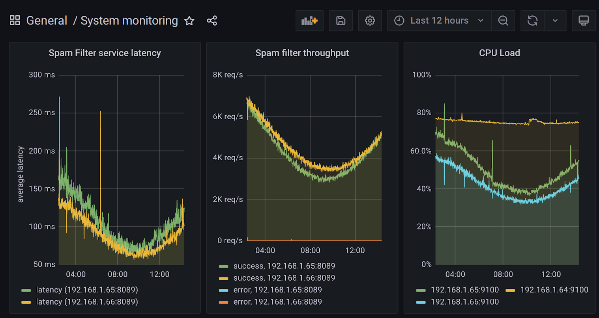
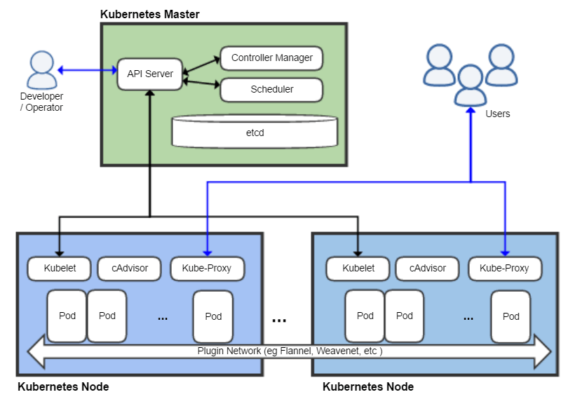

<div class="chapter">Chapter 13</div>

# Planning for Operations

With the emergence of *MLOps*, machine-learning practitioners are increasingly faced with discussions and tooling for *operations*. The term operations describes all tasks, infrastructure, and processes involved in deploying, running, and updating a software system and the hardware it runs on in production. Operations is often considered as a distinct activity from the development of the software and is often performed by other team members with dedicated expertise. Operating a software system reliably at scale requires skill, preparation, and infrastructure. To support operations, *DevOps* and *MLOps* have emerged as concepts and infrastructure to support collaboration between developers, data scientists, and operators toward better operations.

Compared to traditional software, introducing machine learning raises additional challenges during operations, such as (a) ensuring that model training and model inference operate well and (b) moving and processing very large amounts of data. Systems with machine-learning components often have demanding requirements for updates and experimentation due to continuous experimentation and drifting data.

Practitioners have gained and shared experience in operating software systems, and these days a lot of reusable infrastructure is available, often framed with the buzzwords DevOps and MLOps. With this, reliable operation at scale has become much more attainable. Nonetheless, the learning curve can be steep, and the necessary infrastructure investment can be extensive. When software projects with machine-learning components reach a certain scale or complexity, organizations should consider bringing in operations specialists, who may have role titles such as system administrators, release engineers, site reliability engineers, DevOps engineers, MLOps engineers, data engineers, and AI engineers. 

Since operation benefits from certain design qualities of the software system, preparing the system for future operations is another important design task that should be considered early on in a system’s development, just as the other design and architecture considerations discussed before. Building a system that is hard to scale, hard to update, and hard to observe will be an operations nightmare. The operations team will have a much easier time when developers build observability into the system’s infrastructure early on and virtualize the software for easy deployment. Conversely, designing the system for operations allows the operators to focus on providing value back to developers by causing fewer interruptions and enabling faster experimentation.

Again, following the theme of *T-shaped team members* (see chapter *[Introduction](01-introduction.md)*), software engineers, data scientists, managers, and other team members in ML-enabled systems benefit from understanding the key concerns of operators that allows them to anticipate their requirements, to involve them early on, and to design the system to be more operations-friendly. At the same time, operators need some literacy in machine-learning concepts to select and operate infrastructure to support machine-learning components. 

While we could dedicate an entire book to operating software systems generally and ML infrastructure specifically (and several books listed at the end of this chapter cover many of these topics in-depth), here we provide only a brief overview of key concepts and how they influence design and architectural considerations for the system, with pointers to other materials to go deeper. We will briefly return to operations later when we discuss teamwork and cultural aspects in chapter *[Interdisciplinary Teams](21-interdisciplinary-teams.md)*.

## Scenario: Blogging Platform with Spam Filter

Scenario!Blogging Platform with Spam Filter

As a running example, consider hosting a popular blogging platform protecting authors with a spam filter backed by an in-house fine-tuned large language model with fifty billion parameters. The blogging platform has started small but is now hosting the blogs of fifty thousand authors, some of them fairly popular. It is designed with a microservice architecture, with different services for showing an entire blog, for adding and editing posts, for commenting, for user accounts, and for our spam filter. Apache Kafka is used as stream processing infrastructure to queue spam filtering tasks to cope with varying loads. The organization has bought a few servers, housed in a data center, but only one server with a high-end GPU that can run the large language model. It additionally relies on cloud resources when needed, but it has experienced how costly this can quickly turn. 

## Service-Level Objectives

As usual, it is a good idea to start with requirements for operations, before diving into infrastructure, implementation, and actual day-to-day operation. As part of gathering system requirements, we can identify quality requirements for *operating* the system and each component. Such requirements for desired operations qualities are typically stated in terms of *service-level objectives*. Typical service level objectives include maximum response latency, minimum system throughput, minimum availability, maximum error rate, and time to deploy an update. For storage systems, we might additionally set durability objectives; for big-data processing, there might be throughput and job latency objectives. Notice how operators can usually not achieve these goals alone but depend on the capabilities of the software they deploy and operate. Hence, collaboration between operators, developers, and data scientists is essential to deploy systems that achieve their service level objectives in production. Measures and corresponding measurement tools are usually well established and often stated as averages or distributions, such as “able to serve at least 5,000 requests per second” or “99 percent of all requests should respond within 100 milliseconds.”

Service level objectives can and should be defined for the system as a whole, as well as for individually operated components. For example, our blogging platform will care about response latency and availability for serving the blog to users, but also about the response latency and availability of the spam-filtering service. Service quality measures of system and component may be related, but do not have to be—for example, error-handling mechanisms in the user-facing components can preserve system operation even when individual components fail in the background—for example, the blogging platform can keep operating even when the spam-filter component is down. Anticipating failures helps to recover from them, for example, by having already designed a queue of messages to be filtered when the spam filter is not immediately available.

Service level objectives are typically negotiated and renegotiated between operators and other stakeholders, reasoning about constraints, priorities, and trade-offs as usual. For example, the increased infrastructure cost to increase availability from 99.9 to 99.99 percent (i.e., from nine hours to fifty-two minutes of acceptable downtime per year) in the blogging example might simply outweigh the benefit; even lower availability might be acceptable for this service if it allows the operations team to focus on more important goals. Operations ideally focuses on risk management, rather than total risk avoidance.

In more formal arrangements, service-level objectives may be codified as contracts called *service-level agreements*, which typically include a description of consequences and penalties if the objectives are not met. These may be included as interface documentation between components, including the documentation of a model inference service discussed in chapter *[Deploying a Model](10-deploying-a-model.md)*.

## Observability

Being responsible for keeping systems running and performing well with changing demands, operators need visibility into how the system is doing. This is often described as *monitoring* the system and is broadly captured by the term *observability*.

Most monitoring infrastructure supports monitoring the status of hardware out of the box, such as CPU and memory use and uptime. Beyond that, operators usually want to observe more application-specific and component-specific information. At least, a system will typically automatically collect and monitor data for the service level objectives, such as response time, throughput, and availability of the spam filter component. More sophisticated monitoring will observe the system at a more granular level of individual components or even internals of components, which can be useful to identify bottlenecks, unreliable components, and other problems during operation. For example, we might identify which other components call the spam filter how often and to what degree slow responses from the spam filter slow down other parts of the system.

<figure>



<figcaption>

A dashboard showing latency and throughput of two instances of a service and CPU load of three machines over the last twelve hours, made with [Grafana](https://grafana.com/).

</figcaption>
</figure>

Typically, observing a system consists of three distinct steps: *instrumenting* the system to produce telemetry signals that can be monitored, *collecting* and storing the telemetry signals, and *analyzing* the telemetry signals:

  * **Producing telemetry with instrumentation:** In the simplest case, the application code simply includes print statements to write information into log files. For example, the spam filter component in our blogging scenario could print a log entry for each analyzed comment, including analysis time and predicted spam score. In addition, various libraries for software metrics and telemetry provide APIs to record counters and distributions within the application code, such as [Prometheus](https://prometheus.io/docs/instrumenting/clientlibs/) and [OpenTelemetry](https://opentelemetry.io/docs/instrumentation/). Our spam-filter component might simply increase a counter for each request and for each predicted spam message and track the latency of model inference as a distribution. Much infrastructure used in modern software systems already logs many events that can provide a source of telemetry. For example, web servers and stream processing infrastructure will log many events out of the box that may provide useful insights, such as logging every single request. Similarly, most libraries used for remote procedure calls between microservices, such as Uber’s [TChannel](https://github.com/uber/tchannel) or Twitter’s [Finagle](http://twitter.github.io/finagle), will record information about all calls—for example, logging which component calls which other component how frequently and with what latency. Adopting such a library for all calls between microservices in our blogging platform could produce a lot of useful telemetry almost for free.

  * **Collecting telemetry:** Complex systems often create a lot of telemetry in many forms and in many locations. In our blogging scenario, multiple instances of various components each export their own logs and metrics, in addition to hardware logs, and statistics produced by the remote-procedure-call library. Many infrastructure projects have been developed to collect and store such signals in a unified place for subsequent analysis. For example, [Prometheus](https://prometheus.io/) will regularly request updated metrics from all configured systems (pull design) and store them in a time-series database, [statsd](https://github.com/statsd/statsd) acts as a server receiving metrics from systems producing them (push design), [Apache Flume](https://flume.apache.org/) provides a system to collect and aggregate log files at scale from many sources, and [LogStash](https://www.elastic.co/logstash/) provides features to ingest signals from many different sources at scale and process them before passing them on for storage or analysis to a different system. The focus in the telemetry-collection phase is on moving large amounts of telemetry data efficiently and with low latency from many sources to a single place where telemetry can be analyzed.

  * **Analyzing telemetry:** Many different forms of analyses can be performed on the collected signals. Typically, information is extracted and aggregated from raw telemetry data, such as computing the average response time from a server log. The most common forms of analysis are real-time trends of measures shown in dashboards and automated alerts that are triggered when the observed values exceed predefined thresholds. For example, our monitoring system may call a developer’s cell phone if the entire blogging service is unreachable to end users for more than three minutes. [Grafana](https://grafana.com/) is a popular choice for creating dashboards and alert systems, but many other projects exist. In addition, specialized monitoring solutions exist, for example, to track latency and bottlenecks in a network of microservices.


<figure>


<figcaption>

Example screenshot of an AppDynamics FlowMap showing the status and interaction of components in a distributed system. Source: [AppDynamics Knowledgebase](https://community.appdynamics.com/t5/Knowledge-Base/How-do-I-use-AppDynamics-with-ServiceNow/ta-p/30095).

</figcaption>
</figure>

Modern systems to collect and analyze telemetry are flexible and scalable. Still, some planning to identify early on what needs to be observed and what telemetry needs to be collected will make downstream analysis steps much simpler. For example, observability can be baked into the system by building on infrastructure that provides observability out of the box (e.g., remote-procedure-call libraries, stream processing platforms), whereas switching to such infrastructure later might be a substantial undertaking. Investing in observability early in a project also fosters a culture of data-driven decision-making and can help to detect potential problems even in the very early releases of a project.

A solid telemetry and monitoring system benefits many team members, not just operators. Developers typically value insights into how the system and its components perform in production and what features are used. In our blogging-platform scenario, telemetry might show how many comments are filtered on average and whether comment spam associates with certain times of day or certain topics. Telemetry can be used to measure how the system achieves some of its objectives, such as monitoring how many users sign up for or renew their paid plan on the blogging platform. Telemetry is the key to testing and experimenting in production, both for ML and non-ML components, as we will discuss in chapter *[Testing and Experimenting in Production](19-testing-and-experimenting-in-production.md)*, where we also show a concrete example of creating telemetry data.

## Automating Deployments

Most software systems must be updated frequently to fix bugs and to deploy new features. Long gone are the days where a new software version is released every three years; today, many organizations release and deploy updates weekly or even multiple times a day. Many organizations even experiment with multiple concurrent releases in production (see chapter *[Testing and Experimenting in Production](19-testing-and-experimenting-in-production.md)*). Supporting frequent releases can be empowering for developers—they can see their features in production rapidly, receive user feedback, and quickly fix issues without having to wait for the next regularly scheduled release months later. In our blogging platform scenario, it is likely that we will frequently adjust the prompt used in the spam filter to account for new spamming strategies and that we will frequently experiment with small modifications in the rendering of blog posts and the presentation of comments, whereas we expect to update the large language model itself less frequently.

Deploying software and software updates is a core responsibility of operators, and deployment is often a source of frustration. Unscheduled patches to fix an urgent problem live in production are an operator's nightmare. It is easy to break the system with a hotfix applied inconsistently or without sufficient testing. 

Operators often invest substantial effort in automating deployments. By eliminating manual steps, they avoid mistakes and inconsistencies, increase the speed with which updates can be deployed, and support rolling back problematic updates. Many different practices, often under the umbrella of *DevOps* and *MLOps*, help to reduce the friction of deploying new releases.

Most organizations start automation with a *continuous integration* service. Continuous integration describes the process of automatically building and testing every code change integrated into the version control system. Continuous integration ensures that each version can be built independently (not just on the developer’s machine), pass all tests, and pass all other automated quality checks (e.g., static analysis). Typically, a dedicated machine will automatically download the source from the version control system after every change, run the build scripts, and then execute all tests, reporting found problems back to developers. This way, it is not possible to “forget” to include a dependency or “forget” to execute tests before a commit, even when in a rush. We will discuss various forms of automated quality assurance throughout the quality assurance chapters.

After all tests and quality checks pass, the resulting artifacts can be deployed. Automatic deployment processes are called *continuous deployment*. In the simplest case, handwritten scripts upload binaries or models to a server, but often more sophisticated steps are involved, such as packaging the artifacts in a container, uploading the container to a cloud service, launching one or more instances of the container, adjusting network routing, and then shutting down the previous containers. Typically such steps are automated with APIs by various tools and cloud services, and their success is monitored; deployed artifacts are versioned to avoid overwriting existing artifacts that may still be running or needed for a rollback. In some organizations, every single commit is deployed immediately into production if tests pass, allowing developers to monitor their work and how users use it in production rapidly.

Automated deployments are often integrated with processes for testing in production as we will discuss in chapter *[Testing and Experimenting in Production](19-testing-and-experimenting-in-production.md)*. For example, a *canary release* process is common, where some sophisticated deployment system gradually rolls out a release, first deploying it to a few users while observing the system through telemetry, and then making automated decisions about whether to continue the rollout or revert back to the last stable release. 

## Infrastructure as Code and Virtualization

Installing software with many dependencies and configuring network routing on a new machine can be challenging. In the past, operators have often complained that they failed to install a release that worked fine on a developer’s machine, due to unnoticed and undocumented dependencies or system configurations. It is even harder to ensure that hundreds or thousands of machines in a cluster or cloud deployment have consistent configurations. We want to ensure that every single instance of a service has the same version of the code, the same version of the model, and the same version of all libraries, but also the same configuration of service accounts, file permissions, network services, and firewalls. For example, if we need to replace the API key for the large language model in our blogging scenario, we do not want half of the spam filter instances to fail due to outdated API keys.  

**Virtualization.**
 Virtualization technologies, especially modern lightweight *containers* like [Docker](https://www.docker.com/), have significantly helped with reducing friction between developers and operators. Instead of operators deploying a binary to many machines and setting system configurations on each machine, developers now routinely set up, configure, and test their code in a container. In this process, they essentially install their code on a minimal fresh operating system and would notice immediately missing dependencies or incompatible versions. Also, system configurations like file permissions are set only once when creating the container. The operator then can take this container as a single large binary artifact and push copies to the machines that will run it, focusing on hardware allocation and networking rather than on installing libraries and modifying local configuration files. All machines that execute a container share the same consistent environment within the container. Furthermore, the code in the container is entirely separated from other code that may be run on the same machine. Also rolling back a release is as easy as switching back to the previous container. Containers come at the cost of some small runtime overhead and some initial complexity for setting up the container.

In chapter *[Deploying a Model](10-deploying-a-model.md)*, we illustrated an example of a Dockerfile for a model inference service, which explicitly specified which version of Python to use, which dependencies to install in which version, which code and model files to deploy, how to start the code, and what network port to expose. The operator does not need to figure out any of these tasks or manage version conflicts because other language or library versions may already be installed on the system. In our blogging example with an external large language model, the container may contain the serving code with various heuristics and prompts for the large language model as well as the API address and API keys for the large language model.

Just as the application code and individual components are virtualized with containers, it is also common to virtualize other infrastructure components. In our scenario, we could virtualize the MongoDB database holding the blog content, the Apache Kafka stream infrastructure to queue spam filtering tasks, and the Grafana dashboard for monitoring. Many providers of such infrastructure components already offer ready-to-use containers.

**Infrastructure as code.**
 To avoid repetitive manual system configuration work and potential inconsistencies from manual changes, there is a strong push toward automating configuration changes. That is, rather than remotely accessing a system to install a binary and adding a line to a configuration file, an operator will write a script to perform these changes and then run the script on the target machine. Even if the configuration is applied only to a single system, having a script will enable setting up the system again in the future, without having to remember all manual steps done in the past. In addition, by automating the configuration changes, it is now possible to apply the same steps to many machines to configure them consistently, for example, to ensure that they all run the same version of Python and use the same firewall configuration.

In practice, rather than writing scripts from scratch, provisioning and configuration management software such as [Ansible](https://www.ansible.com/) and [Puppet](https://puppet.com/) provides abstractions for many common tasks. For example, the Ansible script below installs and configures Docker, which can be executed uniformly on many machines. 

<figure>

```yaml
- hosts: all
  become: true
  tasks:
    - name: Install aptitude using apt
      apt: name=aptitude state=latest update_cache=yes force_apt_get=yes
    - name: Install required system packages
      apt: name={{ item }} state=latest update_cache=yes
      loop: [ 'apt-transport-https', 'ca-certificates', 'curl', 'software-properties-common', 'python3-pip', 'virtualenv', 'python3-setuptools']
    - name: Add Docker GPG apt Key
      apt_key:
        url: https://download.docker.com/linux/ubuntu/gpg
        state: present
    - name: Add Docker Repository
      apt_repository:
        repo: deb https://download.docker.com/linux/ubuntu bionic stable
        state: present
    - name: Update apt and install docker-ce
      apt: update_cache=yes name=docker-ce state=latest
    - name: Install Docker Module for Python
      pip:
        name: docker
```

<figcaption>

An excerpt of an Ansible script to install Docker and Docker bindings for Python on Ubuntu, from 🔗 [https://github.com/do-community/ansible-playbooks](https://github.com/do-community/ansible-playbooks).

</figcaption>
</figure>

Since the configuration process is fully scripted, this approach is named *infrastructure as code*. The scripts and all configuration values they set are usually tracked in version control, just like any source code in the project.

With the increased adoption of containers, configuration scripts are usually less used for setting up applications, but more to set up the infrastructure in which the containers can be executed (including installing the container technology itself as in the Ansible script above), to configure the network, and to install any remaining software that should not run within containers, such as tools recording hardware telemetry for system monitoring.

## Orchestrating and Scaling Deployments

In many modern systems, implementations are deployed across many networked machines and scaled dynamically with changing demands, adding or removing instances and machines as needed. In addition, we may have different available hardware, with slower or faster CPUs, with more or less memory, and with or without GPUs. In such settings, after virtualizing all the components of a system, operators still need to decide how many instances to start for each container, which instance to run on which hardware, and how to route requests. In our blogging scenario, services for rendering blog posts can be run on almost any hardware, but the large language model has high hardware demands and can only be run on one local machine with a suitable GPU or on rented dedicated GPU cloud resources. The cloud-computing community has developed much infrastructure to ease and automate such tasks, which is collectively known as *orchestration*.

The best-known tool in this space is [Kubernetes](https://kubernetes.io/), a container orchestration tool. Given a set of containers and machines (local or in the cloud), the central Kubernetes management component allocates containers to machines and automatically launches and kills container instances based on either (a) operator commands or (b) automated tools that scale services based on load. Kubernetes also automates various other tasks, such as restarting unresponsive containers, transparently moving containers across machines, managing how requests are routed and balancing requests, and managing updates of containers. In our blogging scenario, Kubernetes would be a good match to deploy the various microservices and scale them when spikes of traffic hit; for example, when a blog post goes viral, it can rapidly scale the web server capacity, without needing to also scale the spam detector component.

<figure>



<figcaption>

Overview of the Kubernetes architecture, where the Kubernetes master controls the allocation of containers to Kubernetes nodes, CC BY-SA 4.0 by [Khtan66](https://en.wikipedia.org/wiki/Kubernetes#/media/File:Kubernetes.png)

</figcaption>
</figure>

To make automated decisions, such as when to launch more instances of a container, orchestration software like Kubernetes typically integrates directly with monitoring infrastructure. It also integrates with the various cloud service providers to buy and release virtual machines or other services as needed. Other approaches to cloud computing like *serverless functions* delegate the entire scaling of a service in a container to the cloud infrastructure.

This kind of orchestration and auto-scaling infrastructure is also commonly used in large data processing and machine-learning jobs. In this context, many tools offer solutions to automatically allocate resources for large model training jobs and elastically scaling model inference services, such as Kubernetes itself, tools built on Kubernetes like [KubeFlow](https://www.kubeflow.org/), and various competitors.

Of course, many modern orchestration tools may rely on machine learning and artificial intelligence components, learning when and how to scale the system just at the right time and optimizing the system to achieve service level objectives at the lowest cost. Earlier work was often discussed under the terms *auto scaling* and *self-adaptive systems*; more recently the term *AIOps* has been fashionable for systems using machine learning for automating operations decisions.

Orchestration services come with substantial complexity and a steep learning curve. Most organizations benefit from delaying adoption until they really need to scale across many machines and need to frequently allocate and reallocate resources to various containers. Commercial cloud offerings often hide a lot of complexity when buying into their specific infrastructure. While much investment into virtualization and orchestration may be delayed until operating at scale is really needed, it is important to design the system architecture such that the system can be scaled in the first place by adding more machines.

## Elevating Data Engineering

Many modern systems move and store vast amounts of data when operating in production. Especially the large amounts of training and inference data in ML-enabled systems can place particular stress on the scalability of data storage and data processing systems. 

*Data engineers* are specialists with expertise in big data systems, in the extraction of information from data from many sources, and in the movement of data through different systems. As systems rely heavily on data, the role of data engineers becomes increasingly important. Data engineers contribute not only to the initial system development and to building data processing pipelines for machine-learning tasks, but usually also to the continuous operation of the system. If our blogging platform becomes popular, we may amass large amounts of text, images, and comments in various databases, as well as very large amounts of telemetry data in a data lake. Understanding the various data processing tools, data quality assurance tools, and data monitoring tools requires a substantial investment, but adopting such tools provides a valuable infrastructure in the long run. There are many tools established and emerging in this field, such as [Evidently](https://evidentlyai.com/) for data drift detection and [Datafold](https://www.datafold.com/) for data regression testing. In our scenario, these kinds of tools might help data engineers detect when the blogging system is overwhelmed with a new form of spam or when a minor change to data cleaning code in the ML pipeline accidentally discards 90 percent of the spam detector’s test data.

## Incident Response Planning

Even the best systems will run into problems in production at some point. Even with anticipating mistakes and planning safety mechanisms, machine-learned models will surprise us eventually and may lead to bad outcomes. While we hope to never face a serious security breach, never cause harm with unsafe behavior, and never receive bad press for discriminatory decisions made by our spam filter, it is prudent to plan how to respond to bad events if they occurred after all. Such kinds of plans are usually called *incident response plans*.

While we may not foresee the specific problem, we can anticipate that certain kinds of problems may happen, especially with unreliable predictions from machine-learned components. For each anticipated class of problems, we can then think about possible steps to take in responding when a problem occurs. The steps vary widely with the system and problems, but examples include:

  * *Prepare channels to communicate problems.* Design a mechanism of how problems can be reported inside and outside of the organization and how they reach somebody who can address them. For example, implement a feedback button in the user interface where users can report missed spam and possible discriminatory spam filtering decisions; those reports could be entered into a ticket system to be processed by a support team member or by an assigned developer.

  * *Have experts on call.* Prepare to have somebody with technical knowledge of the relevant system on call and prepare a list of experts of various parts of the system to contact in emergency situations. For example, know who to reach if the system is overwhelmed with spam after a broken update, have the contact information of a security specialist if suspecting a breach, and report all safety concerns to a compliance office in the organization.

  * *Design processes and infrastructure for anticipated problems.* Plan what process to use in case of a problem before the problem occurs and develop technical infrastructure to help mitigate the problem. For example, we might sign up for a tool that scans the dependencies of all our microservices for known vulnerabilities and assign responsibility to a team member to investigate and resolve each reported problem; and we might implement a simple flag that allows us to quickly shut down down spam filtering without taking down the entire system if we detect anomalous behavior.

  * *Prepare for recovery*. Design processes to restore previous states of a system, such as rolling back updates or restoring from backups. For example, keep a backup of the history of blog posts and comments in case a bug in the editor destroys user data and prepare for the ability to rerun the spam filter on recent comments after rolling back a problematic model.

  * *Proactively collect telemetry.* Create system logs and other telemetry to later support diagnosing the scope and origin of a problem. For example, if attackers found a way to circumvent our spam filter and post profane spam messages, we can check logs to see how long they have been trying (and succeeding) and what other messages they tried.

  * *Investigate incidents.* Have a process to follow up on incidents, discover the root cause, learn from the incident, and implement changes to avoid future incidents of the same kind.

  * *Plan public communication.* Plan who is responsible for communicating with the public about the incident. For example, should operators maintain a status page, or should the CEO or lawyers be involved before making any public statements?


While many aspects of incident response planning relate to processes, many can be supported with technical design decisions, such as telemetry design, versioning, and robust and low-latency deployment pipelines. Automation can be the key to reacting quickly, though mistakes in such automation can cause incidents in the first place. 

## DevOps and MLOps Principles


*DevOps* and *MLOps* are labels applied to the wide range of practices and tools discussed in this chapter. DevOps has a long tradition of bringing developers and operators together to improve the operations of software products. MLOps is the more recent variant of DevOps that focuses on operating machine-learning pipelines and deploying models. 

Neither DevOps nor MLOps have a single widely agreed-upon definition, but they can be characterized by a set of common principles designed to reduce friction in workflows:

  * *Consider the entire process and toolchain holistically.* Rather than focusing on local development and individual tools, consider the entire process of creating, deploying, and operating software. Dismantle barriers between the process steps. For example, containers remove friction in deployment steps between development and operations, and data versioning tools track changes to training data within machine-learning pipelines. 

  * *Automation, automation, automation.* Avoid error-prone and repetitive manual steps and instead automate everything that can be automated. Automation targets everything, including packaging software and models, configuring firewalls, data drift detection, and hyperparameter tuning. Automation increases reliability, enhances reproducibility, and improves the time to deploy updates.

  * *Elastic infrastructure.* Invest in infrastructure that can be scaled if needed. For example, design a system architecture with flexible and loosely coupled components that can be scaled independently as in our blogging platform scenario.

  * *Document, test, and version everything.* Document, test, and version not only code, but also scripts, configurations, data, data transformations, models, and all other parts of system development. Support rapid rollback if needed. For example, test the latency of models before deployment and test the deployment scripts themselves.

  * *Iterate and release frequently.* Work in small incremental iterations and release frequently and continuously to get rapid feedback on new developments and enable frequent experimentation. For example, experiment multiple times a day with different spam-detection prompts rather than preparing a big release once a month.

  * *Emphasize observability.* Monitor all aspects of system development, deployment, and operation to make data-driven decisions, possibly automatically. For example, automatically stop and roll back a model deployment if user complaints about spam suddenly rise.

  * *Shared goals and responsibilities.* The various techniques aim to break down the barriers between disciplines such as developers, operators, data scientists, and data engineers, giving them shared infrastructure and tooling, shared responsibilities, and shared goals. For example, get data scientists and operators to share responsibility for successful and frequent deployment of models.


<figure>


<figcaption>

Stages in a DevOps toolchain (CC BY-SA 4.0 [Kharnagy](https://commons.wikimedia.org/wiki/File:Devops-toolchain.svg))

</figcaption>
</figure>

A recent interview study of MLOps practitioners characterized their primary goals as *Velocity*, *Validation,* and *Versioning*: Enabling quick prototyping and iteration through automation (velocity), automating testing and monitoring and getting rapid feedback on models (validation), and managing multiple versions of models and data for recovering from problems (versioning).

Discussions of DevOps and MLOps often focus heavily on the tooling that automates various tasks, and we list some tools below. However, beyond tools, DevOps and MLOps often are a means to change the culture in an organization toward more collaboration—in this context, tools are supportive and enabling but secondary to process. We return to the cultural aspect and how DevOps can be a role model for interdisciplinary collaboration in chapter *[Interdisciplinary Teams](21-interdisciplinary-teams.md)*.

Also notice that DevOps and MLOps are not necessarily a good fit for every single project. They are beneficial particularly in projects that are deployed on the web, that evolve quickly, and that depend heavily on continuous experimentation. But as usual, there are trade-offs: infrastructure needs to be designed and tailored to the needs of a specific project, and the same techniques that benefit the operation of a massively distributed web service are likely not a fit for developing autonomous trains or systems with models packaged inside mobile apps. Seriously considering a system’s quality requirements (not just those of the ML components) and planning for operation already during the system design phase can pay off when the system is deployed and continues to evolve.

## DevOps and MLOps Tooling

There is a crowded and evolving market for DevOps and MLOps tooling. At the time of writing, there is a constant stream of new MLOps tools with many competing open-source and commercial solutions and constant efforts to establish new terms like *LLMOps*. Here, we can only provide an overview of the kind of tools on the market.

For DevOps, the market is more established. Many well-known development tools serve important roles in a DevOps context. The following kinds of tools are usually associated with DevOps:

  * **Communication and collaboration:** Many tools for issue tracking, communication, and knowledge sharing are pervasively used to communicate within and across teams, such as [Jira](https://www.atlassian.com/software/jira), [Trello](https://trello.com), [Slack](https://slack.com), wikis, and [Read The Docs](https://readthedocs.org/).

  * **Version control:** While there are many different version control systems, for source code, [git](https://www.git-scm.com) is dominant and [GitHub](https://github.com) and [Bitbucket](https://bitbucket.org) are popular hosting sites.

  * **Build and test automation:** Build tools like [make](https://www.gnu.org/software/make/), [maven](https://maven.apache.org), and [Rake](https://ruby.github.io/rake/) automate build steps. Test frameworks and runners like [JUnit](https://junit.org/), [JMeter](https://jmeter.apache.org), and [Selenium](https://www.selenium.dev) automate various forms of tests. Package managers like [packr](https://github.com/libgdx/packr) and [pip](https://packaging.python.org) to bundle build results as executable packages and, for building containers, [Docker](https://www.docker.com) is dominating the market.

  * **Continuous integration and continuous deployment (CI/CD):** The market for CI/CD tools that automate build, test, and deployment pipelines is vast.  [Jenkins](https://www.jenkins.io) is a popular open-source project for self-hosted installations, various commercial solutions such as [TeamCity](https://www.jetbrains.com/teamcity/), [JFrog](https://jfrog.com), and [Bamboo](https://www.atlassian.com/software/bamboo) compete in this space, and numerous companies specialize in hosting build and deployment pipelines as a service, including [Circle CI](https://circleci.com), [GitHub Actions](https://docs.github.com/actions), [Azure DevOps](https://azure.microsoft.com/en-us/products/devops).

  * **Infrastructure as code:** Multiple tools automate configuration management tasks across large numbers of machines with scripts and declarative specifications, such as [Ansible](https://www.ansible.com), [Puppet](https://www.puppet.com), [Chef](https://www.chef.io), and [Terraform](https://www.terraform.io).

  * **Infrastructure as a service:** Many cloud providers provide tooling and APIs to launch virtual machines and configure resources. This is a vast and competitive market with well known providers like Amazon’s [AWS](https://aws.amazon.com), Google’s [Google Cloud](https://cloud.google.com/), Microsoft’s [Azure](https://azure.microsoft.com/), and Salesforce’s [Heroku](https://www.heroku.com). Infrastructure like [OpenStack](https://www.openstack.org) provides open-source alternatives.

  * **Orchestration:** In recent years, [Kubernetes](https://kubernetes.io) and related tools have dominated the market for orchestrating services across many machines. [Docker Swarm](https://docs.docker.com/engine/swarm/) and [Apache Mesos](https://mesos.apache.org) are notable competitors, and cloud providers often have custom solutions, such as [AWS Elastic Beanstalk](https://aws.amazon.com/elasticbeanstalk/).

  * **Measurement and monitoring:** The market for observability tools has exploded recently, and different tools specialize in different tasks. [Logstash](https://www.elastic.co/logstash), [Fluentd](https://www.fluentd.org), and [Loki](https://grafana.com/oss/loki/) are examples of tools that collect and aggregate log files, often connected to search and analysis engines. [Prometheus](https://prometheus.io/), [statsd](https://github.com/statsd/statsd), [Graphite](https://graphiteapp.org), and [InfluxDB](https://www.influxdata.com) are examples of time series databases and collection services for measurements. [Grafana](https://grafana.com) and [Kibana](https://www.elastic.co/kibana) are common for building dashboards on top of such data sources. Many companies specialize in providing end-to-end observability solutions as a service that integrate many such functions, including [Datadog](https://www.datadoghq.com), [NewRelic](https://newrelic.com), [AppDynamics](https://www.appdynamics.com), and [Dynatrace](https://www.dynatrace.com).


For MLOps, we see a quickly evolving tooling market that addresses many additional operations challenges, many of which we discuss in more detail in other chapters. MLOps covers many forms of tooling that explicitly address the collaboration across multiple teams, but also many that focus on providing scalable and robust solutions for standard machine learning tasks.

  * **Pipeline and workflow automation:** A large number of tools provide scalable infrastructure to define and automate pipelines and workflows, such as [Apache Airflow](https://airflow.apache.org), [Luigi](https://luigi.readthedocs.io), [Kubeflow](https://www.kubeflow.org), [Argo](https://argoproj.github.io), [Ploomber](https://docs.ploomber.io), and [DVC](https://dvc.org) (see chapter *[Automating the Pipeline](11-automating-the-pipeline.md)*). This can make it easier for data scientists to automate common tasks at scale.

  * **Data management:** Many different kinds of tools specialize in managing and processing data in machine-learning systems. Data storage solutions include traditional databases but also various data lake engines and data versioning solutions, such as [lakeFS](https://lakefs.io), [Delta Lake](https://delta.io), [Quilt](https://www.quiltdata.com), [Git LFS](https://git-lfs.com), and [DVC](https://dvc.org). Data catalogs, such as [DataHub](https://datahubproject.io), [CKAN](https://ckan.org) and [Apache Atlas](https://atlas.apache.org/), index metadata to keep an overview of many data sources and enable teams to share datasets. Data validation, such as [Great Expectations](https://greatexpectations.io), [DeepChecks](https://deepchecks.com), and [TFDV](https://github.com/tensorflow/data-validation), tools enforce schemas and check for outliers; drift detection libraries like [Alibi Detect](https://docs.seldon.io/projects/alibi-detect/) find distribution changes over time. All these tools help to negotiate sharing large amounts of data, data quality, and data versioning across teams (see also chapters *[Scaling the System](12-scaling-the-system.md)*, *[Data Quality](16-data-quality.md)*, and *[Versioning, Provenance, and Reproducibility](24-versioning-provenance-and-reproducibility.md)*).

  * **Automated and scalable model training:** Many tools and platforms address scalability and automation in data transformation and model training steps, such as [dask](https://www.dask.org), [Ray](https://docs.ray.io), and most machine-learning libraries like [Tensorflow](https://www.tensorflow.org). Many hyperparameter-optimization tools and autoML tools attempt to make model training easier by (semi) automating steps like feature engineering, model selection, and hyperparameter selection with automated search strategies, such as [hyperopt](https://hyperopt.github.io/hyperopt/), [talos](https://github.com/autonomio/talos), [autoKeras](https://autokeras.com), and [NNI](https://github.com/microsoft/nni). These tools help scale the ML pipeline and make machine learning more accessible to non-experts. 

  * **Fine-tuning and prompt engineering:** For foundation models, increasingly tools support fine-tuning, prompt engineering, building prompt pipelines, optimizing prompts, and securing prompts. For example, [LangChain](https://www.langchain.com) is popular for sequencing prompts and reusing templates, [DSPy](https://github.com/stanfordnlp/dspy) abstracts prompt details and supports automated prompt optimization, [PredictionGuard](https://predictionguard.com) abstracts from specific language models and postprocesses their output, and [Lakera Guard](https://www.lakera.ai/lakera-guard) is one of many tools detecting prompt injection.

  * **Experiment management, model registry, model versioning, and model metadata:** To version models together with evaluation results and other metadata, several tools provide central platforms, such as [MLFlow](https://mlflow.org), [Neptune](https://neptune.ai), [ModelDB](https://github.com/VertaAI/modeldb), and [Weights and Biases](https://wandb.ai/). These tools help teams navigate many experiments and model versions, for example, when deciding which model to deploy (see chapter *[Versioning, Provenance, and Reproducibility](24-versioning-provenance-and-reproducibility.md)*).

  * **Model packaging, deployment, and serving:** Making it easier to create high-performance model inference services, several tools, including [BentoML](https://www.bentoml.com), [TensorFlow Serving](https://github.com/tensorflow/serving), and [Cortex](https://github.com/cortexlabs/cortex), automate various packaging and deployment tasks, such as packaging models into services, providing APIs in various formats, managing load balancing, and even automating deployment to popular cloud platforms (see chapter *[Deploying a Model](10-deploying-a-model.md)*). With automation, such tools can reduce the need for explicit coordination between data scientists and operators.

  * **Model and data monitoring:** Beyond general-purpose DevOps observability tooling, several tools specialize in model and data monitoring. For example, [Fiddler](https://www.fiddler.ai), [Hydrosphere](https://hydrosphere.io), [Aporia](https://www.aporia.com), and [Arize](https://arize.com) are all positioned as ML observability platforms with a focus on detecting anomalies and drift, alerting for model degradation in production, and debugging underperforming input distributions (see chapters *[Data Quality](16-data-quality.md)* and *[Testing and Experimenting in Production](19-testing-and-experimenting-in-production.md)*).

  * **Feature store:** Feature stores have emerged as a class of tools to share and discover feature engineering code across teams and serve feature data efficiently. Popular tools include [Feast](https://feast.dev) and [Tecton](https://www.tecton.ai/feature-store/).

  * **Integrated machine-learning platform:** Many organizations integrate many different ML and MLOps tools in a cohesive platform, typically offered as a service. For example, AWS’s [SageMaker](https://aws.amazon.com/sagemaker/) offers integrated support for model training, feature store, pipeline automation, model deployment, and model monitoring within the AWS ecosystem. Some of these integrated platforms, such as [H2O](https://h2o.ai), specialize in easily accessible user interfaces that require little or no coding skills. Many other organizations offer integrated platforms, including [Databricks](https://www.databricks.com), [Azure Machine Learning](https://azure.microsoft.com/en-us/products/machine-learning), and [Valohai](https://valohai.com).

  * **ML developer tools:** Many tools aimed at the core work of data scientists are also often mentioned under the label MLOps, even if they do not necessarily relate to operations, such as data visualization, computational notebooks and other editors, no-code ML frameworks, differential privacy learning, model compression, model explainability and debugging, and data labeling. Many of these tools try to make data-science tasks easier and more accessible and to integrate them into routine workflows.


## Summary

Operating a system reliably, at scale, and through regular updates is challenging, but a vast amount of accumulated experience and infrastructure can help to reduce friction. Just as with all other architecture and design decisions, some planning and up-front investment that is tailored to the needs of the specific system can ease operations. At a certain scale and velocity, it is likely a good idea to bring experts, but an understanding of key ideas such as observability, release management, and virtualization can help to establish a shared understanding and awareness of the needs of others in the project. Machine learning in software projects creates extra uncertainty, extra challenges, and extra tools during operations, but does not fundamentally change the key strategies of how different team members together can design the system for reliable operation and updates.

## Further Readings

  * A standard book for operators and engineers on how to deploy systems reliably and at scale based on experience at Google and a web portal for the topic: 🕮 Beyer, Betsy, Chris Jones, Jennifer Petoff, and Niall Richard Murphy. *[Site Reliability Engineering: How Google Runs Production Systems](https://sre.google/sre-book/table-of-contents/)*. O'Reilly, 2016. 🔗 [https://sre.google/](https://sre.google/). 

  * A popular introduction to DevOps and the DevOps mindset and fictional story that conveys many of these principles in an engaging way: 🕮 Kim, Gene, Jez Humble, Patrick Debois, John Willis, and Nicole Forsgren. *[The DevOps Handbook: How to Create World-Class Agility, Reliability, & Security in Technology Organizations](https://bookshop.org/books/the-devops-handbook-how-to-create-world-class-agility-reliability-security-in-technology-organizations/9781950508402)*. IT Revolution, 2nd ed, 2021. 🕮 Kim, Gene, Kevin Behr, and Kim Spafford. *[The Phoenix Project](https://bookshop.org/books/the-phoenix-project-a-novel-about-it-devops-and-helping-your-business-win-anniversary/9781942788294)*. IT Revolution, 2014.

  * The MLOps community has developed a vast amount of tools and infrastructure for easy deployment of machine-learned models. For a good introduction, see 🔗 [https://ml-ops.org/](https://ml-ops.org/) 🔗 [https://github.com/visenger/awesome-mlops](https://github.com/visenger/awesome-mlops) 🔗 [https://github.com/kelvins/awesome-mlops](https://github.com/kelvins/awesome-mlops). 

  * An interview study with MLOps practitioners identifying velocity, validation, and versioning as key goals and identifying common practices and problems: 🗎 Shankar, Shreya, Rolando Garcia, Joseph M. Hellerstein, and Aditya G. Parameswaran. “[Operationalizing Machine Learning: An Interview Study](https://arxiv.org/abs/2209.09125).” arXiv preprint 2209.09125 (2022).

  * A book diving deep into MLOps specifically, including concrete case studies: 🕮 Treveil, Mark, Nicolas Omont, Clément Stenac, Kenji Lefevre, Du Phan, Joachim Zentici, Adrien Lavoillotte, Makoto Miyazaki, and Lynn Heidmann. *[Introducing MLOps: How to Scale Machine Learning in the Enterprise](https://bookshop.org/books/introducing-mlops-how-to-scale-machine-learning-in-the-enterprise/9781492083290)*. O'Reilly, 2020.

  * A book on design patterns covering, among others, some MLOps patterns for deploying and updating models: 🕮 Lakshmanan, Valliappa, Sara Robinson, and Michael Munn. *[Machine Learning Design Patterns](https://bookshop.org/books/machine-learning-design-patterns-solutions-to-common-challenges-in-data-preparation-model-building-and-mlops/9781098115784)*. O'Reilly Media, 2020.

  * Many books cover specific technologies, such as the dozens of books each on Docker, Puppet, Prometheus, Kubernetes, and KubeFlow.

  * An argument to focus on observability as a much more important quality in ML-enabled systems: 🗎 Lewis, Grace A., Ipek Ozkaya, and Xiwei Xu. “[Software Architecture Challenges for ML Systems](https://doi.org/10.1109/ICSME52107.2021.00071).” In *International Conference on Software Maintenance and Evolution (ICSME)*, pp. 634–638. IEEE, 2021.


---
*As all chapters, this text is released under <a href="https://creativecommons.org/licenses/by-nc-nd/4.0/">Creative Commons BY-NC-ND 4.0</a> license.*
*Last updated on 2024-06-13.*
