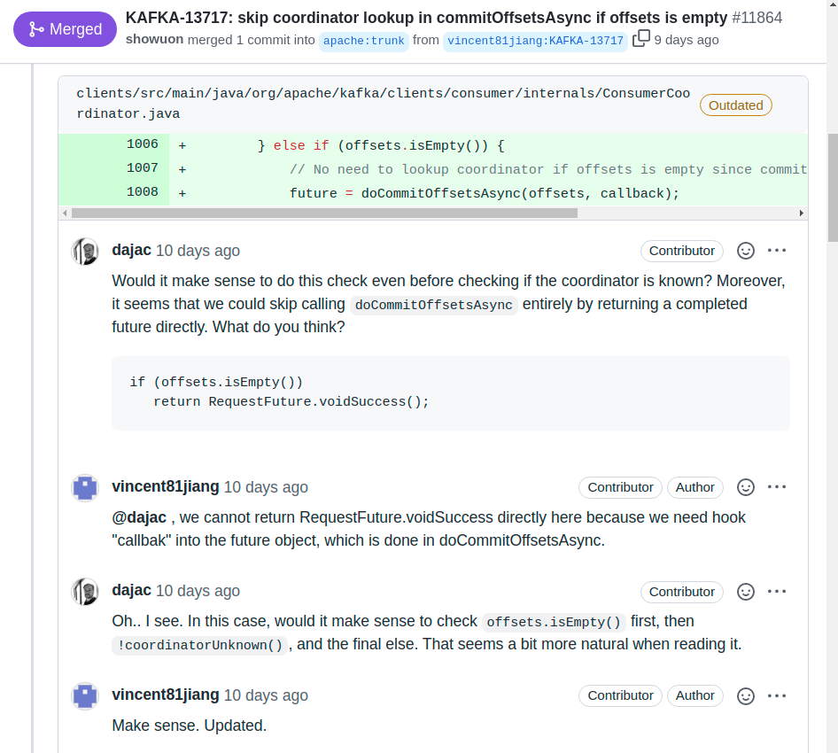

<div class="chapter">Chapter 14</div>

# Quality Assurance Basics

Quality assurance broadly refers to all activities that evaluate whether a system meets its requirements and whether it meets the needs of its users. There is a broad portfolio of quality-assurance activities, but the most common include various forms of testing and code review. Assurances can relate to various requirements, including functional correctness according to some specification, operational efficiency (e.g., execution time), and usefulness of the software for an end user. Quality assurance can evaluate the system as a whole as well as individual parts of the system. Different approaches can provide assurances with different levels of confidence – some can even make formal guarantees. In the following, we provide a very brief overview of the different quality assurance approaches common in software engineering, before subsequent chapters explore specifics of how these techniques can be used or need to be adjusted to evaluate model quality, data quality, infrastructure quality, and system quality in ML-enabled systems.

Quality assurance approaches for software can be roughly divided into three large groups: 

  * *Dynamic approaches* execute the software, including traditional *testing* and *dynamic program analyses.*

  * *Static approaches* analyze code, documentation, designs, or other software artifacts without executing them, including *code review*, *code linting*, *static data-flow analysis,* and *formal verification*.

  * *Process evaluation approaches* analyze how the software was produced rather than the software artifacts, for example, assuring that requirements are documented and known bugs are tracked.


Many quality assurance activities can be automated, as we will discuss – for example, it is common to execute large test suites automatically after every change to a code base. At the same time, some quality assurance approaches rely on manual steps or are entirely manual, such as asking experts to review design documents for performance bottlenecks or security weaknesses.

Quality assurance often focuses on *functional correctness* to evaluate whether the software produces the *expected outputs* according to some specification. Beyond functional correctness, there are many *other qualities* of interest for components or the system as a whole, as discussed throughout the requirements engineering and architecture chapters, such as execution latency, scalability, robustness, safety, security, maintainability, and usability. Some assurance approaches are a better fit for some qualities than others. For example, the execution latency of individual components can be measured with automated tests, but usability may be better evaluated in a lab study with users.

## Testing

Testing is the most common quality assurance strategy for software: Executing the software with *selected inputs* in a *controlled environment* to check that the software behaves *as expected*. Tests are commonly fully automated, but testing can also be performed entirely manually, for example, by asking testers to interact with a shopping app and score whether they like the provided recommendations. 

What it means for software to “behave as expected” may depend on what kind of requirement is tested: Commonly, a test checks that the computed output corresponds to the expected output for a given input (testing behavioral requirements), but we can also test whether a software responds as quickly as expected (performance requirements) or whether end users find it easy to navigate the user interface (usability requirements), among many other requirements.

### Test Automation

Tests are automated with code. An automated test has the following ingredients: (a) call the software under test to execute it, (b) provide inputs for the execution, (c) control the environment if needed (e.g., initialize dependencies, provision an empty database), and (d) check whether the execution matches expectations, commonly by checking the output against some expected values. In traditional software testing, this is often implemented with unit testing frameworks like *JUnit* or *pytest*. 

<figure>

```python
from system_under_test import next_date

def test_end_of_month():
  assert next_date(2011, 1, 31) == (2011, 2, 1)
  assert next_date(2011, 2, 28) == (2011, 3, 1)

def test_leap_year():
  assert next_date(2020, 2, 28) == (2020, 2, 29)
  assert next_date(2020, 2, 29) == (2020, 3, 1)
  assert next_date(2024, 2, 28) == (2024, 2, 29)
  assert next_date(2028, 2, 28) == (2028, 2, 29)

def test_not_leap_year():
  assert next_date(2021, 2, 28) == (2021, 3, 1)
  assert next_date(1900, 2, 28) == (1900, 3, 1)
```

<figcaption>

Example of three independent unit tests that test two aspects of a next_date function and can be automatically executed with pytest.

</figcaption>
</figure>

Unit testing frameworks provide a common style for writing tests and come with additional infrastructure, including a test runner that executes the tests and reports test results (e.g., *python -m pytest test.py* for the tests above). Testing frameworks are available for pretty much every programming language and environment, often with many convenient abstractions to write readable tests.

As mentioned, tests can check expected behavior in more ways than just comparing the output against expected outputs. For example, tests can check that a function answers within a time limit and that a machine-learned model achieves prediction accuracy above a threshold (more on this later). 

<figure>

```python
def test_search_performance():
  start_time = time.time()
  expensive_search_query()
  end_time = time.time()
  assert (end_time - start_time) < 1 #second

def test_model_accuracy():
  model = load_model("model.tflite")
  (X, Y) = load_test_data("labeled_data.dat")
  accuracy = evaluate(model, X, Y)
  assert accuracy > 0.9
```

<figcaption>

Examples of simple tests that fail if a computation is too slow or a trained model is not meeting an accuracy threshold on evaluation data.

</figcaption>
</figure>

To test timing-related issues of components and entire systems, dedicated performance testing frameworks help write reliable performance tests at a higher level of abstraction. For example, a tool like *[Apache JMeter](https://jmeter.apache.org/)* can send an increasing number of requests to a component to measure (a) response time, (b) throughput, and (c) resource use at different loads. Such tools can perform more specialized tests, such as *load testing* to check whether a component can handle the maximal expected load, *scalability testing* to explore how the component behaves as load increases, *soak testing* to explore whether the component remains stable when overloaded for some time, and *stress testing* to intentionally overwhelm the entire system to test mechanisms for graceful degradation and recovery. 

### Continuous Integration

Even if tests are written in code and can be executed by a test runner, developers might forget or delay running their tests. If tests are executed only after days or weeks of new development, problems are detected late and harder to fix than if they had been addressed promptly. *Continuous integration* runs tests after every change and ensures that developers cannot “forget” to run tests.

A continuous integration is typically triggered whenever new code is submitted to the version control system.  The continuous integration service will then download that code, build and test it in a clean environment, and report the test results. Results are often shown in online dashboards and as build flags in the version control system, but may also be emailed to the author of the change. As everything is automated, it is quickly noticed when somebody’s code changes break a test. Infrastructure can even enforce that code changes cannot be merged until after the continuous integration service has reported passing tests.

Another benefit from continuous integration is that tests are always executed by an *independent* service, ensuring that the tests do not just pass on the developer’s machine (*“works for me”*) but also in an independent build in a clean environment. This independence helps ensure that builds and tests are portable and that all dependencies are managed as part of the build. To this end, continuous integration services can be set up locally on dedicated machines, with tools like *[Jenkins](https://www.jenkins.io/)*, or using cloud infrastructure, such as *[CircleCI](https://circleci.com/)* and *[GitHub actions](https://github.com/features/actions)*. 

### Unit Testing, Integration Testing, System Testing, and Acceptance Testing

Testing is commonly distinguished by the granularity of the artifact to be tested. *Unit tests* focus on small units of functionality, such as a single function or a class. *Integration tests* analyze the interactions of multiple units at the granularity of multiple interacting functions, of components, or of subsystems. Finally, *system tests* evaluate the entire system and test the system behavior end-to-end; system tests conducted from a user’s perspective, often with a focus on usability and overall effectiveness of the system for a task are called *acceptance tests*.

<figure>


<figcaption>

A unit test executes a single unit of code, an integration test executes the combination of multiple units, a system test executes the entire system end to end, and acceptance testing tests the entire system from the perspective of end users.

</figcaption>
</figure>

Most developers focus most of their testing efforts at the level of unit tests, testing the inputs and outputs of individual functions, such as in the *next_date* tests above. Similarly, in machine learning, most testing focuses on testing a single model in isolation, independent of how the model is integrated into a system. Unit tests are most easily automated.

Integration tests evaluate whether multiple units work together correctly. In terms of code and test infrastructure, automated integration tests look just like unit tests and use the same test frameworks; however, integration tests execute multiple pieces of functionality, passing the results from the former to the latter, asserting that the eventual result is correct. We will see more examples of integration testing of multiple steps in a machine-learning pipeline in chapter *[Pipeline Quality](17-pipeline-quality.md)*. As we will show in the same chapter, integration tests can also check whether error handling is implemented correctly for communication between two or more components.

<figure>

```python
def test_two_phase_instrument_detector():
  instrument_model = load_model("small_model.tflite")
  instrument_type_model = load_model("large_model.tflite")
  (X, Y) = load_test_data("labeled_data.dat")

  correct_predictions = 0
  for i in range(0, len(X)):
    instrument_type = None
    # composed 2-phase prediction
    is_instrument = instrument_model(X[i])
    if is_instrument > 0.8:
      instrument_type = instrument_type_model(X[i])
    if instrument_type == Y[i]:
      correct_predictions += 1

  accuracy = correct_predictions / len(X)
  assert accuracy > 0.9
```

<figcaption>

Example of an integration test for a component to detect instruments in audio that uses two models in a two-phase prediction composition from chapter Deploying a Model. While we could perform unit tests of both models individually, here we test the accuracy of the classifier when both models are integrated.

</figcaption>
</figure>

Finally, system tests tend to make sure that requirements are met from an end user’s perspective. They commonly follow use cases or user stories, of a user stepping through multiple steps of interacting with a system to achieve a goal, such as signing up for an account and buying a product recommended by the system, expecting to see a specific message and to receive a confirmation email (or an immediate reaction for certain inputs). In systems with a graphical user interface, libraries for GUI testing can be used to automate system-level tests, but they tend to be tedious and brittle. Many organizations perform system testing mostly manually or in production. When system testing is performed by the client or end users rather than by developers or testers, it is often called *acceptance testing*.

### Test Quality

While tests evaluate the quality of some software, we can also ask how good the tests are at evaluating the software. Since testing may find defects but can never guarantee the correctness of software (as testing can only check some of infinitely many possible executions), it is fair to ask whether some test suites are better than others at finding defects and providing confidence. 

The most common approach to evaluate the quality of a test suite is to measure *coverage* achieved by the tests. In a nutshell, coverage measures how much of the code has been executed by tests. If we have more tests or more diverse tests, we will execute more parts of the code and are more likely to discover bugs than if we focus all our testing on a single location. Importantly, coverage can highlight which parts of the implementation are not covered by tests, which can guide developers on where to write additional tests. In the simplest case, coverage is measured in terms of which lines of code are executed, and coverage tools will highlight covered and uncovered areas in reports and development environments. In addition, it is possible to measure coverage in terms of branches taken through *if* statements or measuring (usually manually) how well the system requirements are covered by tests. Tools to produce coverage reports are broadly available with all testing frameworks and development environments, for example, *[JaCoCo](https://www.eclemma.org/jacoco/)* in Java and *[Coverage.py](https://coverage.readthedocs.io/)* for Python.

<figure>


<figcaption>

Example of a coverage report, highlighting which lines have not been executed by any tests, which may inform what additional tests to add, for example tests about year changes and tests about the 400-year leap year rule.

</figcaption>
</figure>

Beyond coverage, the idea of *mutation testing* has gained some popularity to evaluate test quality. Mutation testing asks the question of whether the tests are sensitive enough to detect typical bugs that might be expected in the implementation, such as off-by-one mistakes in conditions. To this end, a mutation testing framework will inject artificial bugs into the software, for example, by flipping comparison operators in expressions (e.g., replacing “<” by “*>”*) or adjusting decision boundaries (e.g., replacing “*a < b.length”* by “*a < b.length + 1”*). The tool will then run the tests on each modified version of the code to see whether the previously passing tests now fail. Tests that fail on more injected changes are more sensitive to detect such changes and are hence considered to be of higher quality. The downside of mutation testing is that it can be computationally expensive, because the tests must be executed over and over again for each injected change.

### Testing in Production

Most testing is done in a controlled environment. For example, when the system interacts with a database, the test environment reinitializes a database with predetermined content before every test rather than letting the test write to the production database. Controlling the environment helps to make tests reproducible and reliable and prevents buggy code from breaking a production system during testing. However, some behaviors can be tricky to anticipate or create in a controlled setting. For example, we may find it difficult to test whether our distributed system recovers gracefully from a server crash even when it is under high load, because it requires substantial test infrastructure to launch and control multiple servers to simulate the crash. For cases that are difficult to anticipate and cases that are difficult to reproduce in testing, we may have to rely on *testing in production*.

Testing in production typically complements traditional *offline* testing in controlled environments rather than replace it. The idea of testing in production is to observe the entire production system to identify problems and especially to detect whether the system behavior overall changes when introducing a change. The change we introduce could be an improved version of the software we want to test or an artificially introduced defect to evaluate how the system copes. For example, we could intentionally inject faults in the running production system, such as rebooting one server to see whether the production system recovers gracefully, a process known as *chaos testing*. Testing in production can also be used to conduct an experiment to see which of two alternative implementations works better in production, for example, in terms of fewer crashes or more sales – an approach known as *A/B testing*. To avoid disaster from bad changes and failed experiments, testing in production is often limited to a subset of all users with safety mechanisms, such as the ability to roll back the change quickly. 

Since testing in production is useful for experimentation and particularly attractive when incrementally developing and testing ML models in realistic settings, we will dedicate an entire chapter *[Testing and Experimenting in Production](19-testing-and-experimenting-in-production.md)* to the idea, concepts, and tools.

## Code Review

*Code review*, traditionally also known as *inspection*, is a process of manually reading and analyzing code or other artifacts to look for problems. Code review is a static approach, in that reviewers analyze the code without executing it.

Today, the most common form of code review is lightweight incremental code review of changes when they are committed into a version control system. Essentially all big tech companies have adopted some code review process and tooling where each set of changes needs to be reviewed and approved by multiple others before it will be integrated into the shared code base. In open source, this is commonly achieved through reviewing *pull requests* before they are merged into the main development branch. Generally, this style of code review happens regularly as code is developed and is quick and lightweight.

<figure>



<figcaption>

Example excerpt of code review of suggested changes in a pull request for the open source project [Apache Kafka](https://github.com/apache/kafka/pull/11864) on GitHub. Here, the change’s author constructively discusses with other contributors possible ways to make the change clearer.

</figcaption>
</figure>

Studies show that today’s common lightweight incremental code review is only moderately effective at finding defects, but it can surface other issues that are difficult to test for, such as poor code readability, poor documentation, bad coding patterns, poor extensibility, and inefficient code. In addition, code review can be performed on artifacts that are not executable, such as requirements and design documents, incomplete code, and documentation. Importantly, code review has several other benefits beyond finding defects, particularly for information sharing and creating awareness, so that multiple developers know about each piece of code, and for teaching and promoting good practices.

In a machine-learning context, code reviews can be extended to all code and artifacts of the machine-learning pipeline, including data-wrangling code, model training code, model evaluation reports, model requirements, model documentation, deployment infrastructure, configuration code, and monitoring plans.

There are also older, more formal, and more heavyweight approaches to code review. In classic *[Fagan-style inspections](https://en.wikipedia.org/wiki/Fagan_inspection)*, multiple reviewers read and discuss a fragment of code, both independently and as a group. Fagan-style inspections perform an in-depth review of a completed piece of code before it is released, in contrast to the incremental reviews during development common today. Often, checklists are used to focus the reviewers’ attention on specific issues, such as possible security problems. Fagan-style inspections were popular and well-studied in the 1980s, and studies have shown that they are incredibly effective at finding bugs in software (more than any other quality assurance strategy). However, they have fallen out of fashion because they are very slow and very expensive. Fagan-style inspections are usually reserved for mission-critical core pieces of code in high-risk projects, for important design documents, and for security audits. In a machine learning context, they may be used, for example, for reviewing the training code or for fairness audits. In today’s practice, though, heavyweight inspections have almost entirely been replaced by lightweight incremental code reviews, which are much cheaper, even if less effective at finding defects.

## Static Analysis

*Static analysis* describes a family of approaches to automatically reason about code without executing it. There are many different static analyses, typically categorized and named after the technical flavor of the underlying technique, such as *type checking*, *code linting*, *data-flow analysis*, or *information-flow analysis*. In some sense, static analysis is a form of automated code review performed by an algorithm, where each analysis is focused on a specific kind of possible issue.

Static analysis tools examine the structure of source code and how data flows through source code, often looking for patterns of common problems, such as possibly confusing assignment (“=”) with comparison (“==”), violating style guidelines, calling functions that do not exist, including dead code that cannot be reached, and dereferencing a null pointer.

<figure>

```java
if (user.jobLevel = 3) { // suspicious assignment & type error
  ...
}

int fn() {
  int X=1  ;           // violation of style guidelines
  return Math.abss(X); // function is not defined
  X = 3;               // dead code
}

PrintWriter log = null;
if (anyLog) log = new PrintWriter(...);
// possible null pointer exception if detailedLog && !anyLog
if (detailedLog) log.println("Log started"); 
```

<figcaption>

Examples of coding problems that can be detected by more or less sophisticated static analysis tools.

</figcaption>
</figure>

Static analyses commonly report style issues (e.g., violating naming conventions), suspicious but not technically illegal code (e.g., assignment within an if expression), and clear mistakes (e.g., dead code, calls to undefined functions). Common static analysis tools implement analyses for many kinds of issues. Some static analyses can *guarantee* that certain narrow kinds of problems do not occur if the analyses do not report any issues (at the cost of possible false warnings) – for example, static type checkers as in Java and C# prevent developers from calling methods that do not exist. However, most static analyses rely on heuristics that point out common problems but may miss other problems and may raise false alarms.

For dynamically typed and highly flexible languages such as Python and JavaScript, static analysis tools are usually weaker than those for Java or C; they tend to focus on style issues and simple problem patterns. For example, *[Flake8](https://github.com/pycqa/flake8)* is a popular style checker for Python. Static analyses for specific problems related to machine learning code and data transformations have been proposed in academia, but they are not commonly adopted.

## Other Quality Assurance Approaches

Several other quality assurance approaches exist. We provide only a quick overview, since some also come up in discussions around machine-learning code.

**Dynamic analysis** is a form of program analysis where additional information is tracked while the program is executed by a test or in production. *Dynamic type checking* is a typical example of a dynamic analysis built into most programming languages, where each runtime object is associated with a runtime type, preventing the interpretation of strings as numbers without appropriate conversion and enabling more informative error messages when a problem occurs during an execution. *Profiling* is a dynamic analysis that measures the execution time of code fragments to observe performance bottlenecks. *Provenance tracking* is common in research on databases and big data systems to track the origin of values at runtime, for example, to identify which rows of which dataset were involved in computing a result. Dynamic analyses are typically implemented either (a) directly in the runtime system (e.g., in the Python interpreter) or (b) by instrumenting the code before execution to track the desired information.

**Formal verification** mathematically *proves* that an implementation matches a specification. Assuming that the specification is correct, formal verification provides the strongest form of assurance – if we can prove a program correct with regards to a specification, we can be sure that it performs exactly as specified. Formal verification is expensive though, requires substantial expertise and effort, and cannot be fully automated. It is rarely used for quality assurance in real-world projects outside of a few mission-critical core fragments of some very important systems, such as operating systems and control software for spacecraft.

Finally, some assurance strategies investigate **process quality** rather than (or in addition to) the quality of the actual software. That is, we assure that the software was developed with a well-defined and monitored process. This may include assuring that the team follows good development practices, documents and approves requirements, performs architectural planning, uses state-of-the-art development and quality assurance tools, checks for certain kinds of problems, tracks known defects, uses a mechanism to identify and eliminate recurring problems (root cause analysis), analyzes and tracks risks, uses version control, uses change management, monitors developer progress, and much more. Many process improvement methods, such as *[Six Sigma](https://en.wikipedia.org/wiki/Six_Sigma)*, *[Kaizen](https://en.wikipedia.org/wiki/Kaizen)*, and *[Lean Manufacturing](https://en.wikipedia.org/wiki/Lean_manufacturing)* stem from engineering and manufacturing, but have also been adapted to software processes. An organization's attention to process quality is sometimes characterized by *maturity models* – organizations that define their processes, follow them, and monitor them to look for improvement opportunities are considered more mature. The best-known example of a maturity model is the *[Capability Maturity Model](https://en.wikipedia.org/wiki/Capability_Maturity_Model)* for traditional software, but maturity models have also been suggested for [testing machine-learning components](https://static.googleusercontent.com/media/research.google.com/en//pubs/archive/46555.pdf) and for [developing machine-learning systems](https://www.microsoft.com/en-us/research/uploads/prod/2019/03/amershi-icse-2019_Software_Engineering_for_Machine_Learning.pdf) broadly*.* Developing software with a high-quality process does not guarantee that the resulting software artifacts are of high quality, but a quality process can avoid some problems stemming from sloppy practices. At the same time, a strong focus on process quality is often disliked by developers and associated with bureaucracy. 

## Planning and Process Integration

Quality-assurance methods only improve software quality if they are actually used. Software developers often have a reputation for prioritizing coding over quality assurance. It is common to read reports of how developers wrote almost no tests, did quick and shallow code reviews, or ignored warnings from static-analysis tools, if they ran them in the first place. A key question hence is how to get team members to invest in quality assurance and take quality assurance seriously.

First, managers and teams should include time and resources for quality assurance when making plans. When under constant deadline pressure, developers may feel forced to cut corners, often creating unpleasant work environments where developers are dissatisfied with their own work and working conditions.

Second, quality assurance activities should be planned and scheduled, just like other development activities. Planning includes developing a test plan as well as setting quality goals when identifying requirements and designing components. For example, when identifying requirements, also discuss what system tests could be used to evaluate whether the requirements were met. When assigning a milestone for completing a component to a developer or team, the milestone should not only require the completion of all coding activities, but also require having demonstrated that the code meets agreed-upon quality goals (e.g., meeting testing requirements, finishing code review and resolving all comments, passing static analysis, meeting the customer’s expectations). This style of pairing design and development activities with test activities is commonly described as the *[V-model](https://en.wikipedia.org/wiki/V-Model)*.

<figure>

![A process model arranging 7 boxes in the form of a V. On the left side, boxes requirements analysis, architecture design, low-level design, and implementation are arranged in descending positions. On the right side implementation, unit testing, integration testing, and system testing are arranged in ascending order. Boxes at the same level are connected with dots, indicating that system-level testing corresponds to requirements analysis, integration testing to architectural design, and unit testing to low-level design. ](./img/14-v-model.svg)

<figcaption>

The V-model of system development describes how quality assurance strategies are matched to requirements and design activities in the system development process. This figure shows one of many common variations of this diagram linking software development stages (as discussed in the process chapter) to quality assurance activities.

</figcaption>
</figure>

Third, assign clear responsibilities for quality-assurance work. Some organizations have dedicated quality assurance or testing teams, separate from development teams, who need to sign off on passing quality goals. In today’s practice though most developers perform most quality assurance activities themselves for all code they wrote. Still, dedicated testing teams with specialists can be useful to provide an independent perspective, particularly in later stages, focused on system testing, security audits, penetration testing, and fairness audits.

<figure>


<figcaption>

Screenshot of static analysis warning shown within Google’s in-house code review tool, from 🗎 Sadowski, Caitlin, Edward Aftandilian, Alex Eagle, Liam Miller-Cushon, and Ciera Jaspan. "[Lessons from building static analysis tools at Google](https://dl.acm.org/doi/pdf/10.1145/3188720)." Communications of the ACM 61, no. 4 (2018): 58-66.

</figcaption>
</figure>

Finally, by integrating quality assurance practices with tooling into the development process, it is often possible to require developers to perform certain steps. There are many successful examples of such process integrations: 

  * Code reviews are required in many organizations such that code cannot be merged unless approved by at least two other developers (technically enforced). 

  * Continuous integration tools run all tests and refuse to merge changes that break tests (technically enforced). 

  * The version control system refuses to merge code changes if they are not accompanied by unit tests or if they decrease overall code coverage (can be technically enforced). 

  * Google has been successful in getting developers to pay attention to static-analysis warnings with a bit of social engineering, by surfacing those warnings during code review. Many static-analysis tools now also integrate similarly with code review of pull requests on GitHub. Code review is a good time to show static-analysis warnings, because developers are already open to feedback, and the presence of other reviewers provides social pressure to address the warnings (not technically enforced, but creating social pressure). 

  * Project managers do not let developers move on to the next task before their previous milestone is complete with tests and documentation (enforced by management).


Overall, establishing a *quality culture,* in which the organization values software quality enough to make it a priority, takes time, effort, and money. Most developers do not want to deliver low-quality software, but many feel pressured by deadlines and management demands to take shortcuts. As with all culture change, establishing a quality culture requires buy-in from management and the entire team, supported with sufficient resources, and not just wordy ambitions or compliance to rules imposed from above. Defining processes, observing outcomes, avoiding blame, performing retrospective analyses, and celebrating successes can all help to move to a culture where quality is valued.

## Summary

There are many strategies to assure quality of software, all of which also apply to software with machine-learning components. Classic quality-assurance techniques include testing, code review, and static analysis. All of these are well established in software engineering. To be effective, these activities need to be planned, automated where possible, and integrated into the development process.

## Further Readings

  * Quality assurance is prominently covered in most textbooks on software engineering and dedicated books on testing and other quality assurance strategies exist, such as 🕮 Copeland, Lee. *[A practitioner's guide to software test design](https://bookshop.org/books/a-practitioner-s-guide-to-software-test-design/9781580537919)*. Artech House, 2004. 🕮 Aniche, Mauricio. *[Effective Software Testing: A Developer's Guide](https://bookshop.org/books/effective-software-testing-a-developer-s-guide/9781633439931)*. Simon and Schuster, 2022. 🕮 Roman, Adam. *[Thinking-driven testing](https://bookshop.org/books/thinking-driven-testing-the-most-reasonable-approach-to-quality-control/9783319731940)*. Springer, 2018.

  * Great coverage of many different forms of code review and inspection, including advice for more heavyweight strategies: 🕮 Wiegers, Karl Eugene. *[Peer reviews in software: A practical guide](https://www.google.com/books/edition/_/d7BQAAAAMAAJ)*. Boston: Addison-Wesley, 2002.

  * An excellent study of modern code review (incremental review of changes) at Microsoft highlighting the mismatch between expectations and actually observed benefits: 🗎 Bacchelli, Alberto, and Christian Bird. "[Expectations, outcomes, and challenges of modern code review](https://www.cabird.com/pubs/bacchelli2013eoc.pdf)." In *International Conference on Software Engineering (ICSE)*, pp. 712-721. IEEE, 2013.

  * An article describing the multiple attempts to introduce static analysis at Google and the final solution of integrating lightweight checks during code review: 🗎 Sadowski, Caitlin, Edward Aftandilian, Alex Eagle, Liam Miller-Cushon, and Ciera Jaspan. "[Lessons from building static analysis tools at Google](https://dl.acm.org/doi/pdf/10.1145/3188720)." *Communications of the ACM* 61, no. 4 (2018): 58-66.

  * Manurity models suggested for building ML systems and for ML testing: 🗎 Amershi, Saleema, Andrew Begel, Christian Bird, Robert DeLine, Harald Gall, Ece Kamar, Nachiappan Nagappan, Besmira Nushi, and Thomas Zimmermann. "[Software engineering for machine learning: A case study](https://www.microsoft.com/en-us/research/uploads/prod/2019/03/amershi-icse-2019_Software_Engineering_for_Machine_Learning.pdf)." In *International Conference on Software Engineering: Software Engineering in Practice (ICSE-SEIP)*, pp. 291-300. IEEE, 2019. 🗎 Breck, Eric, Shanqing Cai, Eric Nielsen, Michael Salib, and D. Sculley. "[The ML test score: A rubric for ML production readiness and technical debt reduction](https://static.googleusercontent.com/media/research.google.com/en//pubs/archive/46555.pdf)." In *International Conference on Big Data (Big Data)*, pp. 1123-1132. IEEE, 2017.


---
*As all chapters, this text is released under <a href="https://creativecommons.org/licenses/by-nc-nd/4.0/">Creative Commons BY-NC-ND 4.0</a> license.*
*Last updated on 2024-03-10.*
