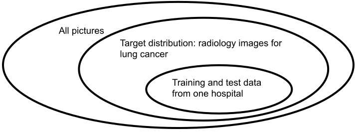

<div class="chapter">Chapter 15</div>

# Model Quality

Data scientists usually evaluate model quality by measuring *prediction accuracy* on a *held-out dataset*. While an accurate model does not guarantee that the overall product that integrates the model performs well in production when interacting with users and the environment, assuring model quality is an essential building block in any quality assurance strategy for production systems with machine-learning components. Defining, analyzing, and measuring a model's quality is challenging, partly because it differs significantly from traditional software testing.

In this chapter, we will focus exclusively on model quality and postpone concerns about data quality, infrastructure quality, and the quality of the final product. We will focus on *offline* evaluations during development and postpone testing *in production* to a later chapter. We will proceed in three parts: First, we discuss more fundamentally what *“correctness”* or “*bug”* even means for a machine-learned model to highlight the difficulties and differences compared to traditional software testing. Second, we look at traditional measures of prediction accuracy used in data science and discuss typical pitfalls to avoid. Finally, we discuss emerging evaluation strategies inspired by traditional software testing, many of which pursue more nuanced evaluations of model behaviors and individual requirements.

## Scenario: Cancer Prognosis


Let's consider a system that takes radiology images and information about a patient (e.g., age, gender, medical history, and other tests performed) as input to predict whether the patient has cancer. 

<figure>

```python
def hasCancer(image: Image, age: int, ...) -> bool:
   """Determine whether the radiology image shows signs of cancer"""
```

<figcaption>

A signature of the learned cancer prognosis model.

</figcaption>
</figure>

In practice, such a model would be integrated into a larger system, where it has access to patient records and interacts through a user interface with physicians who will confirm the final diagnosis. The system would support physicians to make better diagnoses and treatment decisions, not replace them. Designing such a system so that physicians trust the system is challenging, as illustrated well in the [*“Hello AI”* study](https://dl.acm.org/doi/abs/10.1145/3359206) by Google. As a deployed product, the system would likely need to explain how it made a decision and where exactly it suspects cancer, but for now, let us mainly focus on the binary classification model without considering the rest of the system.

Even though we anticipate keeping human experts in the loop, the cancer-prognosis model will be used in high-risk contexts. We should definitively evaluate the entire system in a clinical trial and monitor how the model performs *online* in production once deployed. Nonetheless, it is prudent to rigorously evaluate the quality of the model before ever deploying it to make predictions about actual patients. This *offline* evaluation reduces the chance of exposing patients to bad outcomes from a poor-quality model.

## Defining Correctness and Fit

It is surprisingly difficult to define what it means for a machine-learned model to be “correct” or “buggy.” To explain why, it is necessary to first look at how we traditionally define and evaluate the *correctness* of software implementations.

When discussing correctness, we always need to ask, *“Correct with regard to what?”* In traditional software, we evaluate *correctness* by comparing the software's behavior against its intended behavior. Ideally, we have a precise *specification* of the intended behavior of a software component or a *requirement* of a system’s behavior in the real world (see chapter *[Gathering Requirements](06-gathering-requirements.md)*) that can be used to determine whether a computed output for a given input is correct. 

The process of establishing correctness by checking an implementation against a specification or requirement is known as *verification*, and testing is a common verification technique. In contrast, *validation* is the process of checking whether the specification or implementation meets the customer's problem and needs, for example, by showing users prototypes or getting feedback from early production use. 

<figure>


<figcaption>

Verification asks whether we implemented a system correctly, whereas validation asks whether we have implemented the right system for a customer’s needs.

</figcaption>
</figure>

The difference between verification and validation is important to understand the typical notion of correctness. Consider again the non-ML example of computing the date following a provided date from the previous chapter. To *verify* that the implementation of *next_date* implements the specification for that problem *correctly*, we can write tests that check input-output pairs, as illustrated in the previous chapter. If any test case fails, either the test was wrong, or we have found a *bug*. To *validate* that the implementation meets a customer’s needs, we might show the finished product to the customer. If the customer needed a *next_date* function in the [Hebrew calendar](https://en.wikipedia.org/wiki/Hebrew_calendar) instead, we simply implemented the wrong specification. In that case, the implementation would still be technically *correct according to the provided specification,* but it would simply not be *useful* to the customer.

<figure>

```python
def next_date(year, month, day):
    """Spec: Given a year, a month (range 1-12), and a day (1-31),
    the function returns the date of the following calendar day 
    in the Gregorian calendar as a triple of year, month, and day.
    Throws InvalidInputException for inputs that are not valid dates.
    """
```

<figcaption>

An example specification for the next_date function.

</figcaption>
</figure>

The correctness of software is primarily evaluated through testing. We can not exhaustively test all possible inputs, because there are simply too many. So, while a good testing regime might give us some confidence in correctness, it will not provide correctness guarantees—we may miss some bugs in testing. 

At the same time, with software testing, we have strong correctness expectations for all tested behavior*.* Specifications determine which outputs are correct for a given input. We do not judge the output to be “pretty good” or “95 percent accurate” or are happy with an algorithm that computes the next day “correctly for 99 percent of all provided dates in practice.” We have no tolerance for occasional wrong computations, for approximations, or for nondeterministic outputs unless explicitly allowed by the specification. A wrong computation for any single input would be considered a *bug*. In practice, developers may decide not to fix certain bugs because it is not economical or would cause other problems and instead accept that users cope with a buggy implementation—but we still consider the wrong computation as a bug even if we decide not to fix it.

### Correctness Expectations for Models

How we evaluate machine-learned models differs fundamentally from traditional software testing. Generally speaking, a model is just an algorithm that takes inputs to compute an output; for example, it computes a cancer prognosis for a given image. The key difference is that this algorithm has been learned from data rather than manually coded.

Again, the question is, “Correct with regard to what?” For machine-learned models, we have no specification that we could use to determine which outputs are correct for any given input. *We use machine learning precisely because we do not have such specifications*, typically because the problem is too complex to specify or the rules are simply unknown. We have ideas, goals, intuitions, and general descriptions, for example “detect whether there is cancer in the image,” as well as examples of input-output pairs, which could be seen as partial or implicit specifications, but nothing we can write down as concrete rules as to when an output is correct for *any* given input.

In practice, we fundamentally accept that *we cannot avoid some wrong predictions*. When using machine learning, we cannot and do not expect all outputs to be correct, if we can even determine whether a prediction is correct in the first place. We would not write a test suite with individual input-output examples and expect all tests to pass. A single wrong prediction is not a reason to reject a model. 

<figure>

```python
def test_patient1(self):
    self.assertTrue(has_cancer(load_image("patient1.jpg"), 45, ...))

def test_patient2(self):
    self.assertFalse(has_cancer(load_image("patient2.jpg"), 37, ...))
```

<figcaption>

Models are not tested with unit tests trying individual inputs as traditional software functions. We would not fail the entire test suite for a single wrong prediction.

</figcaption>
</figure>

Overall, we have a *weak notion of correctness.* We evaluate models with examples, but not against specifications of what the model should generally do. We accept that mistakes will happen and try to judge the frequency of mistakes and how they may be distributed. A model that is correct on 90 percent of all predictions in some test data might be pretty good.

Note, that the difference here is not nondeterminism or some notion of a probabilistic specification. Most ML models are deterministic during inference, and repeated inference on the same input would not allow us to get statistically closer to a known correct answer, as we may do when testing the execution latency of a function (traditional performance testing). For ML models, we would not write a test suite that fails if a model predicts *any single* cancer image incorrectly 90 percent of the time, but would reason about prediction accuracy across the entire set images. Overall, the issue is the lack of a specification, not statistical noise.

### Evaluating Model Fit, not Correctness (“All Models are Wrong”)

A better way to think about how to evaluate a model is to think about a model not as *correct* or *wrong* or *buggy*, but about whether the model *fits* a problem or whether it is *useful* for a task. We never expect a model to make only correct predictions, but we accept that mistakes will happen. The key question is whether the model’s predictions, in the presence of occasional mistakes, are *good enough for practical use*.

A good way of thinking about this is the aphorism *“All models are wrong, but some are useful,”* attributed to statistician George Box, for example as expressed in his book *Statistical Control By Monitoring and Adjustment*: *“All models are approximations. Assumptions, whether implied or clearly stated, are never exactly true. All models are wrong, but some models are useful. So the question you need to ask is not ‘Is the model true?’ (it never is) but ‘Is the model good enough for this particular application?’”*

While the quote maps nicely to machine-learned models, it originally referred to modeling in science more broadly, for example, in creating models of real-world phenomena, such as gravitational forces. For example, Newton’s laws of motion are models that provide general explanations of observations and can be used to predict how objects will behave. These laws have been experimentally verified repeatedly over two hundred years and used for all kinds of practical computations and scientific innovations. However, the laws are known to be approximations that do not generalize for very small scales, very high speeds, or very strong gravitational fields. They cannot explain semiconductors, GPS errors, superconductivity, and many other phenomena, which require general relativity and quantum field theory. So, technically, we could consider Newton’s laws as *wrong* as we can find plenty of inputs for which they predict the wrong outputs. At the same time, the laws are *useful* for making predictions at scales and speeds of everyday life.

Similarly, with machine-learned models, we do not expect to learn models that are “correct” in the sense that they always produce the correct prediction (if we can even define what that would be), but we are looking for models that are useful for a given problem. Usually, we are looking for models that make enough useful predictions for inputs that matter.

Accepting that some mistakes are inevitable, there is still the problem of how to evaluate usefulness or fit. Intuitively, a model that makes more correct predictions than another model might be a better fit and more useful. But what level of fit is sufficient for practical use? How many and what kind of wrong predictions can we accept? And are all predictions equally important? These are the kinds of questions that model evaluations need to answer.

Another George Box quote from his 1976 paper “Science and Statistics” points us toward how to think about evaluating fit: *“Since all models are wrong, the scientist must be alert to what is importantly wrong. It is inappropriate to be concerned about mice when there are tigers abroad.”* That is, a model must always be evaluated in the context of the problem we are trying to solve. If we could understand under which situations we could rely on a model (e.g., not to use Newton’s laws near the speed of light, not to use the cancer prognosis model on children), we might be able to trust the model more.

### Deductive versus Inductive Reasoning

Another framework that can help us clarify the thinking about evaluating model quality is the distinction between deductive and inductive reasoning.

Classic programming and quality assurance are deeply rooted in *deductive reasoning*. Deductive reasoning is the form of reasoning that combines logical statements following agreed-upon rules to form new statements. It allows us to prove theorems from axioms and infer expected outcomes. It allows us to reason from the general to the particular. It is a kind of mathematical reasoning familiar from formal methods and classic rule-based AI expert systems, the kind of reasoning we use for analyzing program behavior, and the kind of formality we use to write specifications and determine whether a program violates them. Deductive reasoning can make statements about the correctness or soundness of inferences.

In contrast, machine learning relies on *inductive reasoning:* Instead of defining rules and axioms up front, inductive reasoning infers rules from data. Strong patterns in the data suggest a rule, but do not guarantee that the rule will hold generally. Inductive reasoning is the kind of scientific reasoning common in natural sciences when scientists try to discover the laws of nature, usually relying heavily on statistics. Inductive reasoning can suggest rules with strong evidence, but cannot guarantee correctness.

The inductive reasoning in machine learning is why a hard notion of correctness is so hard to come by, and this is why we should instead reason about fit and usefulness.

<figure>


<figcaption>

Inductive reasoning generalizes observations to rules, whereas deductive reasoning makes inferences from combinations of rules to predict observations.

</figcaption>
</figure>

### Model Validation, not Model Verification

Returning to our distinction between verification and validation in software engineering, we argue that evaluating model quality is ultimately a validation question rather than a verification question. Without a specification, we cannot establish correctness, but instead evaluate whether the model *fits* a user's needs.

In a way, machine learning is conceptually closer to *requirements engineering* than writing code. Requirements engineering identifies what kind of software system would fit a problem: we need to identify the user's needs, as well as environmental interactions and legal and safety constraints, to then specify a solution that fits the needs. Getting to specifications that fit is difficult, as users often have conflicting needs—a requirements engineer will have to resolve them and develop a specification that best fits the needs of most users (or those of the important users) while also meeting other constraints.

<figure>

![Two diagrams with three vertical levels. On the left side, the top part depicts faces and symbols for laws, the middle part has a box specifications that is connected to the top with an arrow "Interviews, Req. Synthesis" and the bottom part has a box Implementation that is connected from the middle with an arrow labeled "Coding. On the right side a similar structure is depicted, but the top part depicts symbols for data and connects with an arrow "Machine Learning" to the middle part labeled ML Model, which then connects to a lower part with an arror "Generate/Pickle" to the model within a box "Inference Service". The diagram shows that the two top parts on both sides correspond to validation and the lower parts to verification.](./img/15-ml-verification-validation.svg)

<figcaption>

A side-by-side comparison of traditional software development and machine learning, illustrating how learning corresponds to the inductive step typically done during requirements analysis rather than the implementation step that can be verified.

</figcaption>
</figure>

Machine learning has a similar role to requirements engineering in traditional software engineering. Both perform inductive reasoning: requirements engineers identify the specification that best matches a user’s needs from interviews, and machine learning identifies rules that best fit some data. We evaluate how well a model fits the problem, not whether the model meets a specification. We might ask whether the training data was representative, sufficient, and of high quality, similar to how a requirements engineer needs to worry about consulting all relevant stakeholders.

It is possible to consider the learned model itself as the specification—a specification derived from data. The “coding” part of turning the learned model into an executable inference service is typically straightforward as the corresponding code is generated. We usually focus on model fit, not coding mistakes in the ML library (ML libraries typically used here have specifications and are tested mostly like traditional software). Instead of testing the inference service *implementation*, we focus on the *validation* challenge of ensuring that the model fits the problem. One key difference to requirements engineering remains, though, which arguably makes validation more difficult: most machine-learned models are not easily interpretable, and humans often find it hard to judge whether they fit a problem. 

### On Terminology: Bugs, Correctness, and Performance

We recommend avoiding the term *model bug* and avoiding talking about the *correctness* of a model, because it brings too much baggage from traditional software testing and deductive reasoning that does not easily match evaluating models where a single wrong prediction is not usually a problem in isolation. Instead, we recommend using terms that refer to the *fit* or *accuracy* of a model.

Machine-learning practitioners usually speak of the “performance of a model” when they refer to prediction accuracy. In contrast, software engineers usually think about the *execution time* of an algorithm when talking about performance. We avoid the term “performance” in this book, because it has very different meanings in different communities and can cause confusion when used casually in interdisciplinary collaborations. We deliberately use the term *prediction accuracy* to refer to how well a model does when evaluated on test data and *time* or *latency* when speaking about durations, such as *learning time* or *inference latency*.

## Measuring Prediction Accuracy

The most common form of evaluating model quality is measuring some form of prediction accuracy on some test data. These forms of evaluations are covered in every introductory data science course and textbook and routine for data scientists. However, we also will discuss the limitations and pitfalls of such an evaluation strategy.

### Accuracy Measures

There are many different measures to evaluate the accuracy of a model in some form, depending on the kind of task (e.g., classification, regression, text generation) and the kind of mistakes we want to explore.

**Accuracy for classification models.**
 The standard measure for a classification task like cancer prognosis is generally just called *accuracy* and measures, for a given dataset, what percent of predictions correspond to the actual expected answers (*accuracy = correct predictions / all predictions*).

<figure>

```python
def accuracy(model, xs, ys):
  count = len(xs)
  count_correct = 0
  for i in range(count):
    predicted = model(xs[i])
    if predicted == ys[i]:
      count_correct += 1
  return count_correct / count
```

<figcaption>

A simple python function to compute the accuracy of a model given some labeled test data.

</figcaption>
</figure>

Note that we can evaluate the accuracy of classification tasks only if we have labeled data for which we know the expected results. Accuracy is computed only for this dataset and does not directly say anything about predictions for any other data.

Data scientists usually visualize the difference between expected and actual predictions with a table called the *error matrix* or *confusion matrix*. Such a table allows us to inspect more closely what kind of mistakes the model makes; for example, we might find that our cancer-prognosis model frequently misclassifies Grade 3 cancer inputs as benign, whereas benign inputs are rarely misclassified as Grade 5 cancer. If we are only interested in a single class of a multi-class classifier, we can always reduce the error matrix and the accuracy computation to that class. 

<figure>


<figcaption>

An error matrix for a classifier for cancer prognosis on a dataset of 164 predictions, both for a multi-class problem with three possible labels and a reduced view on the correctness just predicting Stage 5 cancer.

</figcaption>
</figure>

**Recall and precision.**
 For binary classification problems, it is common to distinguish two kinds of mistakes in the top-right and bottom-left corner of the error matrix: false positives and false negatives. *False positives* correspond to false alarms, such as predicting cancer even though the patient does not have cancer. *False negatives* correspond to missed alarms, such as missing cancer for a patient with cancer.

Both false positives and false negatives have costs, but they are not necessarily equal. In practice, we often prefer models that specifically minimize one of these mistakes, though which one to minimize depends on the application. For example, in the cancer scenario, a false positive prediction possibly causes stress for the patient and requires the patient to undergo procedures to verify the diagnosis (or even undergo unnecessary treatment), causing additional risks and costs. In contrast, a false negative prediction can lead to cases where cancer remains undetected until it grows to a point where treatment is no longer successful. We can argue that false negatives are much worse in this scenario, and we should prefer classifiers with lower rates of false negatives. 

Also, if one outcome is much more likely than the other, there may be many more false positives than false negatives, or the other way around. For example, in a cancer *screening* setting, we might expect that roughly only 1 in 2,000 patients has cancer. We could achieve a very high accuracy by simply always reporting that the patient has no cancer—without any false positives, we would be right in 99.9 percent of all cases, but every single actual cancer case would go undetected as a false negative. Considering both false positives and false negatives and not just overall accuracy provides more detailed insights.

*Precision* and *recall* are the most common measures focused on false positives and false negatives. Recall (also known as true positive rate, hit rate, or sensitivity) describes the percentage of all data points in the target class that were correctly identified as belonging to the target class. In our scenario, it measures how many of all actual cancer cases we detected with the model.  Precision (also known as positive predictive value) indicates how many of the cases predicted to belong to the target class actually belong to the target class. In our scenario, it measures what percentage of cancer warnings are actual cancer cases. While recall and precision are the most common in machine learning, [many other measures](https://en.wikipedia.org/wiki/Confusion_matrix) have been defined around false positives and false negatives.

<figure>


<figcaption>

Illustrations of recall and precisions for cancer prognosis in a screening setting. The model is overall fairly accurate and finds most cancer cases, but if it predicts cancer the chance of a false positive is very high (precision = 0.01). A baseline of simply always predicting “no cancer,” has even higher accuracy and no false positives at all, but it also does not find a single cancer case (recall = 0). Recall and precision help to understand the quality of these classifiers much more than just considering accuracy.

</figcaption>
</figure>

**Precision-recall trade-off and area under the curve.**
 Many classification algorithms do not just predict a class but give a score for each class, or a single score for a binary classification task. The score is typically interpreted as how confident a model is in its prediction, even though most models are not calibrated. It is up to the user of the model to define how to map the score(s) into classes. In multi-class problems, typically the prediction with the highest score is considered. In binary prediction problems, a *threshold* decides what score is sufficiently confident to predict the target class. For example, our cancer prognosis model might return scores between 0 and 1, and we might decide to consider only predictions with a score above 0.9 as cancer cases.

By adjusting the threshold in a binary classification problem, we can trade off between false positives and false negatives. With a lower threshold, more cases are considered as positive cases (e.g., cancer detected), thus typically detecting more true positives but also reporting more false positives. That is, trade off increased recall with lower precision. In contrast, with a higher threshold, we are more selective about what is considered as a positive case, typically reducing false positives, but also detecting fewer true positives—that is, increasing precision at the cost of lower recall. 

How to set a threshold to calibrate between recall and precision depends on the specific problem and the cost of the different kinds of mistakes. For example, in the cancer case, we might accept more false alerts to miss fewer actual cancer cases, if the cost of extra diagnostics on false alerts is much lower than the potential health risk of missed cancer cases.

Recall and precision at different thresholds can be plotted in a graph. We see that extreme classifiers can achieve 100 percent recall and near 100 percent precision, but at the cost of the other measure. By setting a suitable threshold, we can reach any point on the line.

<figure>


<figcaption>

The plot shows the recall precision/trade-off at different thresholds (the thresholds are not shown explicitly). Curves closer to the top-right corner, here model 2, are better considering most thresholds, which is typically quantified into a single number as the area under the curve.

</figcaption>
</figure>

Various *area-under-the-curve measures* evaluate the accuracy of a classifier at all possible thresholds (*[ROC curves](https://en.wikipedia.org/wiki/Receiver_operating_characteristic)* are the most common). It allows a comparison of two classifiers across all different thresholds. Area-under-the-curve measures are widespread in machine-learning research, because they sidestep the problem of finding a suitable threshold for an application of interest, but they are less useful in practice when certain recall or precision ranges are simply not acceptable for practical purposes.

**Accuracy for regression models.**
 Where classification models predict one of a finite set of classes, regression models predict a number. This is suitable for a different class of problems, such as predicting the time to remission for a specific cancer treatment for a patient. In contrast to classification problems, we usually do not expect an exact match between the predicted and actual numbers. Instead, we want an accuracy measure that allows us to distinguish pretty close predictions from far-off predictions. 

Many different accuracy measures are commonly used to characterize the typical error between predicted and actual numbers. For example, the *mean squared error (MSE)* is a common statistical measure that computes the square of the difference between predicted and actual value for each point in the test data, and then averages all of them; the *mean absolute percentage error (MAPE)* reports by how many percent each prediction was off on average; and the *mean absolute error (MAE)* reports the average distance between prediction and actual value. Which measure to use depends on the problem and the characteristics of the data, for example, whether we expect mistakes in predictions to scale relatively to the expected outcome.

**Accuracy for ranking models.**
 For rankings, such as suggesting search results or recommending Youtube videos, there are yet again different accuracy measures. The goal is to measure to what degree a model ranks good or correct predictions highly, so the quality of the model is based on which answers it finds and in which order it returns them. Again, [many different specialized accuracy measures](https://medium.com/swlh/rank-aware-recsys-evaluation-metrics-5191bba16832) exist, that are typically familiar to data scientists working on these kinds of models. For example, the *mean average precision (MAP@K)* measure reports how many correct results are found in the top-K results of a prediction, averaged across multiple queries.

### Quality Measures for Generative Models

The typical accuracy evaluation assumes having access to a single expected outcome for each input, provided as labels for the test data. With generative models for text or images, we often expect the models to be creative and create a wide range of possible answers, such as when summarizing an email discussion. Many different answers can be considered as correct and as being of high quality. The traditional notion of prediction accuracy does not work here, but we can still explore other notions of model quality by finding a way to determine how often generated outputs are satisfactory for a task. 

How to evaluate the quality of outputs of generative models is still evolving, but there are a number of common strategies:

  * *Similarity:* Using a suitable distance measure, evaluate how similar the model’s output is with some reference output. Many natural language systems, such as translations, are traditionally evaluated by comparing the similarity of two texts. Traditional distance measures for text (e.g., *[BLEU](https://en.wikipedia.org/wiki/BLEU)* and *[ROUGE](https://en.wikipedia.org/wiki/ROUGE_(metric))*) focus on the overlap of words and word sequences. In contrast, more recently, measuring distance in some embedding space (e.g., *[BERT](https://towardsdatascience.com/bert-for-measuring-text-similarity-eec91c6bf9e1)*) became more common to capture the semantic similarity between text fragments. Generally, it can be difficult to find a meaningful similarity measure for a new task, and similarity to a reference answer may not be that useful in the first place, especially if we expect creativity in the output or would accept a wide range of possible outputs.

  * *Human judgment:* Ask humans to judge the quality of the generated output. Rather than asking humans to generate a reference answer, they evaluate the generated output, ideally based on predefined criteria. For example, humans may judge whether the summary of an email discussion generated by a model (a) is helpful, (b) identifies the main points, and (c) is reasonably concise. Note that human judgment is repeatedly required for every evaluation during development, not just once to establish a reference answer for subsequent benchmarking. In practice, developers often judge the quality of a model this way on a small number of examples by themselves to get a sense of model quality, but with limited insight about generalizability. This kind of evaluation quickly becomes expensive for more extensive or more frequent evaluations.

  * *Property evaluation:* Even if we cannot automatically evaluate the quality of a generated output, we may be able to judge some properties. For example, for generated text, we might assess properties such as length, style, fluency, and plausibility of text (e.g., using *likelihood* and *[perplexity](https://en.wikipedia.org/wiki/Perplexity)* measures), diversity of answers, or factual correctness. Some of these properties can be evaluated easily, such as measuring the output length or the vocabulary difference between answers. Some properties can be evaluated by more or less sophisticated models, for example, prompting a large language model to determine whether two texts have the same meaning or using a knowledge base to check factual correctness. And some properties may ultimately require human judgment. Identifying properties of interest is often nontrivial, and automating property checks can be expensive. Still, this approach has the potential to provide some insight into the quality of generated outputs at scale. In the end, individual property evaluations can again be aggregated into some sort of accuracy score.


### Comparing against Baselines

Accuracy measures can rarely be meaningfully interpreted in isolation,  independent of whether for classification, regression, ranking, generation, or other problems. A 99 percent accuracy result may be exceptionally good for some problems like cancer prognosis, but actually mediocre or even terrible for other problems, such as aircraft collision avoidance. Even 10 percent accuracy may be good enough for practical use in some very difficult tasks, where a user may be willing to look through many false positives, such as drug discovery. Since we evaluate fit rather than correctness, we still need to decide for each problem what accuracy is needed to be useful.

To allow any form of meaningful interpretation of model accuracy, it is important to compare accuracy against some baselines and consider the cost of mistakes. If we know that baseline approaches can achieve 98.5 percent accuracy, 99 percent accuracy may not seem impressive unless the remaining mistakes are really costly. To measure the improvement over some baseline, reduction in error is a useful measure: Reduction in error is computed as *((1 - baseline accuracy) - (1 - model accuracy))/(1 - baseline accuracy)*. Going from 50 to 75 percent accuracy is a 50 percent reduction in error, whereas going from 99.9 to 99.99 percent accuracy is a much higher reduction of 90 percent.

What baseline is suitable for comparison depends entirely on the problem. There are several easy baselines that can always be considered:

  * For classification problems, output the most common class as the prediction; for regression problems, output the average value. For example, we would always predict “no cancer” as baseline for our cancer detection scenario.

  * Randomly predict a result, possibly drawn from some calibrated probability distributions. For example, for predicting temperatures, output 20±5 °C in the summer and 5±10 °C in the winter.

  * In time-series data, output the last value as the prediction. For example, tomorrow's weather will likely be similar to today's.

  * Use simple non-machine-learning heuristics (a few handwritten hard-coded rules)  for the problem; for example, predict cancer if there are more than ten dark pixels surrounded by lighter pixels.


In addition, it is always useful to use existing state-of-the-art models as a baseline, if they are available. If they are not, it is often a good idea to build a simple baseline model, for example, using random forests with minimal feature engineering as a baseline when evaluating a deep neural network.

### Measuring Generalization

Every data scientist knows that model accuracy needs to be evaluated on data not already used for training. The critical issue is that we do not want to evaluate how well the model memorizes the training data, but how well it generalizes to unseen data from the target distribution.

**Overfitting.**
 Machine learning, like all inductive reasoning, has a risk of overfitting on training data. Machine learning learns rules from data. With sufficient degrees of freedom, it can learn rules that perfectly memorize all observations in the training data, like a lookup table. If the rules are too specific to the training data, they are unlikely to work for unseen data, even if that unseen data differs only slightly from the training data. For example, our cancer prognosis model might memorize the pictures of all cancer cases it has ever seen and thus predict those exact images perfectly, without being able to make any meaningful predictions for unseen inputs of other patients. 

All machine-learning techniques balance between finding rules that fit the training data well and rules that are simple. We expect that simpler rules generalize better and are less influenced by noise in the training data. The technical term is *[bias-variance trade-off](https://en.wikipedia.org/wiki/Bias%E2%80%93variance_tradeoff)*, and most machine-learning algorithms have hyperparameters that control the complexity of what a model can learn, such as controlling the degrees of freedom a model has or specifying a penalty for complexity during the learning process (known as *[regularization](https://en.wikipedia.org/wiki/Regularization_(mathematics))*). In deep learning, increasing the number of training cycles allows a model to pick up on rules that are more specific to the training data.

<figure>


<figcaption>

Many hyperparameters during model training influence how the model generalizes beyond the training data, such as the degrees of freedom, the model complexity, or the number of rounds of gradient descent. With more degrees of freedom, the model typically learns better—up to the point where it starts memorizing the training data. At that point, training accuracy keeps improving, but accuracy on test data falls.

</figcaption>
</figure>

The trick is then to find hyperparameters that allow the model to learn the important rules that make good predictions for most data in the target distribution (i.e., improve accuracy on training and unseen data), without learning too many rules that are just specific to the training data (i.e., improve training accuracy but degrade accuracy on unseen data). When observing accuracy on training data and validation data of models trained under different hyperparameters, it is typically visible when a model overfits, as the accuracy on validation data will be much lower than that on training data.

**Separating training, validation, and test data.**
 Due to the danger of overfitting, model evaluations should always be performed on *unseen* data that was not used during training. Production data can serve as unseen data (as we will discuss in chapter *[Testing and Experimenting in Production](19-testing-and-experimenting-in-production.md)*), but the most common approach is to evaluate a model on held-out validation data that was collected together with the training data.

<figure>

```python
train_xs, train_ys, valid_xs, valid_ys = split(all_xs, all_ys)
model = learn(train_xs, train_ys)
accuracy = accuracy(model, valid_xs, valid_ys)
```

<figcaption>

A typical example of splitting data into training and held-out test data.

</figcaption>
</figure>

When evaluating a machine-learning algorithm or a pipeline rather than a specific model, it is also common to repeatedly split the data and evaluated separate models trained in each split, in a process called cross-validation. Here, the same dataset is split multiple times into training and validation data using one of many splitting strategies (e.g., k-fold, leave-one-out, or Monte Carlo sampling).

When a model is repeatedly evaluated on validation data or when hyperparameters are tuned with validation data (e.g., to detect the best hyperparameters that avoid overfitting), there is a risk of overfitting the model on validation data, too. Even though the validation data was not directly used for training, it was used for making decisions in the training process. Therefore, it is common to not only split between training and validation data but, additionally, also hold out *test data* that, ideally, is only used *once* for a *final* evaluation. Here, validation data is considered part of training, even if just used indirectly, whereas test data is used for the actual evaluation.

<figure>

```python
train_xs, train_ys, valid_xs, valid_ys, test_xs, test_ys = \
            split(all_xs, all_ys)
best_model = None
best_model_accuracy = 0
for hyperparameters in candidate_hyperparameters:
  candidate_model = learn(train_xs, train_ys, hyperparameter)
  validation_accuracy = accuracy(candidate_model, valid_xs, valid_ys)
  if validation_accuracy > best_model_accuracy:
    best_model = candidate_model
    best_model_accuracy = validation_accuracy
final_accuracy = accuracy(model, test_xs, test_ys)
```

<figcaption>

Example of a three-way data split into training, validation, and test data, where validation data is used repeatedly during hyperparameter tuning but test data is used only once on the final model.

</figcaption>
</figure>

**Generalization to what?**
 When we measure generalization, we usually mean measuring how well the model performs on other unseen data from the training distribution, not whether the model generalizes to other distributions. An often unstated assumption in offline accuracy evaluations of machine-learned models is that training, validation, and test data are drawn from the same distribution and that this distribution is representative of the target distribution. The technical term is *independent and identically distributed (i.i.d.)*, describing that training and test data are independently drawn from the same distribution. Data that does not come from the same target distribution is typically called *out-of-distribution (o.o.d.)* data. 

<figure>



<figcaption>

An illustration of how how training and test data may not be representative of the target distribution and how the target distribution is a subset of all possible inputs.

</figcaption>
</figure>

The i.i.d. assumption is core to the typical train-validation-test data split, where first data is sampled from the target population and then this data is split into separate sets, all drawn from the same distribution. Much of machine-learning theory is deeply rooted in the assumption that the training data is representative of the target distribution to which we aim to generalize. 

Can we expect to generalize beyond the training distribution? Technically, the answer may be no. Many machine-learning experts argue that evaluating a model on out-of-distribution data is unfair, just as it would be unfair to quiz an elementary-school child on high-school math—we simply have not taught the relevant concepts. In practice though, we often hope that the model generalizes beyond the training-data distribution in many settings. We hope that the model is robust to adversarial attacks, where attackers craft inputs to trick the model that do not naturally occur in practice. We hope that the model can deal gracefully with distribution shifts over time (known as data drift, see chapter *[Data Quality](16-data-quality.md)* for details), for example, using the cancer model on radiology equipment that slightly degrades between maintenance cycles. We hope that the model can generalize even if the training and test distribution is not exactly representative of the distribution in production, for example, when the cancer model is deployed in a different hospital with different equipment and different typical patient demographics.

While it is possible to specifically test against out-of-distribution data if we can collect test data from that distribution, the standard accuracy evaluation in machine learning does not attempt to judge the model’s accuracy beyond the training distribution.

Interestingly, the notion of a target distribution is tricky with large language models and other foundation models. Modern large language models are trained on so much text that increasingly all natural-language text, and even computer code and other text, become part of the training distribution—it is increasingly hard to imagine or anticipate what would be considered as out-of-distribution data.

### Pitfalls of Measuring Accuracy Offline

Unfortunately, it is quite common that accuracy reported from offline evaluations with test data is overly optimistic. The accuracy observed in independent evaluations on other test data and observed when deployed in production is often much lower than reported in offline evaluations. The former is a common problem for academic papers, and the latter often results in project failures when a model is promising during development but behaves much worse when eventually deployed in the real world. 

We discuss six common reasons for this discrepancy, to provide awareness of pitfalls and to encourage developers involved in model development and evaluation to pay particular attention to avoid these pitfalls. While many of these strategies could be used maliciously, for example, to cheat in a data-science competition or inflate model quality to a customer, typically they occur as honest mistakes or due to a lack of awareness.

**Pitfall 1: Using test data that are not representative.**
 As just discussed, we usually assume that the training and test data are representative of the data to be expected in production. Unfortunately, this is not always true in practice. For example, we may develop and evaluate our cancer model on scans from equipment in a specific hospital with patients typical for that hospital (e.g., shaping age and ethnic demographics or local environmental exposure to cancer-causing toxins) in a given time window. While the model may work well for predictions in this specific setting, we may see much lower prediction accuracy when deploying in a different hospital, because we are trying to generalize beyond the training distribution. When the distribution of input data in production is different from the distribution during training and evaluation, we expect many *out-of-distribution* predictions for which the model’s accuracy may be much lower than reported from in-distribution test data. 

Collecting representative training and test data for the target distribution of a production system can be difficult and expensive. The actual target distribution may be unknown or poorly understood in the early stages of development, we may only have partial access to representative data, or we may have only unlabeled data. In practice, training and test data are often shaped by what is available, for example, by what is already publicly shared, by what is conveniently accessible, by what matches developers’ intuition and experience, or by what is easy to label. However, such data may not be representative of the actual target distribution of a production system. If distributions differ between deployment sites or drift over time (see chapter *[Data Quality](16-data-quality.md)*), we may need to collect multiple test datasets or one large dataset that encompasses a more general distribution than available at any one site.  

**Pitfall 2: Using misleading accuracy measures.**
 Using an inappropriate accuracy measure can make results look much better than they are. Our earlier cancer screening example illustrated how accuracy without separately considering false positives and false negatives can be misleading and how area-under-the-curve measures ignore what trade-offs are practically feasible. Additional context, such as improvements over baselines, costs of mistakes, and representativeness and size of the test data, is often needed to adequately interpret stated accuracy results.

Similarly, the common practice of computing accuracy as the average over a single test dataset may miss nuances and fairness issues. For example, the cancer classifier may work well on most patients but often miss cancer in a minority group in the data (e.g., Black women). Poor predictions for a small subpopulation of the test data may barely hurt the overall accuracy measure. As we will discuss, slicing the test data and reporting accuracy on subpopulations can provide a better understanding than a single overall accuracy number.

Finally, results on small test sets are naturally noisier and should be trusted less than results on larger test sets. High accuracy results achieved on small test sets may simply be due to chance.

**Pitfall 3: Training on test data or evaluating with training data.**
 Even though separating training, validation, and test data is a standard pattern, it is surprising how often mistakes happen in practice. There are several different scenarios of how data can leak between training and evaluation, which are all commonly found in practice.

First, training and test data might simply overlap. Data scientists know to avoid this overlap, but reports of accidental overlap are common. In the simplest case, the same data is used for training and testing, for example, by accidentally using the wrong variable or database table in a notebook. In other cases, the overlap is partial, for example, when a data scientist randomly splits data and writes it into training and test files, and later repeats the random split but only updates the training data. 

Second, information about test data may leak into training if data is preprocessed before splitting. For example, if data is normalized or features are encoded on the whole dataset before a split, the transformation uses information from all rows, including those rows that are later held out as test data. In some competitions where evaluation data is provided without labels, participants sometimes analyze the distribution of the test data to make training decisions. Even if the influence is often low, the data leakage from analyzing test data distributions during training inflates accuracy numbers.

<figure>

```python
import numpy as np
# generate random data
n_samples, n_features, n_classes = 200, 10000, 2
rng = np.random.RandomState(42)
X = rng.standard_normal((n_samples, n_features))
y = rng.choice(n_classes, n_samples)
# leak test data through feature selection before split
X_selected = SelectKBest(k=25).fit_transform(X, y) # leak
X_train, X_test, y_train, y_test = train_test_split(X_selected, y, random_state=42)
gbc = GradientBoostingClassifier(random_state=1)
gbc.fit(X_train, y_train)
y_pred = gbc.predict(X_test)
accuracy_score(y_test, y_pred)
# expected accuracy ~0.5; reported accuracy 0.76
```

<figcaption>

An example of data leakage through feature engineering before splitting. The model trained on random data reports overly optimistic accuracy because it finds patterns in test data, even though it should not be able to do better than random guessing. Example from 🗎 Yang, Chenyang, Rachel A. Brower-Sinning, Grace Lewis, and Christian Kästner. “Data Leakage in Notebooks: Static Detection and Better Processes.” In Proceedings of the 37th IEEE/ACM International Conference on Automated Software Engineering, pp. 1–12. 2022.

</figcaption>
</figure>

To prevent data leakage, practitioners should pay attention to how they split and process data and carefully review all training code. Researchers have also proposed static analysis and data provenance tracking techniques to detect data leakage, but they are not commonly used in practice.

**Pitfall 4: Overfitting on test data through repeated evaluations.**
 A particularly subtle form of data leakage is overfitting on test data through repeated evaluations. It is widely understood that hyperparameter optimization needs to be performed on validation data that is separate from test data, but overfitting on test data can still occur if the test data is used repeatedly.

Even when test data is not used explicitly in the training process or for hyperparameter optimization, repeated evaluations are not uncommon in development processes. For example, a developer might develop and tune a model with training and validation data, then evaluate the final model on test data, realize that the results are not great, do another round of model development, and evaluate again on the same test data. Technically, we have now made a training decision based on test data (i.e., the decision to continue iterating), and the second evaluation on the same data is no longer neutral and independent. 

While leakage of this form is slow, it is more pronounced at scale the more often the test data is reused: as the same test data is used repeatedly for evaluating a model throughout development, it becomes increasingly less reliable. As data scientists adopt ideas of continuous integration and frequent model evaluations, they risk using the same test data over and over again during routine development. Also, if the best model among many models is selected based on the same hidden test data, as in a competition or many researchers working on the same benchmark problem, it is likely that the best model better fits the test data to some degree by random chance. In a research setting, publication bias also allows publishing mostly those models that perform well on test data, even if results are partially due to chance. Even more, in the next research iteration or competition, the winning model may be used as the starting point by many competitors or researchers. In a way, the collective search for the best model for a specific (hidden) test set by an entire community is not unlike hyperparameter tuning on the validation set, just at a larger scale. In fact, it has been observed that published models for many benchmark problems achieve much higher accuracy results on those benchmarks than in production or on fresh datasets from the same distribution.

The more we deviate from the ideal of using test data only once, the more prone evaluations become to reporting too optimistic results. In practice, deviations from this ideal may be somewhat necessary, as further subdividing test data or repeatedly refreshing test data may require an uneconomically large amount of overall test data. As a pragmatic compromise, researchers of the *[ease.ml](http://ease.ml/ci)* project explored guidance on how much to refresh test data to still have statistically meaningful accuracy evaluations.

**Pitfall 5: Ignoring dependence between training and test data.**
 Random splitting into training and test data is only valid if all data points are *independent*. In many settings, this may not be true, resulting in yet another form of data leakage that produces too optimistic accuracy results.

The most common form of data dependence is time-series data, where past data influences future data. For example, predicting a stock market price for a given day is much easier when we know not only the prior day’s stock price but also the next day’s stock price. When dealing with time-series data, it is important to avoid peeking into the future during training. Instead of random splits, we must split data longitudinally: pick any point in time, and data before that point is training data, whereas data after that point is test data. 

<figure>


<figcaption>

When evaluating time-series predictions with random splits, predictions are much easier because we know some future values for most test data. In production systems, we almost always predict only future data.

</figcaption>
</figure>

Another common form of dependency occurs when the original dataset contains multiple data points that belong together in some form. For example, we may have multiple cancer scans from the same patient and a random split will distribute those scans across training and test data—the model may learn to detect the patient and memorize their cancer status rather than to detect cancer in the image. Even if the model does not detect patients, it may have only learned to distinguish cancer from non-cancer images well for the patients in the dataset, but not for any other patients. When data points have dependencies, the right way to split data is to first cluster dependent data (e.g., all cancer scans of one patient) and then randomly assign entire clusters to training or test data.

Data dependencies can be subtle. It is worth explicitly looking for possible dependencies and discussing these potential issues with the team. 

**Pitfall 6: Label leakage.**
 A final common pitfall is to leak information about the expected label within other features of the training data. With label leakage, the model may not learn the actual concepts of the tasks (e.g., detect cancer in a scan) but instead picks up on subtle shortcuts in the data that leak the true label but may not generalize in practice. Label leakage is often a special case of the pitfall of training and test data not representative of the target distribution.

The best-known example of label leakage is probably the frequently shared [urban legend](https://www.gwern.net/Tanks) of an early military AI project trying to detect Russian tanks in pictures with neural networks: The model accurately predicted tanks in held-out test data but utterly failed in production. It turned out that the data (from which both training and test data were drawn) was gathered so that pictures with tanks were taken on sunny days, whereas the other pictures were taken on cloudy days. The model then simply learned to distinguish brightness or weather. The correlation of weather to the label is a shortcut that existed in both training and test data, but it obviously is not something we can rely on in production.

Another commonly shared example relates to cancer prognosis, where the scanning equipment’s ID number is usually embedded in every scan. This equipment number may be useful when tracking down other problems (e.g., discarding all scans from a miscalibrated machine), but should not matter for cancer prognosis. Some models still learned to analyze that number to distinguish stationary from mobile scanning equipment, as scans from mobile equipment are much more likely to contain cancer. The causal reason is that mobile equipment is used more commonly for very sick patients who cannot be moved to the stationary scanner. Here, the model learns a correlation that is predictive of the true label, even though it should be irrelevant to the task.

It can be difficult to define what exactly constitutes label leakage and a shortcut. If the model learns to rely on a predictive correlation that is available also in production, it may be well justified to do so even if there is no causal link. For example, suppose the human judgment that went into deciding what scanning equipment to use is available in production, and the model is not intended to replace that judgment, then the model might rightfully benefit from this extra information. However, if the leakage is just an artifact of how the data was collected but does not occur in production, as in the tank example, accuracy results in the offline evaluation will be much better than what we will see in production.

Label leakage can be challenging to detect. Beyond being suspicious of “too good to be true” results, a good strategy is analyzing how the model makes decisions using explainability techniques to look for suspicious shortcuts (see chapter *[Explainability](25-explainability.md)*).

## Model Evaluation Beyond Accuracy

For data scientists, evaluations usually start with measuring *prediction accuracy* on a *held-out dataset,* but a single accuracy number can be a blunt instrument when trying to understand the quality of a model. Often, models perform better on some parts of the input distribution than others, but a single accuracy number hides those differences. Sometimes, a model fails for some specific rare inputs because it has not learned a relevant concept, but a single accuracy number does not help to identify the problem. To gain a more nuanced understanding of the strengths and weaknesses of a model, many testing strategies probe a model’s accuracy for different subpopulations or evaluate how well the model has learned specific behaviors of interest. Many of these strategies are inspired by more traditional software testing approaches. 

All these approaches can be used to explicitly test for intended behaviors, ideally derived from requirements as discussed for the *V-model* in chapter *[Quality Assurance Basics](14-quality-assurance-basics.md)*. Such behaviors can relate to specific subpopulations and corner cases, to specific forms of reasoning, or to safety, security, and fairness requirements. In addition, many approaches generate new test data to move beyond i.i.d. evaluations.

All these approaches can be used not only to evaluate model quality overall, but also for *error analysis* and *debugging,* that is, understanding whether a mistake observed for a model was related to a larger problem, such as a learned shortcut or missing conceptual understanding in the model. There is usually not a clear line between testing and debugging, and these approaches help with both.

Strategies for model testing beyond just analyzing overall accuracy are actively researched, and new ideas and tools are constantly proposed. Here, we provide an overview of the main trends and underlying ideas.

### Limitations of i.i.d. Accuracy Evaluations

The traditional measures of i.i.d. accuracy are a blunt tool, because they provide only aggregate insight about all test inputs from the entire test distribution—and that assumes that the test distribution is representative of the actual relevant target distribution to begin with. This single number can mask many problems. 

**Not every input is equally important.**
 In many settings, some inputs are more important than others, and some mistakes are more costly than others. The costs of mistakes differ not only between false positives and false negatives, but also between different kinds of inputs. In the cancer detection scenario, we might expect that certain forms of cancer that require rapid treatment are more important to detect accurately than more treatable forms. In a business context for a voice assistant like Amazon’s Alexa, shopping-related commands are more profitable than answering questions about the weather. A phrase like “What's the weather tomorrow?” is very common for a voice assistant, and frequent mistakes would provide a poor experience to an outsized number of users. Users also may have expectations of what they consider as understandable mistakes of a voice assistant and might forgive a model for a mistake on the phrase “Add asafetida to my shopping list,” but not on “Call mom.” If the importance of inputs or mistakes differs, it can be worth evaluating accuracy separately for important groups of inputs. Note that importance can but does not need to align with how frequent those inputs are in practice or in the test data.

**Rare inputs and fairness.**
 Mistakes are usually not uniformly randomly distributed but are systematic based on what the model has learned. If a model commonly makes mistakes on certain kinds of inputs, but those inputs are not well represented in our test data, we may barely notice those mistakes in overall accuracy numbers. For example, our cancer model may be able to detect most forms of cancer but entirely miss a rare kind—if that form of cancer is also rare in our test data, never detecting that kind of cancer will barely impact the model’s reported accuracy. If the inputs are rare enough, we might not even find them in our test data and can only observe the problem in production.

These kinds of differences are often eventually noticed for minority groups. Because such groups are often not well represented in training data, often even less represented than in the user population in production, the model often performs poorly for them. When they are also not well represented in test data, the overall accuracy number will not be hurt much by this poor performance. This leads to discriminatory discrepancies in the level of service, for example, 35 percent more misidentified words in a voice assistant from people who were Black. We will return to this issue in much more depth in chapter *[Fairness](26-fairness.md)*.

**Right for the wrong reason.**
 A model may have learned *shortcuts* that work in the training and test distribution but that do not generalize beyond that specific distribution. Shortcut learning happens especially when the training data was not representative of the target distribution, as in the urban legend of the tank detector discussed earlier, where the model could simply predict the presence of a tank in a picture based on the average brightness of the picture. Within the test data, the model will often be *right but for the wrong reason*—the shortcuts actually boost accuracy in an i.i.d. accuracy evaluation, but will be problematic as soon as we move beyond the distribution of the training and test data. Instead, we might want to test that the model is *right for the right reason*—that is, that it has learned actually meaningful concepts. We hope that models that have learned the right behaviors generalize better. To this end, we need to move beyond beyond i.i.d. accuracy evaluations.

### Slicing

A common approach to more nuanced evaluations is to separately analyze the model's accuracy for multiple intentionally selected *subsets of the test data*. To this end, testers find a way to identify subsets of the test data, called *slices*, corresponding to specific interests. For example, we could divide cancer cases by the kind of cancer, by severity, by gender of the patient, by age of the patient, by region, by the radiology hardware used, and by many other factors. We can then separately measure the model’s accuracy *for each slice* with some suitable accuracy measure.

Slices are created from the original test data (or from production data when testing in production). Technically, each slice is determined by a *slicing function* that selects a subset of the test data. The same data can be sliced in many different ways. Any single test data point can be in any number of slices. It is also possible to look at the intersection of multiple slices to form another slice, such as a slice of all late-stage cancer cases in male white patients. 

**Selecting slices.**
 In practice, slices are often selected opportunistically by what features are readily available for the test data. For example, if our test data for the cancer classifier has information about patients, we can easily slice by gender or age.

Ideally, though, slice selection should be informed by our understanding of the problem and our requirements considering the overall system and environment beyond the model, rather than just driven by what features are available. For example, if some inputs are more important than others from a business perspective, such as shopping-related voice commands, we should create a slice for them. If we are concerned about rare but important inputs, such as rare cancers, create a corresponding slice. If we are concerned about fairness, create slices for subpopulations of interest, for example, divided by gender, race, and age. If we want to test whether a model has learned a specific behavior, such as distinguishing cancer from axillary lymph nodes, create a slice of test data that requires that behavior. 

During debugging, we might create further slices based on hypotheses. For example, if we receive reports about certain cancers rarely detected in young children, we could explore different slices corresponding to cancer types and age groups to test whether hypotheses formed from a few reports actually correspond to larger patterns.

**Creating and analyzing slices.**
 If relevant features are available for test data, such as age and gender of patients, creating slices is straightforward by filtering on those features. However, when we create desired slices based on requirements or hypotheses during debugging, we may not have the relevant features readily available in our test data. Creating the slice might require substantial effort to identify the relevant subset of data, manually or by developing automated classifiers. For the latter, special-purpose classification models can decide whether data is relevant to a slice, for example, to predict whether a cancer scan is taken from an unusual angle. For specific domains, such as natural language processing, tailored tools have been proposed to ease the creation of slicing functions, such as [Errudite](https://aclanthology.org/P19-1073/) for natural language slicing.

Once slices are created, we can report accuracy separately for each slice. Note that accuracy numbers in very small slices may be unreliable. If such slices are important, it may be worth collecting additional test data for this slice. In addition, approaches like [SliceFinder](https://arxiv.org/abs/1807.06068) can help explore many slices and use statistical tests to identify which slices or slice intersections underperform with some confidence. Furthermore, interactive tools like [Zeno](https://zenoml.com/) help to visualize differences across slices, explore examples in each slice, and deliberately analyze intersections of slices.

Once underperforming slices are identified, developers can explore fixes or mitigations. Fixes often involve augmenting training data with more data relevant to those slices. Mitigations outside the model (see chapter *[Planning for Mistakes](07-planning-for-mistakes.md)*) might include detecting or restricting inputs or adjusting how the system uses predictions for these subpopulations to compensate for the reduced confidence; for example, we could prompt rather than automate actions for inputs corresponding to problematic slices.

As a concrete real-world example, the [Overton](https://arxiv.org/abs/1909.05372) system at Apple uses slicing to allow developers to focus on important or challenging subsets of inputs, such as “nutrition-related queries” or “queries with complex disambiguations.” Developers write slicing functions to identify such inputs and often work on improving the models for those slices separately, typically by providing more labeled training data, indirectly with weak supervision. In contrast to trying to improve the model for the entire input space at once, focusing on individual slices at a time is more tractable, fosters a collaborative divide-and-conquer approach, and makes progress more visible.

**Parallels in software testing.**
 Slicing of the input space has similarities with the traditional testing strategy of *[equivalence class testing](https://en.wikipedia.org/wiki/Equivalence_partitioning)*. With equivalence class testing, testers analyze the program's specification to identify groups among inputs along multiple dimensions. For example, for the earlier *next_date* function, we could identify several groups of inputs for day, month, and year. We might expect that whether we test the third or the fifteenth of a month does not matter much, but invalid inputs and inputs near boundaries—28, 29, 30, 31 may be relevant. Instead of selecting random inputs, we identify equivalence classes (or slices) of interest: for days <0, 0, 1–27, 28, 29, 30, 31, and >31, for years leap years and non-leap years and years > 2038, for months groups for those months with 28, 30, and 31 days. Generally, equivalence classes can be derived from specifications in different ways: by tasks, by input ranges, by specified error conditions, by expected faults, and so forth. In traditional software testing, a tester then creates a test case for each group, known as *weak equivalence class testing*, or a test for each interaction of groups, known as *strong equivalence class testing*. Weak and strong equivalence class testing parallels testing slices and interactions of slices. In addition, *[combinatorial testing](https://scholar.google.com/scholar?hl=en&q=combinatorial+interaction+testing&btnG=)* and *[decision tables](https://en.wikipedia.org/wiki/Decision_table)* are common techniques to explore interactions among inputs in test data that may provide some inspiration on how to design test datasets without exploring all combinations of all slices.

### Behavioral Testing

Another strategy to perform deeper evaluations beyond measuring overall accuracy is to curate test data to test specific model behaviors of interest—a process described in the literature as *behavioral testing*, *capability testing*, or *stress testing*. “Behavior” can refer to any behavioral requirement, concept, or capability that we expect a model to have learned or any form of wrong reasoning we want to avoid. For example, we could test that our cancer model relies more on the shape of dark areas than the picture’s darkness or contrast. Conversely, *shortcuts* are anti-behaviors, and behavioral testing can help ensure that the model does not use those shortcuts. 

For each behavior of interest, we curate test data that evaluates that specific behavior in isolation. While we would expect that relevant inputs for the behavior of interest naturally occur in the target distribution, it can be difficult to attribute the influence of the behavior of interest on overall accuracy results. Instead, behavioral testing uses dedicated test data specific to each behavior. For example, to test how much the cancer model relies on the shape of dark spots, we could intentionally generate images that manipulate shapes, darkness, and contrast. Behavior testing of models is essentially a form of *unit testing*, where test data is created to test specific expected behaviors of the model. Behaviors can be seen as partial specifications of *what* to learn in a model for a problem, and behavioral testing can be a way of encoding domain knowledge. 

**Identifying behaviors to test.**
 Ideally, behaviors are derived from requirements. A process following the *V-model* of testing (see chapter *[Quality Assurance Basics](14-quality-assurance-basics.md)*) can help identify behaviors we care about up front to then test that the model has learned all of them. Unfortunately though, we are back to the problem of not having clear specifications: we usually cannot identify what exact behaviors are needed in a model. Still, for many problems, we may have a good conceptual understanding of ingredients that are likely needed to make a model perform a task similar to humans. For example, in their paper on [CheckList](https://arxiv.org/abs/2005.04118), Ribeiro et al. mention, among others, the following behaviors expected of a commercial sentiment analysis tool:

  * Understanding negation: The model correctly detects how negation in sentences affects sentiment, as in “It isn’t a lousy customer service.”

  * Taxonomy: The model correctly handles synonyms and antonyms.

  * Robustness to typos: The model is not thrown off by simple typos like swapping two characters, as in “no thakns.”

  * Irrelevance: The model correctly ignores irrelevant parts of sentences, such as URLs.

  * Semantic role labeling: The model recognizes the author's sentiment as more important than that of others, for example, “Some people think you are excellent, but I think you are nasty.”

  * Fairness: The model does not associate sentiment just based on gendered parts of sentences.

  * Ordering: The model understands the order of events and its relevance to the sentiment of the sentence. For example, it should detect statements about past and current opinions and report the current as the sentiment, as in “I used to hate this airline, although now I like it.”


To identify behaviors, it may be useful to understand key aspects of the task and how humans would perform it. For example, a good understanding of linguistics is likely helpful for identifying the behaviors in the list above. Observing how radiologists identify cancer, especially in cases where models are confused, might reveal important behaviors humans use for the task.

In practice, behaviors to be tested are often derived bottom-up from *error analysis* in a debugging process rather than top-down from requirements or domain knowledge. That is, developers analyze a sample of wrong predictions in test data or production data and then hypothesize about behaviors that the model has not learned yet or wrong behaviors that the model has learned (shortcut reasoning). Those hypotheses can then be turned into behavioral tests with dedicated test data. For example, we might notice that the sentiment analysis model is often confused by synonyms or that the cancer model is distracted by dark artifacts from some imaging hardware—from those observations, we then derive corresponding behavior requirements to understand synonyms or to not be distracted by certain noise. [Adatest](https://github.com/microsoft/adatest) is an example of a system that interactively intertwines error analysis, hypothesis exploration, and data generation for testing.

**Curating test data for behavioral tests.**
 Once we have identified the behaviors of interest, we can curate labeled test data for each behavior. The goal is to create test data that specifically targets the behavior of interest. Behavioral tests are often intentionally contrastive, often near the decision boundary of the model, to observe whether the model picks up on the specific difference needed to make the right prediction. For example, we might create sentences with many synonyms or cancer images with intentional forms of noise. How to select or create behavior-specific labeled test data is very domain-specific. Many researchers and practitioners have developed custom generators or platforms to write such generators in a domain. Most of them rely on a small number of common strategies.

First, *domain-specific generators* are common to generate test data from patterns. For example, to test that a sentiment analysis model understands negation, we could generate sentences with known labels with the template *“I [NEGATION] [POS_VERB] the [THING],”* to be filled with different negations, different positive verbs, and different things. Beyond simple templates, generators can be quite sophisticated, for example, generating realistic renderings of cancers with different attributes. More recent approaches use large language models to generate test data with specific characteristics. For example, the prompt “Write a one line negative review for a watch that uses sarcasm” might create test data like “Finally, a watch that helps me be fashionably late!” and “A watch that's truly ahead of its time... or behind, depends on the day.”

Second, testers can manually *create new test data from scratch* that tests a specific behavior. For example, crowd workers could be instructed to take pictures of certain objects with different backgrounds to test whether an object detection model can correctly distinguish foreground and background objects. Testers can also be instructed to specifically collect data from rare populations beyond what can be found with slicing in existing test data, for example, to collect radiology images of rare cancer kinds from multiple hospitals and multiple different scanners.

Third, *transformations* of existing test data can introduce variations that rely on certain behaviors. For example, synonyms can be tested by replacing words in existing sentences with their synonyms while expecting the sentiment prediction to be the same as the original sentence. Transforming existing inputs is often easier than creating inputs from scratch. Transformations can be implemented in code, performed by ML models, and performed by crowd workers. For example, we could prompt crowd workers or a large language model with “Minimally rewrite the following positive review to use double negation” to curate two positive-sentiment test inputs that differ primarily in their use of double negation.

Finally, slicing can be sufficient if our original test data is large and diverse enough to find sufficient existing test data that relies on the behavior. For example, we might be able to identify sarcasm and cancer images with strong noise in existing test data. 

**Duality of testing and training with behavior-specific data.**
 Data generated for specific behavior can be used for testing the behavior, but also during training to guide the model to learn this behavior. In the latter context, the literature tends to speak of *augmenting* training data, and all the same strategies are available to create contrastive training examples. Many studies have shown that training with augmented contrastive training data can force a model to unlearn shortcuts or to learn specific intended behaviors, typically improving the model’s overall accuracy. Behaviors can be seen as partial specifications of *what* to learn in a model for a problem; creating data for specific behaviors can be a way of encoding domain knowledge. 

An interesting hypothesis is that behavioral testing can help build more generalizable models by guiding the model to avoid shortcuts and instead reason in an understandable and expected way that mirrors how humans reason. While we cannot provide a precise specification for a model’s task, we may still be able to identify some behaviors that are important for robust reasoning. Driving the model to rely more on such behaviors might make a model less brittle to common pitfalls like non-representative training and test data. It may even help the model generalize to out-of-distribution data. 

**Parallels in software testing.**
 Behavioral testing mirrors traditional *specification-based testing* at the level of *unit testing*. In specification-based testing, each test case tests a specific aspect of the specification in isolation. Test cases can be derived from any specification, more or less formal. In practice, specification is rarely stated formally, but often in the form of documentation or just implied from the function name or context. Multiple test cases together might probe for all behaviors described in a function’s specification. 

A test case might exercise the function with typical inputs and check the correctness of the outputs, but a test case might also explicitly probe for challenging parts of the problem, like handling expected corner cases and correct error handling. Note that test cases cover all parts of the specification, independently of how relevant they are for the test inputs most commonly expected in practice.

Testers frequently anticipate common mistakes, such as off-by-one errors, and write tests to check for them, which mirrors behavioral tests for anticipated shortcut learning. In software engineering, test creation techniques are commonly studied and codified. For example, *[boundary value analysis](https://en.wikipedia.org/wiki/Boundary-value_analysis)* is a classic testing technique to analyze the boundaries of value ranges in the specification and create test cases specifically at those boundaries (e.g., beginning and end of the month for *next_date*) or beyond the boundaries (e.g., 0 or 13 for months in *next_date*). These classic testing techniques can inspire how to look for corner cases and challenging concepts to test as behaviors for ML models.

### Testing Invariants with Unlabeled Data

Most testing requires labels to determine whether predictions are correct, but labeling test data can be expensive, whereas unlabeled data is often abundantly available or can be easily generated. For certain kinds of global properties, which usually relate to robustness, it is possible to perform tests on *unlabeled* data and sometimes even random inputs. For example, if we want to ensure that the result of a cancer prediction does not rely on the machine identification in the top-right corner of an image, we can compare the prediction of a cropped with an uncropped image, without having to know whether the patient in the image actually has cancer; if we want to ensure that a sentiment analysis classifier does not rely on gender, we can swap out names and pronouns and observe whether predictions change. In both cases, we check whether predictions are stable under different conditions, not whether predictions are correct—hence, we can use unlabeled data.

**Invariants and metamorphic relations.**
 Some kinds of properties of interest can be expressed as *invariants* that can be tested without having to know the expected output for each test input. Invariants are partial specifications—they do not fully specify how inputs relate to outputs, but they provide some expectations about expected behavior.

In model testing, most useful invariants describe the relative behavior of a model for two inputs in what is called a *metamorphic relation:* Provided a pair of inputs that differ in a prescribed way, we expect the model predictions to relate in an expected way. The concept is best explained with some examples:

  * The cancer prognosis model *f* should predict the same outcome for both the original image and a slightly cropped image: *∀x. f(x) = f(crop(x)).*

  * The cancer prognosis model *f* should never change predictions if only a single pixel of the input image is different: *∀x. f(x) = f(change_pixel(x))*. This is a common robustness property we will discuss in chapter *[Safety](27-safety.md)*.

  * A credit rating model *f* should not depend on gender: *∀x. f(x) = f(swap_gender(x))*. This is a simple and possibly naive fairness property that does not account for other features that correlate with gender (see chapter *[Fairness](26-fairness.md)*).

  * If two customers differ only in income, a credit limit model *f* should never suggest a lower available credit limit for the customer with the higher income: *∀x. f(x) ≤ f(increase_income(x)).*

  * Sentiment analysis model *f* should not be affected by contractions: *∀x. f(x) = f(x.replace(“is not”, “isn’t”)).*

  * Negation should swap sentiment for all sentences in the form “A is B:” *∀x. matches(x, ”A is B”) ⇒* *f(x) = 1 - f(x.replace(“ is “, “ is not “)).*


All these invariants can be tested with unlabeled data and even random inputs. We might expect the invariants to hold for every single input or at least for most inputs.

A metamorphic relation generally has the form *∀x. h(f(x)) = f(g(x))* where *g* is a function that performs a more or less sophisticated transformation of the input to produce the second input, and *h* is a function that relates the two outputs of model *f*. In the first cropping invariant above, *g* is the cropping function and *h* is simply the identity function stating that the expected prediction is the same for every pair of related inputs, without knowing the expected label. In the invariant for negation, *g(x)=x.replace(“ is “, “ is not “)* to negate the meaning of the sentence and *h(x)=1-x* to indicate that the expected sentiment between the two sentences should be opposite, again without knowing the expected label of either input.

**Identifying invariants.**
 Identifying invariants is challenging and requires a deep understanding of the problem.

The most common use of model testing with invariants is with regard to *robustness*. For robustness, we usually expect that the prediction should be the same after adding some noise to the data. For example, a language model should not be distracted by typos, and an object-detection model should detect objects in any rotation. What form of robustness is worth checking depends on how the model is used and what form of noise might be expected from sensors in deployment, such as typos in input, blurry cameras, tilted cameras, foggy conditions, and low-quality microphones. Noise can also be added to represent potential adversarial attacks, such as small tweaks to many pixels or large changes to few pixels, as we will discuss in chapter *[Security and Privacy](28-security-and-privacy.md)*. 

Another kind of common invariant relates to things the model should specifically *not* pick up on. For example, a cancer prognosis model should not rely on the label identifying the scanner hardware in the top-right corner, and a credit model should not rely on gender or race. Many of these invariants relate to fairness, where transformations intentionally modify representations of gender, race, or age. However, fairness-related invariants can only check that a specific protected attribute is not used *directly* during decision-making, but such invariants usually do not consider context or other features correlated with the protected attribute, as we will discuss in the context of anti-classification in chapter *[Fairness](26-fairness.md)*.

Finally, in some cases, domain-specific expectations can be encoded, such as that credit limit predictions should increase monotonically with income, that negation flips sentiment, or that machine-translated sentences should have the same structure after replacing nouns. Sometimes, behaviors identified as part of behavioral testing can be encoded as a metamorphic relation. 

**Testing or formally verifying invariants.**
 Invariants are expressed as formulas over all possible inputs from some domain. For each test input, we can check whether the metamorphic relation holds. In practice, we can (a) *select* test inputs from existing test data or production data, which is often abundantly available in unlabeled form, (b) *generate* random, representative, or outlier test inputs, or (c) *search* specifically for inputs that violate the invariant. 

Most invariants in machine-learning contexts are not intended as strict invariants, where we would reject a model as faulty if the model's prediction violates the invariant for even a single input. Instead, we typically evaluate how well the model has learned the invariant as a form of accuracy measure in terms of the relative frequency of invariant violations over some test input sample. Alternatively, when using a search strategy, we can evaluate how easy it is to find inputs that violate the invariant.

The following approaches are plausible:

  * *Invariant violations in test and production data:* We can measure the relative frequency of invariant violations over production data, for example, evaluating how often cancer prognoses flipped for real-world cancer images after reducing the image’s contrast. Here, we evaluate the invariant with realistic data from the target distribution, not with artificial data or outliers. This strategy provides a quality measure that can easily be monitored in production, since no labels are needed.

  * *Invariant violations on generated data:* Usually, generating purely random data is straightforward, but most such randomly generated data will not resemble production data at all. For example, randomly generated images almost always look like white noise rather than resemble a radiology image with or without cancer. In practice, domain-specific generators can be developed for many problems that generate more realistic test inputs from a target distribution, for example, using probabilistic programming to express realistic distributions for patient metadata or using large language models to generate product reviews—without having to commit to a specific label for any of the generated inputs. The same kind of generators can also be used to specifically generate outliers within the target distribution to stress the model. Finally, distributions to generate data can be learned, for example, by using *[generalized adversarial networks](https://en.wikipedia.org/wiki/Generative_adversarial_network)* to produce realistic inputs that mimic some training distribution. Whatever form of generator is used, it is important to interpret the relative frequency of invariant violations with regards to that distribution, whether it is the distribution of all inputs, the distribution of realistic inputs, or a distribution of outliers.

  * *Adversarial search:* Rather than generating random inputs until we find an invariant violation, we can specifically search for such inputs. Many such search strategies have been developed under the label *adversarial machine learning*, usually rooted in security and safety questions of finding inputs that violate specific expectations, such as finding a minimal modification to an image to misclassify the image. Inputs found with adversarial search that violate the invariant may not mirror expected inputs, but they might be useful in debugging the model. Unless any single invariant violation is a problem, it can be difficult to derive a meaningful quality measure from adversarial search; we could count the number of invariant violations found per hour of search, but that may say more about the effectiveness of the search than the quality of the model

  * *Formal verification:* Some researchers explore formal methods to prove that an invariant holds for a model for *all* possible inputs. For example, it is fairly straightforward to guarantee that a decision tree for a credit scoring model does not directly rely on the age feature in the input by analyzing the model’s parameters to ensure that no decision in the tree uses the age feature. For others, such as robustness properties on deep neural networks, automated formal verification techniques are an area of active research with approaches that scale to increasingly more complex properties and larger models. If a property does not hold, formal verification techniques usually provide counterexamples that can be inspected or used as tests, similar to adversarial search.


**Parallels in software testing.**
 Testing with invariants is very common in traditional software engineering research to solve the oracle problem. The *oracle problem* is a standard term for the challenge of identifying expected outputs for generated inputs to a function. Invariants sidestep the problem of having to provide expected outputs for test inputs. The most common invariant in traditional testing is to state that *the program should not crash* (*∀x. f(x) does not crash*). *[Fuzz testing](https://en.wikipedia.org/wiki/Fuzzing)* is an approach to feeding random inputs into a program to find crashing bugs. Beyond crashing, many more global invariants have been used for testing, such as never accessing uninitialized memory and never passing unsanitized user inputs into database queries or web outputs. It is also possible to state function-specific invariants, known as *property-based testing* popularized by [QuickCheck](https://en.wikipedia.org/wiki/QuickCheck), for example stating that the day of the next day is always either 1 or increased by 1 (*∀y, m, d. (y’, m’, d’) = next_date(y, m, d) ∧ (d’ = 1 ∨ d’=d+1)*). All these invariants can be tested at a massive scale, limited only by computational resources—inputs may be taken from production data, generated more or less randomly, or identified with search.

Uniform random sampling for inputs, like in naive fuzz testing, often finds only very shallow bugs, since most random inputs will be ill-formatted for a program’s purpose and will be immediately rejected (e.g., *next_date(488867101, 1448338253, -997372169)*). A large amount of effort went into developing better generators for test data. One strategy is to let developers specify distributions or custom generators, as in QuickCheck, analogous to many custom data generators in model testing. However, a more common strategy is to develop algorithms that can automatically search for inputs that execute different parts of the program to be tested, analogous to adversarial search in model testing. Such search strategies for traditional program testing typically analyze the source of the program or observe the program during execution with many different strategies, including  *[dynamic symbolic execution](https://cacm.acm.org/magazines/2013/2/160161-symbolic-execution-for-software-testing/fulltext)* or *[coverage-guided fuzzing](https://dl.acm.org/doi/abs/10.1145/3360600)*. The entire field of automated software testing is well researched, and many tools are broadly deployed in practice, especially fuzzers. 

A key distinction between traditional software testing and model testing is again the role of specifications. In traditional software testing, we expect invariants to be never violated. Every single violation found with fuzzing would be considered a bug, even though some developers can be frustrated with crash reports for entirely unrealistic inputs. We would not find it acceptable if a function to compute the next date violated an invariant for 0.001 percent of all randomly generated inputs or if we could not find more than three violations per hour with fuzz testing. Consequently, approaches that perform a targeted search for violating inputs tend to be more common than those based just on randomness or production data.

### Differential Testing

Differential testing is another testing strategy that does not require labels. Instead of comparing a model’s prediction for a real or generated input against a ground truth label, differential testing compares whether the model’s prediction agrees with that of a reference implementation or a gold standard model. We can also compare multiple independently trained models and use a majority vote to identify the assumed correct label for an input. For example, during the early development of our cancer model, we might compare its predictions against those of existing state-of-the-art models.

In practice, differential testing is not common for model testing. We usually use machine learning exactly because we do not have a reference solution other than asking humans to label the data. Comparing the output of two models may be difficult to interpret when both models are prone to make mistakes. Differential testing is most effective when a reasonably accurate reference solution exists, but it should be replaced with a new model because the reference solution is too slow or too expensive to operate in production. For example, when the inference costs of prompts on a large language model are too high, we might train a smaller, more tailored model for the specific task and compare its predictions. 

Again, we run into the same limitations of redundancy in machine learning discussed in chapter *[Planning for Mistakes](07-planning-for-mistakes.md)*: when we learn multiple state-of-the-art models from the same training data, those models often make similar mistakes. Still, differential testing might be helpful to identify which kind of real or generated inputs are unstable across multiple models to suggest areas of difficult inputs.

**Parallels in software testing.**
 Differential testing is well-known as another approach to solve the oracle problem. Differential testing has been very successful in several domains of software testing where multiple implementations of the same algorithm exist. For example, optimizers in virtual machines have been tested against the slower execution of a program in interpreters. Compiler testing is an area where differential testing has been particularly effective; for example, [CSmith](https://collections.lib.utah.edu/dl_files/7e/30/7e30340439462f87df1d8883cfae520b17e949fc.pdf) found hundreds of bugs in C compilers by compiling the same randomly generated C code with different compilers and observing whether the compiled code behaves the same way. Also, multiple implementations of the same machine-learning algorithm have been tested this way—where, in contrast to models, the learning algorithms are well specified.

More broadly, *n-version programming* is the idea of intentionally implementing the same program two or more times independently to find bugs where implemented behaviors differ, either in testing or in production. Unfortunately, experience has also shown that if multiple developers implement the same specification independently, they often make similar mistakes—similar to how multiple models trained on the same data might learn the same shortcuts.

### Simulation-Based Testing

In some cases, it is easier to generate inputs for an expected output label than to provide labels for existing or generated test data. A prominent example is testing vision models for autonomous vehicles, where models are commonly tested with pictures or videos rendered from a scene in a simulator. For example, testers can generate many scenes with any number of pedestrians and then test that a pedestrian detector model finds the pedestrians in those pictures that contain them with the appropriate bounding boxes—since we generate the input from the scene, we know exactly where we expect the model to detect pedestrians. We can also test how the model works under challenging conditions, such as simulated fog or camera issues. 

Unfortunately, simulators can be expensive to build, and it can be difficult to generate realistic inputs representative of production data. For example, it is unclear whether it would be feasible and cost-effective to build a simulator for cancer images: we may be able to synthetically insert cancer into non-cancer images and additionally simulate other challenging health conditions, but creating such a simulator to create realistic and diverse images may be a massive engineering challenge in itself. For autonomous driving, simulators are more common due to the high stakes and the high costs of field testing, but simulators may still not have the fidelity to produce all the distractions and diversity of an everyday street.

If available, simulators can be an effective tool for exploring many different behaviors and stressing the model under foreseen extreme conditions, providing a strong foundation for deliberate and systematic behavioral testing. For example, developers of autonomous car systems usually identify specific challenging tasks and test them individually with dedicated simulated scenes, such as overtaking in different kinds of traffic situations, navigating intersections in many different configurations, or reacting to speeding drivers running a red light. They usually perform extensive requirements engineering to identify scenarios to be tested.

Overall, simulation-based testing is a niche approach applied only in domains where building a simulator is feasible, and the importance of the problem justifies the investment. A simulation-based approach obviously does not work if the input-output relationship is unknown to begin with and cannot be simulated with sufficient fidelity, such as when predicting the time to remission for cancer or identifying what makes a joke funny. Simulation is also not suitable if the reverse computation is just as hard as the computation to be evaluated; for example, generating an image for testing an image-captioning system based on a known caption is not easier than generating a caption for the image.

**Parallels in software testing.**
 Simulation-based testing is also a niche topic in software testing, but it provides another possible solution to the oracle problem in that the input is generated based on the expected output. For example, a function for prime factorization is much easier to test if we randomly generate a list of prime numbers as the expected output and multiply them to create a test input than if we had randomly generated a test input and then had to determine the expected answer (e.g., *random_numbers = [2, 3, 7, 7, 52673]; assert factor_prime(multiply(random_numbers))) == random_numbers;*).

Similarly, *model-based testing* is well explored and can provide inspiration: when requirements for expected behaviors are known and can be modeled, usually as a state machine, model-based testing systematically derives inputs that cover all expected behaviors in the model. Here again, system inputs are derived from expected behavior outputs.

### External Auditing and Red Teaming

*Red teaming* has recently become popular as a strategy to find safety and security issues in models and systems with those models. Red teaming is now commonly used for large multi-purpose models, such as large language models, to identify ways to circumvent safety mechanisms, for example, to find a way to trick a model into generating instructions for making explosives. In traditional software security terminology, a *red team* is a group of testers that act as attackers on the system—they intentionally probe the system and try to find loopholes like attackers might, using methods attackers might use. These testers try to find and exploit vulnerabilities in software, but usually also try social engineering and physical penetration of buildings and hardware. 

A red team typically consists of experts who deliberately try to find problems, currently often researchers. These experts typically rely on their knowledge of common attacks and their intuition to try different ideas, probing the system incrementally to get an understanding of capabilities and limitations until they find a problem. Red teaming differs substantially from a structured or requirements-driven approach used for behavioral testing and encoded in the V-model. Instead, it encourages creative thinking outside the box. 

In addition to red teaming, crowd-sourced end-user fairness audits have become popular. Here, organizations let end users from minority populations interact with the model or system before it is released widely to find problematic, discriminatory behavior. The idea is that these users bring different perspectives than the developers and may test for behaviors that the developers missed. Similar to red teaming, there is usually no fixed structure, but end users are encouraged to use their experience and creativity to identify potential problems. 

Red teaming and end-user audits do not test requirements explicitly, and it can be difficult to assess what level of assurance is provided. Critics of these practices argue that they focus on flashy but often unrealistic issues, provide merely an outward appearance of taking safety seriously to appease the public, but are less effective than more structured approaches. Nonetheless, red teaming and end-user audits can be seen as a form of requirements validation with a prototype. The open-ended nature of these processes and the involvement of various stakeholders and experts can be effective at identifying requirements that we previously overlooked. For example, when an end user finds a discriminatory behavior, such as a radiologist determining that the model performs poorly on female adolescent patients, developers could update requirements and create slices, write behavioral tests, or create invariants specifically for this problem.

**Parallels in software testing.**
 Most software testing tests requirements or specifications, rather than performing open-ended, creative exploration of potentially missed problems. Red teaming and penetration testing are sometimes used for security-critical systems. Letting end users evaluate a software product before releasing it is mostly limited to requirements validation, usability studies, and beta testing (see chapter *[Testing and Experimenting in Production](19-testing-and-experimenting-in-production.md)*).

## Test Data Adequacy

Fundamentally, testing can only show the presence of bugs, but never guarantee their absence. Hence, an important question is when we can stop testing and are ready for deployment—that is, when tests are adequate and give us sufficient confidence in the quality of a software system or model. There are many ways to judge test adequacy, but in practice, developers often just pragmatically stop testing when time or money runs out or when the system seems “good enough.” 

For model testing, there are no established adequacy criteria. Many practitioners develop some rule of thumb about the amount of test data needed to trust their evaluation numbers. For example, Hulten suggests that hundreds of data points are sufficient for a quick check, and thousands of data points will be a good size to gain confidence in accuracy for many models. Similar heuristics might also be used for judging the size of slices for subpopulations, where accuracy results on small slices may not be trustworthy.

In addition to considering the amount of test data, we can consider additional perspectives: First, we can attempt to judge whether the test data is representative of the target distribution. Second, if we can enumerate relevant behaviors or subgroups of interest, we can report to what degree our tests *cover* all relevant behaviors and subgroups. Third, if external audits and red-teaming activities do not find many problems not already covered by tests, this indicates that our tests were already providing good coverage. None of these criteria lend themselves to easy automated measurement, and there is no established way of arguing about test adequacy for model testing. In fact, it is a common public debate whether companies acted irresponsibly when they released models into the wild or whether their internal testing was responsible or sufficient, but there are no agreed-upon standards or broadly accepted best practices.

**Parallels in software testing.**
 In software testing, adequacy measures are much more established, but those measures are difficult to translate to model testing. Adequacy criteria based on *line or branch coverage* and, to a lesser extent, *mutation testing* are common in practice, measuring automatically what parts of the code are executed by tests or how effective tests are at detecting injected faults  (see chapter *[Quality Assurance Basics](14-quality-assurance-basics.md)*). Academic papers have discussed adequate criteria for model test data inspired by line coverage and mutation testing, but no practically meaningful equivalent has emerged. For example, it is unclear whether a test set that activates more neurons in a neural network is in any practical way better than a test set that activates fewer, or whether a test set in which more predictions flip if mutating some training data or some model parameters is better at discovering model problems than one where fewer predictions flip. When looking for invariant violations, adversarial search is usually more effective than generating test data to maximize some form of coverage over model internals.

The closest parallel is *specification coverage*, which is a measure describing how many specifications or requirements have corresponding tests. Specification coverage is an appealing concept, but it is rarely ever actually measured in practice. The main obstacle is that requirements are not always written down clearly, and tests are usually not traced explicitly to requirements, preventing automated measurement.

## Model Inspection

Testing is the dominant quality assurance approach for models and software, but it is not the only one. Just like code reviews can find bugs in code without running it, also models can be inspected without relying on making individual predictions for test data. When inspecting a model, developers usually check whether the model’s learned rules are plausible or seem to rely on spurious correlations and shortcuts.

The problem with inspecting machine-learned models is that many models are in a format that is difficult to interpret. In the best case, developers can inspect the parameters of a small linear model or a decision tree to check whether the model has learned plausible rules. However, when it comes to more complex models, like deep neural networks, developers must rely on explainability tools. For example, a tool could identify that a credit scoring model heavily uses a gender feature; another tool could mark the pixels in the top-left corner of the inputs to a cancer prognosis model as very influential, suggesting a shortcut relying on the equipment identifier in the image. In practice, using explainability tools is common to debug models and identify what a model has learned—we dedicate chapter *[Explainability](25-explainability.md)* to the topic. 

## Summary

How we evaluate the quality of a model differs fundamentally from how we traditionally evaluate the quality of software. In the absence of specifications, we evaluate how well a model *fits* a problem or how *useful* it is for a problem, not whether the model is *correct.* We do not reject an entire model because we disagree with a single prediction; instead, we accept that some predictions will be wrong and quantify how often a model is wrong for the kind of data we expect in production. 

Traditionally, models are evaluated in terms of prediction accuracy. There are many different accuracy measures, and which measure is suitable depends on the kind of model and what kind of mispredictions we are concerned about. The traditional i.i.d. evaluation, in which data is split into training, validation, and test data, is well established. Still, many pitfalls can lead to overly optimistic accuracy results, such as test data not being representative, label leakage, and overfitting test data.

Traditional i.i.d. evaluations on a single test dataset can be a blunt instrument that does not provide more detailed insights into model behavior. Many more targeted model evaluation approaches have been developed, including slicing, behavioral testing, automated input generation, and simulation-based testing. All of these approaches can test specific requirements we may have for the model and can provide a more detailed understanding of whether the model has learned the right behaviors. While traditional software testing is not a perfect analogy, software engineering provides many lessons about curating multiple validation datasets grounded in requirements, about random testing of invariants, and about test automation.

Overall, approaches to evaluating model quality are still actively developed, and expectations of what is considered a responsible evaluation may change over time. In current practice, much model testing still primarily relies on i.i.d. evaluations of overall prediction accuracy, on ad hoc debugging with slices or generators for specific behaviors, and, recently, on red teaming. In addition, models are now commonly tested in production, as we will discuss, but responsible engineers will likely still want to rigorously test models offline before deployment.

## Further Readings

  * Pretty much every data science textbook will cover evaluating accuracy, different accuracy measures, cross-validation, and other relevant strategies.

  * A quick introduction to model evaluation, including accuracy measures, baselines, slicing, and rules of thumb for adequacy criteria: 🕮 Hulten, Geoff. *[Building Intelligent Systems: A Guide to Machine Learning Engineering](https://www.buildingintelligentsystems.com/)*. Apress, 2018, Chapter 19 (“Evaluating Intelligence”).

  * An extended discussion on the role of specifications, on verification vs validation, and what would be a model bug: 📰 Kaestner, Christian. “[Machine Learning Is Requirements Engineering — On the Role of Bugs, Verification, and Validation in Machine Learning](https://medium.com/@ckaestne/machine-learning-is-requirements-engineering-8957aee55ef4).” Medium [blog post], 2020.

  * An extended overview of the “All models are wrong” quote and related discussions, as well as original sources of these quotes: 🔗 [https://en.wikipedia.org/wiki/All_models_are_wrong](https://en.wikipedia.org/wiki/All_models_are_wrong) 🗎 Box, George E.P. “Science and Statistics.” *Journal of the American Statistical Association* 71, no. 356 (1976): 791–799. 🕮 Box, George E.P., Alberto Luceño, and Maria del Carmen Paniagua-Quinones. *Statistical Control by Monitoring and Adjustment.* Wiley & Sons, 2011.

  * An overview of current discussions of evaluating large language models through properties and behavioral tests: 📰 Ribeiro, Marco Tulio. “[Testing Language Models (and Prompts) like We Test Software](https://medium.com/towards-data-science/testing-large-language-models-like-we-test-software-92745d28a359).” Towards Data Science [blog post], 2023.

  * An overview of shortcut learning with many good examples and an overview of current approaches for detection and avoidance: 🗎 Geirhos, Robert, Jörn-Henrik Jacobsen, Claudio Michaelis, Richard Zemel, Wieland Brendel, Matthias Bethge, and Felix A. Wichmann. “[Shortcut Learning in Deep Neural Networks](https://arxiv.org/abs/2004.07780).” *Nature Machine Intelligence* 2, no. 11 (2020): 665–673.

  * A static analysis tool to detect data leakage in notebooks that found leakage to be a very common problem in practice: 🗎 Yang, Chenyang, Rachel A. Brower-Sinning, Grace Lewis, and Christian Kästner. “[Data Leakage in Notebooks: Static Detection and Better Processes](https://dl.acm.org/doi/abs/10.1145/3551349.3556918).” In *Proceedings of the International Conference on Automated Software Engineering*, 2022.

  * A discussion of the danger of overfitting on test data in continuous integration systems and statistical reasoning about when to refresh test data: 🗎 Renggli, Cedric, Bojan Karlaš, Bolin Ding, Feng Liu, Kevin Schawinski, Wentao Wu, and Ce Zhang. “[Continuous Integration of Machine Learning Models with ease.ml/ci: Towards a Rigorous Yet Practical Treatment](http://www.sysml.cc/doc/2019/162.pdf).” In *Proceedings of SysML,* 2019.

  * Illustrative examples of data dependencies in test sets: 📰 Rachel Thomas. “[How (and Why) to Create a Good Validation Set](https://www.fast.ai/2017/11/13/validation-sets/).” Fast.ai [blog post], 2017. 

  * An extended discussion of the possible origins and truth of the tank detector story in which the models overfit on sunshine: 📰 Branwen, Gwern. “The Neural Net Tank Urban Legend.” [https://gwern.net/tank](https://gwern.net/tank).

  * Examples of accuracy differences across demographic slices for face recognition and voice recognition: 🗎 Buolamwini, Joy, and Timnit Gebru. “[Gender Shades: Intersectional Accuracy Disparities in Commercial Gender Classification](http://proceedings.mlr.press/v81/buolamwini18a.html).” In *Proceedings of the Conference on Fairness, Accountability and Transparency*, pp. 77–91. PMLR, 2018. 🗎 Koenecke, Allison, Andrew Nam, Emily Lake, Joe Nudell, Minnie Quartey, Zion Mengesha, Connor Toups, John R. Rickford, Dan Jurafsky, and Sharad Goel. “[Racial Disparities in Automated Speech Recognition](https://www.pnas.org/doi/abs/10.1073/pnas.1915768117).” In *Proceedings of the National Academy of Sciences* 117, no. 14 (2020): 7684–7689.

  * A study highlighting how rare but systematic problems can get lost in the noise of overall accuracy evaluations in a medical domain and how slicing and error analysis can help to better understand the model: 🗎 Oakden-Rayner, Luke, Jared Dunnmon, Gustavo Carneiro, and Christopher Ré. “[Hidden Stratification Causes Clinically Meaningful Failures in Machine Learning for Medical Imaging](https://dl.acm.org/doi/abs/10.1145/3368555.3384468).” In *Proceedings of the Conference on Health, Inference, and Learning*, pp. 151–159. 2020.

  * On Zeno, an interactive tool to explore slices in test data: 🔗 [https://zenoml.com/](https://zenoml.com/) 🗎 Cabrera, Ángel Alexander, Erica Fu, Donald Bertucci, Kenneth Holstein, Ameet Talwalkar, Jason I. Hong, and Adam Perer. “[Zeno: An Interactive Framework for Behavioral Evaluation of Machine Learning](https://dl.acm.org/doi/abs/10.1145/3544548.3581268).” In *Proceedings of the Conference on Human Factors in Computing Systems (CHI)*, 2023.

  * On SliceFinder, a tool to opportunistically explore slices and slice interactions for all features of the test dataset, using statistics to cope with noise from very small slices: 🗎 Chung, Yeounoh, Neoklis Polyzotis, Kihyun Tae, and Steven Euijong Whang. “[Automated Data Slicing for Model Validation: A Big Data-AI Integration Approach](https://arxiv.org/abs/1807.06068).” *IEEE Transactions on Knowledge and Data Engineering,* 2019.

  * A general discussion of slicing of test data: 🗎 Barash, Guy, Eitan Farchi, Ilan Jayaraman, Orna Raz, Rachel Tzoref-Brill, and Marcel Zalmanovici. “[Bridging the Gap between ML Solutions and Their Business Requirements Using Feature Interactions](https://dl.acm.org/doi/abs/10.1145/3338906.3340442).” In *Proceedings of the Joint Meeting on European Software Engineering Conference and Symposium on the Foundations of Software Engineering*, pp. 1048–1058. 2019.

  * A tool to write slicing functions for natural language test data for debugging models: 🗎 Wu, Tongshuang, Marco Tulio Ribeiro, Jeffrey Heer, and Daniel S. Weld. “[Errudite: Scalable, Reproducible, and Testable Error Analysis](https://aclanthology.org/P19-1073.pdf).” In *Proceedings of the Annual Meeting of the Association for Computational Linguistics (ACL)*, pp. 747–763. 2019.

  * A description of the Overton system at Apple that heavily relies on evaluating slices of the test data: 🗎 Ré, Christopher, Feng Niu, Pallavi Gudipati, and Charles Srisuwananukorn. “[Overton: A Data System for Monitoring and Improving Machine-Learned Products](https://arxiv.org/abs/1909.05372).” arXiv preprint 1909.05372, 2019.

  * An extended discussion of how multiple models achieve similar accuracy on a test set but differ in how they generalize to out-of-distribution data, motivating the importance of testing behaviors: 🗎 D'Amour, Alexander, Katherine Heller, Dan Moldovan, Ben Adlam, Babak Alipanahi, Alex Beutel, Christina Chen et al. “[Underspecification Presents Challenges for Credibility in Modern Machine Learning](https://arxiv.org/abs/2011.03395).” arXiv preprint 2011.03395, 2020.

  * A general discussion of behavioral testing and its approaches and potential promises for generalizability: 📰 Christian Kaestner. “[Rediscovering Unit Testing: Testing Capabilities of ML Models](https://towardsdatascience.com/rediscovering-unit-testing-testing-capabilities-of-ml-models-b008c778ca81),” Towards Data Science [blog post], 2021.

  * Examples of behavioral testing through curated and generated tests in NLP systems: 🗎 Ribeiro, Marco Tulio, Tongshuang Wu, Carlos Guestrin, and Sameer Singh. “[Beyond Accuracy: Behavioral Testing of NLP Models with CheckList](https://homes.cs.washington.edu/~wtshuang/static/papers/2020-acl-checklist.pdf).” In *Proceedings of the Annual Meeting of the Association for Computational Linguistics (ACL)*, 2020, pp. 4902–4912. 🗎 Naik, Aakanksha, Abhilasha Ravichander, Norman Sadeh, Carolyn Rose, and Graham Neubig. “[Stress Test Evaluation for Natural Language Inference](https://www.aclweb.org/anthology/C18-1198.pdf).” In *Proceedings of the International Conference on Computational Linguistics*, pp. 2340–2353. 2018. 

  * An example of using behavioral testing to explicitly search for shortcuts rather than testing expected behaviors: 🗎 McCoy, R. Thomas, Ellie Pavlick, and Tal Linzen. “[Right for the Wrong Reasons: Diagnosing Syntactic Heuristics in Natural Language Inference](https://arxiv.org/pdf/1902.01007).” In *Proceedings of the Annual Meeting of the Association for Computational Linguistics (ACL),* 2019.

  * AdaTest is a tool to interactively explore behaviors of a model with LLM-supported test data generation: Ribeiro, Marco Tulio, and Scott Lundberg. “[Adaptive Testing and Debugging of NLP Models](https://aclanthology.org/2022.acl-long.230.pdf).” In *Proceedings of the Annual Meeting of the Association for Computational Linguistics (ACL)*, pp. 3253–3267. 2022.

  * An overview of much recent research in model testing, with a focus on invariants and test case generation: 🗎 Ashmore, Rob, Radu Calinescu, and Colin Paterson. “[Assuring the Machine Learning Lifecycle: Desiderata, Methods, and Challenges](https://arxiv.org/abs/1905.04223).” arXiv preprint 1905.04223, 2019.

  * Examples of invariants to detect problems in NLP models: 🗎 Ribeiro, Marco Tulio, Sameer Singh, and Carlos Guestrin. “[Semantically Equivalent Adversarial Rules for Debugging NLP Models](https://www.aclweb.org/anthology/P18-1079.pdf).” In *Proceedings of the Annual Meeting of the Association for Computational Linguistics (ACL)*, pp. 856–865. 2018.

  * As background on metamorphic testing, this survey discusses how metamorphic testing has been used for software testing, beyond just machine learning: 🗎 Segura, Sergio, Gordon Fraser, Ana B. Sanchez, and Antonio Ruiz-Cortés. “[A Survey on Metamorphic Testing](https://core.ac.uk/download/pdf/74235918.pdf).” *IEEE Transactions on Software Engineering* 42, no. 9 (2016): 805–824.

  * A description of the original QuickCheck approach to write function-specific invariants for software testing: 🗎 Claessen, Koen, and John Hughes. “[QuickCheck: A Lightweight Tool for Random Testing of Haskell Programs](https://dl.acm.org/doi/abs/10.1145/351240.351266).” In *Proceedings of the International Conference on Functional Programming*, pp. 268–279. 2000.

  * An example of a formal verification approach for robustness invariants: 🗎 Singh, Gagandeep, Timon Gehr, Markus Püschel, and Martin Vechev. “[An Abstract Domain for Certifying Neural Networks](https://dl.acm.org/doi/pdf/10.1145/3290354).” *Proceedings of the ACM on Programming Languages* 3, no. POPL (2019): 1–30.

  * An example of how differential testing can be powerful for finding bugs in compilers with generated tests, here implemented in CSmith: 🗎 Yang, Xuejun, Yang Chen, Eric Eide, and John Regehr. “[Finding and Understanding Bugs in C Compilers](https://www.flux.utah.edu/download?uid=114).” In *Proceedings of the Conference on Programming Language Design and Implementation*, pp. 283–294. 2011.

  * Two examples of using differential testing for testing multiple implementations of the same machine-learning algorithm: 🗎 Srisakaokul, Siwakorn, Zhengkai Wu, Angello Astorga, Oreoluwa Alebiosu, and Tao Xie. “[Multiple-Implementation Testing of Supervised Learning Software](https://www.ideals.illinois.edu/items/94039).” In *Workshops at the AAAI Conference on Artificial Intelligence*. 2018. 🗎 Herbold, Steffen, and Steffen Tunkel. “[Differential Testing for Machine Learning: An Analysis for Classification Algorithms beyond Deep Learning](https://arxiv.org/abs/2207.11976).” *Empirical Software Engineering* 28, no. 2 (2023): 34.

  * Exploration of differential testing of multiple learned models: 🗎 Pei, Kexin, Yinzhi Cao, Junfeng Yang, and Suman Jana. “[DeepXplore: Automated Whitebox Testing of Deep Learning Systems](https://doi.org/10.1145/3132747.3132785).” In *Proceedings of the Symposium on Operating Systems Principles*, pp. 1-18. 2017.

  * An example of a simulation-based evaluation strategy for autonomous driving: 🗎 Zhang, Mengshi, Yuqun Zhang, Lingming Zhang, Cong Liu, and Sarfraz Khurshid. “[DeepRoad: GAN-Based Metamorphic Testing and Input Validation Framework for Autonomous Driving Systems](https://dl.acm.org/doi/abs/10.1145/3238147.3238187).” In *Proceedings of the International Conference on Automated Software Engineering*, pp. 132–142. 2018.

  * A discussion of the current discourse around red teaming and its often ad hoc nature: 🗎 Feffer, Michael, Anusha Sinha, Zachary C. Lipton, and Hoda Heidari. "[Red-Teaming for Generative AI: Silver Bullet or Security Theater?](https://arxiv.org/abs/2401.15897)" arXiv preprint 2401.15897, 2024.

  * An excellent overview of explainability techniques for models, many of which can be used for inspecting models: 🕮 Molnar, Christoph. *[Interpretable machine learning. A Guide for Making Black Box Models Explainable](https://christophm.github.io/interpretable-ml-book/)*, 2019.

  * A study with radiologists that found that users of models for cancer prognosis have many more concerns than just the accuracy of the model: 🗎 Cai, Carrie J., Samantha Winter, David Steiner, Lauren Wilcox, and Michael Terry. “[‘Hello AI:’ Uncovering the Onboarding Needs of Medical Practitioners for Human-AI Collaborative Decision-Making](https://dl.acm.org/doi/abs/10.1145/3359206).” *Proceedings of the ACM on Human-Computer Interaction* 3, no. CSCW (2019): 1–24.


---
*As all chapters, this text is released under <a href="https://creativecommons.org/licenses/by-nc-nd/4.0/">Creative Commons BY-NC-ND 4.0</a> license.*
*Last updated on 2024-08-09.*
