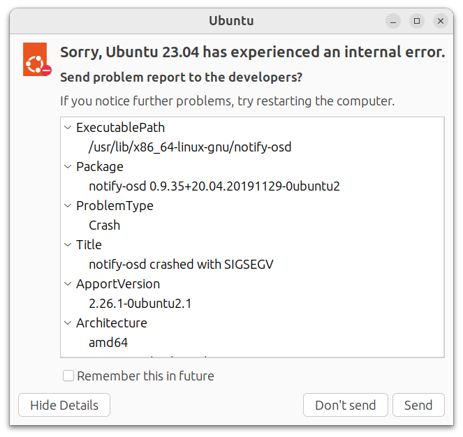
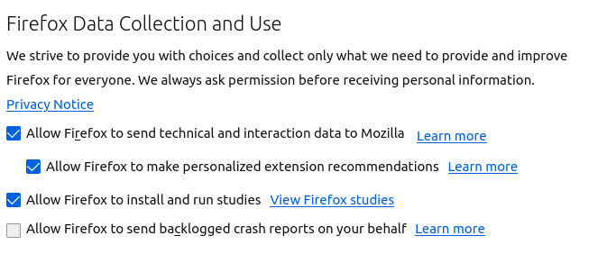

<div class="chapter">Chapter 19</div>

# Testing and Experimenting in Production

Testing in production is popular, and most systems with machine-learning components are tested in production at some point. Testing in production, also known as *online testing*, allows a holistic evaluation of the system in real-world conditions, rather than relying on artificial *offline* evaluations in controlled test environments. Increasingly, developers just try ideas directly in production *multiple times a day* to see what works. This way they can iterate quickly with real feedback. Whereas testers in offline evaluations need to think about possible test inputs and corner cases and work hard to create realistic test environments, deployments in production by definition receive real, representative data and interact with the real environment. Testing in production can avoid the common pitfalls of offline model evaluations, such as test data not being representative of production data. However, testing in production also raises new challenges, since quality problems may be directly exposed to users, potentially causing real harm. It also usually requires nontrivial infrastructure investments and careful design of telemetry. 

For most developers building software systems with machine-learning components, testing and experimenting in production will be an important building block. In this chapter, we discuss the opportunities, risks, and infrastructure of testing and experimenting in production.

## A Brief History of Testing in Production

Testing in production is not a new idea and has been used in systems without machine-learning components for a long time. Offline testing in a dedicated test environment, such as writing unit tests, running software in a simulated environment, or having manual testers click through a user interface in a lab, is important, but will not discover all problems—testing can only show the presence of bugs, not their absence, as stated in the famous [Dijkstra quote](https://en.wikiquote.org/wiki/Edsger_W._Dijkstra). We can never test all the inputs that a user might try in production or all the environment conditions that the real system might be facing.

**Alpha testing and beta testing.**
 Alpha tests and beta tests were traditional ways of getting users to test a product before its release—either at very early stages (alpha testing) and at a near-release stage (beta testing). Users participating in alpha and beta testing are usually aware that they are using a pre-release version of the software and should expect some problems. In pre-internet days, companies would recruit hundreds or thousands of volunteers who would use early versions of the product and hopefully report bugs and answer surveys. For example, fifty thousand beta testers helped with Windows 95, many of whom paid $20 for the privilege. Today, feedback is often collected through telemetry and online forms. For example, many start-ups provide only limited access to products still in development; for example, OpenAI initially had waitlists for DALL·E and ChatGPT. Limited early releases and waitlists can also function as a marketing tool, giving access to journalists and influencers while still working out problems and scaling the system.

<figure>


<figcaption>

Windows 95 was one of the first beta tests conducted at truly large scale. <span title="Online-only figure; not part of the printed book.">[Online-only figure.]</span>

</figcaption>
</figure>

**Crash reports and client-side telemetry.**
 With internet connectivity, companies started to replace phone calls and physical mail to gather feedback and learn about bugs with *telemetry* in the software that would automatically upload information about the software's behavior to a server. 

The first big telemetry step was sending *crash reports* whenever the software crashed. A management component would detect the crash and collect additional information, such as stack traces and configuration options, and upload them to a server of the developing company. Developers could then use crash reports to gain insights into bugs that occur in production. Soon, companies like Microsoft started to receive so many crash reports that they started to invest in research to automatically deduplicate and triage them.

<figure>



<figcaption>

Many operating systems offer to send crash telemetry on application crashes. <span title="Online-only figure; not part of the printed book.">[Online-only figure.]</span>

</figcaption>
</figure>

Soon, many software systems started collecting and uploading telemetry not only about crashes but about all kinds of *usage behavior*: for example, what features users use, how much time they spend on certain screens, and possibly even personal data like their location. To developers and product managers, such information about user behavior is valuable, as it can provide insights on how the software is used, what features users like, and how the product can be improved. A whole market developed for tools to instrument software with telemetry and to analyze telemetry data. For desktop applications, most companies allow users to opt out of sending telemetry.

<figure>



<figcaption>

Many desktop applications provide consent or opt-out mechanisms for sharing data about user behavior with developers. <span title="Online-only figure; not part of the printed book.">[Online-only figure.]</span>

</figcaption>
</figure>

**Server logs.**
 As software products move to web applications, lots of usage data can be collected directly on the server side. Server logs can provide insights into what users are doing, without sending data from a client. Data collection is usually covered only in the privacy policy without requesting consent or providing opt-out opportunities.

In addition, many monitoring solutions emerged that allow operators to observe systems in production. Originally, monitoring solutions focused on observing CPU and memory use or the load produced by individual services, but increasingly monitoring captured system-specific information extracted from log files or telemetry data, such as the number of concurrent users or the number of new posts on a social-media site.

**Experiments in production.**
 Once developers found ways to observe user behavior, both in desktop apps and in web applications, they started experimenting on their users. Typically developers implement small changes in the software and show that changed variant to a small subset of users, to then observe how their behavior changes. Classic *A/B experiments* of this kind might experiment with different designs of the shopping-cart button in a web store to observe whether users seeing the new design buy more products on average. The same kind of experimental setup can also be used to observe, in production, whether users with the updated version of the software experience slower response times or more frequent crashes than those still using the old version. *Canary releases* are now popular for rolling out new releases incrementally, detecting problems in production before they reach many users. Companies with many users often run hundreds of experiments in parallel and can detect even small effects of design and implementation changes on users’ chances to click on things or buy things.

**Chaos engineering.**
 A final, maybe most daring, step of testing in production is chaos engineering. Chaos engineering is primarily a form of testing robustness of distributed systems, popularized by Netflix for testing their infrastructure built on Amazon’s cloud infrastructure. To see how the whole system reacts to specific outages, Netflix’s automated tool deliberately takes down servers and observes through telemetry whether overall system stability or user experience was affected—for example, it may measure how many users’ Netflix stream was interrupted after deliberately taking down a server. While it initially may seem crazy to deliberately inject faults in a production system, this strategy instills a culture for developer teams to anticipate faults and write more robust software (e.g., error recovery, failover mechanisms) and it allows robustness testing of distributed systems at a scale and realism that is difficult to mirror in a test environment. 

## Scenario: Meeting Minutes for Video Calls


Throughout this chapter, we consider a feature that is currently experimentally integrated into many video conferencing systems as a running example: automatically writing meeting minutes. Building on existing transcription functionality that recognizes what was spoken during a meeting, a generative large-language model is used to identify topics of discussion and agreed decisions and action items from the conversation. 

We assume that the video conferencing company developing this feature already has a video conferencing product with many customers, though it is not the market leader. The company sees meeting minutes as an important feature, because competitors are all announcing similar features. To achieve parity with competitors, it may be sufficient to merely summarize what was said in the meeting for now, but the team has many more plans to make this feature more powerful for business users. For example, (1) if the meeting has an agenda, the model can identify and mark which part of the meeting corresponds to which agenda item and summarize them separately; (2) beyond just a summary, the model can identify points of contention and who spoke for and against them with which arguments; and (3) the model can record agreements achieved, identify and schedule follow up meetings, and add planned action items mentioned to a ticketing system with the right responsibility. Some of the identified information might already be shown live during the meeting rather than just sent by email as a summary after the meeting.

## Measuring System Success in Production

For most software systems, we have a notion of how to evaluate the success of the system as a whole once deployed. As discussed in chapter *[Setting and Measuring Goals](05-setting-and-measuring-goals.md)*, many *organizational goals* are measured in monetary terms: how many licenses or subscriptions we sold of the video conferencing system, how much commission we earn for products our system recommends, or how much we earn from advertisement on our site. Corresponding *leading indicators* may look at trends in these numbers. We can also use more indirect success measures that relate more to how users interact with the software, such as the number of active users and the number of video conferences, the number of returning users, the amount of time spent or “engagement,” or the number of positive reviews received in user satisfaction surveys. Many of these measures would be described as *key performance indicators* in management terminology. None of these success measures can be evaluated well in offline evaluations; at most, we can approximate user satisfaction in user studies.

For many of these measures, it is fairly straightforward to collect telemetry data in a running system, by collecting data on sales and advertising transactions, by analyzing databases or log files of system use, and by analyzing reviews or running user surveys. If needed, it is usually straightforward to add additional instrumentation to the system to produce logs of user activity for later analysis, such as collecting what links users click. 

It is generally much easier to measure the success of the system as a whole than to attribute the success or lack thereof to specific components of the system. For example, none of these measures of system success ask whether meeting summaries were useful, only whether users are satisfied with the system overall. However, we can also deliberately design online success measures related to individual components, such as, how many users enable meeting summaries, how many users actually look at meeting summaries after first trying the feature, how many users mention meeting summaries in their reviews, or how users like meeting summaries in a user satisfaction survey.

System-level or feature-level success measures can be difficult to interpret in isolation, and some may have high latency, making it difficult to track the effects of individual changes. For example, improving meeting summaries may only slowly translate into new subscriptions over days, weeks, or months. However, more granular measures of user behavior can respond within minutes or seconds. For example, smaller model updates or user-interface changes in the system might very quickly result in noticeable changes in how much time users spend looking at meeting summaries; if we change the font size of advertisements, we may see quickly whether users, on average, click on more ads. With enough users, even small changes in success measures may be noticeable.

## Measuring Model Quality in Production

Beyond assessing the success of the entire system, we can also try to measure the quality of individual components in production. Especially for machine-learned models, it is common to try to evaluate model accuracy in production, independent of system success.

For machine learning, testing in production has one big advantage: *production data is the ultimate unseen and representative test data.* When it comes to live interactions with users, production data is by definition representative of real production use and it is not yet available at training time, hence we avoid the various pitfalls of traditional offline accuracy evaluations discussed in chapter *[Model Quality](15-model-quality.md)*, such as data leakage, label leakage, and bad splits of data with dependencies. When data drift occurs, production data will always reflect the most recent relevant distribution. If we can evaluate model accuracy in production, we can get an accurate picture of whether our model generalizes—at least how well it did in production so far.

To evaluate the accuracy of a model in production, the key question is how we know whether a prediction made in production was correct or what the right prediction would have been. Determining model accuracy in production is usually much more difficult than measuring overall system success. Correctness of individual predictions may be determined or, more often, approximated with additional telemetry data, but how to do so depends on the specific system and often requires substantial creativity. The following patterns are common:

  * **Wait and see:** In situations where we predict the future, such as predicting the weather, predicting the winner of a game, and predicting ticket prices for a flight, we can simply wait and record the right answer later. We then can simply compare the prediction against the actual answer to compute the prediction accuracy of past predictions. The obvious problem with the wait-and-see strategy is that our accuracy results will not be available until later, but that may be okay for many purposes, especially when predicting the near future. We also need to be careful if the prediction might influence the outcome — it is unlikely that a model’s weather prediction will influence the weather, but predicting rising ticket prices may lead more people to buy tickets thus raising the prices even more. 

  * **Crowd-source labels:** If we can label training data in the first place, often with crowd workers or experts, we can usually also label production data in the same way. For example, we can ask the same team that labeled action items in meeting transcripts for training to also label action items in production data. Labeling a random sample of production data is usually sufficient to compute reasonably confident accuracy scores for the model. This approach works for all contexts, where we can label training data in the first place, but it can be expensive to continuously label samples of production data over extended periods and it can raise privacy concerns.

  * **Prompt users:** If users can judge the correctness of a prediction, we can simply ask them whether our prediction was correct. For example, we may simply ask users of our video conference system whether the summaries are comprehensive and useful, or whether the identified action items are correct and complete. In practice, we probably do not want to prompt users to check every prediction, but if the system is used enough, even just asking for one of ten thousand predictions might provide sufficient feedback to compute useful accuracy scores. Instead of asking about the correctness of individual predictions, we can also ask about user satisfaction with predictions in general, such as prompting users with a survey about whether they usually find meeting summaries to be accurate.

  * **Allow users to complain:** Instead of prompting users about the quality or correctness of a prediction, we might provide a lightweight path for them to complain. For example, they might press a button that the meeting summary was “inaccurate,” “too long,” or “not useful.” Allowing users to complain provides a less intrusive user experience, but it also means that we will not learn about every single problem and will never get positive feedback. Realistically, we can only observe the rate of reported problems, but that may be sufficient to track relative model quality over time or to compare two models.

  * **Record corrections:** In many settings, users might be willing to correct wrong predictions. For example, users might remove irrelevant parts from the meeting summary or add missing action items before sharing the meeting summary with participants. Based on corrections, we can identify where the model made mistakes and can even identify the expected answer. However, similar to complaints, this method will not identify all problems as we cannot simply interpret unmodified outputs as correct. In addition, a user’s change may be independent of the predictions’ correctness, for example, when a user adds additional notes to the meeting minutes about things that we discussed privately just after the meeting concluded. Nonetheless, observing corrections can provide a scalable, albeit noisy, indicator of model problems.

  * **Observe user reactions:** Beyond corrections, there are many ways to learn about the quality of your predictions simply from observing how users react to them. For example, if a user stops sharing meeting minutes after meetings and instead writes minutes manually, they may not be satisfied with the quality; if a user successively states two very similar action items during a meeting, this might indicate that they were not happy with the way the system recognized the action item the first time (if shown live on-screen); or in a different context, if a user fully watches a recommended movie, it was likely a better recommendation than if they watched only the first few minutes. There are lots of possibilities to infer something about the quality of the predictions from how users react to them, but what data to collect depends a lot on how users interact with the system.

  * **Shadow execution:** Finally, if the system replaces a human, but the system has not yet been deployed, we can still observe how the human actually performs the task and compare it to the model’s prediction. This is known as *shadow execution,* where the model makes predictions on production data, but those predictions are not actually used. Shadow execution is common for evaluating autonomous driving systems, where the autonomous system receives sensor inputs from the real vehicle, but the human operator still is in control, so we can compare how the system’s proposed actions align with those of the human operator. In our meeting minutes example, before rolling out an extension of our meeting minutes feature to recognize and schedule follow-up meetings, we could observe whether the client manually enters calendar events for follow-up meetings at the time our model would have predicted.


Different telemetry strategies will work in different application scenarios, and there is no universal fit. Beyond our running example, here are some more examples to illustrate the wide range of possible designs:

  * *Predicting the value of a home for a real-estate marketplace:* A wait-and-see strategy provides accurate labels, but often with long delays. Asking experts to judge the value of a sample of the homes might be possible but would be very expensive.

  * *Profanity filter on a blog platform:* Users are likely to complain both about wrongly filtered messages and messages that should have been filtered.

  * *Cancer prognosis in medical imaging:* With integration into a medical records system, a wait-and-see strategy provides delayed labels. If additional tests are ordered after a prognosis, the delay can be fairly short. Observing how often a radiologist overrules the system provides some notion of accuracy (or trust).

  * *Automated playlist on music streaming site:* Observing user interactions with the playlist can indicate whether users play or skip suggested songs or mark them as favorites.

  * *Friend tagging in photos on social media site:* Users might be willing to correct predictions when given a suitable user interface. Gamification can help to entice corrections. If the system is integrated with notifications, we might observe the reactions of tagged users, and incorrectly tagged users may complain.

  * *Emergency breaking in an autonomous train:* Shadow execution can be used whether the software suggests breaking when a human operator did. If an operator monitors the deployed system, their intervening can be considered as a correction. If actually deployed autonomously, experts can review all cases of emergency breaking and a lack of emergency braking would be noticed in crash statistics.


Generally, telemetry should be deliberately designed. The different approaches to collecting telemetry provide different insights and different levels of confidence in model quality. For a single model, we may be able to think of several different ways to collect telemetry to learn about the model’s accuracy in production. There are many trade-offs between different approaches to telemetry with regard to at least (1) accuracy, (2) reliability, (3) cost, and (4) latency. Some telemetry approaches can provide reliable insights into the correctness of individual predictions, sometimes for all predictions and sometimes for a sample. However, often we only have observations that we expect to correlate with prediction accuracy, such as whether users correct the meeting minutes or share them with others. For some designs, we only get signals about a subset of problems, but have no signal about whether the remaining predictions are correct. In some contexts, we can collect telemetry nearly for free as a byproduct of running the software, but in others we may need to invest heavily in additional data acquisition or manual labeling. In some cases, we get insights from telemetry quickly, whereas in others we need to wait for days or weeks to evaluate whether a prediction was correct or whether a user acted on it.

Due to all those difficulties and proxy measures, model-quality measures in production are often not directly comparable with quality measures on labeled test data. For example, instead of a classic prediction-accuray measure, we might only measure the rate of corrections. Still, those proxy measures are usually useful enough for comparing multiple models in the same production environment and to observe trends over time. 

<figure>


<figcaption>

An example of monitoring a model quality score across five subpopulations, plotting an internal measure for how often generated transcriptions are modified. While the absolute number may not be interpretable in itself, we can see that performance for all subpopulations is fairly consistent except for one sudden outlier for one population. An abrupt change like this indicates a drastic improvement after an update or a sudden problem, for example, due to undetected schema drift.

</figcaption>
</figure>

In practice, developers often track multiple different quality measures that each provides only a partial picture of a model’s quality, and each measure has noise and uncertainty. However, observing trends across multiple measures usually provides a good picture overall. 

**Model evaluation vs. model training with production data.**
 As with all other model evaluation strategies discussed in chapter *[Model Quality](15-model-quality.md)*, there is a duality in that telemetry data can be used not only to evaluate and debug a model but also as additional training data to improve the model. If we can reliably collect labels for production data, even just for samples or for wrong predictions, this labeled production data can be used for the next iteration of model training. Even if labels are approximate or incomplete, production data can often improve model training. Approaches like *weak supervision*, as popularized by [Snorkel](https://snorkel.ai/), are common to learn from large amounts of production data with partial or low-quality labels (see also chapter *[Automating the Pipeline](11-automating-the-pipeline.md)*).

From a business perspective, learning from production data is also the foundation for the *machine-learning flywheel* effect mentioned in the introduction: If we build better products, we get more users; if we get more users, we can collect more production data; if we have more production data, we can build better models; with better models, our products get better, and the cycle repeats.

## Designing and Implementing Quality Measures with Telemetry

Telemetry opportunities differ substantially between systems. While there are many common considerations and lots of reusable infrastructure, developers usually need to design custom telemetry and measures for each system, navigating various trade-offs.

### Defining Quality Measures 

To measure system success or model quality in production, we need to define how we measure success or quality in terms of the collected telemetry. We follow the three-step approach for defining a measure introduced in chapter *[Setting and Measuring Goals](05-setting-and-measuring-goals.md)*:

  * *Measure:* First, we need a description of the quality of interest. For evaluating models in production, we are usually interested in some measure of model accuracy, such as prediction accuracy, recall, and mean square error, or in some proxy of model accuracy, such as the relative number of predictions corrected by users within one hour or the relative number of predictions where users retry on a similar input. 

  * *Data collection:* Second, we need to identify what data we collect in production. This is a description of the telemetry data we collect, such as collecting corrections from activity logs, collecting user feedback from prompts with five-star ratings, collecting the number of complaints, or collecting what follow-up meetings are added to a calendar. This should also include a description of how data is collected and whether it is sampled, anonymized, or aggregated in some form.

  * *Operationalization:* Finally, we need a description of how we compute the measure from the collected data. As usual, operationalization is sometimes straightforward, for example, counting the number of active subscriptions or the number of complaints. However, operationalization can be highly nontrivial, for example, operationalizing a correction rate for meeting minutes to indicate model quality requires distinguishing changes that indicate poor meeting summaries from users simply adding more information not discussed in the meeting.


Especially for quality measures that are only a proxy for model quality, clearly describing the measure and its operationalization with telemetry is crucial to interpreting the measure and its confidence correctly.

### Implementing Telemetry and Analyses

Telemetry data is inherently continuous, and analyses will usually be time-series analyses that monitor trends in quality measures over time. Practical implementation of telemetry and quality measures relies usually on the *observability infrastructure* introduced in chapter *[Planning for Operations](13-planning-for-operations.md)*. 

Telemetry is typically explicitly produced with extra code in the running system. That is, developers introduce extra instructions in the right places of the software to create telemetry data to support some analysis of interest. These extra instructions typically either *log* events with standard logging libraries or invoke APIs from observability libraries to record numbers. Developers can also proactively create telemetry data without planning ahead for specific forms of analysis and may create a large number of log events for all kinds of potential debugging and analysis tasks.

For logging, any simple *print* statement in a program can write information to the standard output that may then be collected and analyzed. More commonly, logging libraries, such as [loguru](https://pypi.org/project/loguru/) and [log4j](https://logging.apache.org/log4j/2.x/), are used for more structured outputs (e.g., with timestamps and severity level) and for more easily collecting logging information into files. If the software runs on the client’s device, logs may be collected locally and then sent to a server for analysis. In our example, the server could log every time a large-language-model prompt is invoked to summarize a meeting or identify action items, with pointers to the source transcript; the web editor displaying the meeting summary could record (and send to a server) every time somebody makes a change to a summary, identifying which summary was edited and what change was made. Infrastructure for collecting and aggregating logs for analysis is broadly available, such as [LogStash](https://www.elastic.co/logstash/). 

Observability libraries, like [Prometheus](https://prometheus.io), provide APIs to record basic events that can be reported as *counters* or *distributions*, such as the number of changes in the meeting summary editor per user or the inference latency of a model. Developers define what data to track and typically call APIs to increase a counter or report a number. The library will collect and sometimes compress this data and typically aggregate and track data over time in a time-series database for further analysis. 

Operationalization to turn raw observations into measures is usually done with the analysis component of observability infrastructure and is often expressed as declarative queries. All collected telemetry is continuous, and analyses are usually performed in windows over time, such as counting the number of changes logged by the system in the previous thirty minutes or reporting the average inference latency in the previous five minutes. These kinds of sliding-window analyses are usually well supported by observability infrastructure for logs and time-series databases of observations. For example, the Prometheus query “*rate(model_inf_latency_sum[1m])/rate(model_inf_latency_count[1m])”* reports the average latency of model inference over a one-minute window at any point in time where observations were recorded with the Prometheus’ summary API. The analysis results can then be plotted in a dashboard like [Grafana](https://grafana.com) and alerts can be configured if values exceed predefined thresholds. 

<figure>

```python
from flask import Flask, request, jsonify
from loguru import logger
from prometheus_client import Histogram, Counter, start_http_server
from prometheus_flask_exporter import PrometheusMetrics

app = Flask(__name__)
# Initialize Prometheus metrics for Flask
metrics = PrometheusMetrics(app)
# Define custom Prometheus metrics
transcript_counter = Counter('transcript_inference_count', '...')
audio_length_hist = Histogram('transcript_audio_length', '...')
# Configure Loguru logger
logger.add("transcript_inference.log", rotation="500 MB")

@app.route('/transcribe', methods=['POST'])
def transcribe():
   audio_url = request.json.get('url')
   audio_file = download_audio(audio_url)
   if not audio_file:
       logger.error(f"Audio file {audio_url} download failed.")
       return jsonify({'error': 'Failed to download audio file'}), 400

   # record inference count and audio length for monitoring
   transcript_counter.inc() 
   audio_length_hist.observe(get_length(audio_file)) 
   transcript = model_transcribe(audio_file)
   return jsonify({'transcript': transcript})
```

<figcaption>

An example of recording telemetry with Prometheus and loguru in a model inference service. The prometheus_flask_exporter library automatically records counts and latency of all requests. In addition, errors are logged, the number of inferences is counted, and the distribution of the length of transcribed audio files is recorded for a dashboard.

</figcaption>
</figure>

**Scaling telemetry.**
 The amount of telemetry produced in production can be massive and can stress network, storage, and analysis infrastructure. While plenty of big-data infrastructure exists to store and analyze large amounts of data, it is worth planning carefully what amount of telemetry should be collected and for how long it should be stored. Especially when handling transient input data, such as raw video footage from video conferences, we might not want to store all raw inputs from all users. To reduce the amount of telemetry data, we can either sample and collect only a subset of the data or extract data and store only the extracted features. We might develop quite sophisticated (adaptive) sampling strategies when the target events are rare or unevenly distributed across subpopulations, for example, if we monitor problems that seem to only occur for speakers with certain dialects talking about medical research. Depending on cost and estimated benefits, we might store telemetry data in a *data lake* in case we want to revisit old production data in the future (see chapter *[Scaling the System](12-scaling-the-system.md)*), or we may simply discard old data past a two-month observation window used in monitoring.

**Privacy.**
 Telemetry data can include other sensitive information. For example, if we collect change events for edits to meeting summaries in a log file, that log file will contain excerpts of user data. Even if we could collect high-quality telemetry and even new training data from observing changes to the meeting summaries, we might decide not to collect that data over privacy concerns. Often, users are not aware of what data is collected about their behavior and whether they can opt out. For example, Amazon’s privacy policy retains the right to collect and store voice recordings from its Alexa devices, but Amazon has repeatedly gotten [bad press](https://www.techradar.com/news/amazon-alexa-stores-voice-recordings-for-as-long-as-it-likes-and-shares-them-too) about it; Zoom has retracted changes to their privacy policies allowing them to train models on customer data after a [public backlash](https://www.fastcompany.com/90934584/zoom-ai-training-terms-of-service-consent). Designers should carefully consider the privacy implications of telemetry and consult with privacy experts about relevant laws and regulations.

To ensure privacy, some organizations focus on federated learning where ML models and data never leave the user’s devices. The most common example is smart keyboards for mobile devices. This naturally limits the kind and amount of telemetry we can collect and the kind of measures we can operationalize. In many cases, it may still be possible to do some analysis and aggregation of telemetry data on user devices and send only anonymized aggregates to the server, but this can be tricky to get right.

### Architecture and User-Interface Design for Telemetry

The deployment architecture of a system and its user-interaction design can drive substantially what telemetry can be collected.

In a server-based system, data is already on the company's server, whereas desktop applications, mobile apps, or IoT devices perform operations locally, possibly including model inference, and may not want to (or can) upload all raw data as telemetry. For example, we would be unlikely to upload all raw video footage of a smart dashcam system that detects dangerous driving to a telemetry server for analysis, but the video conferencing system needs to transmit video from all participants anyway. Some systems with client-side deployment may still send some telemetry in real time to a central server for analysis. When the system is deployed in contexts where the internet is slow, expensive, or occasionally unavailable, for example, mobile apps while on an airplane, we may consider more sophisticated designs where telemetry is collected locally, possibly compressed or analyzed, and only occasionally uploaded. Such designs need to navigate various trade-offs, including the amount of data, computational effort, and latency of telemetry—for example, what delay is acceptable for telemetry to be still useful. 

Also user-interaction design can substantially influence what telemetry can be collected and how reliable it may be for some quality measures of interest. Simply prompting users for feedback may be intrusive, whereas gathering data about user behaviors such as edits or clicking links, might provide possibly less accurate but overall more broadly available feedback on how users react to model predictions. Many user-interface design decisions in a software system can deliberately influence how users interact with the system and what telemetry can be collected. For example, if our video conference system would simply send summaries by email to the host, we would not have many opportunities to collect telemetry short of attaching a survey and a link to complain—but if we present the summary in an easy-to-use web editor that links summary fragments to meeting recording snippets and makes it easy to proofread and correct summaries, users are much more likely to interact with the summary in a way that could provide meaningful telemetry about corrections. Similarly, users of a social media site might be more likely to correct detected friends in photos if corrections are easy in the user interface and if the friend tagging is integrated with notifications or statistics or if there is a gamification component (e.g., points for most corrections or least unknown faces in photos). All these user-interaction design mechanisms can encourage users to perform actions that can be interpreted directly or indirectly as signs for model quality.

## Experimenting in Production

A solid telemetry system for monitoring system and model quality in real time provides also the foundation for experimenting in production. Rather than just observing the system over time, we can intentionally introduce changes in the system to observe how users react to those changes.

Experimentation in production can be very powerful and identify surprising and counterintuitive designs that developers may not have anticipated. For example, Kohavi and colleagues at Microsoft describe how presenting ads on Bing differently by including more text in the link increased ad revenue by 12 percent or 100 million US dollars per year, without affecting other measures of user engagement. Developers did not anticipate the strong effect and, in fact, did not implement the change for several months after it was initially suggested. This was one of thousands of experiments done that year, of which only a few showed strong results. Hence, rather than relying on developers’ intuition to accurately predict what influences user behavior, experimenting in production can explore choices at scale. In our meeting minutes scenario, it may be far from obvious what large-language-model prompts or sequence of prompts work well for summarizing meetings, and trying different ideas with diverse use cases in production may allow many more experiments than could be conducted by manually analyzing a few examples in offline evaluations.

### A/B Experiments

Classic human-subject experiments in psychology or medicine divide participants into two groups, giving one group the treatment and using the other group as a control group, to then compare whether there are differences in outcomes between the groups. Running traditional experiments in psychology or medicine is challenging, because it is usually difficult and expensive to recruit enough participants and it is important but nontrivial to ensure that the two groups are comparable—so that we do not have more healthy participants in one group of a medical trial.

Cloud-based and internet-connected services with many users provide *perfect conditions to run controlled experiments*. We can divide users already using our product into two groups and show them different versions of the product. Since we are experimenting on existing users, we do not have additional recruitment costs and we may have thousands or millions of participants. The ethics of experimenting on users is debated, because companies usually do not seek consent, at most inform users with vague privacy policies, and rarely provide opt-out options. There is no government oversight comparable to research ethics in academia. Regardless, such experimentation is a very common practice.

With a large number of participants randomly assigned to groups, experiments in production can be very powerful: with large groups, we have to worry little about the chances of unbalanced groups and can detect even small effects in random noise. With enough users, it becomes feasible to run *hundreds of experiments at the same time*, as many big-tech companies do these days. We can constantly experiment, validate new features rapidly in production, and make many design decisions with insights from experiments. This is another example of the *flywheel effect:* The more users, the easier it is to experiment in production, and more experiments help improve the product, which attracts more users.

Controlled experiments in production are usually called *A/B experiments*.  We simply assign some percentage of your users to a treatment group and serve them a different variant of the product, typically differing only in a small change, such as trying a different prompt for generating meeting minutes or presenting our meeting minutes with a different layout.

To implement A/B experiments, we need three ingredients: (1) two or more alternative implementation variants to be tested, (2) a mechanism to map users to those variants, and (3) a mechanism to collect telemetry separately for each variant:

  * **Implementing variants.** To serve two alternative variants, we can either deploy two separate variants and decide which users to route to which variant at the network level with a load balancer, or we can encode the differences as a simple control-flow decision within a single application — a practice called *feature flags.* Feature flags are simply boolean options that are used to decide between two control flow paths in the implementation. Multiple feature flags can control differences in the same system. Ideally, feature flags are tracked explicitly, documented, and removed once the experiment is done.


<figure>

```js
if (features.enabled(userId, "new_model_experiment5")) {
  // new feature extraction
  // predict with new model and new features
} else {
  // old feature extraction
  // predict with old model
}
```

<figcaption>

An example of a feature flag used to decide between two models. Feature flags are usually enabled for specific users.

</figcaption>
</figure>

  * **Mapping users to variants.** Next, we need to decide which users will see which variant. Random assignment of users to variants is usually a good choice to avoid bias in how groups are formed, for example, where one group contains all the most active users. It is also usually a good idea to assign users to groups in a stable fashion, so that they do not see different variants whenever they reload the web page. Simple functions are usually sufficient, like “function isEnabled(userId) { return (hash(userId) % 100) < 10 },” which selects 10 percent of all users in a stable fashion. It is also possible to stratify the sample by randomly selecting from different subgroups, such as selecting fifty percent of beta-users, ninety percent of developers (dogfooding), and 0.1 percent of all normal users. Even when users cannot easily be tracked with accounts, it is worth trying to identify repeat users to keep them in the same group for repeated interactions, for example, based on their IP address.

  * **Telemetry.** Finally, it is important that telemetry and derived measures for system or model quality can be mapped to experimental conditions. That is, we need to know which actions were associated with users in each experimental condition. For example, we want to know which corrections of meeting minutes were performed by users receiving summaries from an updated model. If telemetry is linked to user accounts, we can map telemetry based on the user-variant mapping; alternatively we can include the experimental condition in the logged event. With this mapping, it is then usually straightforward to compute and report quality measures for each group.


**Statistics of A/B experiments.**
 It seems tempting just to compare the quality measures for both groups, say the average rate of corrections to meeting minutes. However, since observations are noisy it is worth analyzing experimental results with the proper statistics. For example, we might see that 15 percent of 2,158 users in the control group with the old summary model correct the meeting minutes but only 10 percent of the twenty users in the treatment group do—but given the small sample size, we should have little confidence in the 33 percent improvement, which may just be due to random noise. 

Statistics can help us quantify what confidence we should have that observed differences are real. In a nutshell, the more samples we have in each group and the larger the difference between the group averages, the easier it is to be confident that an observed difference is not due to random noise. With large enough groups, even small differences can be detected reliably and confidently. Medicine and psychology researchers usually run experiments with dozens or maybe a few hundred participants if they are lucky—in contrast, many systems have enough users that even just assigning 0.5 percent of all users to a treatment group, yields a group with tens of thousands of participants that allows to distinguish even tiny improvements from noise.

In practice, the *t-test* is a common statistical test to check whether two samples are likely from the same distribution, that is, whether we observe an actual difference between the treatment and control group rather than just random noise. The t-test technically has a number of assumptions about the data, but is robust if the samples are large, which they are almost always when performing A/B testing. Loosely interpreted, a statistical test like the t-test can quantify a notion of confidence that the differences are not just due to chance. It is common to show results of A/B experiments in dashboards including measures of effect size and  confidence.

<figure>


<figcaption>

Example of a dashboard showing the result of an A/B experiment from [https://conversionsciences.com/ab-testing-statistics/](https://conversionsciences.com/ab-testing-statistics/) <span title="Online-only figure; not part of the printed book.">[Online-only figure.]</span>

</figcaption>
</figure>

When multiple experiments are performed at the same time, more sophisticated designs might be needed. We can either assign each user at most to one experimental condition or allow overlapping experiments; for the latter, more sophisticated statistical techniques that can detect interaction effects are needed and assignment may be performed deliberately with multi-factorial designs. Plenty of literature and tooling exists to support sophisticated experiments.

**Minimizing exposure.**
 Typically, we want to assign as few users to the treatment group as necessary, in case the experiment fails and we expose those users to lower qualities of service, or even risks. For example, if a variant of our meeting-minutes model starts creating lots of wrong follow-up meetings, we would rather not annoy too many users; if it summarizes decisions incorrectly, we could create actual harm for affected users. At the same time, we need a certain number of participants to gain confidence in the results, and the smaller the effect size we try to observe, the more participants we need. 

In addition, experiments usually need to run for several hours or days, to overcome cycling usage patterns throughout a day or week and to see results past novelty effects, where users simply engage with a feature because it is new or different—for example, when they first try to the meeting-minutes feature, they may be much more likely to correct generated summaries. Many practitioners suggest running an experiment for at least one week.

In theory, power statistics provide some means to compute needed sizes. In practice, most people running A/B tests will develop some intuition, usually use a somewhat smallish percent of their user base (say 0.5 to 10 percent) for the treatment group, and run experiments for a while until they see statistically significant results. Big-tech companies with millions of active users can run hundreds of experiments in parallel, each with thousands of users, without ever exposing more than one percent of their users to a given treatment.

**Infrastructure.**
 It is fairly straightforward to set up a custom A/B experiment from scratch by introducing a few feature flags, a hard-coded user-variant mapping, adjusting telemetry, and maybe adding a t-test. However, it is often a good idea to invest in some infrastructure to make experimentation easy and flexible to encourage data scientists and software engineers to experiment frequently and make evidence-based decisions and improvements based on experiment results. This is described as *continuous experimentation* by tool vendors, as an analogy to *continuous integration* and *continuous deployment* in DevOps.

Many companies offer ready-to-use infrastructure to make experimentation easy. At their core, many of these services manage feature flags and provide a dashboard to show experimental results. They typically integrate functionality to automatically schedule experiments, to automatically end experiments when results can be reported with confidence or problems are detected, and to dynamically adjust experiment parameters, such as increasing the number of users included in the treatment group. Many open-source projects provide foundations for individual parts, but such infrastructure is also commercially available as a service, for example, from [LaunchDarkly](https://launchdarkly.com/), [split.io](http://split.io), and [Flagsmith](https://www.flagsmith.com). Many big-tech companies have built their in-house experimentation infrastructure. The whole experimentation infrastructure is commonly associated with the labels *DevOps* and *MLOps*, introduced in chapter *[Planning for Operations](13-planning-for-operations.md)**.* It is also complementary with infrastructure for versioning and provenance, which we will discuss in chapter *[Versioning, Provenance, and Reproducibility](24-versioning-provenance-and-reproducibility.md)*.

### Canary Releases

<figure>


<figcaption>

The term canary release comes from the practice of bringing [canary birds into coal mines](https://www.forbes.com/sites/kionasmith/2019/12/31/the-canary-in-the-coal-mine-isnt-ancient-history), because the specially-bred birds were more sensitive to carbon monoxide and would die before the gas levels became lethal for the human miners. Canary releases try to detect release problems early. <span title="Online-only figure; not part of the printed book.">[Online-only figure.]</span>

</figcaption>
</figure>

Canary releases use the same infrastructure as A/B experiments but focus on deployment. Where A/B experiments analyze an experimental change to see whether it improves the product, canary releases are usually designed as a safety net for releasing intended changes. The idea is to treat *every* release like an experiment that is initially only rolled out to a small number of users (treatment group), to limit exposure in case the release performs poorly. If the new release performs worse than the previous release according to telemetry (with all the statistical tests of A/B experiments), it is rolled back so that all users return to the control group and receive the previous release. If the release performs similarly or better, it is further deployed to more users. Typically, a canary release starts with internal users, beta users, and a very few normal users (under 1 percent), and is then increasingly deployed to 5 percent and then 20 percent of all users before it is released to all. The entire process can be fully automated. This way, we will likely catch the worst problems very early and detect even smaller performance degradations as the software is deployed to more users but before all users are affected.

At a technical level, canary releases and A/B experiments usually share the same infrastructure. They equally encode variants (releases or experiments) with feature flags or load balancers, they equally map users to a treatment and a control group, and they equally track success and make decisions through telemetry. The main technical difference is that the user-variant mapping is dynamically adjusted over time depending on observed telemetry results—rolling the release out to more users or entirely rolling back the release. Open-source and commercial infrastructure providers usually support both use cases.

### Other Experiments in Production

A/B experiments and canary releases are the most common forms of experimentation in production, but they are far from the only ones.

*Shadow releases* run two variants in parallel, but show only the predictions of the previous system or model to the user. This way, users are not yet affected by the change, but we can observe whether the new variant is stable. When testing models with shadow execution, we can observe how often the new model agrees with the old model. If we can gain some ground truth labels for the production data, we can even compare the accuracy of the two variants. Shadow releases are traditionally used to test the stability, latency, and resource consumption of a system in production settings. It is also commonly used in testing autonomous driving systems against human drivers, where model quality problems could create severe safety problems.

*Blue/green deployment* is a name for experiments where both the old and the new variant of a system or model are deployed and a load-balancer or feature flag immediately switches *all* traffic to the new version. That is, in contrast to incremental deployments in canary releases, the new variant is released to everybody at the same time. Blue/green deployments avoid potential consistency challenges from running different variants in parallel and exposing different users to different variants, but they also expose all users to potential problems.

*Chaos engineering*, as mentioned earlier, was originally developed to test robustness in a distributed system against server outages, network latency problems, and other distributed system problems. The idea can naturally be extended to machine-learning components, especially when testing infrastructure robustness for questions such as “would we detect if we released a stale model” or “would system quality suffer if this model would be 10 percent less accurate or have 15 percent more latency?”

### Experimenting Responsibly

Experimenting in production can be extremely powerful once an active user base is available, but it can also expose users to risks from releasing poor-quality systems or models. Experiments can fail, releases can break functionality, and injected small faults of a chaos experiment can take the entire service down. A key principle is always to *minimize the blast radius,* that is, to plan experiments such that the consequences of bad outcomes are limited. Usually, it is prudent to test changes offline before exposing them to users and even then to restrict the size of the treatment group to the needed minimum. When it comes to conducting chaos experiments, designers usually think carefully about how to isolate effects to few users or subsystems.

For the same reason, it is important to be able to *quickly change deployments:* for example, abort a release or redirect all traffic of the treatment group back to the original variant. This relies on a well-designed and well-tested infrastructure for operations, based on DevOps principles and tools, such as automation, rigorous versioning, containerization, and load balancers.

As organizations scale experimentation, *automation* becomes essential to act quickly on insights. It is risky to rely on alerting on-call operators about poor performance, who then have to identify what shell scripts to run to roll back a release, possibly creating an even larger mess in the process by changing or deleting the wrong files. Automation can also make experimentation more efficient, as it can terminate experiments once confident results are collected and then immediately start the next experiment. Good infrastructure tooling will automate steps, take the friction out of the process, and improve turnaround time, which might encourage developers to experiment more and make more decisions based on empirical observations in the production system.

And finally, whenever experimenting in production, developers should always be aware that they are experimenting on users, real humans, with real consequences. Even with minimizing the blast radius and quick rollbacks, experiments can cause real harm to users. In addition, extensive A/B experimentation can lead to identifying a manipulative system design that optimizes a success measure, such as ad clicks, but does so by exploiting human weaknesses, exploiting human biases, and fostering addiction. For example, recommendation systems in social media that optimize for engagement are known to recommend content that causes outrage and polarization, and A/B experiments will support designs that cause addictive design decisions such as infinite scrolling. Responsible experiments should likely include a diverse set of outcome measures, including some user goals. Even if not legally required, ethics and safety reviews of experiments and following established research-ethics principles, such as respect for persons, beneficence, and justice from the *[Belmont Report](https://www.hhs.gov/ohrp/regulations-and-policy/belmont-report/index.html)*, can be a cornerstone for responsible experimentation.

## Summary

In summary, testing and experimenting in production can be very powerful. Production data is the ultimate unseen test data and does not suffer from many problems of traditional offline evaluations of machine-learning models. The key challenge is designing telemetry that can capture key qualities of the system or model, without being intrusive. Observability infrastructure helps to collect and analyze telemetry, show results in dashboards, and trigger alerts.

Beyond just observing a system, we can explicitly experiment in production. Especially, A/B experiments and canary releases are common to expose changes to a small number of users and observe whether variants of the system or its models lead to observable differences in success measures. Solid infrastructure and automation is highly beneficial for continuous experimentation. Many DevOps and MLOps tools can make it easy for developers and data scientists to run experiments in production.

## Further Readings

  * More on telemetry design, including engineering challenges like adaptive sampling: 🕮 Hulten, Geoff. *[Building Intelligent Systems: A Guide to Machine Learning Engineering](https://www.buildingintelligentsystems.com/)*. Apress, 2018, Chapter 15 (“Intelligent Telemetry”).

  * An in-depth book on A/B testing, that extensively covers experimental design and statistical analyses: 🕮 Kohavi, Ron, Diane Tang, and Ya Xu. *[Trustworthy Online Controlled Experiments: A Practical Guide to A/B Testing](https://bookshop.org/books/trustworthy-online-controlled-experiments-a-practical-guide-to-a-b-testing/9781108724265)*. Cambridge University Press, 2020.

  * A great introduction to canary releases: 🕮 Warner, Alec, and Štěpán Davidovič. “[Canarying Releases](https://landing.google.com/sre/workbook/chapters/canarying-releases/).” In [*The Site Reliability Workbook*](https://landing.google.com/sre/books/), O’Reilly 2018.

  * Much deeper discussion that motivates monitoring in data science projects: 📰 Cohen, Ori. “[Monitor! Stop Being A Blind Data-Scientist](https://towardsdatascience.com/monitor-stop-being-a-blind-data-scientist-ac915286075f).” [blog post], 2019.

  * Many examples and success stories of traditional A/B experiments: 📰 Pun, Heidi. “[Here Are 10 Fascinating A/B Testing Examples That Will Blow Your Mind](https://www.designforfounders.com/ab-testing-examples/).” Design for Founders Blog, 2016. 

  * Pitfalls of A/B testing: 📰 Ding, Emma. [“7 A/B Testing Questions and Answers in Data Science Interviews](https://towardsdatascience.com/7-a-b-testing-questions-and-answers-in-data-science-interviews-eee6428a8b63).” [blog post], 2021

  * A book covering monitoring and alerting in much more detail, though not specific to machine learning: 🕮 Ligus, Slawek. *[Effective Monitoring and Alerting](https://bookshop.org/books/effective-monitoring-and-alerting-for-web-operations/9781449333522)*. O'Reilly Media, Inc., 2012.

  * Papers discussing experience and infrastructure of A/B testing at Google and Facebook, focusing primarily on how to describe experiments and how to run many overlapping experiments: 🗎 Tang, Diane, et al. [“Overlapping Experiment Infrastructure: More, Better, Faster Experimentation](https://ai.google/research/pubs/pub36500.pdf).” In *Proceedings of the International Conference on Knowledge Discovery and Data Mining*. ACM, 2010. 🗎 Bakshy, Eytan, Dean Eckles, and Michael S. Bernstein. [“Designing and Deploying Online Field Experiments](https://arxiv.org/pdf/1409.3174).” In *Proceedings of the International Conference on World Wide Web*. ACM, 2014. 

  * A broader discussion on the practice of using feature flags within software systems and the engineering challenges of managing them: 🗎 Meinicke, Jens, Chu-Pan Wong, Bogdan Vasilescu, and Christian Kästner. [“Exploring Differences and Commonalities between Feature Flags and Configuration Options](https://www.cs.cmu.edu/~ckaestne/pdf/icseseip20.pdf).” In *Proceedings of the International Conference on Software Engineering — Software Engineering in Practice (ICSE-SEIP)*, pp. 233–242, 2020.

  * An experience reported from a company that extensively evaluates all machine learning through experiments in production: 🗎 Bernardi, Lucas, Themistoklis Mavridis, and Pablo Estevez. “[150 Successful Machine Learning Models: 6 Lessons Learned at Booking.com](https://dl.acm.org/doi/abs/10.1145/3292500.3330744).” In *Proceedings of the International Conference on Knowledge Discovery & Data Mining*, pp. 1743–1751. 2019.

  * Examples of discussions on the ethics for A/B testing: 📰 Constine, Josh. “[The Morality Of A/B Testing](https://techcrunch.com/2014/06/29/ethics-in-a-data-driven-world/).” [blog post], 2014. 📺 Jeff Orlowski. “[The Social Dilemma](https://en.wikipedia.org/wiki/The_Social_Dilemma).” Netflix Documentary, 2020.


---
*As all chapters, this text is released under <a href="https://creativecommons.org/licenses/by-nc-nd/4.0/">Creative Commons BY-NC-ND 4.0</a> license.*
*Last updated on 2024-06-17.*
