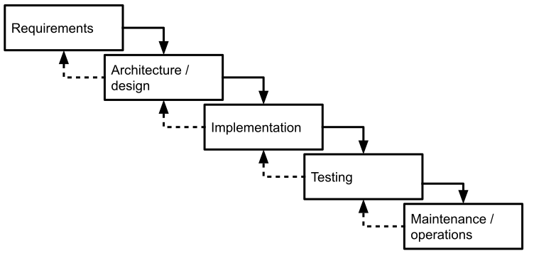

Chapter 20

# Data Science and Software Engineering Process Models

Software products with machine-learned components are usually built by interdisciplinary teams involving data scientists, software engineers, product managers, domain-matter experts, and many other roles. Projects building such projects must integrate both ML and non-ML components. However, the processes used by data scientists and software engineers differ significantly, potentially leading to conflicts in interdisciplinary teams if not understood and managed accordingly.

## Data-Science Process

The typical machine-learning project builds a model from data to make predictions for a specific task. In an educational setting, the prediction problem and data is often provided and the goal is to learn a model with high accuracy on held-out data, mostly focused on feature engineering and modeling. In a production setting, data scientists are often involved in many additional tasks of shaping the problem, cleaning data, more nuanced behavioral model evaluations, and possibly also shaping data collection or deploying and monitoring the model. To build a model, data scientists go through an iterative process with many steps, typically depicted as a *pipeline*, as illustrated among others in chapters *[From Models to Systems](02-from-models-to-systems.md)*, *[Automating the Pipeline](11-automating-the-pipeline.md)*, and *[Pipeline Quality](17-pipeline-quality.md)*. 

Although the pipeline view may initially look like a strictly sequential process, the actual model development process is usually highly iterative and exploratory: often, a data scientist starts with an initial understanding of the problem, tries an initial model with some features, evaluates that model, to then goes back to improve results by exploring alternative steps. Attempts to improve the model may involve collecting more or different data, cleaning data, engineering different features, training different kinds of models, trying different foundation models with different prompts, or trying different hyperparameters. Typically, the development process is exploratory in that a data scientist would try many different alternatives, discarding those that do not improve the model. This iterative and exploratory nature of data science is usually visible through backward arrows in pipeline visualizations.

Generally, model development uses a *science mindset*: start with a goal and iteratively explore whether a solution is possible and what it may look like. The iterative and exploratory nature of data science work mirrors that of many traditional scientists, say in physics or biology, where scientists study phenomena with experiments, analyze data, look for explanations, plan follow-up experiments, and so forth, until patterns and theories emerge. Exploration may follow intuition or heuristics, may simply try many alternatives in a brute-force fashion, or may follow a more structured and hypothesis-driven approach, but it is often difficult to plan up front how long it will take to create a model because it is unknown what solutions will work. It is not uncommon to revisit the very goal that the model is supposed to solve or fundamentally revisit data collection as more insights emerge about what is possible with the available data.

This iterative and exploratory process is likely familiar to every data scientist and has been confirmed also in various empirical studies on how data scientists work. If tracking progress on a model, we often see that data scientists develop low-accuracy models quickly and then incrementally improve the model over time. However, progress is rarely predictable, and data scientists often spend a lot of time on explorations that do not yield meaningful accuracy improvements. It is nearly impossible to determine up front how long model development will take and what model accuracy can be eventually achieved.

<figure>

<figcaption>

Experimental results from a study in which multiple participants developed a model for handwritten digit recognition, showing the accuracy of each participant's best model over the four-hour duration of the experiment. The experiment shows incremental improvements that are unpredictable and uneven, often with long stretches between improvements. It also indicates the substantial accuracy differences between the final models. Results from Patel, Kayur, James Fogarty, James A. Landay, and Beverly Harrison. “[Investigating Statistical Machine Learning as a Tool for Software Development](http://www.kayur.org/papers/chi2008.pdf).” In Proceedings of the Conference on Human Factors in Computing Systems (CHI), 2008.

</figcaption>
</figure>

Beyond the pipeline visualization, there are many more process models that attempt to capture the data science workflow, including the *[CRISP-DM](https://en.wikipedia.org/wiki/Cross-industry_standard_process_for_data_mining)* process model (a cross-industry standard process for data mining), and Microsoft’s *[Team Data Science Process](https://docs.microsoft.com/en-us/azure/machine-learning/team-data-science-process/overview)*. All of them share the iterative nature depicted through cycles and feedback loops and all emphasize that exploration and iteration is not limited to only the modeling part, but also to goal setting, data gathering, data understanding, and other activities.

<figure>

<figcaption>

A process diagram showing the relationship between the different phases of [CRISP-DM](https://en.wikipedia.org/wiki/Cross-industry_standard_process_for_data_mining), adopted from IBM SPSS Modeler Documentation “CRISP-DM Help Overview” at [https://www.ibm.com/docs/en/spss-modeler/saas?topic=dm-crisp-help-overview](https://www.ibm.com/docs/en/spss-modeler/saas?topic=dm-crisp-help-overview).

</figcaption>
</figure>

<figure>

<figcaption>

A process model of Microsoft’s Team Data Science Process, from Microsoft Azure Team, "[What is the Team Data Science Process?](https://docs.microsoft.com/en-us/azure/machine-learning/team-data-science-process/overview)" Microsoft Documentation, Jan 2020

</figcaption>
</figure>

### Computational Notebooks for Exploration

Computational notebooks like Jupyter are standard tools for data scientists. Though they are sometimes criticized by software engineers for encouraging poor coding practices (e.g., lack of abstraction, global variables, lack of testing) and for technical problems (e.g., inconsistencies from out-of-order execution), they effectively support data scientists in their exploratory activities.

Computational notebooks have a long history and are rooted in ideas of *[literate programming](https://en.wikipedia.org/wiki/Literate_programming)*, where code and text are interleaved to form a common narrative. A notebook consists of a sequence of cells, where code in cells can be executed one cell at a time, and the output of a cell’s execution is shown below the cell. Computational notebooks have been available since 1988 with [Wolfram Mathematica](https://en.wikipedia.org/wiki/Wolfram_Mathematica), and many implementations exist for different languages and platforms, but they have exploded in popularity with [Jupyter](https://jupyter.org/) notebooks.

<figure>

<figcaption>

An example of a notebook interleaving code and text cells and showing the output of a code cell below the cell.

</figcaption>
</figure>

Notebooks support iteration and exploration in many ways: 

  * They provide quick feedback, allowing users to write and execute short code snippets incrementally, similar to *[REPL interfaces](https://en.wikipedia.org/wiki/Read%E2%80%93eval%E2%80%93print_loop)* for quick prototyping in programming languages.

  * They enable incremental computation, where users can change and re-execute cells without re-executing the entire notebook, allowing users to quickly explore alternatives.

  * They are quick and easy to use. Copying cells to compare alternatives is common and easy, unlike developing abstractions like reusable functions.

  * They integrate visual feedback by showing resulting figures and tables directly within the notebook during development.

  * They can integrate results with code and documentation, making it easy to share both code and results.

While notebooks are an excellent tool for exploration and prototyping, they are usually not a good tool to develop and maintain production pipelines. Once exploration is completed and the model is moved into production, it is advisable to clean the code and migrate it to a more robust, modular, tested, and versioned pipeline implementation, as discussed throughout chapters *[Automating the Pipeline](11-automating-the-pipeline.md)*, *[Pipeline Quality](17-pipeline-quality.md)*, and *[Versioning, Provenance, and Reproducibility](24-versioning-provenance-and-reproducibility.md)*.

### Data-Science Trajectories

Data-science projects share many common steps, but they do not necessarily perform them in the same sequence. Martı́nez-Plumed and coauthors coined the term *data-science trajectory* to describe the different paths taken through the various steps of the data-science process. 

Different projects can differ substantially in their trajectory. One common difference is whether a project pursues a clear initial goal or explores available data rather opportunistically. On the one hand, many projects set out with a clear goal or business case, such as building an audio transcription start-up or building a cancer prognosis model, and then acquire data or design a data collection strategy for that specific purpose. On the other hand, many projects start from data that is already available, such as a hotel booking company that has data on many customers and past transactions and explores the data for insights for improving products (e.g., better recommendations) or even just identify interesting narratives for marketing (e.g., “What are the most popular vacation spots for Germans?” or “Which airport hotels are most booked on short notice for canceled flights?”). 

## Software-Engineering Process

The software-engineering community has long studied and discussed different processes to develop software, often under the term *software development lifecycle*. Similarly to data science, software development also involves different steps that focus on distinct activities, such as identifying requirements, designing and implementing the system, and testing, deploying, and maintaining it.

Experience and research over many decades have shown that just jumping straight into writing some code is often dangerous and ineffective, because developers might solve the wrong problem, start the implementation in a way that will never scale or will never meet other important quality goals, and simply write code that later needs significant corrections. Indeed, plenty of empirical evidence supports that fixing requirements and design problems late in a software project is exceedingly expensive. Consequently, it is a good idea to do some planning before coding, by paying attention to requirements and design, and to also deliberately plan time for quality assurance and maintenance. 

<figure>

<figcaption>

The larger the distance between introducing and detecting a defect, the higher the relative cost for repair. Data from Bennett, Ted L., and Paul W. Wennberg. “[Eliminating Embedded Software Defects Prior to Integration Test](http://www.triakis.com/pages/Downloadable%20Files/Triakis%202005%20Xtalk%20Article-c.pdf).” Crosstalk, The Journal of Defence Software Engineering (2005): 13–18.

</figcaption>
</figure>

The process of developing a software project fundamentally includes many non-coding activities that are useful to help a timely and on-budget delivery of a quality product, such as (1) review of designs and code, (2) keeping a list of known problems in an issue tracker, (3) use of version control, (4) scheduling and monitoring progress of different parts of the project, and (5) daily status and progress meetings. While many of these activities require some up-front investment, using them promises to avoid later costs, such as missing long undetected design problems, releasing software with forgotten bugs, being unable to roll back to a past stable version, detecting delays in the project late, and team members doing redundant or competing work by accident. Many practitioners have observed how a lack of attention to process leads developers to slip into *survival mode* when things go wrong, where they focus on their own deliverables but ignore integration work and interaction with others, leading to even more problems down the line.

### Process Models: Between Planning and Iteration

Many different approaches to software development processes have been codified as process models. These process models all make different trade-offs in how they approach planning and iteration.

**Waterfall model.**
 The earliest attempt to structure development and encourage developers to focus on requirements and design early was the *[waterfall model](https://en.wikipedia.org/wiki/Waterfall_model)*, which describes development as an apparent sequence of steps (not unlike the pipeline models in data science). The key insight behind the waterfall model was that process rigor is useful—for example, ensuring that requirements are established before coding, that the design respects the requirements, and that testing is completed before releasing the software. However, similar to iteration in data science pipelines, even the first version of the waterfall model in Royce’s original 1970 paper “[Managing the Development of Large Software Systems](https://scholar.google.com/scholar?cluster=8624196209257442707)” suggested some feedback loops and iterations, such as going back from design to requirements if needed and going through the waterfall twice, once for a prototype and once for the real system. While the waterfall model is often considered dated and too inflexible to deal with changing requirements in modern software projects, the key message of *“think and plan before coding”* has endured.

<figure>

<figcaption>

A simple visual representation of the waterfall process model.

</figcaption>
</figure>

**Spiral model.**
 Subsequent process models placed a much stronger emphasis on iteration, emphasizing that it is often not possible or advisable to perform all requirements engineering or design up front. For example, if a project contains a risky component, it may waste significant resources to perform full requirements analysis and design before realizing that a core part of the project is not feasible. The *[spiral model](https://en.wikipedia.org/wiki/Spiral_model)* emphasizes iterating through the waterfall steps repeatedly, building increasingly complete prototypes, starting with the most risky parts of the project.

<figure>

<figcaption>

The spiral model suggests building a series of prototypes, interleaving requirements, design, implementation, and testing activities, starting with the most risky components. Figure based on Boehm, Barry W. “[A Spiral Model of Software Development and Enhancement](https://doi.org/10.1109/2.59).”  Computer 21, no. 5 (1988): 61–72.

</figcaption>
</figure>

**Agile methods.**
 Another factor to push for more iteration is the realization that requirements are hardly ever stable and rarely fully known up front. Customers may not really know what they want until they see a first prototype, and by the time the project is complete, customers may already have different needs. *[Agile methods](https://en.wikipedia.org/wiki/Agile_software_development)* push for frequent iteration and replanning by self-organizing teams that work closely with customers. Note that agile methods do not abandon requirements engineering and design, but they integrate it in a constant iterative development cycle with constant planning and re-planning. A typical pace is to develop incremental software prototypes in two-week or thirty-day sprints, synchronizing daily among all team members in standup meetings, and cycling back to planning after every sprint. In each iteration, the software is extended and changed to add functionality and react to new or changing requirements.

<figure>

<figcaption>

Agile development with constant iteration, for example, through sprints and weekly standup meetings. (CC BY-SA 4.0, [Lakeworks](https://en.wikipedia.org/wiki/Scrum_(software_development)#/media/File:Scrum_process.svg))

</figcaption>
</figure>

All process models in software engineering make trade-offs between the amount of up-front planning (requirements, design, project management) and the frequency of iteration reacting to changes. Large projects with stable requirements or important safety or scalability requirements (e.g., aerospace software) often adopt more waterfall-like processes, whereas projects with quickly evolving needs (e.g., social media) and start-ups focused on getting out a minimal viable product tend to adopt more agile-like strategies. With rapidly changing machine-learning technologies, many, but not all, ML-enabled products fall into the latter category.

## Tensions between Data Science and Software Engineering Processes

Software products with ML components require both data science and software engineering contributions and hence need to integrate processes for both. Teams often clash when team members with different backgrounds have different assumptions about what makes a good process for a project and do not necessarily understand the needs of other team members.

While the iterative data science process may look at first glance similar to the iteration in more iterative development processes, they are fundamentally different:

  * Iteration in the *spiral* process model focuses on establishing feasibility early by developing the most risky part first, before tackling less risky parts. In machine-learning model development, work is usually not easily splittable into risky and less risky parts. Data scientists can try to establish feasibility early on, but it is often not clear in advance whether a desired level of accuracy is achievable for a prediction task.

  * Iteration in agile development aims, in part, to be flexible to clarify initially vague requirements and react to changing requirements. In many machine-learning projects, the general goal of a model is clear and does not change much, but iteration is needed to identify whether a model can fulfill that goal. If the initial goal cannot be met or new opportunities are discovered, model requirements and system requirements model may change.

  * The design and planning steps in software-engineering processes support a divide-and-conquer strategy to make progress independently on different parts of the problem, often enabling parallel development by multiple team members. Model development is usually harder to decompose into problems that can be solved independently.

  * Iteration in machine-learning model development is *exploratory* in nature, with many iterations resulting in dead ends. Outside of highly experimental projects, dead ends are less common in traditional software engineering. Experimentation toward a solution is not unusual, but experimentation is rarely the main reason for iteration in software development.

Overall, traditional software projects have much more of an *engineering* flavor than a *science* flavor, with clearer decomposition and a more predictable path toward completion. While almost all software projects are innovative rather than routine, they can still be planned and addressed with established methods in a systematic way; iteration supports planning, progress monitoring, and reacting to changes. While software developers also run into surprises, delays, and dead ends, traditional software engineering usually involves much less open-ended experimentation and fewer problems for which we may not know whether there is a feasible solution at all.

**Conflicts about engineering practices.**
 The differences in processes and working styles can lead to conflicts in teams. For example, software engineers have written countless articles and blog posts about poor engineering practices in data science code, especially in notebooks: software engineers complain about a lack of abstraction, copying of code rather than reuse through abstraction, missing documentation, pervasiveness of global state, lack of testing, poor version control, and generally poor tool support compared to modern software development environments with autocompletion, refactoring, debuggers, static analysis, version control integration, continuous integration. However, given the exploratory nature of data science, up-front abstraction and documentation of exploratory code are likely of little value, and copy-paste reuse and global state are likely convenient and sufficient. Documentation and testing are simply not a priority in an exploratory phase. At the same time, data scientists should also not expect that their exploratory code is immediately production-ready.

**Conflicts in effort estimation.**
 While software engineers are notoriously bad at estimating the time and effort it takes to build a system, they usually have some idea about how long it will take and can get better estimates with experience, practice, and dedicated estimation methods. Given their exploratory and science-based working style, data scientists may have little chance of estimating how much time is needed to achieve a targeted level of accuracy for a machine-learning problem or whether it is even feasible to reach that level at all. This difficulty of estimating time and effort can make planning projects with ML and non-ML components challenging. It can frustrate software engineers and managers who do not understand the data-science process.

**Conflicts from misunderstanding data-science work.**
 Studies show that many team members in software engineering and management roles lack an understanding of data science and often hold misleading views. For example, they may naively request that data scientists develop models that never produce false positives. Studies of software engineers who build machine-learning models without data science training show that those software engineers have a strong bias for coding, little appreciation for data exploration and feature engineering, and are often naive about overfitting problems and evaluating model quality. For example, Yang and collaborators observed that when an initial model is less accurate than needed, developers without data science training rarely engage in iterative data exploration or feature engineering but rather jump straight to collecting more data or trying deep learning next. That is, software engineers and managers with only a superficial understanding of data science will often misunderstand how data scientists work and are likely to impose their own biases and preferences in a collaboration.

## Integrated Processes for ML-Enabled Systems

To build software products with machine-learning components, we need to integrate software-engineering work and data-science work and need to respect the processes of both fields. In addition, as emphasized repeatedly throughout this book, it is important to adopt a system-wide perspective and understand how ML components fit into the system. To the best of our knowledge, no accepted “best practices” or integrated workflow models exist at this point.

An idealized integrated process considers the overall system and its ML and non-ML components. We need to understand the overall system requirements and plan the overall system design to decompose the work into components, both ML and non-ML components, each with its own requirements. The development process for each individual component can be tailored to the needs of that component, for example, using established software-engineering or data-science processes, as appropriate. Ideally, components can be mostly developed and tested independently from other components before they are all integrated into the overall system. This idealized integrated process naturally allows ML and non-ML components to be developed with different processes and tools, but those are integrated into an overall process for developing the *system*. Iteration happens both at the level of components and at the level of the entire system.

<figure>

<figcaption>

An iterative development process for a system, integrating distinct iterative development processes of the ML and non-ML components of the system.

</figcaption>
</figure>

Following such a process that explicitly acknowledges the relationship between the system and its components and the relationships among components as part of the overall system design helps to align and integrate all parts of the project. Starting with system-level requirements and system-level architecture work before diving immediately into implementation and machine learning can help to frame component requirements, such as accuracy, latency, privacy, explainability, or fairness needs of ML components. It also helps to anticipate interactions among components, such as how user interface design influences data collection and how model accuracy influences user interface design and safety guardrails. It supports deliberate planning for integration and system testing.

### Model-First versus System-First Development

In practice, few projects follow an idealized top-down process, first establishing system requirements to then decompose the system into components with clear requirements. In line with different trajectories in data science, discussed earlier, different projects for ML-enabled systems differ in how they sequence activities and where they focus their attention. A key difference across many projects is the order in which system and model are developed and the priority given to each.

**Model-first development.**
 In many projects, the model is developed first, and then a system is built around the model once the feasibility and capability of the model are established. In many projects, data scientists explore opportunities in existing data before any non-ML components are built or before it even is clear what kind of product could be built. If data scientists find interesting patterns (e.g., the ability to predict travel patterns from past transactions) or can establish new model capabilities (e.g., new models that can identify and summarize opposing views in a conversation), then and only then, might the team explore how to turn their model into a new product or enhance existing products. In such settings, system development is commonly an afterthought, not given any priority.

Model-first development is particularly common in projects where the machine-learning components form the core of the system and the non-ML parts are considered small or less important. Our transcription service example from the introduction is an example of this, with substantial non-ML code, but the system functionality entirely depends on the machine-learned model. A demand forecasting system that creates daily reports is another example, this one with minimal non-ML code around a model. Such projects are usually started by data scientists, bringing in other team members only later.

Model-first development has several benefits. In many cases, it is not clear what is achievable with machine learning up front—without knowing that, it may not be possible to plan the system at all. Given that the model is often the most uncertain part of ML-enabled systems, focusing early on the model avoids heavy engineering investments into projects that eventually turn out to be entirely unfeasible. Furthermore, since model-first development is not constrained by system requirements and derived model requirements, data scientists have much more flexibility as they creatively explore ideas. Data scientists may feel more comfortable performing exploratory work in notebooks with little emphasis on building, testing, and documenting stable ML pipelines. 

However, model-first development also has severe drawbacks, reported in many projects that followed this trajectory. Building a product around an existing model without any earlier system-level planning can be challenging when model qualities and goals do not match system needs and goals. There are plenty of reports where the model had to be abandoned or redeveloped entirely for a production system, for example, when model latency was unacceptable for production use, when users would not trust an automated system, or when important explainability or safety requirements were neglected. Many reports also argue that user experience suffers because broader requirements and usability are ignored at the model-centric start of the project. Data scientists often indicate that they could have developed different models and accommodated additional requirements if only they had known about them earlier. 

Even when pursuing a model-first approach, performing at least some minimum exploration of system-level requirements and some minimum planning early on seems prudent. In addition, once model feasibility is established, the team should take system-level design seriously, step back, and include a broader group of stakeholders in planning the system around the model. The team should expect that substantial changes to the models may be needed for the final product.

**System-first development.**
 Far from all systems are developed model-first. In many projects, about half in our observations, there is a clear up-front vision of a product and the machine-learned model is planned as a component in this product—closer to the idealized integrated process discussed above. In these projects, system goals are mostly established up front, and many non-ML components may already exist before a model is developed. In these projects, data scientists often receive concrete goals and requirements for their model development, derived from the system requirements.

System-first development is particularly common when machine-learning components are added to support a new feature in an existing system, such as adding an audit risk prediction feature to an established tax software. System-first development may also be advisable for new ML-enabled systems in regulated domains, such as banking or hiring, and domains with strong safety requirements, such as drones and medical software.

The benefits and drawbacks of system-first development mostly mirror those of model-first development: system-first development fosters system-wide planning, helping with designing better user experiences and safer systems. It leads to clearer model requirements, often including requirements for latency, fairness, and explainability, ensuring that models are designed to be compatible with production environments. At the same time, it may be unclear whether the intended model is feasible at all, and system-first development may constrain the creativity with which data scientists explore new opportunities in data. Data scientists in projects following a system-first approach more often complain about receiving unrealistic model requirements, especially when the system designers may make unrealistic promises to clients.

Given the uncertainty of building ML components, also a system-first approach will likely need to involve data scientists and at least some experimentation and prototyping to identify what system-level requirements are realistic.

**Balancing system and model work.**
 In the end, neither a fully model-first or system-first approach seems practical. Some consideration of how the model would be used in a system benefits projects that prioritize models, and early involvement of data scientists and some experimentation during system planning helps to avoid unrealistic expectations in projects that focus on the system first. However, completely parallel development of the system and its ML and non-ML components is likely only feasible in smaller projects were a small team can iterate and coordinate frequently and can constantly renegotiate requirements and component interfaces. More top-down planning may become necessary for larger projects.

This tension once more emphasizes the importance of deliberately adopting a process of iteration and continuous (re-)planning—as recognized in the long history of process models developed in the software-engineering and data-science communities.

### Examples

To wrap up this section, let us consider a few examples of systems and discuss what kind of processes might be appropriate for them.

A start-up developing an automated transcription service (as in the introduction) is likely focused primarily on the model as the most risky and business-critical part. Developers will build a system around the model later, once a viable solution for the transcription problem has been found. If the team seeks venture capital, they need to identify a plausible business model early on, but otherwise the team will likely focus almost exclusively on the model initially, before seriously thinking about revenue and operating costs, the user interface, and the rest of the system. However, once the model is established, the team should take system design seriously to provide an appealing product with acceptable scalability, latency, fairness, safety, and security, and to establish a profitable business.

Fine-tuning a recommendation feature of a hotel booking site may start model-first with opportunistically logging data of users interactions with the site and then exploring that data to develop ideas about what features could be predicted about potential customers (e.g., whether they are flexible about travel times, whether they travel for business or leisure). The non-ML part of the system might be changed to collect better telemetry, for example, by encouraging users to provide their age or information about their travel plans after they booked a hotel with the current system. Data scientists could then iterate on data exploration, model development, and experimenting with integrating prototype models with the existing system without user-visible product features as milestones. 

A cloud-based notes app for creative professionals may want to introduce new features to summarize and organize notes and automatically link notes to related emails, using off-the-shelf large language models. Developers already have a good sense of what the language models can do and instead focus in a system-first fashion on identifying specific functionality they want to integrate into the system, mechanisms to present the results to users (especially to avoid problems from hallucinations), and ways to structure the business to offset the substantial costs for model inferences. Prototyping of prompts may commence in parallel with system-level planning, but after some initial prototyping, data scientists focus mostly on developing prompt pipelines that reliably meet the quality requirements expected by the system.

For a recidivism-risk-assessment system to be used by judges, regulatory requirements may require a top-down design, where it is first necessary to understand design constraints at the system and societal level, such as fairness and explainability requirements and how humans would interact with the system. These then influence subsequent decisions for data collection and modeling, as well as user-interaction design. A system-first, waterfall-like approach is more appropriate for such a high-stakes setting with substantial scrutiny and possible regulation.

## Summary

Software engineers have long discussed different process models of how work should be organized, emphasizing the need to plan before coding at the same time as recognizing the need for iteration. Process models for data science similarly capture the iterative and exploratory nature of data-science work. Despite some similarities in the need for iteration, the working styles differ significantly in how exploratory and plannable they are, potentially leading to conflicts and planning challenges. To build software products with machine-learning components, developers should carefully plan how to integrate model development and other software development work.

## Further Readings

  * A detailed discussion of the CRISP-DM model and data science trajectories: 🗎 Martínez-Plumed, Fernando, Lidia Contreras-Ochando, Cesar Ferri, Jose Hernandez Orallo, Meelis Kull, Nicolas Lachiche, Maréa José Ramírez Quintana, and Peter A. Flach. “[CRISP-DM Twenty Years Later: From Data Mining Processes to Data Science Trajectories](https://ieeexplore.ieee.org/abstract/document/8943998).” *IEEE Transactions on Knowledge and Data Engineering,* 2019.

  * A discussion of Microsoft’s Team Data Science Process: 📰 Microsoft Azure Team, “[What Is the Team Data Science Process?](https://docs.microsoft.com/en-us/azure/machine-learning/team-data-science-process/overview)” Microsoft Documentation, January 2020.

  * A detailed overview of an ML-development process based on CRISP-DM that takes the entire system into account: 🗎 Studer, Stefan, Thanh Binh Bui, Christian Drescher, Alexander Hanuschkin, Ludwig Winkler, Steven Peters, and Klaus-Robert Müller. “[Towards CRISP-ML (Q): A Machine Learning Process Model with Quality Assurance Methodology](https://arxiv.org/abs/2003.05155).” *Machine Learning and Knowledge Extraction* 3, no. 2 (2021): 392–413.

  * An exploration of how data-science lifecycle models may need to be customized for specific domains, here financial technologies: 🗎 Haakman, Mark, Luís Cruz, Hennie Huijgens, and Arie van Deursen. “[AI Lifecycle Models Need to Be Revised: An Exploratory Study in Fintech](https://arxiv.org/pdf/2010.02716).” *Empirical Software Engineering* 26 (2021): 1–29.

  * A paper observing the iterative process of data scientists outside of notebooks: 🗎 Patel, Kayur, James Fogarty, James A. Landay, and Beverly Harrison. “[Investigating Statistical Machine Learning as a Tool for Software Development](https://doi.org/10.1145/1357054.1357160).” In *Proceedings of the Conference on Human Factors in Computing Systems (CHI)*, pp. 667-676. 2008.

  * In addition to iteration, data scientists explicitly try alternatives as part of their explorations: 🗎 Liu, Jiali, Nadia Boukhelifa, and James R. Eagan. “[Understanding the Role of Alternatives in Data Analysis Practices](https://doi.org/10.1109/TVCG.2019.2934593).” *IEEE Transactions on Visualization and Computer Graphics*, 2019.

  * There are many papers discussing computational notebooks, their benefits and their limitations, such as: 🗎 Kandel, Sean, Andreas Paepcke, Joseph M. Hellerstein, and Jeffrey Heer. “[Enterprise Data Analysis and Visualization: An Interview Study](http://vis.stanford.edu/files/2012-EnterpriseAnalysisInterviews-VAST.pdf).” *IEEE Transactions on Visualization and Computer Graphics* 18, no. 12 (2012): 2917–2926. 🗎 Kery, Mary Beth, Marissa Radensky, Mahima Arya, Bonnie E. John, and Brad A. Myers. “[The Story in the Notebook: Exploratory Data Science Using a Literate Programming Tool](https://dl.acm.org/doi/pdf/10.1145/3173574.3173748).” In *Proceedings of the Conference on Human Factors in Computing Systems (CHI)*, 2018. 🗎 Chattopadhyay, Souti, Ishita Prasad, Austin Z. Henley, Anita Sarma, and Titus Barik. “[What’s Wrong with Computational Notebooks? Pain Points, Needs, and Design Opportunities](https://web.eecs.utk.edu/~azh/pubs/Chattopadhyay2020CHI_NotebookPainpoints.pdf).” In *Proceedings of the Conference on Human Factors in Computing Systems (CHI)*, 2020.

  * Example of a paper observing poor software engineering practices in notebooks: 🗎 Pimentel, Joao Felipe, Leonardo Murta, Vanessa Braganholo, and Juliana Freire. “[A Large-Scale Study about Quality and Reproducibility of Jupyter Notebooks](http://www2.ic.uff.br/~leomurta/papers/pimentel2019a.pdf).” In *International Conference on Mining Software Repositories (MSR)*, pp. 507–517. IEEE, 2019.

  * An example of a company using notebooks in a production setting: 📰 Matthew Seal, Kyle Kelley, and Michelle Ufford. “[Part 2: Scheduling Notebooks at Netflix](https://netflixtechblog.com/scheduling-notebooks-348e6c14cfd6?gi=4c5ad1d3f7f).” Netflix Technology Blog. 2018

  * An example of a tool to extract parts of a notebook, for example, when transitioning from exploration into production: 🗎 Head, Andrew, Fred Hohman, Titus Barik, Steven M. Drucker, and Robert DeLine. “[Managing Messes in Computational Notebooks](https://dl.acm.org/doi/pdf/10.1145/3290605.3300500).” In *Proceedings of the Conference on Human Factors in Computing Systems (CHI)*, 2019.

  * Software engineering process models (or lifecycle models) are described in every standard software engineering textbook. The following papers and books are seminal for the waterfall model, the spiral model, and agile: 🗎 Royce, Winston W. “[Managing the Development of Large Software Systems](https://scholar.google.com/scholar?cluster=8624196209257442707).” In IEEE WESCON, 1970. 🗎 Boehm, Barry W. “[A Spiral Model of Software Development and Enhancement](https://doi.org/10.1109/2.59).” Computer 21, no. 5 (1988): 61–72. 📰 Beck, Kent et al. “[Manifesto for Agile Software Development](https://agilemanifesto.org),” [https://agilemanifesto.org](https://agilemanifesto.org). 🕮 Beck, Kent. *[Extreme Programming Explained: Embrace Change](https://bookshop.org/books/extreme-programming-explained-embrace-change-revised/9780321278654)*. Addison-Wesley Professional, 2000. 

  * A book with an excellent introduction to process and why it is important for successful software projects: 🕮 McConnell, Steve. *[Software Project Survival Guide](https://books.google.com/books?hl=en&lr=&id=Hkt3BQAAQBAJ)*. Pearson Education, 1998. 

  * A study of how non-experts (mostly software engineers) develop machine-learning models: 🗎 Yang, Qian, Jina Suh, Nan-Chen Chen, and Gonzalo Ramos. “[Grounding Interactive Machine Learning Tool Design in How Non-experts Actually Build Models](http://www.audentia-gestion.fr/MICROSOFT/Machine_Teaching_DIS_18.pdf).” In *Proceedings of the Designing Interactive Systems Conference*, pp. 573–584. 2018.

  * An interview study on how software engineers and data scientists collaborate in building ML-enabled systems, identifying a split between model-first and system-first approaches and their corresponding challenges: 🗎 Nahar, Nadia, Shurui Zhou, Grace Lewis, and Christian Kästner. “[Collaboration Challenges in Building ML-Enabled Systems: Communication, Documentation, Engineering, and Process](https://arxiv.org/abs/2110.10234).” In *Proceedings of the International Conference on Software Engineering* (ICSE), 2022.

---
*As all chapters, this text is released under <a href="https://creativecommons.org/licenses/by-nc-nd/4.0/">Creative Commons BY-NC-ND 4.0</a> license.*
*Last updated on 2024-06-17.*
