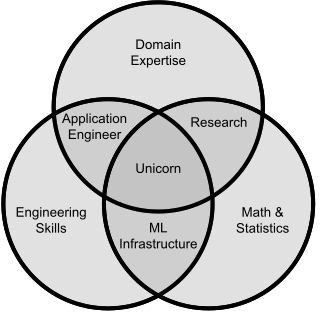

Chapter 21

# Interdisciplinary Teams

As discussed throughout this book, building production systems with machine-learning components requires interdisciplinary teams, combining various needed areas of expertise from multiple team members. 

Teamwork is often difficult, though. Conflicts between team members with different backgrounds and roles are common and found in many projects. It is also challenging to determine when to involve team members with specific expertise, for example, when to bring in operators, user-interface designers, security experts, data-science experts, or lawyers. In this chapter, we take a closer look at the different roles involved in building production systems with machine-learning components and how to manage common conflicts that can emerge in teams, especially interdisciplinary or cross-functional ones. We will also discuss how DevOps and MLOps can be a template for successful collaboration that turns an “us-vs-them” mentality into a culture of collaboration in pursuit of joint goals.

## Scenario: Fighting Depression on Social Media

Consider a large short-video social media platform that plans an initiative to improve mental health among its users, after mounting evidence of how social media use may foster addiction and depression among young users. There are many possible design interventions, such as [not showing how often other posts have been liked](https://www.pbs.org/newshour/science/how-removing-likes-from-instagram-could-affect-our-mental-health) or [using natural-language analysis to detect and discourage toxic interactions](https://engblog.nextdoor.com/the-kindness-reminder-868252995140)—in our scenario, the team has the ambitious plan of trying to predict whether a user develops signs of depression based on their behavior, media consumption, and postings on the side. To predict depression, a set of sentiment-analysis techniques will be used on video and text as a starting point, and more specialized techniques will be developed. In addition, the team considers several potential interventions once signs of depression are detected, including changing news feed curation algorithms to filter harmful content for these users, popping up information material about depression, designing small-group features, and even informing the parents of young users.

This project is highly nontrivial and ambitious. Even though the company has many experienced managers, software engineers, and data scientists, they expect to rely heavily on external help from medical experts in clinical depression, researchers who have studied interventions for depression, and ML researchers at top universities. There are many challenges in depression prognosis at a technical level, but also many design challenges in how to present results, how to design interventions, and how to mitigate risks and harms from false prognoses. This project will likely involve dozens of people with different expertise, within a large organization and with external collaborators.

## Unicorns Are Not Enough

Discussions of skills and teams for bringing machine learning into software products frequently talk about *unicorns*, those rare developers that combine all the needed expertise and experience in statistics, engineering skills, and the domain of interest (e.g., clinical depression). Depending on who talks about unicorns, unicorns are also expected to have business expertise, people skills, and may be expected to do all the data collection.

<figure>

<figcaption>

Unicorns at the intersection of various skills, a variant of common visualizations originally by [Steve Geringer](http://www.anlytcs.com/2014/01/data-science-venn-diagram-v20.html).

</figcaption>
</figure>

As the term unicorn suggests, such multi-talented people are rare or might not even exist. Many might know or have heard of some people who fit the description to some degree, but they are rare and can be difficult and expensive to hire. Often, a better strategy is to go with an interdisciplinary team where multiple people with expertise in different topics work together.

Even if we could hire a unicorn developer, working with multiple people in one or more teams is still necessary, simply for the *division of labor* to scale development for any nontrivial system. Most software products are too big and complex for a single person to build. In addition, teams foster a *division of expertise*, as a single person, even a unicorn, is rarely an expert in all relevant topics or has the cognitive capacity to develop deep expertise in all relevant topics. For example, in the depression project, beyond software engineers and data scientists, we might want to work with clinical experts in depression to provide expertise and evaluate the system, with social workers and social scientists who design interventions, with designers who propose a user interaction design, with operators who deploy and scale the system in production, with a security expert who audits the system, and probably with a project manager who tries to keep everything together.

All this points to the fact that teams are inevitable. As systems grow in size and complexity, the times when systems are built by a lone genius are over. Teams are needed, and those teams need to be interdisciplinary. 

## Conflicts Within and Between Teams are Common

Conflicts can arise both within and between teams. Within teams, members often work together more closely, but conflicts arise when members have conflicting goals (often associated with different roles) or simply do not understand each other well. Between teams, collaboration tends to be more distant, and conflicts can arise more easily: conflicts often arise when the responsibilities are not clear and when teams are sorted and isolated by role, such as a *siloed* software-engineering team using models produced by a *siloed* data-science team. Conflicts among teams can also arise when teams have conflicting goals or incentives and when power structures in an organization let one team define priorities without listening to the needs of others. A common point of friction is that many groups want to influence the project early to shape technical decisions but are only consulted at the end to approve the final product or fix problems—frustrations about not being involved early are commonly heard from security experts, user interface designers, privacy designers, safety experts, fairness advocates, land awyers, but also data scientists (especially, in system-first development) and software engineers (especially, in model-first development). 

To illustrate the everyday conflicts among data scientists and software engineers, let us look at experiences in two real organizations (anonymized). 

<figure>

<figcaption>

Internal team structures and collaboration points of two organizations building products with machine-learning components. Conflicts often arise at these collaboration points.

</figcaption>
</figure>

In *organization A*, a team of four data scientists, two of whom have a software-engineering background, builds and deploys a model for a product (quality control for a production process) for an external customer. Interactions between the customer and the data-science team are rather formal as they span company boundaries and involve a formal contract. The model is integrated into a product by the engineering team of the customer, which has limited experience in machine learning—hence the work on the final system is split across two teams in two organizations. The data-science team is given data and a modeling task and has no power to shape data collection or model requirements; they can only make local modeling decisions. The data scientists report that they need to invest a lot of time in educating their customer about the importance of data quality and quantity, and that they have to fight unrealistic expectations. At the same time, they struggle to get access to domain experts in the customer’s team to understand the provided data. The provided data is proprietary and confidential, so the customer imposes severe restrictions on how data scientists can work with data, limiting their choices and tools. The data scientists had to manage a lot of complex infrastructure themselves and would have preferred to do less engineering work, but they found it hard to convince their management to hire more engineers. Since data scientists were not given any latency, explainability, fairness, or robustness requirements, they did not feel responsible for exploring or testing those qualities.

In *organization B*, a team with eight members works on an ML-enabled product in the health domain for a government client. The team is composed mostly of software engineers, with one data scientist. Even though it is technically a single team with low internal communication barriers, the team members form internal cliques. The sole data scientist reports feeling isolated and not well integrated into the decision-making process by other team members and has little awareness of the larger system and how the model fits into it. Similarly, team members responsible for operations report poor communication with others in the team and ad hoc processes. Software engineers on the team find it challenging to wrap and deploy ML code due to their limited experience in machine learning and feel like they need to educate others on the team about code quality. All team members focus on their own parts with little effort toward integration testing, online testing, or any joint evaluation of the entire product.  The team builds both the model and the product around the model. It is not given data, but must identify suitable data themselves. Communication with the client is rare, and the team has little access to domain experts or end users. Multiple team members report communication challenges due to different backgrounds among the team members and a lack of documentation, and they find it challenging to plan milestones as a team. The client’s requirements are neither well-defined nor stable, leading to many unplanned changes. The client often makes requests that seem unrealistic given the available data, but the data scientist is not involved when the team lead communicates with the client, so they cannot push back on such requests early. While the client is eventually happy with the functionality, the client does not like the product's user interface, which has been neglected during requirements collection and all subsequent discussions. 

In the following, we discuss multiple factors that underlie common team problems and strategies to strengthen interdisciplinary teams by deliberately designing team structures and processes.

## Coordination Costs

As teams grow in size, so do coordination costs and the need for structure. Whereas a team with three members can usually easily and informally coordinate their work, a larger project with thirty members (as may be needed for our depression project) will need an internal structure with smaller teams to avoid a lot of time spent in ineffective meetings. Dividing members of a project into smaller teams with some management structure breaks communication links that otherwise would quadratically grow with the number of members. 

<figure>

<figcaption>

A group with n members has n(n-1)/2 communication links (left), but dividing people into multiple teams and coordinating between the teams through representatives for each team can significantly reduce the number of communication links, here from 21 to 10 for the same number of people.

</figcaption>
</figure>

### Information Hiding and Socio-Technical Congruence

Communication *within* a team is usually more direct and less formal (e.g., standup meetings, sharing offices), though teams with poor internal cohesion can fracture into smaller groups. In contrast, communication *across* teams usually requires more planning but is ideally also needed less often if the architectural decomposition of the system is designed well. 

At a technical level, the traditional strategy to limit the need for communication is *information hiding*. The idea is that an *interface* represents a component, and others who interact with the component will call APIs but do not need to know any implementation details behind the interface. Ideally, teams responsible for different components only need to coordinate when initially deciding on the interface—and when changing the interface. For example, if we had a stable and clear interface for the depression prognosis model and explanations for its predictions, the engineering team could work on designing interventions in the user interface independently, without interacting with the model team. Information hiding is the key reason we argued for modular implementations and documentation throughout the architecture and design chapters: if we can isolate non-ML components from ML components (including inference and pipeline components) and document their interfaces, then separate teams can work on different components without close coordination. 

When diving work and assigning it to teams, software structure should align with the team structure—a principle known as *socio-technical congruence* or *Conway’s law*. Multiple people working on a component must coordinate closely and can do so better if they are part of the same team. For example, team members may share progress daily in standup meetings, but may only learn about important updates from other teams through their managers or from mailing lists with a low signal-to-noise ratio. Conway’s observation was that system structure and team structure often naturally align, mainly because developers design system components to fit the existing team structure (informally, *“if you have three groups working on a compiler, you'll get a 3-pass compiler; if you have four groups working on a compiler, you'll get a 4-pass compiler”*). Studies have shown that projects where the system structure does not align with the team structure, that is, a single component is maintained by developers from different teams, are associated with slower development and more defects.

<figure>

![Two figures of 7 team members divided into two teams with inner communication, overlayed with boxes representing module boundaries. In the first figure the module boundary aligns with the team boundary, so that only a single link between team members crosses the module and team boundary. In the second figure, three modules are shown that do not meet the module boundaries. One module contains members from both teams without any communication link. In addition, many communication links cross module boundaries.](./img/21-congruence.svg)

<figcaption>

High congruence (left) where team and module boundaries align versus very poor congruence (right) where members of two teams are responsible for three modules and two modules are maintained by members of different teams, sometimes without direct communication links.

</figcaption>
</figure>

### Challenges to Divide and Conquer

While the principles of information hiding and socio-technical congruence are well established to organize work in a divide-and-conquer fashion, they are not always easy to apply, and there are well-known challenges. Arguably, software projects with machine learning can be particularly challenging, as interfaces can rarely be fully designed up front, as interfaces are difficult to document, as many qualities emerge from the interaction of the model with other components and the environment, and as expertise does often not align cleanly with component boundaries.

**Interfaces are rarely stable.**
 Information hiding relies on interfaces being *stable*. Ideally, they are designed once at the beginning and never changed*.* Friction commonly occurs when interfaces need to be renegotiated and changed, often when important information was not considered or not known when designing the interfaces and when the initial interfaces had ambiguous or incomplete documentation. 

Given the exploratory and iterative nature of data science (see chapter *[Data Science and Software Engineering Process Models](20-data-science-and-software-engineering-process-models.md)*), it can be difficult to define and document interfaces in a project’s early architectural design phase. Data-science teams often explore what is possible as the project evolves, leading to repeated changes in component interfaces that affect other teams. For example, in the depression prognosis project, there might be a long exploratory phase where a data-science team tests the feasibility of detecting depression with various models and from different data before they can even consider writing an interface definition that allows software engineers to use the model in the system or documenting requirements more deliberately. Even then, the data scientists may explore to what degree explanations can be provided for predictions only late in the project, even though this affects user interface designers working on other components. Then, they may again redesign parts of the model and change assumptions about data and other components when deployment at scale is planned or as privacy concerns are raised. It seems unlikely that multiple teams can agree on stable interfaces up front and work largely in isolation in this project.

**Incomplete interface descriptions can limit shared understanding.**
 Compartmentalizing work into components often seems appealing until teams realize that nuances got lost when interfaces were defined prematurely or incompletely without a complete understanding of a system. In our depression prognosis example, it would be tempting to delegate data acquisition and cleaning to a separate team, but defining this data collection task well requires an understanding of social media, of depression, of the data scientists’ need when building models, of lawyers about how personal data can be legally processed in various jurisdictions, of user interface developers who understand what telemetry data can be realistically collected, and others. It is unlikely that a data collection component can be well specified in an early planning phase of the project without cross-team coordination and substantial exploration. Starting with a poorly defined task provides the illusion of being able to make progress in isolation, only to discover problems later. On the positive side, even a preliminary understanding of interfaces will allow the data collection team to identify with which other teams to engage when coordination and (re)negotiation of the interface becomes necessary.

In addition, as discussed in earlier chapters, practices for defining and documenting interfaces of machine-learning components and data quality are poorly developed. We do not have good formalisms to describe what an ML model can do and what its limitations are, and other qualities of a model, like expectations toward resource consumption, are also rarely documented. For example, data scientists receiving data about user interactions with our social media site may have little information about the data’s quality and additional opportunities to collect additional data unless they engage with other teams. While documentation of machine-learning components and data will hopefully improve, the poor state of the practice explains why friction often emerges at the interface between data science and software engineering teams who try to work independently.

**Many system qualities cannot be localized in components.**
 Many qualities of a software system emerge from the interaction of many components when deployed in an environment, including important qualities such as safety, security, usability, fairness, and operational efficiency. Ideally, system requirements are decomposed into component requirements, and each component reasons about its contributions to these qualities internally and documents it as part of the interface.

In practice though, we may see compartmentalization and a diffusion of responsibility. Each team may assume that others will take care of this. Team members concerned about these system-wide issues can have a hard time coordinating across many teams when the need for this coordination is not apparent from the component interfaces. For example, in the depression prognosis project, it may be difficult to identify which team is responsible for the fairness of the system toward different demographics; we can assign a fairness audit as a responsibility to the model team but might easily ignore how usage patterns of teen girls combined with the implementation decisions about telemetry and the reporting interface may lead to skewed discriminatory outcomes. As we will discuss in chapter *[Fairness](26-fairness.md)*, fairness is cutting across the entire system and cannot be assessed in any single component. Yet, fairness may not be considered a serious concern locally in most components and may be mostly ignored when defining interfaces for components.

**Expertise cannot always be localized to modules.**
 Similarly to qualities, the expertise needed for development can also be difficult to localize. In an ideal world, systems are decomposed into components so that experts can develop each component independently. Information hiding ensures that expertise is localized in the component, and others can use the component through the interface without needing the same expertise. However, localizing expertise can be difficult, especially when it comes to machine learning. In our example, we likely want to have a software engineer be part of the team that develops the depression prognosis model; similarly, the design and engineering team that builds the user interface will likely benefit from having machine-learning and operations expertise on their team to better anticipate and mitigate mistakes and to better design the telemetry and monitoring system. Hence, to ensure socio-technical congruence, we must design interdisciplinary teams for each component rather than sorting people by specialty into teams (*siloing*). 

Overall, a divide-and-conquer strategy is essential to manage coordination costs, but an overly strong separation of components is likely not successful either. Projects need to find a way to balance system-wide concerns with the need to divide work into individual components that cannot realistically consider every possible interaction among components and their design decisions in their interfaces. Project managers and system architects who oversee the definition of components and the negotiation of interfaces have a particular responsibility to pay attention to such concerns. 

### Awareness

A second strategy to coordinate work across teams, in many ways opposite but complementary to divide and conquer with information hiding, is to foster *awareness*. Here, information is not hidden but actively broadcast to all who might be affected. Activities that foster awareness include cross-team meetings, sending emails to a mailing list, announcing changes on Slack, monitoring an activity feed of the version control system (e.g., on GitHub), and subscribing to changes in an issue tracker. Broadcasting every decision and change typically quickly leads to information overload, where important information may be lost in the noise, returning to the process costs of a single large team. However, more targeted awareness mechanisms can be effective, for example, proactively informing affected teams about important upcoming changes to data quality or setting up automated notifications for model updates. Filtering can be done by the sender (e.g., selecting whom to contact in other teams) or the receiver (e.g., subscribing to relevant mailing lists or setting up automated alerts on keyword matches). For example, a developer who maintains the user frontend may subscribe to code changes in the machine-learning pipeline for the depression prognosis model to observe whether explanations provided in the user interface should be updated, too; a data scientist planning to update a model’s internal architecture anticipating changes to inference latency may proactively reach out to all teams using the model to give them time to adjust if needed.

Personal awareness strategies, such as opening informal cross-team communication links, often rely on personal relationships and are not robust when team members leave. It can be a good idea to formalize such communication links, such as documenting whom to contact for various issues or creating topic-specific mailing lists. For example, in the depression project, the data scientists may maintain a list of contacts in the engineering teams of the social media platform who can explain (and possibly change) how data about user interactions is logged, especially if that is not documented anywhere.

Awareness is less effective if teams span multiple organizations with formal boundaries and contracts. Team members may still reach out informally to teams in other organizations, such as data scientists trying to find domain experts in the client’s organization, but it is usually more challenging to establish communication and even more challenging to sustain it to establish awareness. Clear documentation and formalized communication channels are usually more effective.

In practice, most multi-team software projects use some combination of information hiding and awareness. Both have their merits and limits. It seems, at least with current common practices, information hiding might be less effective as a strategy in ML-related projects than in traditional non-ML projects—hence, teams in ML-related projects should consider investing either in better practices for stabilizing and documenting interfaces or in deliberate awareness mechanisms. When relying on awareness, teams should deliberately design communication strategies to sustain awareness and avoid information overload.

## Conflicting Goals and T-Shaped People

A well-known dysfunction in (interdisciplinary) teams is that different team members have different goals, which may conflict with each other. In our depression prognosis example, data scientists and lawyers may have very different preferences about what kind of data can be analyzed to further their respective goals; operators may prefer smaller models with lower latency; and user-experience designers may value reliable confidence estimates for predictions and meaningful explanations more than higher average accuracy across all predictions, as it allows them to design better mitigation strategies for wrong predictions. A team member optimizing only for their own goals may contribute to the project in ways that are incompatible with what others want and need—for example, learning depression prognosis models that are expensive to use in production and producing false positives that drive away users or even cause some users to seek therapy unnecessarily. Sometimes, different goals are reinforced through measures and performance reviews, where software engineers may be evaluated by the number of features shipped, operators by downtime, data scientists by accuracy improvements achieved. Yet again, other team members may struggle to quantify their contributions, such as fairness advocates and lawyers, since their work manifests manifests primarily in the absence of problems. To improve teamwork, project members, often across multiple teams, need to communicate to resolve their goal conflicts.

**T-shaped people.**
 To resolve goal conflicts, it is first necessary to identify them. To this end, it is useful if team members are transparent about what they try to achieve in the project and how they measure success. Team members need to make an effort to understand the goals of other team members and why they are important to them. This often requires some understanding of a team member’s expertise, such as, their concerns about modeling capabilities, their concerns about presenting results to users, their concerns about operation costs, or their concerns about legal liabilities. 

While, as discussed earlier, it is unlikely that team members are experts in all of the skills needed for the project (“unicorns”), it is beneficial if they have a basic understanding of the various concerns involved. For example, a data scientist does not need to be an expert in privacy laws, but they should have a basic understanding of the principles involved to appreciate and understand the concerns of a privacy expert. Here, the idea of T-shaped people, which we already mentioned in the introductory chapter, is a powerful metaphor for thinking about how to build interdisciplinary teams: instead of hiring experts who just narrowly specialize in one topic or generalists who cover lots of topics but are not an expert in any one of them, *T-shaped people* combine the expertise in one topic with general knowledge of other topics (more recently, recruiters also popularize the term *π-shaped people* for team members who have deep expertise in two areas in addition to broad general knowledge). For example, a T-shaped data scientist in the depression prognosis project may have extensive experience with machine learning for multi-modal sentiment analysis, may learn domain expertise about clinical depression, may already have basic software engineering skills (as discussed throughout this book), may know about the general challenges of operating distributed systems, and may know how to speak to an expert about privacy laws. Ideally, teams are composed of T-shaped members to cover all relevant areas with deep expertise but also allow communication between the different specialists.

If team members understand each other and their individual goals, it is much easier to negotiate and agree on goals for the entire project as a team. For example, the team may identify that certain privacy laws impose hard constraints that cannot be avoided; data scientists can identify whether an explainability requirement from a software engineer is important for the system’s success when weighing explainability against prediction accuracy in their work; and software engineers who understand the basics of machine learning may have a better understanding of what requests for explainability and latency are realistic for the system and how to anticipate model mistakes. Understanding each other will also help explain contributions to project success in performance reviews, such as a data scientist compromising for lower accuracy (their typical own success measure) to support explainability needed by other team members (benefiting their measures and overall project success).

Generally, it is useful to expose all views and consider conflicts a useful part of the process to make more informed decisions and set and commit to project-level goals. The contributions of team members should be evaluated based on the compromise that codifies the goals for the entire project. 

## Groupthink

Another well-known dysfunction in teams is *groupthink*, the tendency of a group to minimize conflict by (1) not exploring alternatives, (2) suppressing dissenting views, and (3) isolating the group from outside influences. Groupthink leads to irrational decision-making where the group agrees with the first suggestion or a suggestion of a high-status group member. Symptoms include teams that overestimate their ability and closed-mindedness in general with pressure toward uniformity and self-censoring. 

In software projects, groupthink is pervasive for hype technologies, where teams pick technologies because they are popular, not because they were chosen after exploring alternatives. In our example, the depression prognosis team may rely on prompts with a well-known commercial large language model to analyze text from videos without considering any other learning techniques, just because a manager or experienced data scientist suggested it and it seems modern. Even though some team members may think that other techniques would be more suitable because they are less expensive in operations, easier to debug and explain, and equally accurate, those team members do not voice their opinion because they do not want to be perceived as contrarian, old-fashioned, or as being out of the loop. 

Groupthink is also common when it comes to discarding risks, such as safety, fairness, privacy, and security risks in machine-learning projects, where team members might not bring up concerns, to not rock the boat or jeopardize timely deployment. For example, some team members may have concerns about fairness or safety issues with the depression prognosis system, fearing that it may perform poorly for underrepresented demographics or lead to severe stress from false positives, but they do not analyze this further because team leads always discard such concerns whenever mentioned.

Groupthink has been studied in many contexts and is common across many teams, and many common causes have been identified, including high group cohesion and homogeneity where all team members have similar backgrounds and experiences, an organizational culture that isolates decision-makers from feedback and discourages exploration of alternatives, and stressful external threats, recent failures, and moral dilemmas. In machine-learning projects, data scientists often share similar educational backgrounds, data scientists are often siloed from developers and operators, and development happens at a very fast pace with many competitors. For example, suppose the social media company is under public scrutiny after recent high-profile depression-related suicides. In that case, the team might cut corners and knowingly deploy an inaccurate model without well-tested mitigation strategies to protect users from the stress, potential overtreatment, and social stigma of false positives.

Many interventions have been suggested and explored for groupthink. In general, it is important to foster a culture in which team members naturally explore different viewpoints and discuss alternatives. Solutions include: (1) selecting and hiring more diverse teams, (2) involving outside experts, (3) ensuring all team members are asked for their opinions, (4) having a process in which high-status team members always speak last, (5) actively moderating team meetings, and (6) always exploring a second solution. Techniques such as *[devil’s advocate](https://en.wikipedia.org/wiki/Devil%27s_advocate)* (having team members explicitly voice contrary opinions for the sake of debate, without labeling them their own) and agile development techniques such as *[planning poker](https://en.wikipedia.org/wiki/Planning_poker)* and *[on-site customers](https://www.zentao.pm/agile-knowledge-share/extreme-programming-on-site-customer-849.html)* also reduce certain groupthink tendencies. Given the high risks of many ML-related software products, teams would do well reflecting on groupthink and proactively adopting interventions.

## Team Structure and Allocating Experts

Large organizations work with many people with different expertise and pursue many projects at the same time. How to organize people into teams is well studied in the management literature, and plenty of experience exists for traditional software projects. At a smaller scale, similar considerations occur when deciding how to allocate project members to teams within the project.

Management literature typically contrasts two common forms of organizing people into teams: *matrix organization* and *project organization*. In a matrix organization, experts are sorted into departments. Members of the different departments are lent to specific projects—they often work on one or multiple projects (and teams) in addition to tasks in their home departments. Each department has its own management structure, own goals, and own hiring priorities. In contrast, in a project organization, team members belong exclusively to a project and do not have an additional home department; the organization may not have any departments. Each project recruits team members from the pool of employees in the organization or hires additional team members externally; if the project is completed, team members join other projects. Trade-offs between matrix and project organization are well known.

<figure>

<figcaption>

In a matrix organization, people are grouped into departments that then lend them to specific projects. In a pure project organization, team members belong exclusively to a team.

</figcaption>
</figure>

On the one hand, matrix organization allows composing teams flexibly with experts from multiple departments, even when some experts are involved in the project only for a small fraction of their time. Matrix organization fosters information sharing across projects and helps develop deep expertise within each department. For example, a privacy lawyer develops best practices and applies them in each project, and data scientists working on different projects may communicate to share their latest insights and suggest interesting recent papers to their colleagues. For example, a data scientist working on depression prognosis might share an office with and learn from other data scientists working on similar cutting-edge models for advertising in the same organization. However, in a matrix organization, individuals often report to the department and one or more projects at the same time, setting up conflicts when deadlines loom. 

On the other hand, project organization enables team members to focus exclusively on their project, but experts may have fewer opportunities to learn from other experts in their field working on other projects. They may reinvent and reimplement functionality that already exists elsewhere in the organization. Also, not every team can justify recruiting a specialist in a full-time capacity. For example, while consulting with privacy experts is important, the project will likely not have a full-time privacy lawyer on every team. [Research](https://arxiv.org/abs/2006.12358) shows that many machine-learning projects struggle particularly to allocate resources for responsible machine learning, including privacy and fairness work, in practice. 

In addition, many hybrid organization forms balance these trade-offs. For example, organizations can adopt primarily a project organization model but still organize important but less commonly used experts on privacy law and security in dedicated departments. To foster communication among experts distributed across teams and projects, many organizations support informal in-house communication networks to provide opportunities for exchange and shared learning, for example, through invited talks or in-house meetups. In Spotify’s well-known [agile model](https://blog.crisp.se/wp-content/uploads/2012/11/SpotifyScaling.pdf), these cross-team and cross-project communities that develop field-specific standards and exchange ideas on special topics are known as *Chapters* and *Guilds*.

**Empowering teams to contact external experts.**
 When considering how to organize and allocate rare expertise across project teams in machine-learning projects, we can learn from other fields. The software engineering community went through similar struggles about two decades earlier with regard to how to allocate security expertise in software teams: Security is a quality that is affected by all development activity. Some developers were very invested in making software secure, but security was not a focus or even perceived as a distraction for most developers—something slowing them down when pursuing their primary goal of developing new features. Attempts to educate all developers in security were met with resistance. Software security is a deep and complicated field, and it may take years to become an expert and still requires continuous learning as the field evolves. Security workshops were perceived as compliance tasks with little buy-in. A more successful strategy to improve software security was to provide developers with basic security training that conveys just the key concerns and principles, but not many technical details. Such lightweight training established security literacy and turned developers into T-shaped people who would recognize when work security might become important and know when and how to bring in help from experts in the organization. In addition, certain security practices could be enforced with tools (e.g., adopting more secure libraries and automated checks) or as part of the process (e.g., requiring signoff on architectural design by a security expert). 

In a clear parallel, in building software products with machine-learning components, we see that fairness experts, privacy experts, user-experience experts, operations experts, and others all want to ensure being involved (early) in teams, but both software engineers and data scientists have immediate goals, will not train for years to become experts in each of these topics, while likely also not having the resources to allocate an expert for each area as a full-time team member. Like with secure coding, trainings are often seen as a nuisance distracting from more important work or as a compliance activity. Currently, much fairness and safety work in machine learning is performed by team members interested in the topic, without much structural support. Hiring T-shaped people and creating awareness of potential issues and when and how to bring in experts is likely a more productive form of engagement, possibly combined with better tooling and process interventions. We will return to practical steps in chapter *[Fairness](26-fairness.md)*.

## Learning from DevOps and MLOps Culture

Conflicts between teams and team members with different roles and goals are common and well studied. In the software engineering community, approaches to improve teamwork are particularly well explored between developers and operators on software teams in the context of what is now known as *DevOps.* The same insights can be found for improving teamwork between data scientists and operators under the name *MLOps*. Beyond the principles and tooling innovations discussed in chapter *[Planning for Operations](13-planning-for-operations.md)* and several other chapters, DevOps and MLOps provide a promising vision for fostering interdisciplinary collaboration. 

### A Culture of Collaboration

Historically, developers and operators have often operated with conflicting goals, with developers prioritizing new features and being quick to market, whereas operators aim to minimize outages and server costs. There are many public stories of how operators are frustrated with the code they get from software engineers or data scientists, because the code misses necessary dependencies or simply is not stable or fast enough for production use. Similarly, many stories report developers being frustrated with operators about how slow and conservative they are with releases. 

DevOps establishes a *culture of collaboration* with joint goals, joint vocabulary, and joint tools to bring developers and operators closer together. Instead of an “us versus them” mentality between siloed groups with distinct priorities, DevOps establishes the *joint goal* of frequently delivering value and learning from rapid feedback. Developers and operators work together toward this joint goal, focusing on the resulting product rather than on development or operation in isolation. In this process, developers and operators integrate their work tightly through joint tooling where their work intersects. These include developers wrapping their software in containers for deployment and operators providing access to live telemetry through A/B testing infrastructure and monitoring dashboards. Developers and operators share the *joint responsibility* for delivering the product.

This culture of collaboration is supported by a framing in which developers and operators mutually benefit from working closely together. From a *developer’s perspective,* developers invest extra effort into automating testing, instrumenting their software to produce telemetry, and containerizing their software to be *release-ready*, but they benefit from seeing their code released in production soon after committing it, within minutes rather than weeks or months. Beyond the satisfaction of seeing their code live, developers are empowered to make their own deployment decisions and they can gather rapid feedback from users to make data-driven decisions in subsequent development. From an *operator’s perspective,* having developers perform containerization and implement telemetry frees operators to focus on infrastructure for operating reliably and for experimenting in production, investing in automating container orchestration and infrastructure for canary releases and A/B tests, rather than worrying about manually installing library dependencies and manually rolling back unsuccessful updates from a backup at 3 a.m. The benefits are analogous for data scientists in MLOps who can rapidly experiment in production at the cost of learning infrastructure for packaging their models in a production-ready format, which might be as easy as understanding how to use a library like [BentoML](https://github.com/bentoml/bentoml).

To facilitate collaboration in DevOps, developers and operators agree on shared terminology and work with joint tools, especially containers, test automation, versioning infrastructure, A/B testing infrastructure, and telemetry and monitoring infrastructure. These tools mediate and enforce the collaboration between both roles, as both use them jointly. For example, rather than waiting for an operator to manually process a ticket in a workflow system, developers can push a new container version to a repository from where the operators’ systems will automatically deploy them as an experiment; they can access on their own the experiment results gathered from telemetry that their software produces. MLOps pursues the same kind of collaboration between data scientists and operators when training models or deploying models as an inference service within a system, with tools shared by both roles for pipeline execution, model versioning, model packaging, and so forth.

In a sense, DevOps and MLOps force developers and data scientists to use certain tools and workflows that require learning about some aspects of an operator’s role  and goals, and vice versa. Using joint tools requires some understanding of shared concepts and effectively enforces a joint vocabulary, characteristic of T-shaped people.

### Changing Practices and Culture

Like all culture change, adopting a DevOps or MLOps mindset and culture in an organization with previously siloed teams is hard. Overcoming inertia from past practices can be challenging (*“this is how we always did things”*), and the initial learning cost for adopting some of the DevOps tooling can be high for both developers and operators. Shifting from an “us versus them” mentality to a blameless culture of openly shared artifacts and joint responsibility requires substantial adjustment, as does moving from ad hoc testing to rigorous test automation in continuous deployment pipelines. Cultural values are often deeply embedded in organizations and resistant to change without concerted efforts and buy-in from management. Developers not used to rapid feedback and telemetry from production systems may not anticipate the benefits without first-hand experience, but developers who have seen the benefits may never want to work in an organization without it again. When operators are drowning in day-to-day emergencies, they may not have the time to explore new tools. Managers of siloed teams may worry about losing their importance in the organization; individual team members may fear automating their own jobs away. Haphazard adoption of some DevOps practices may produce costs without providing the promised benefits—for example, adopting release automation without automated tests or introducing container orchestration without telemetry or monitoring will expose a team to a lot of risks.

The kind of culture change that many organizations need for the successful adoption of DevOps and MLOps can be instigated bottom-up from motivated employees and top-down from leadership in an organization. Supportive management is crucial. DevOps and MLOps are often introduced by the advocacy of individuals, who convince colleagues and management. Education about principles and benefits is important to generate buy-in. Experienced hires or consultants can help change minds and adopt complex tools. It is usually a good idea to demonstrate benefits at a small scale before rolling out changes more broadly; for example, a small team could pioneer DevOps practices on a single component and then proselytize the benefits in the rest of the company. Projects are more likely to demonstrate success if they focus on current pain points and ensure that key technical enablers, such as test automation and telemetry, are implemented. In our depression prognosis scenario, if the organization does not already have a DevOps culture, we may focus on automating model deployment and experimentation as early leverage points that benefit most from iterative development and rapid feedback.

### A Vision beyond DevOps and MLOps

DevOps and MLOps provide lessons for how to think about a culture of collaboration. As discussed, friction can be observed at the interfaces between teams and when team members have different backgrounds and goals, whether it is between data scientists and software engineers, between data scientists and people gathering the data, between developers and lawyers, or between domain experts and user-experience designers. In all cases, we would like to see interdisciplinary collaboration toward *joint goals* over “us-versus-them” conflicts.

DevOps and MLOps demonstrate the power of setting joint goals for delivering a product rather than the individual components and silos, but they also illustrate the effort required to affect culture change in a siloed organization. Importantly, DevOps and MLOps highlight the mutual benefits gained by each group from the collaboration and from taking on extra work to help the other group. Tools where roles interact define a common language and shared artifacts that mediate and codify the collaboration.

Consider the collaboration between software engineers and data scientists discussed throughout this book and what a *DevML* culture could look like. That is, let us focus on the collaborative development of the entire product rather than MLOps’ focus of automating and deploying an ML component. How should we frame joint joint goals between software engineers and data scientists? What *DevML* tools could support it? At the time of this writing, this area is not well explored, but we can speculate about many potential joint practices and tools to foster collaboration where these roles interact to (1) collect system requirements and negotiate component and model requirements, (2) analyze and document anticipated mistakes, design mitigation strategies, and plan incident response strategies, (3) design the system architecture for scalability, modifiability, and observability, (4) document and test data quality for data exchanged between components, (5) document and test model capabilities and qualities, (6) plan and perform integration testing of ML and non-ML components in a system, (7) facilitate experimentation with all aspects of the software product, (8) jointly version ML and non-ML components in the system, and (9) perform threat modeling of the entire system and its components to identify security threats.

For example, we think that better tooling to describe target distributions of a model and better tooling to report model quality in a more nuanced and multi-faceted way capturing qualities and model behaviors (inspired by documentation mechanisms like Model Cards and FactSheets, see chapter *[Deploying a Model](10-deploying-a-model.md)*) will be powerful technologies where team members of different roles interact. They can infuse a shared understanding of concerns at the interface: When data scientists are asked to provide documentation following a comprehensive template, they are nudged to consider qualities that software engineers may find important; when software engineers draft a test plan early on, they are forced to consider which model qualities are most relevant to them. Tooling to automatically report evaluation results from an automated infrastructure could ease the process and replace ad hoc communication with mature automation. Similarly, we think that including data scientists in requirements analysis, risk analysis, or threat modeling activities of the system through checkpoints in tools or artifacts can encourage the kind of T-shaped people and collaborative culture we want in our teams. 

In all these steps, data scientists and software engineers may need to take on additional tasks, but they may also gain benefits, hopefully toward a win-win situation. For example, software engineers may have an easier time integrating models and can focus more on mitigating anticipated mistakes and providing better user experiences, whereas data scientists may receive data of better quality and also better guidance and clearer requirements, making it more likely that their models will move from prototype to production.

While cultures and tools for potential areas like *DevML*, *LawDev*, *DataExp*, *SecDevOps*, *MLSec*, *SafeML*, and *UIDev* (or many other silly abbreviations we could invent for combinations of various roles) may not be as popular or well understood as DevOps or MLOps, we should think more carefully about these collaborations, about setting joint goals and supporting them with joint tooling. The way that DevOps and MLOps embrace operators in a collaborative culture are success stories from which we should seek inspiration for successful interdisciplinary collaboration more broadly.

## Summary

Machine-learning projects need expertise in many fields that are rarely held by a single person. A better strategy to scale work, both in terms of division of labor and division of expertise, is to assemble interdisciplinary teams. Scaling teams can be challenging due to process cost and various team dysfunctions such as conflicting goals and groupthink, which can be exacerbated by the increased complexity and need for more diverse expertise in machine-learning projects compared to many traditional software projects.

To address process costs, it is essential to consider the interfaces between teams and to what degree stable and well-documented interfaces are possible or to what degree teams need to continuously iterate together on the product. Team members should be mindful of potential problems and establish suitable communication and collaboration channels.

The interdisciplinary nature of machine-learning projects brings additional, but also well-studied teamwork challenges, such as conflicting goals and groupthink. Education, T-shaped people, deliberate structuring of teams and processes to make use of specialized expertise, and establishing a culture of constructive conflict are all key steps to explore to make interdisciplinary teams work better. DevOps culture can provide inspiration for a successful collaborative culture focused on joint goals, supported with joint tools, that may well provide lessons for collaboration among other roles in a team.

## Further Readings

  * A discussion of organizational challenges when trying to integrate fairness concerns into organizational practices within and across teams: 🗎 Rakova, Bogdana, Jingying Yang, Henriette Cramer, and Rumman Chowdhury. “[Where Responsible AI Meets Reality: Practitioner Perspectives on Enablers for Shifting Organizational Practices](https://arxiv.org/abs/2006.12358).” *Proceedings of the ACM on Human-Computer Interaction* 5, no. CSCW1 (2021): 1–23.

  * Examples of coordination and collaboration failures around data quality in ML-enabled software projects: 🗎 Sambasivan, Nithya, Shivani Kapania, Hannah Highfill, Diana Akrong, Praveen Paritosh, and Lora M. Aroyo. “[‘Everyone Wants to Do the Model Work, Not the Data Work’: Data Cascades in High-Stakes AI](https://dl.acm.org/doi/abs/10.1145/3411764.3445518).” In *Proceedings of the Conference on Human Factors in Computing Systems (CHI)*, 2021. 

  * A study about the collaboration challenges between data scientists and user-experience designers and the difficulty of finding clear interfaces: Subramonyam, Hariharan, Jane Im, Colleen Seifert, and Eytan Adar. “[Solving Separation-of-Concerns Problems in Collaborative Design of Human-AI Systems through Leaky Abstractions](https://dl.acm.org/doi/abs/10.1145/3491102.3517537).” In *Proceedings of the Conference on Human Factors in Computing Systems (CHI)*, 2022.

  * A study highlighting the challenges in building products with machine-learning components and how many of them relate to poor coordination between software engineers and data scientists: 🗎 Nahar, Nadia, Shurui Zhou, Grace Lewis, and Christian Kästner. “[Collaboration Challenges in Building ML-Enabled Systems: Communication, Documentation, Engineering, and Process](https://dl.acm.org/doi/10.1145/3510003.3510209).” In *Proceedings of the International Conference on Software Engineering* (2022).

  * Detailed case studies of production machine learning discussing the need for interdisciplinary collaborations with various domain experts: 🗎 Lvov, Ilia. “[Project Management in Social Data Science: Integrating Lessons from Research Practice and Software Engineering](http://hdl.handle.net/10023/18936).” PhD diss., University of St Andrews, 2019.

  * A study of the different roles of data scientists in software teams at Microsoft: 🗎 Kim, Miryung, Thomas Zimmermann, Robert DeLine, and Andrew Begel. “[Data Scientists in Software Teams: State of the Art and Challenges](https://doi.org/10.1109/tse.2017.2754374).” *IEEE Transactions on Software Engineering* 44, no. 11 (2017): 1024–1038.

  * A presentation arguing for building interdisciplinary teams with T-shaped people: 📰 Ryan Orban. “[Bridging the Gap between Data Science & Engineer: Building High-Performance Teams](https://www.slideshare.net/ryanorban/bridging-the-gap-between-data-science-engineer-building-highperformance-teams)” [presentation], 2016.

  * Classic and more recent books on teamwork in software engineering: 🕮 Brooks Jr., Frederick P. *[The Mythical Man-Month: Essays on Software Engineering](https://bookshop.org/books/the-mythical-man-month-essays-on-software-engineering-anniversary-edition/9780201835953)*. Pearson Education, 1995. 🕮 DeMarco, Tom, and Tim Lister. *[Peopleware: Productive Projects and Teams](https://bookshop.org/books/peopleware-productive-projects-and-teams-revised/9780321934116)*. Addison-Wesley, 2013. 🕮 Mantle, Mickey W., and Ron Lichty. *[Managing the Unmanageable: Rules, Tools, and Insights for Managing Software People and Teams](https://www.managingtheunmanageable.net/)*. Addison-Wesley Professional, 2019.

  * Classic work on team dysfunctions: 🕮 Lencioni, Patrick. *[The Five Dysfunctions of a Team: A Leadership Fable](https://bookshop.org/books/the-five-dysfunctions-of-a-team-a-leadership-fable-9780787960759/9780787960759)*. Jossey-Bass, 2002.

  * Classic work on Groupthink dating back to the 1970s: 🗎 Janis, Irving (1991). “[Groupthink](https://williamwolff.org/wp-content/uploads/2016/01/griffin-groupthink-challenger.pdf).” In *A First Look at Communication Theory* (pp. 235–246). New York: McGrawHill.

  * Spotify’s agile model has received much attention for describing how to organize many people in small self-organizing cross-functional teams, but with structures that group and crosscut such teams: 📰 Kniberg, Henrik and Anders Ivarsson. “[Scaling Agile @ Spotify with Tribes, Squads, Chapters & Guilds](https://blog.crisp.se/wp-content/uploads/2012/11/SpotifyScaling.pdf)” [blog post], 2012.

  * A seminal book on organizational culture, what it is, why it is difficult to change, and how to best attempt to change it regardless: Schein, Edgar H. *[Organizational Culture and Leadership](https://bookshop.org/p/books/organizational-culture-and-leadership-edgar-h-schein/11349800)*. John Wiley & Sons, 2010.

  * A classic paper on information hiding and the need for interfaces between teams: 🗎 Parnas, D. L. “[On the Criteria to Be Used in Decomposing Systems into Modules](https://kilthub.cmu.edu/articles/journal_contribution/On_the_criteria_to_be_used_in_decomposing_systems_into_modules/6607958/files/12098510.pdf).” *Communications of the ACM* 15(12), 1053–1058, 1972.

  * Socio-technical congruence was originally proposed by Melvin Conway in 1968, but it has since been repeatedly validated and identified as the source of problems in software projects when violated: 🗎 Conway, Melvin E. “[How Do Committees Invent](http://melconway.com/Home/pdf/committees.pdf).” *Datamation* 14, no. 4 (1968): 28–31. 🗎 Herbsleb, James D., and Rebecca E. Grinter. “[Splitting the Organization and Integrating the Code: Conway's Law Revisited](http://www.cs.cmu.edu/afs/cs.cmu.edu/Web/People/jdh/collaboratory/research_papers/ICSE99.pdf).” In *Proceedings of the International Conference on Software Engineering*, pp. 85–95. 1999. 🗎 Cataldo, Marcelo, Patrick A. Wagstrom, James D. Herbsleb, and Kathleen M. Carley. “[Identification of Coordination Requirements: Implications for the Design of Collaboration and Awareness Tools](https://patrick.wagstrom.net/publications/Cataldo_2006_IdentificationOfCoordinationRequirements.pdf).” In *Proceedings of the Conference on Computer Supported Cooperative Work*, pp. 353–362. 2006.

  * An exploration of the role of awareness in software engineering to coordinate work: 🗎 Dabbish, Laura, Colleen Stuart, Jason Tsay, and Jim Herbsleb. “[Social Coding in GitHub: Transparency and Collaboration in an Open Software Repository](https://herbsleb.org/web-pubs/pdfs/dabbish-social-2012.pdf).” In *Proceedings of the Conference on Computer Supported Cooperative Work*, pp. 1277–1286. 2012. 🗎 de Souza, Cleidson, and David Redmiles. “[An Empirical Study of Software Developers' Management of Dependencies and Changes](https://www.ics.uci.edu/~redmiles/publications/C078-deSR08.pdf).” In *International Conference on Software Engineering*, pp. 241–250. IEEE, 2008. 🗎 Steinmacher, Igor, Ana Paula Chaves, and Marco Aurélio Gerosa. “[Awareness support in distributed software development: A systematic review and mapping of the literature](https://doi.org/10.1007/s10606-012-9164-4).” *Computer Supported Cooperative Work (CSCW)* 22, no. 2–3 (2013): 113–158.

  * A detailed study on how to establish a DevOps culture in an organization: 🗎 Luz, Welder Pinheiro, Gustavo Pinto, and Rodrigo Bonifácio. “[Adopting DevOps in the Real World: A Theory, a Model, and a Case Study](http://gustavopinto.org/lost+found/jss2019.pdf).” *Journal of Systems and Software* 157 (2019): 110384.

  * A fictional story that conveys DevOps principles and the struggle of changing organizational culture in an engaging way: 🕮 Kim, Gene, Kevin Behr, and Kim Spafford. *[The Phoenix Project](https://bookshop.org/books/the-phoenix-project-a-novel-about-it-devops-and-helping-your-business-win-anniversary/9781942788294)*. IT Revolution, 2014.

  * Examples of actual interventions on social media sites to fight depression and toxicity: 📰 Leventhal, Jamie. “[How Removing ‘Likes’ from Instagram Could Affect Our Mental Health](https://www.pbs.org/newshour/science/how-removing-likes-from-instagram-could-affect-our-mental-health).” PBS NewsHour. 2019. 📰 Masquelier, Daniel. “[The Kindness Reminder](https://engblog.nextdoor.com/the-kindness-reminder-868252995140).” Nextdoor Engineering Blog. 2019.

---
*As all chapters, this text is released under <a href="https://creativecommons.org/licenses/by-nc-nd/4.0/">Creative Commons BY-NC-ND 4.0</a> license.*
*Last updated on 2024-06-17.*
