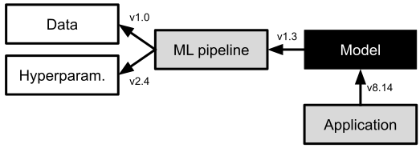

<div class="chapter">Chapter 24</div>

# Versioning, Provenance, and Reproducibility

With complex, interacting, and ever-changing machine-learned models in software systems, developers might easily lose track of which version of a model was used in production and how exactly it was trained, creating challenges in understanding what went wrong when a problem occurs. It can even be difficult to just reproduce the problem when models are constantly updated or if different users see different results in A/B experiments or canary releases. A lack of versioning, provenance tracking, and reproducibility makes it difficult to provide any form of accountability.

There are many tools designed to reign in some complexity, explicitly distinguish and track versions, and trace data as it flows through systems and influences models. In contrast, deploying a model by simply *overwriting* an older model on a server in production is a sure way to lose track and risk severe challenges for any debugging or auditing step.

In this chapter, we consider three distinct but interrelated issues:

  * **Versioning:** Models and code may be frequently updated to account for drift or for experimentation. Systems must ensure that the same versions of models and code are deployed or that they differ in deliberate ways. For debugging, developers must often identify what specific version of the models and code has made the specific decision and might want to retrieve or recreate that specific version. 

  * **Provenance and lineage:** If any models are found to be problematic, developers might want to identify issues in the training code or data used for that specific model. To that end, they might want to know what code and data was used during training and possibly also track the origin of that data, how it was modified, and by whom.

  * **Reproducibility:** If there is nondeterminism during model inference, it may be difficult to investigate any single prediction. If model training is nondeterministic, problems may be resolved just by retraining the model. Developers will likely want to understand the influence of nondeterminism and to what degree models and predictions can be reproduced. Reproducibility is also important to develop trust in experiment evaluations and academic results.


Versioning, provenance tracking, and reproducibility are essential tools for responsible engineers that provide a technical foundation for debugging, reliable experiments, trustworthy and safe deployments, safeguards against security attacks and forensics when attacks occur, accountability and auditing, and many other tasks.

## Scenario: Debugging a Loan Decision 

Consider this scenario drawn from controversies around the 2019 launch of Apple’s *Apple Card* credit card: A large consumer-products company introduces private loans as a new financial product and leans heavily into automation to scale the business. Loan decisions are largely automated, based on various models and scoring approaches. After the launch, an applicant with a large social media presence publicly shames the organization, claiming discriminatory loan practices in viral posts. First, the support team, then developers try to investigate the issue. If claims escalate, the bank may need to provide evidence to defend itself before a judge or regulators.

<figure>


<figcaption>

[Viral tweet](https://twitter.com/dhh/status/1192540900393705474) after Apple’s launch of Apple Card complaining about discrimination in determining the credit line of two married people.

</figcaption>
</figure>

Hopefully, developers already tested the model for bias before deployment (see chapter *[Fairness](26-fairness.md)*) and designed the system to mitigate wrong predictions (see chapter *[Planning for Mistakes](07-planning-for-mistakes.md)*). However, even if developers have confidence that their models are not biased, they likely still want to investigate what happened and why in this specific case, to either explain the reason to the applicant or change the system design. 

<figure>


<figcaption>

Possible internal architecture of the system automating loan decisions, relying on various data sources and three interacting models.

</figcaption>
</figure>

To investigate the issue, developers might need to confirm what actually happened, that is, confirm what decision was produced. The system uses various data sources and uses at least three models to make a decision. In addition, the company is constantly improving their models and is using both A/B tests and canary releases all the time, making it potentially difficult to reconstruct what exactly happened a week ago. They will also need to identify what inputs were used to arrive at the decision. Most likely, the developers will want to reproduce the decision by running model inference with the same inputs and observe how changes to select inputs modify the outcome. 

## Versioning

When building systems with machine-learning components, responsible engineers usually aim to version data, ML pipeline code, models, non-ML code, and possibly infrastructure configurations.

**On terminology:** *Revisions* refer to versions of an artifact over time, where one revision succeeds another, traditionally identified through increasing numbers or a sequence of commits in a version control system. *Variants* refer to versions of an artifact that exist in parallel, for example, models for different countries or two models deployed in an A/B test. Traditionally, variants are stored in branches or different files in a repository. *Version* is the general term that refers to both revisions and variants. *Releases* are select versions that are often given a special name and are chosen for deployment. Here, we care about all forms of versioning.

### Versioning Data-Science Code

Versioning of code is standard practice for software developers, who have grown accustomed to committing their work incrementally, usually with meaningful commit messages, to a version control system like[ *Git*](https://en.wikipedia.org/wiki/Git). Also operators now commonly version containers and infrastructure configurations (the “infrastructure as code” strategy discussed in chapter *[Planning for Operations](13-planning-for-operations.md)*). The version control system tracks every single change and who has submitted it, and it enables developers to identify and retrieve any earlier revision. 

Data scientists using computational notebooks tend to be less rigorous about versioning their work. Their exploratory workflow does not align well with traditional version control practices of committing cohesive incremental steps, since there often are no obvious milestones and much code is not intended to be permanent. For example, data scientists in our bank might experiment with many different ideas in a notebook when developing a fraud detection model before committing to a specific approach. In addition, notebook environments usually store notebooks in an internal format that makes identifying and showing changes difficult in traditional version control systems, though many tools now address this, including *[nbdime](https://nbdime.readthedocs.io/en/latest/)*, *[ReviewNB](https://www.reviewnb.com/)*, *[jupyterlab-git](https://github.com/jupyterlab/jupyterlab-git)*, and most hosted notebook-style data-science platforms. For example, a data scientists exploring whether 

While versioning of experimental code can be useful as backup and for tracking ideas, versioning usually becomes important once models move into production. This is also often a time when data-science code is migrated from notebooks to well-maintained pipelines (see chapter *[Pipeline Quality](17-pipeline-quality.md)*), for example, when we decide to first deploy our fraud detection model as part of an A/B experiment. At this point, the code should be considered as any other production code, and standard version control practices should be used. 

When versioning pipeline code, it is important to also track versions of involved frameworks or libraries to ensure reproducible executions. To version library dependencies, the common strategies are to (1) use a package manager and declare dependencies with pinned versions (e.g., *requirements.txt*) or (2) versioning the copied code of all dependencies together with the pipeline. Optionally, it is possible to package all learning code and dependencies into versioned virtual execution environments, like Docker containers, to ensure that environment changes are also tracked.Building the code or containers in a continuous integration environment ensures that all necessary dependencies are declared.

### Versioning Large Datasets

Whereas current version control systems work well for typical source code repositories with many small files, they face challenges with large datasets. There are five common strategies to version large files, each with different tradeoffs:

  * **Storing copies of entire datasets:** Each time a dataset is modified a new copy of the entire dataset is stored (e.g., *customer_profiles_v435.csv.gz*, *customer_profiles_v436.csv.gz*). One the one hand, this strategy might require substantial storage space if changes are frequent, even if the changes are small, because the entire file is copied for each change. On the other hand, it is easy to identify and access individual versions of a file. This strategy can be easily implemented by having a naming convention for files in a directory, and it is used internally in *Git*.

  * **Storing deltas between datasets:** Instead of storing copies of the entire file, it is possible to store only changes between versions of files. Standard tools like *diff* and *patch* can be used to identify changes between files and record and replay changes. If changes are small compared to the size of the entire file, for example, only the income of a single customer was updated in a file with 30,000 customers, this strategy is much more space efficient. However, restoring a specific past version may require substantial effort for applying many patches to the original dataset. This strategy has long been used internally by many version control systems, including *RCS* and *Mercurial*.

  * **Offsets in append-only datasets:** If data is only ever changed by appending, it is sufficient to remember the file size (offset) to reconstruct a file at any past moment in time. This strategy is simple and space-efficient, but it only works for append-only data, like log files and event streams. Other mutable data can be encoded as an append-only structure in a strategy called *event sourcing* (see chapter *[Scaling the System](12-scaling-the-system.md)*), mirroring the strategy of storing deltas. For example, instead of modifying a customer’s income in their profile, we append a line to amend their previously stated income. In addition to storing offsets in flat files, streaming system like Apache Kafka can track data positions with offsets, and many database systems store a log in this form temporarily.

  * **Versioning individual records:** Instead of versioning an entire dataset at once, it is possible to version individual records. Especially in key-value databases, it is possible to version the values for each key (storing either copies or deltas). For example, *Amazon S3* can version individual buckets. Locally, this can also be achieved by creating a separate file for each record and using Git to version a directory with all records as individual files, resulting in an individual history per record (with some overhead for versioning the directory structure). For our customer profiles, it is naturally to version each customer’s profile independently in a separate file or distinct database entry. Some database systems natively support tracking the edit history of individual entries. 

  * **Version pipeline to recreate derived datasets:** When datasets were *derived* from other datasets through deterministic transformation steps, it can be more efficient to recreate that data on demand rather than to store it. For example, the feature vectors used to train the fraud detection model can be recreated by re-executing the data cleaning and feature extraction steps of the machine-learning pipeline. Conceptually, the derived dataset can be considered a *view* on the original data. To enable recreating every version of the derived data, the original data and all transformation code must be versioned and all transformation steps must be deterministic.


Which strategy is most suitable for versioning data depends on the size and structure of the data, how and how often it is updated, and how often old versions are accessed. Typically, the most important tradeoff is between storage space required and computational effort, where storing copies is fast but requires a lot of space, whereas storing deltas is more space efficient but has high costs for retrieval. In our loan-decision scenario, we may adopt different strategies for different datasets: Time-series data of *market trends* is naturally an append-only data structure, for which versioning with offsets is cheap and efficient. In contrast, name, income, and marriage status in customer profiles will not change frequently and not for all customers at once, so we might just version individual customer records separately. Finally, if we track the balance of customer’s bank accounts, we may see frequent changes for many customers, with little hope for small deltas, so we might just store copies of the data we use for training*.*

Large datasets are often no longer stored locally but stored in a distributed fashion, often in cloud infrastructure (see chapter *[Scaling the System](12-scaling-the-system.md)*). The versioning strategies above are mostly independent of the underlying storage mechanism and are implemented in various database and cloud solutions. Many tools provide creative access to large versioned datasets, like *[GitLFS](https://git-lfs.com)* providing a git-compatible frontend for large file versioning in external storage, *[Dolt](https://github.com/dolthub/dolt)* providing git-style versioning tools for a relational database, and *[lakeFS](https://docs.lakefs.io)* providing git-style access to data lakes backed by cloud storage. 

If the data schema for a dataset can change over time, that schema should be versioned with the data. Similarly, metadata like license, origin, and owner should be versioned as well.

### Versioning Models and Experiment Tracking

Models are usually stored as binary data files, consisting primarily of serialized model parameters. Some models can require substantial storage space. With most machine-learning algorithms, even small changes to data or hyperparameter result in changes to many or all model parameters. Hence, there are usually no meaningful deltas or small structure changes that could be used for more efficient versioning. Usually, there is no meaningful alternative to storing copies of the entire model file for each version.

A large number of tools specialize in storing and displaying multiple versions of models together with metadata, typically intended for tracking and comparing experiments during model development – for example, when trying different hyperparameters, different feature engineering, different learning algorithms, different prompts. Easily accessible dashboards then allow developers to compare the metadata for different models, for example, to explore the interaction of feature engineering and hyperparameters on model accuracy. Popular tools in this category include *[MLflow](https://mlflow.org/),[ ModelDB](https://github.com/VertaAI/modeldb),[ Neptune](https://neptune.ai/),[ TensorBoard](https://www.tensorflow.org/tensorboard/),[ Weights & Biases](https://wandb.ai/),* *[DVCLive](https://dvc.org/doc/dvclive)*, and[ *Comet.ml*](http://comet.ml/). 

<figure>


<figcaption>

MLflow shows results from multiple training runs, filtered by those with a recall above 0.85, each listed with corresponding hyperparameters of that run, data version, pipeline version, and training latency. This dashboard is useful for comparing results of training with different hyperparameters, but it could also be used to compare different versions of the pipeline or training with different datasets.

</figcaption>
</figure>

These experiment tracking tools usually provide higher-level APIs that are called from within data science code to upload new versions of a model to the dashboard. Typically, a series of API calls upload the model and provide developer-selected metadata. Such metadata often includes information about data and code versions, about hyperparameter, and about evaluation results.

<figure>

```python
from verta import Client
client = Client("http://localhost:3000")
proj = client.set_project("Loan Risk Model")
expt = client.set_experiment("Development")

# try different hyperparameters
for reg in [0.5, 0.7, 0.8]:
  model = # ... model training code with hyperparameter reg
  run = client.set_experiment_run() 
  run.log_hyperparameters({"regularization" : reg})
  run.log_dataset_version("data", dataset_version)
  run.log_code() # sends local git commit id
  run.log_metric("accuracy", accuracy(model, validation_data))
  run.log_model(model)
```

<figcaption>

Example of using ModelDB’s API to record three versions of a model together with a hyperparameter, the dataset version, the code version, and accuracy results.

</figcaption>
</figure>

### Versioning Model Inference APIs

Also interactions between the model inference service and any client using the model can be versioned. A model-inference service can provide clients access to multiple versions of a model. A typical design avoids versioning and deploys the latest version of a model at an API endpoint (e.g., *http://[address]/[modelid]*) so that clients will always receive the latest versions of the model without changes to the client. Explicit access to separate versions is often done by providing an (often optional) version identifier to the API endpoint (e.g., *http://[address]/[modelid]/[version]*) so that clients can choose when to update, specifying the used model version within the client code that is itself versioned. 

## Data Provenance and Lineage

Data provenance and data lineage both refer to tracking data through and across systems, typically identifying the data’s origins and how it was moved and processed, and possibly also tracking who owns data, when it was edited, how, and by whom. The terms data provenance and data lineage are often used interchangeably, though data provenance tends to focus more on tracking edits to individual rows and across organizations of data whereas lineage tends to track data flows at the granularity of files and processes within a system.

### Provenance within ML Pipelines

Practitioners often share stories where they built models with outdated copies of data files, spent hours tracking down the origins of files, and exploring whether files were updated with the most recent version of data processing scripts from the correct original data. When multiple teams touch data, they often fear changing any data files or data transformation steps because it may break things for others, without knowing how else may actually be using the data. Provenance tracking aims to log such information to minimize mistakes and support debugging and coordination. Provenance tracking in machine learning pipelines usually focuses on how data flows from file to file through different processes. It records how data is loaded, transformed, and written in pipelines, especially for pipelines that have many steps and store intermediate data in various files. 

Provenance tracking can be done manually or with custom code but also automated by frameworks and platforms. In particular, four strategies are common.

**Manual documentation.** Developers can document their projects describing the source and target files and the overall data flow in their systems with text or diagrams, as we illustrated in chapter *[Scaling the System](12-scaling-the-system.md)* for stream processing systems. The flow diagram for the loan decision system is an example of such high level documentation. However, documentation is often outdated and it does not track provenance information for individual files. That is, it provides a description of the pipeline, but does not capture which version of the data and code was used to produce a given file or whether a file was generated with the documented process at all.

**Logging custom metadata.** Developers can add instructions to their pipeline code to produce provenance metadata for every data transformation, logging what data is read, what version of what code is run, and what data is written as a result, usually tracking exact file paths and versions or file hashes. In addition, experiment tracking libraries, such as *MLflow* and *ModelDB* discussed above, can be used to log such information with APIs from within data-science code; platforms like *[OpenLineage](https://openlineage.io/)* define a shared format that can be collected in shared databases like *[Marquez](https://marquezproject.ai/)*. However, producing metadata with custom code requires discipline, as it is easy to forget some instrumentation or produce inconsistent or incomplete provenance data.

**Pipeline framework with provenance tracking.** Developers can write all their data science code using a framework that automatically tracks provenance data. That is, rather than reading files directly from files or databases, the data science code accesses those through APIs from the framework, which enables the framework to track all access. These frameworks usually also orchestrate the execution of the pipeline steps and are designed for distributed executions at scale.

A well-known example of this approach is *[DVC](https://dvc.org)*. In DVC, pipeline steps are modeled as separate stages with clear inputs and outputs, all specified in a configuration file. Each stage is implemented by an executable, typically a Python script, that is called with the stage’s configured input data and produces output data in a configured location. The DVC configuration file describes where data is stored, which could be a local file, a database, or remote cloud storage, and how data flows between stages. With this, DVC can take control of the pipeline execution, version all data, including intermediate data, and record provenance information. DVC tracks all code, configuration files, data versioning metadata, and provenance metadata in a Git repository, and integrates with external data versioning solutions. As long as all processing steps are executed within the pipeline with the DVC frontend, all steps are versioned and metadata of all data transformations is tracked. 

In addition to DVC, several other tools, including *[Pachyderm](https://www.pachyderm.com)* and *[Flyte](https://flyte.org)*, pursue a similar philosophy of enforcing a pipeline structure and clear data dependencies, which then can automatically track provenance information for all executions within that framework. As long as developers commit to using such a framework, any pipeline execution will automatically and reliably record provenance information without additional steps from the developers.

<figure>

```yaml
stages:
  featureengineering: # feature engineering stage
    cmd: jupyter nbconvert --execute featurize.ipynb
    deps: # input data
      - data/fraud_history.csv
    outs:
      - features.csv
  training:
    cmd:
      - pip install -r requirements.txt
      - python train.py --out ${model_file}
    params:
      - hyperparam.yml 
    deps:
      - requirements.txt # dependencies in git
      - train.py # training code in git
      - features.csv # intermediate values produced by prior stage
    outs:
      - ${model_file}
    metrics:
      - accuracy.json # track results produced by train.py as metadata
```

<figcaption>

Excerpt from a DVC configuration file describing how to process data in two pipeline stages. The first stage executes a notebook to read raw data and produce feature vectors for training, and the second stage reads those feature vectors and other inputs to produce a model and report accuracy results with a Python script.

</figcaption>
</figure>

**Automated transparent tracking in integrated platforms.** Whereas tools like DVC require developers to write and configure their pipeline code in a specific format, some platforms can track provenance information entirely automatically for all code executed on that platform. This works particularly for cloud-hosted integrated machine-learning platforms where data and code are all stored and executed on the same platform, such as *[AWS Sagemaker](https://docs.aws.amazon.com/sagemaker/latest/dg/lineage-tracking-auto-creation.html)* and *[Keboola](https://www.keboola.com/product/data-lineage)*. For example, Google internally runs all their machine-learning jobs on their own systems that produce extensive logs about executed processes and file access – an automated tool called *[Goods](http://research.google.com/pubs/archive/45390.pdf)* can recover detailed provenance information just from those logs that are produced anyway. This process is entirely transparent to developers, who do not have to follow any specific structures or conventions as long as all data and code stay within the same platform – but it requires buying into a uniform platform for all data and machine-learning workflows.

### Provenance Beyond the Pipeline

Provenance tracking infrastructure for machine learning usually focuses on data flows within a machine-learning pipeline, from initial data, through automated transformations, to a model. However, provenance can be tracked long before data enters the pipeline, tracking who has created data and how it was modified. It can also be tracked for flows among the different components of the system, such as the three different models in our loan decision scenario.

When data is acquired externally, we may or may not receive additional information about the data and how it was created. When data is created internally, we can describe how the data was created. Datasheets and other data documentation formats (see chapter *[Data Quality](16-data-quality.md)*) can help to guide what information to provide.

For debugging, security, and privacy purposes, it can be useful to track row-level provenance data about who has created and edited individual rows of data, for example, who has modified a customer profile, when, and how; who has added labels to training data; and which version of the fraud detection model created a specific input for the loan scoring model. Such metadata allows developers to later double-check edits or delete data from specific users or components, which might be of low quality, malicious, or required to be deleted by law. Such granular provenance tracking requires authentication and authorization for all data creation and data editing steps, including identifying the process that automatically created data and persons who manually created or modified data. Many database systems explicitly support row-level edit histories – if not, such information can be added or logged manually behind an abstraction layer controlling all access to the data.

Data provenance tracking beyond the pipeline is not well standardized. It is particularly challenging when data is exchanged across organizational boundaries. Several dedicated data platforms specialize in features to record or discover provenance metadata with different levels of automation, including *[Alation](https://www.alation.com)*, *[Octopai](https://www.octopai.com)*, *[Precisely](https://www.precisely.com)*, *[Talend](https://www.talend.com)*, and *[Truedat](https://www.truedat.io)*.

## Reproducibility

A final concern for debugging, audits, and science broadly is to what degree data, models, and decisions can be reproduced. At a technical level, it may be useful to be able to recreate a specific model for some debugging task. For example, do we get the same problematic loan decision if we provide the same inputs again, and do we still get the same decision if we train the model again with exactly the same data? For research, it is important (but challenging) to be able to independently reproduce and verify the results published in papers.

**Nondeterminism.** Many machine-learning algorithms are nondeterministic – that is, training a model with the same data and the same hyperparameter will not result in exactly the same model. In contrast, most data transformation steps in machine-learning pipelines are deterministic, as is model inference for most models (see chapter *[Quality Attributes of ML Components](09-quality-attributes-of-ml-components.md)*).

Beyond intentional nondeterminism in machine-learning algorithms, there are many common unintentional sources of nondeterminism. A lack of versioning discipline often induces nondeterminism: If data is not versioned, a model might be trained on different data when retrained later or a model may be trained with a different version of the machine-learning library, with a different version of the feature-engineering code, or with different hyperparameters. 

Determinism in machine-learning pipelines can be tested by executing the pipeline repeatedly and on different machines, observing whether the intermediate data files or the final models are bit-for-bit identical. In the software community, this style of building software repeatedly to check for nondeterminism is known as[ *reproducible builds*](https://reproducible-builds.org/), and has primarily a security rationale: If multiple parties can independently produce the exact same binary, we have confidence that nobody has injected a back door during the build on a compromised machine.

**Reproducibility vs. replicability.** Discussions of reproducibility in data science often mix two distinct concepts: reproducibility and replicability. 

In science, *reproducibility* is the ability to repeat an experiment with minor differences, achieving comparable but not necessarily identical results. For example, when reproducing human-subject experiments, reproduction studies may use the same study protocol but recruit fresh participants, hoping to find similar effects to the prior study. Similarly, a new neural network architecture to improve fraud detection published in an academic paper should not only increase accuracy on a single dataset, but hopefully shows similar improvements on other comparable datasets and in production use. 

In contrast, *(exact) replicability* is the ability to reproduce the exact same results by running the exact same experiment. In a human-subject study this would typically relate to the data analysis steps, whether the exact same findings be recreated from the same data with the same statistical analysis; in a machine-learning paper on fraud detection re-executing the experiment code with the published model should yield exactly the same accuracy results. Replicability ensures that the specific steps are described exactly (or sources published) and that they are deterministic. 

Reproducibility is particularly important for science to ensure the robustness of findings and to avoid overfitting. In the social sciences and medicine, a failure to reproduce many previously broadly accepted findings is known as the *[replication crisis](https://en.wikipedia.org/wiki/Replication_crisis)*. The research literature is also full of complaints about poor reproducibility of machine-learning research papers, resulting in poor scientific integrity and wasted resources when implementing approaches that do not actually work. Beyond research, in machine-learning projects in production, we want to avoid wild random swings in model accuracy caused by nondeterminism, so that we can track progress across experiments.

In contrast, replicability is a technical issue that is useful for engineers debugging deployed machine-learning systems. If steps are replicable, such as many feature encoding steps, we do not necessarily need to version their outputs, but we can recreate them. In addition, replicability can help with debugging by observing the causal impact of data or design decisions in the artifacts through what-if experiments, for example, testing whether our loan decision changes if we retrain the model after removing some outliers.

**Practical recommendations for reproducibility and replicability.** Developers should set realistic expectations for reproducibility and replicability. Both are useful but usually not a priority in production projects.

As an initial step, documentation and automation of machine-learning pipelines facilitate some level of reproducibility in that steps are consistently executed and results do not rely on undocumented manual data cleaning steps or other manual interventions. Modular and tested pipeline code can withstand more noise from the environment, such as temporarily unavailable web APIs, as discussed in chapter *[Pipeline Quality](17-pipeline-quality.md)*.

Furthermore, eliminating nondeterminism from machine-learning pipelines can support some forms of debugging. It is worth eliminating unnecessary and accidental nondeterminism, such as changes introduced by inconsistent versions of used libraries – here proper versioning of data-science code, its dependencies, and all data is a good practice that can avoid many downstream problems. However, strict bit-for-bit replicability of models is rarely a goal – it is often impractical or even impossible. Developers usually accept some nondeterminism in learning steps and cope with it by versioning the outputs of those steps.

Finally, the ability to *independently* reproduce similar results in the face of nondeterminism tends to be more important for research than for production projects. In production, we usually care about the accuracy of a specific used model and not about the accuracy of other reproduced models. However, if models are retrained in production regularly, it is worth testing that repeated executions of the pipeline result in models with similar accuracy. Too much randomness in resulting models makes experimentation difficult and unreliable and may waste many resources to find a model in repeated tries that can be deployed in production. Strong variations among retrained models also suggests a brittleness where offline evaluations may not be very predictive of production use. If developers aim to reduce nondeterminism, they can start with eliminating manual steps and versioning code and data, but also intentionally curb nondeterminism during learning by choosing different machine-learning algorithms and hyperparameters and by fixing random seeds.

## Putting the Pieces Together

Versioning, provenance, and reproducibility are distinct concepts, but in practice, they all work together: Provenance tracking in pipelines relies heavily on versioning data and code. Reproducibility benefits from versioning and automated pipelines. Versioning of large intermediate datasets can be avoided if they can be exactly replicated. Tools in this space often address multiple concerns, integrating pipeline automation with data versioning, metadata tracking, and experiment analysis.

In addition, despite most discussions focusing on data, models, and pipelines, as usual, we need to consider the entire system. All pieces of an ML-enabled system, including data, pipeline code, model, non-ML code, and infrastructure configurations, can be versioned together in a single repository or independently as separate projects. Usually, a single large repository for all artifacts is not desirable, due to the challenges of versioning large files using classic version control. Hence,  individual parts of the system are often versioning independently in practice. 

If parts of a system are versioned independently, we can connect different versions with metadata, tracking which version of the application uses which version of the model, which version of the model was trained with which version of the pipeline, and so forth. Usually this is achieved by pointing from one versioned artifact to a specific version of another artifact. For example, most developers are familiar with how to specify an exact version of a library dependency within their versioned application code (e.g., *requirements.txt* file) allowing the application and the library to be versioning independently. Similarly, the application code can refer to a specific version of the model inference API (as shown above), the pipeline code can import a specific version of the feature engineering code (e.g., using a feature store, see chapter *[Deploying a Model](10-deploying-a-model.md)*), and the pipeline code can pointing to a specific version of the input data. In practice, we always import versioned forms of other artifacts and commit the specific version as part of the code or a configuration file. 

<figure>



<figcaption>

Conceptually, a version of the model is created with a version of the machine-learning pipeline with a version of the data and specific hyperparameters. A version of the rest of the system uses a version of the model.

</figcaption>
</figure>

Once models are deployed, it is useful to log which application and model version handled specific inputs during inference. Especially in systems with multiple models, such as our loan decision system, it is useful to log the predictions of each model separately, which might help to identify whether any single model might be to blame for a bad outcome (see chapter *[System Quality](18-system-quality.md)*). This also helps to track the specific model version responsible for every prediction and downstream system action as models evolve or are changed in A/B tests. The logged information about predictions can then be combined with other versioning and provenance data to identify pipeline code, data, and hyperparameters used for training, so that we can trace back from a single prediction to the data behind the model that made the prediction. 

<figure>

```
<date>,<model>,<model version>,<feature inputs>,<output>
<date>,<model>,<model version>,<feature inputs>,<output>
<date>,<model>,<model version>,<feature inputs>,<output>
```

<figcaption>

Example of a log file format storing model version, inputs, and outputs for every prediction in a system.

</figcaption>
</figure>

It is usually feasible to build the entire versioning, provenance, and logging infrastructure from scratch, connecting different version control systems for code and data. However, the various mentioned experiment tracking tools and data governance platforms can provide reusable infrastructure that comes with nice dashboards and analysis facilities. Moveover, pipeline automation frameworks or data science platforms can provide integrated versioning and provenance tracking support for the entire machine-learning pipeline, possibly all the way to deployed models – leaving only the integration of the application with the various versioned models to developers. It is usually a good idea to test that sufficient information has been logged to trace back a prediction to model, training data, and code before it is needed to debug a real-world problem.

## Summary

Versioning and provenance tracking are important for debugging and accountability in responsible machine learning. Versioning of data can be challenging at scale, but different approaches and their tradeoffs are well understood and supported by existing tools. The key is to version everything, including versioning data, versioning entire pipelines and their dependencies, and versioning the resulting models – and then to connect all those versions. Provenance tracking follows the flow of data through various processing steps and files, often integrated with pipeline automation tools, and facilitates this connection of various versions of data and code artifacts. All this can avoid some nondeterminism that supports reproducibility and replicability. 

All these steps require some infrastructure investment and storage overhead but can make the operation of systems and the debugging of problems smoother. Responsible engineers use these tools to understand how systems operate and to debug the root causes of problems.

## Further Readings

  * Git is the standard version control system for code these days. This book provides a detailed introduction and also describes how Git internally stores versions as copies: 🕮 Scott Chacon and Ben Straub.[ Pro Git](https://git-scm.com/book/en/v2), Apress 2014.

  * Some experiment tracking platforms are described in academic papers and books: 🗎 Vartak, Manasi, Harihar Subramanyam, Wei-En Lee, Srinidhi Viswanathan, Saadiyah Husnoo, Samuel Madden, and Matei Zaharia. "[ModelDB: a system for machine learning model management](http://people.csail.mit.edu/matei/papers/2016/hilda_modeldb.pdf)." In *Proceedings of the Workshop on Human-In-the-Loop Data Analytics*, 2016. 🗎 Zaharia, Matei, Andrew Chen, Aaron Davidson, Ali Ghodsi, Sue Ann Hong, Andy Konwinski, Siddharth Murching et al. "[Accelerating the machine learning lifecycle with MLflow](https://www-cs.stanford.edu/people/matei/papers/2018/ieee_mlflow.pdf)." *IEEE Data Eng. Bull.* 41, no. 4 (2018): 39-45. 🕮 Alla, Sridhar, and Suman Kalyan Adari. "[Beginning MLOps with MLFlow](https://bookshop.org/p/books/beginning-mlops-with-mlflow-deploy-models-in-aws-sagemaker-google-cloud-and-microsoft-azure-sridhar-alla/15272424)." Apress, 2021. 

  * Challenges in versioning data-science code in computational notebooks have been extensively studied, and several tools have been suggested to perform fine-grained history tracking within a notebook, usually in a way that supports the exploratory working style: 🗎 Chattopadhyay, Souti, Ishita Prasad, Austin Z. Henley, Anita Sarma, and Titus Barik. “[What’s Wrong with Computational Notebooks? Pain Points, Needs, and Design Opportunities](https://web.eecs.utk.edu/~azh/pubs/Chattopadhyay2020CHI_NotebookPainpoints.pdf).” In *Proceedings of the Conference on Human Factors in Computing Systems (CHI)*, 2020. 🗎 Kery, Mary Beth, Bonnie E. John, Patrick O’Flaherty, Amber Horvath, and Brad A. Myers. “[Towards effective foraging by data scientists to find past analysis choices](https://www.amberhorvath.com/resources/kery_chi2019.pdf).” In *Proceedings of the Conference on Human Factors in Computing Systems (CHI)*, 2019.

  * A lack of documentation and provenance tracking has been described as visibility debt: 🗎 Sculley, David, Gary Holt, Daniel Golovin, Eugene Davydov, Todd Phillips, Dietmar Ebner, Vinay Chaudhary, Michael Young, Jean-Francois Crespo, and Dan Dennison. “[Hidden technical debt in machine learning systems](http://papers.nips.cc/paper/5656-hidden-technical-debt-in-machine-learning-systems.pdf).” In *Advances in Neural Information Processing Systems*, pp. 2503–2511. 2015.

  * Row-level data provenance tracking is experimentally supported by several database and big data systems: 🗎 Buneman, Peter, Sanjeev Khanna, and Tan Wang-Chiew. "[Why and where: A characterization of data provenance](https://core.ac.uk/download/pdf/76382863.pdf)." In *Database Theory—ICDT*, 2001. 🗎 Gulzar, Muhammad Ali, Matteo Interlandi, Tyson Condie, and Miryung Kim. “[Debugging big data analytics in Spark with BigDebug](https://people.cs.vt.edu/~gulzar/assets/pdf/sigmod2017-bigdebugdemo.pdf).” In *Proceedings of the International Conference on Management of Data*, pp. 1627–1630. ACM, 2017.

  * In uniform data-science platforms, it is possible to extract provenance information from existing log files or with little instrumentation of the platform’s infrastructure: 🗎 Halevy, Alon, Flip Korn, Natalya F. Noy, Christopher Olston, Neoklis Polyzotis, Sudip Roy, and Steven Euijong Whang. “[Goods: Organizing google’s datasets](https://research.google.com/pubs/archive/45390.pdf).” In *Proceedings of the International Conference on Management of Data*, pp. 795–806. ACM, 2016. 🗎 Schelter, Sebastian, Joos-Hendrik Boese, Johannes Kirschnick, Thoralf Klein, and Stephan Seufert. "[Automatically tracking metadata and provenance of machine learning experiments](https://www.amazon.science/publications/automatically-tracking-metadata-and-provenance-of-machine-learning-experiments)." In *Machine Learning Systems Workshop at NIPS,* 2017.

  * The definitions of the terms reproducibility and reliability are contested. This article provides a good overview of the different notions: 🗎 Juristo, Natalia, and Omar S. Gómez. “[Replication of software engineering experiments](https://www.researchgate.net/profile/Omar_S_Gomez/publication/221051163_Replication_of_Software_Engineering_Experiments/links/5483c83c0cf25dbd59eb1038/Replication-of-Software-Engineering-Experiments.pdf).” In *Empirical Software Engineering and Verification*, pp. 60–88. Springer, 2010.

  * Many articles indicate a reproducibility crisis in machine learning research or advocate for steps toward more reproducible research practices, including publishing all artifacts: 🗎 Hutson, Matthew. "[Artificial intelligence faces reproducibility crisis](https://www.science.org/doi/full/10.1126/science.359.6377.725)." *Science* (2018): 725-726. 🗎 Pimentel, João Felipe, Leonardo Murta, Vanessa Braganholo, and Juliana Freire. "[A large-scale study about quality and reproducibility of Jupyter notebooks](http://www.ic.uff.br/~leomurta/papers/pimentel2019a.pdf)." In *International Conference on Mining Software Repositories (MSR)*, pp. 507-517. IEEE, 2019. 🗎 Pineau, Joelle, Philippe Vincent-Lamarre, Koustuv Sinha, Vincent Larivière, Alina Beygelzimer, Florence d'Alché-Buc, Emily Fox, and Hugo Larochelle. "[Improving reproducibility in machine learning research (a report from the NeurIPS 2019 reproducibility program)](https://dl.acm.org/doi/abs/10.5555/3546258.3546422)." *The Journal of Machine Learning Research* 22, no. 1 (2021): 7459-7478.

  * A short discussion of steps to reduce nondeterminism in machine learning pipelines, mostly through better engineering practices: 🗎 Sugimura, Peter, and Florian Hartl. “[Building a Reproducible Machine Learning Pipeline](https://arxiv.org/abs/1810.04570).” *arXiv preprint 1810.04570,* 2018.


---
*As all chapters, this text is released under <a href="https://creativecommons.org/licenses/by-nc-nd/4.0/">Creative Commons BY-NC-ND 4.0</a> license.*
*Last updated on 2024-03-24.*
