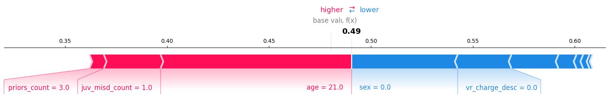

Chapter 25

# Explainability

Machine-learned models are often opaque and make predictions in ways we do not understand—we often use machine learning precisely when we do not know how to solve a problem with fixed, easy-to-understand rules in the first place. There are many examples of useful models that outperform most humans on specific tasks, such as diagnosing some medical conditions, speech recognition, and translating text, even though we have no idea of how those models work. Without understanding *how* a model works and *why* a model makes specific predictions, it can be difficult to trust a model, to audit it, to appeal a decision, or to debug problems. 

In this chapter, we provide an overview of the many approaches to explaining machine-learned models. These days, explainability tools are primarily used primarily by developers for model evaluation and debugging. Without them, developers often have a hard time understanding why something went wrong and how to improve, such as [object detection models not recognizing cows or sheep in unusual locations](https://aiweirdness.com/post/171451900302/do-neural-nets-dream-of-electric-sheep), [a voice assistant starting music while nobody is in the apartment](https://mashable.com/article/amazon-alexa-rave-party-germany), or [an automated hiring tool automatically rejecting women](https://www.reuters.com/article/us-amazon-com-jobs-automation-insight-idUSKCN1MK08G). Beyond debugging, explainability tools are valuable in the toolbox of responsible engineers for many other tasks, including fairness audits, designing user interfaces that foster trusted human-AI collaboration, and enabling effective human oversight.

## Scenario: Proprietary Opaque Models for Recidivism Risk Assessment

In the criminal legal system, judges make difficult decisions about sentencing, granting parole, and setting bail. Judges have substantial discretion, and there have been long-standing concerns about inconsistent and biased decisions. A reform movement has called for evidence-based decision-making for sentencing and parole that assesses the likelihood of a person to re-offend after release from prison statistically rather than subjectively. With this, the movement aims to increase consistency in sentencing, replace cash bail, and reduce mass incarceration. Many jurisdictions have adopted legal mandates to introduce evidence-based risk assessment tools, and many companies now provide such tools. 

Typically, an automated recidivism risk assessment tool, such as Northpointe’s proprietary [COMPAS system](https://en.wikipedia.org/wiki/COMPAS_(software)), takes a person’s demographic data, criminal history, and survey responses to predict how likely the person is to commit another crime within three years, for example, on a ten-point scale. The prediction is based on a model trained on data from incarcerated persons released in past decades.

These risk assessment tools have become highly controversial over claims that they are biased and that their widespread use would reinforce existing bias much more than individual biased judges ever could. Much of the controversy was triggered by ProPublica’s “[Machine Bias](https://www.propublica.org/article/machine-bias-risk-assessments-in-criminal-sentencing)” article, which claimed that the tool made mistakes at different rates for different racial groups: “Blacks are almost twice as likely as whites to be labeled a higher risk but not actually re-offend.”

Without the ability to inspect the model, it is challenging to audit it for fairness, for example, to determine whether the model accurately assesses risks for different populations. This has led to extensive controversy in the academic literature and press. The COMPAS developers and various journalists and researchers have voiced divergent views about whether the model is fair and how to determine what is fair, but discussions are hampered by a lack of access to the internals of the actual model. However, it is not obvious that we could easily interpret and audit a model with thousands or millions of parameters, even if we had access.

In contrast, consider a scorecard for the same problem describing positive and negative factors with points and using a simple threshold on those points to assess the risk. Researchers have trained such a scorecard on the same data with similar accuracy to the commercial tools. The scorecard representation is compact and easy to understand; a judge can see all inputs and decision boundaries used. It is easy to audit this model for certain notions of fairness, for example, to see that neither race nor any obvious correlated attribute is used in this model and neither is the severity of the crime (that the judge is supposed to assess independently). It is also clear that the model considers age, which could inform a policy discussion about whether that is appropriate.

<figure>

<figcaption>

An interpretable model for recidivism prediction as a scorecard from 🗎 Cynthia Rudin and Berk Ustun. “[Optimized Scoring Systems: Toward Trust in Machine Learning for Healthcare and Criminal Justice](https://users.cs.duke.edu/~cynthia/docs/WagnerPrizeCurrent.pdf).” Interfaces 48, no. 5 (2018): 449–466.

</figcaption>
</figure>

## Defining Explainability

Explainability is one of those concepts that has an intuitive meaning but is difficult to capture precisely. In a nutshell, we want to know how a model works generally or how it makes individual decisions. For example, given a specific person assessed by a judge, we want to know what factors were decisive for predicting a high recidivism risk. However, it may not be possible to causally separate hundreds of relevant factors that together informed the decision with complex thresholds and interactions, so we might focus on a *partial* explanation of the most influential factors. This then raises the problem that there are multiple partial explanations for every prediction that can all be correct at the same time, even though they convey different information. But even then, all of this just explains how a specific model used the provided inputs to make a decision, but not why the model is right. For example, we might ask for an explanation of why the model uses age as an important factor with decision boundaries at twenty-four and forty—explaining this might require understanding the learning algorithm and the data. However, explanations may become so complex that they become effectively incomprehensible even for experts, returning to the original problem of opaque models. 

Since models are “just” algorithms that we can dissect, and since many models replace well-deliberated handwritten rules, we may have high expectations of how to explain opaque machine-learned models. However, when humans make decisions, they can rarely provide exact explanations either. A judge making a risk assessment without a tool could articulate some information considered, but it would likely be unable to explain exactly how they reached their decision and how exactly they weighed or ignored the various pieces of information. More likely, they would provide a *justification* after the fact, a carefully curated narrative that supports their decision. Explanations about models share, by necessity, many of the same limitations of explanations given by humans.

Yet, the impossibility of providing unique, exact, and concise explanations for models does not mean that model explanations are necessarily unreliable and useless. Even partial explanations can provide insights in navigating complex systems, when customized for a specific task. However, the explanations desired by a developer, a fairness auditor, a judge, and a defendant will differ substantially, as does the purpose of the explanation.

### Interpretability, Explainability, Justifications, and Transparency

There are many terms used to capture to what degree humans can understand the internals of a model or what factors are used in a decision, including *interpretability*, *explainability*, *justification*, and *transparency*. These and other terms are not used consistently in the research literature, and many competing and contradictory definitions exist. We use the following distinctions.

**Interpretability.**
 A model is *intrinsically interpretable* if a human can understand the internal workings of the model, either the entire model at once or at least the parts of the model relevant to a given prediction. This may include understanding decision rules and cutoffs and the ability to manually derive the outputs of the model. For example, the scorecard for the recidivism model can be considered interpretable, as it is compact and simple enough to be fully understood. 

**Explainability.**
 A *model* is *explainable* if we find a mechanism to provide (partial) information about the workings of the model, such as identifying influential features. We consider a model’s *prediction* explainable if a mechanism can provide (partial) information about the prediction, such as identifying which parts of an input were most important for the resulting prediction or which changes to an input would result in a different prediction. For example, for the proprietary COMPAS model for recidivism prediction, an explanation may indicate that the model heavily relies on the age, but not the sex of the defendant. Explanations are usually easy to derive from intrinsically interpretable models, but can be provided also for models of which humans may not understand the internals. If explanations are derived from external observations of a model rather than the model’s internals, they are usually called *post hoc explanations.*

**Justification.**
 A justification is a post hoc narrative explaining how a decision is consistent with a set of rules, so the decision can be reviewed. The justification is not necessarily a complete explanation of the reasoning process, and different justifications may support opposing decisions for the same inputs. In the legal system, judges need to justify their decisions in writing, explaining how the decision conforms with existing laws, precedents, and principles—this enables scrutiny and due process.

**Transparency.**
 Transparency describes the disclosure of information about the system to its *users* or *the public*, possibly including information about the model, the training data, the training process, and explanations for individual decisions. Transparency usually requires that the disclosed information is clear and accessible to non-experts. For example, the judge might need to disclose the use of the recidivism risk assessment tool, and the producer of that tool may disclose data sources and summary results of model evaluations and fairness audits. Transparency usually aims at building trust by justifying design decisions, demonstrating good engineering practices, and enabling some scrutiny. In contrast to the more technical notions of interpretability and explainability, transparency is the preferred term in policy discussions about responsible machine learning, as it focuses on the scrutability of interactions between the system and its users or society at large, to which we will return in chapter *[Transparency and Accountability](29-transparency-and-accountability.md)*. 

### Purposes of Explanations

Explanations of models and predictions are useful in many settings and can be an important tool for responsible engineers. While there are many different approaches to explaining models and predictions, it is important to tailor them to the specific use case.

**Model debugging.**
 According to a [2020 study](https://dl.acm.org/doi/abs/10.1145/3351095.3375624), by far the most common use case for explainability is debugging models. Developers want to vet the model as a sanity check to see whether it makes reasonable predictions for the expected reasons given some examples, and they want to understand *why* models perform poorly on some inputs, for example, identifying shortcut learning. For example, developers of a recidivism model could debug suspicious predictions and see whether the model has picked up on unexpected features like the height of the accused. Developers tend to use explainability tools interactively and can often seek technical explanations that would not be suitable for end users.

**Auditing.**
 We can assess a model’s *fairness*, *safety*, or *security* much more reliably if we understand the internals of a model, and even partial explanations may provide useful insights. For example, it is trivial to identify in the interpretable recidivism scorecard how decisions rely on sensitive attributes (e.g., race, sex) or their correlates. It can also be helpful to understand a model’s decision boundaries when reasoning about the robustness of a model, for example, whether the recidivism risk scores can easily be manipulated with different answers to survey questions about anger management. 

**Human-AI collaboration and human oversight.**
 In many human-in-the-loop designs (see chapter *[Planning for Mistakes](07-planning-for-mistakes.md)*), humans work together with software systems or directly interpret the predictions of models. For example, a judge is supposed to consider the recidivism risk score as part of their judgment, but in practice, many judges do not trust the tools and do not consider the risk scores. Even if a decision is fully automated, many systems provide humans the ability to override decisions, for example, to approve a loan previously rejected by an automated system in an appeals process. To effectively incorporate a model’s prediction into human decisions and to decide when to override an automated decision, humans need to understand when and how they can trust the model. Explanations that align with the human’s intuition may encourage trust;  explanations highlighting faulty reasoning can reduce unjustified overreliance on the model. For example, a judge may decide to trust the model’s risk assessment if the score is supported with a plausible justification identifying which attributes support the risk score and might override the score if those attributes are considered irrelevant to the case. Explanations must be tailored to the humans’ explanation needs and technical ability.

**Dignity and appeals.**
 Exposing humans to inscrutable automated decisions can undermine their sense of control and autonomy, dehumanizing them to data points rather than individuals. Providing transparency about how decisions were made in a way that is understandable to the affected individuals can restore a sense of control. In some cases, explanations can empower affected individuals to change their behavior toward better outcomes (both in positive and malicious ways), for example, opting for vocational training while incarcerated if it increases their chance of parole. It also empowers individuals to appeal unfair decisions by pointing out incorrect explanations, for example, when learning that the wrong age was considered to compute their recidivism risk.

**Discovery and science.**
 Finally, machine learning is increasingly used for discovery and science to understand relationships, not just make predictions. Statistical modeling has long been used in science to uncover potential *causal* relationships, such as testing which interventions reduce recidivism risk. Machine-learning techniques may provide opportunities to discover more complicated patterns that may involve complex interactions among many features and elude simple rules, and explanation tools can help to make sense of what was learned by opaque models. For example, [Vox](https://www.vox.com/unexplainable/22323113/unexplainable-smell-mystery-nanonose) reported how opaque machine-learned models can help to build a robot nose even though science does not yet have a good understanding of how humans or animals smell things; we know some components of smell, but cannot put those together to a comprehensive understanding. Extracting explanations from complex machine-learned models may be a way forward to create scientific hypotheses that can be experimentally tested.

## Explaining a Model

The first group of explanation techniques aims to explain how a model works overall, independent of a specific input. We might be interested in understanding decision rules and decision boundaries or just generally which features the model depends on most. 

### Intrinsically Interpretable Models

Some models are simple and small enough that users with sufficient technical knowledge can directly inspect the model structure and understand it in its entirety. For example, the recidivism scorecard is effectively a simple linear model with five factors based on three features (age at release, number of prior arrests, and prior arrest for misdemeanor) that is understandable in its entirety, even to nontechnical users. It may not be clear how the decision boundaries were established, but it is obvious what features are used, how they interact, and what the decision boundaries are.

In general, *linear models* are widely considered inherently interpretable as long as the number of terms does not exceed the human cognitive capacity for reasoning. For models with many features, regularization techniques can help to select only the most important features (e.g., [Lasso](https://en.wikipedia.org/wiki/Lasso_(statistics))). Also, *decision trees* and rules produced by *association rule mining* are natural for humans to understand if they are small enough. In contrast, neural networks are generally considered opaque even to experts since computations involve many weights and step functions without any intuitive representation, often over large input spaces and often without easily interpretable input features. 

Since they need to match human cognitive abilities, inherently interpretable models are restricted in the number and complexity of rules that can be learned and require more emphasis on feature engineering. They are usually expected to be less accurate for many problems than more complex, non-interpretable models—or at least easier to build. Hence, practitioners often use non-interpretable models in practice and use post hoc explanations on those.

### Global Surrogate Models

One of the simplest ways to explain any model without access to its internals is to train an inherently interpretable model as a *surrogate model* based on the original model’s predictions. To this end, we select any number of data points from the target distribution and use the predictions of the original model for those data points as labels; we then train an interpretable model (e.g., sparse linear model, shallow decision tree, association rule mining) on that data and interpret the resulting surrogate model as a proxy for the target model. This approach resembles a *model extraction attack* (see chapter *[Security and Privacy](28-security-and-privacy.md)*) to create an inherently interpretable close approximation of the original model. Many external audits of proprietary models only accessible through an API use this strategy.

In our recidivism scenario, even without access to the original training data, we could train a sparse linear model based on the recidivism risk scores predicted by the proprietary COMPAS recidivism model for many hypothetical or real persons. We could then inspect whether that surrogate model relies on race, sex, or age. Similarly, we could use *association rule mining* on the predictions created by the original model to identify rules that explain high-confidence predictions for some regions of the input distribution, such as identifying that the model reliably predicts rearrest if the accused is between eighteen and twenty-four years old. 

While surrogate models are flexible, intuitive, and easy to use, it is important to remember they are only proxies for the target model and not necessarily faithful. Hence, explanations derived from the surrogate model may not be true to the target model. For example, a surrogate model for the COMPAS model may learn to use sex for its predictions, even if sex was not used in the original model. While it is possible to measure how well the surrogate model fits the target model (e.g., R2 score), a strong fit still does not guarantee correct explanations. Also, if it is possible to learn a highly accurate surrogate model, we should question why we are not using an interpretable model to begin with.

### Feature Importance

*Feature importance* measures how much a model relies on its different features. While it does not provide deep insights into the inner workings of a model, feature importance explains which features are generally the most important when making decisions. It provides highly compressed global insights about the model. 

Typically, feature importance is determined for a given feature by measuring how much a model loses accuracy on some evaluation data if it does not have access to that feature. We simply compare the accuracy of the model measured on labeled data with the accuracy of the model after removing the feature from that data. In practice, rather than removing the feature, all values in the feature column are shuffled. If accuracy differs between the two evaluations, this suggests that the model relies on the feature for its predictions. The larger the accuracy difference, the more the model depends on the feature. For example, in our recidivism prediction model, we might find that removing sex barely affects accuracy, but that the model performs worse without access to an individual’s age and much worse without access to the number of prior arrests. 

<figure>

<figcaption>

Feature importance plotted for a deep neural network trained on the COMPAS dataset for recidivism risk assessment, showing that the description of the offense, the number of prior arrests, and age are much more important for accurate predictions for this model than sex or race.

</figcaption>
</figure>

### Partial Dependence Plots

While *feature importance* computes the average explanatory power added by each feature, more visual explanations of *partial dependence plots* and *individual conditional expectation plots* help to better understand how changes to features influence average and individual predictions. In a nutshell, such plots show the predicted value for a single input depending on the value of one feature while all other features are held constant—for example, we may observe how the predicted recidivism risk for an individual decreases if we manipulate their age. A partial dependence plot then aggregates these trends across all test data. Beyond feature influence, these plots allow us to inspect whether a feature has a linear influence on predictions, a more complex behavior, or none at all. Similar to feature importance, these plots can be created without access to model internals by simply probing the predictions for many possible inputs with manipulated features.

<figure>

<figcaption>

Combined plots for partial dependence and individual conditional expectation for a neural network trained to predict recidivism risk with the COMPAS data. The left plot shows how the predicted recidivism risk increases with more prior arrests for sampled individuals shown in grey and the average of all individuals in the test data shown in black. The other plots show a decrease with age and a marginally increase with more juvenile felony arrests.

</figcaption>
</figure>

## Explaining a Prediction

Whereas the techniques described in the previous section provide explanations for the entire model, in many situations, we want to understand why a model made a prediction for a specific input. For example, we might explain that a person’s high number of prior arrests contributed heavily or was even sufficient as the only factor to predict high recidivism risk for that person.

While explanation tools typically focus on explaining predictions from opaque models, often without access to model internals, it can be instructive to consider what explanation we would provide for a prediction made by an inherently interpretable model where all internals can be inspected. Let us consider the recidivism scorecard example above and ask for an explanation why it predicts that a twenty-six-year-old white woman with three prior arrests, including a misdemeanor arrest, is predicted to *not* be arrested for another offense. Since the scorecard is inherently interpretable, we can simply manually execute all steps of the model with the concrete feature values—scoring a single point for the misdemeanor arrest, which is below the model’s threshold for predicting another arrest. Abstracting from the specific internals of the model, we can answer a number of common questions:

  * *What features were most influential for the prediction?* First, we can observe that sex and race were not used at all and, hence, had no influence on this prediction. Second, we can observe that age and prior offenses are influential: being older than twenty-four and having fewer than five prior arrests were influential features for predicting low recidivism risk, whereas having any prior arrest, having a prior misdemeanor arrest, being below forty were (weaker) features that count toward an increased recidivism risk.

  * *How robust is the prediction?* We can observe that the prediction would be the same regardless of the person’s sex and race and would not change for any age above twenty-four and any fewer than five arrests.

  * *Under what alternative conditions would the prediction be different?* We can observe that the same person would have predicted to commit another crime if she was twenty-three, if she had eleven prior arrests, among many other alternative conditions.

In the following, we discuss three explanation strategies that provide similar explanations for any kind of model without access to model internals.

### Feature Influences

Many explainability techniques try to quantify how much each feature contributes to a specific prediction, typically highlighting the most influential features as an explanation. For example, we may attempt to quantify to what degree a specific recidivism risk prediction can be attributed to age and prior arrests. For images, feature influence is typically shown as a heat map highlighting the most influential pixels in a prediction. When linear models are used, feature influence can be extracted directly from model coefficients, but computing approximate influences for nonlinear models requires some creativity. We illustrate LIME as an easy-to-understand idea and SHAP as a state-of-the-art model-agnostic approach, but many others are specialized for certain models.

**LIME.**
 LIME is a relatively simple and intuitive technique based on the idea of surrogate models. However, instead of learning a global surrogate model explaining how the model works in general, LIME learns a linear local surrogate model for the decision boundary near the input to be explained. To learn a surrogate model for the nearby decision boundary, LIME samples data points from the entire input distribution but weighs samples close to the target input higher when training the surrogate model. The resulting linear local surrogate model can then be used to identify which features were most influential with regard to that nearby decision boundary simply by interpreting the surrogate model’s coefficients. The results are often shown as a bar chart of the influence of the most influential features, similar to feature importance results for the entire model. Feature influences are easy to interpret and accessible to end users if the features themselves are meaningful.

<figure>

![Two plots with age on the x axis and prior arrests on the y axis and the same curve going through the plot to indicate the model's decision boundary. Each plot highlights one point near the decision boundary, which is surrounded by gray dots indicating sampled data points, where gray dots near the point of interest are much larger than ones further away. Near each point a line is drawn through the diagram to indicate the linear approximation of the nearby decision boundary. The line roughly tracks the angle of the nearby decision boundary but otherwise does not follow the decision boundary in other parts of the plot. The two approximated lines are very different between the two plots.](./img/25-lime.svg)

<figcaption>

A visual illustration of LIME for a learned nonlinear decision boundary in our recidivism scenario: we collect model predictions for many data points, but heavily weigh data points near the point we want to explain to each learn a linear model that approximates the decision boundary closest to the point of interest. In the left example, the prediction is “no rearrest” and it is influenced by both features, but in the right example the prediction is “rearrest” and it is almost exclusively explained by the number of prior arrests. Note how both predictions are explained with regard to different local decision boundaries.

</figcaption>
</figure>

Beyond tabular data, LIME has been used on text and images, highlighting which words or pixels were influential, using the same strategy of learning a linear local surrogate model from the original model’s predictions using mutations of the text or image of interest as inputs, with higher weights for mutations that are more similar to the original input. Visualizations highlighting influential words or pixels are often used to detect shortcut learning, when the model’s decision heavily relies on words or pixels that should have not been relevant to the task, such as using the background of an image for detecting the object in the foreground.

Note that, by construction, feature-influence explanations are local and only explain the influence for the nearest decision boundary, but not other possible decision boundaries—making the explanation necessarily partial. In addition, with its focus on local decision boundaries approximated with sampling, LIME’s feature influence values are known to be often unstable.

<figure>

<figcaption>

Example of visually illustrating which pixels were most important for and against predicting this image to contain a cat, from the [LIME documentation](https://github.com/marcotcr/lime). [Online-only figure.]

</figcaption>
</figure>

**SHAP.**
 The SHAP method has become the most common method for explaining model predictions, largely superseding LIME as a more stable alternative. SHAP provides local explanations of feature influences, similar to LIME, but computes the influences differently. SHAP is based on Shapley values, which have a solid game-theoretic foundation, describing the average influence of each feature when considered together with other features in a fair allocation (technically, “the Shapley value is the average marginal contribution of a feature value across all possible coalitions”). The SHAP calculations rely on probing the model for many predictions of manipulated inputs of the original input to explain, similar to LIME, but the specific technical steps are complex and not intuitive; see the suggested readings for details. Shapley values are expensive to compute precisely, but implementations and approximations are widely available as easy-to-use libraries.

<figure>

<figcaption>

An example of a force plot visualizing SHAP values. Each arrow indicates the relative influence of individual features, here showing that the number of prior arrests has only a small influence toward predicting rearrest and the person’s age has a strong influence, whereas the person’s sex (female) has a moderate influence against predicting rearrest for this neural network model’s prediction.

</figcaption>
</figure>

### Anchors

Where feature influences describe how much individual features contribute to a prediction, *anchors* try to capture a small subset of constraints *sufficient* for a prediction. In a nutshell, an anchor describes a region of the input space around the input of interest, where all inputs in that region (likely) yield the same prediction. Ideally, the region can be described with as few constraints as possible to include many inputs. For example, our scorecard version of the recidivism model predicts high recidivism risk for every person under forty with five or more prior arrests, independent of any other features. In an object detection task, an anchor identifies the minimum number of pixels needed to reach a classification. Anchors are easy to interpret and can be useful for debugging, can help to understand which features are largely irrelevant to a prediction, and provide insights into how robust a prediction is.

<figure>

![A plot with age on the x axis and prior arrests on the y axis, a nonlinear decision boundary through the plot, and two data points highlighted on either side of the decision boundary (same setup as previous plot for LIME). Each data point is surrounded by a rectangle, labeled anchor, that stretches over a large area but does not cross the decision boundary or the axes. Next to the plot a photo of a train on a track in a wooded hilly landscape where pixels for the steam locomotive, the first car, and the track in front of the engine are highlighted.](./img/25-achor.svg)

<figcaption>

A visual illustration of anchors. On the left, anchors describe the regions around two recidivism predictions near a nonlinear decision boundary that yield the same prediction. On the right, pixels sufficient for recognizing a steam locomotive in a photo are highlighted, showing that the object-detection model relies on significant parts of the image beyond the actual engine, illustrating how the model requires context or might use a shortcut.

</figcaption>
</figure>

Anchors are straightforward to derive from decision trees. In addition, techniques have been developed to search for anchors in predictions of any opaque models by sampling many model predictions to find a large but compactly described region with stable predictions. These techniques can be applied to many domains, including tabular data and images.

### Counterfactual Explanations

Counterfactual explanations describe conditions under which the prediction would have been different; for example, “if the accused had one fewer prior arrests, the model would have predicted no future arrests.” Counterfactual explanations are intuitive for humans, providing contrastive and selective explanations for a specific prediction. Counterfactual explanations might be considered for end-users, especially if users can change inputs to achieve a different outcome, which, like in our recidivism setting, is not always the case.

<figure>

![A plot with age on the x axis and prior arrests on the y axis, a nonlinear decision boundary through the plot, and two data points highlighted on either side of the decision boundary (same setup as previous plot for anchors and LIME). Corresponding to each data point, there are several additional points shown that are just on the other side of the decision boundary, sometimes passing the closes part of the decision boundary and sometimes passing one further away. Each additional data point is labeled with an explanation in a legend, such as "Predict arrest if 3 years younger" that explains how the new point relates to the original point by moving 3 years on the x axis.](./img/25-counterfactual.svg)

<figcaption>

Examples of counterfactual explanations for the nonlinear recidivism model. For each input of interest, there are many potential counterfactuals, some requiring smaller adjustments (e.g., counterfactual 1 is a much smaller change than 4) or fewer feature adjustments than others (e.g., counterfactual 2 adjusts two features, all others only one).

</figcaption>
</figure>

For every prediction, there are many possible changes that would alter the prediction, for example, “if the accused had one fewer prior arrest”, “if the accused was fifteen years older,” and “if the accused was female and had one more arrest.” This is known as the *Rashomon effect* after the famous movie by the same name, in which multiple contradictory explanations are offered for the murder of a Samurai from the perspective of different narrators. Typically, we aim to create a counterfactual  example with the smallest change or the change to the fewest features, but there may be many other factors to decide which explanation might be the most useful. 

Approaches to finding counterfactual examples use more or less sophisticated search strategies to find nearby inputs with different predictions—that is, find the minimal change to an input to cross the model’s decision boundary. This is equivalent to finding adversarial examples (see chapter *[Security and Privacy](28-security-and-privacy.md)*). Search is usually more effective with access to model internals or access to confidence values for predictions (e.g., hill climbing, Nelder–Mead). Search strategies can use different distance functions, to favor explanations changing fewer features or favor explanations changing only a specific subset of features like those that can be influenced by users. 

### Similarity

Predictions based on *nearest neighbors* algorithms are sometimes considered inherently interpretable (assuming an understandable distance function and meaningful instances) because predictions are purely based on similarity with labeled training data, and the nearest similar data points can be provided as explanations. For example, recidivism predictions could be explained by showing cases of similar cases. Some recent research has started building inherently interpretable image classification models by segmenting photos and using similarity-based approaches to identify interpretable features.

## Explaining Data and Training

Finally, various techniques support understanding how the training data influences the model, which can be useful for debugging data quality issues. We briefly outline two strategies.

*Prototypes* are instances in the training data that are representative of a certain class, whereas *criticisms* are instances that are not well represented by prototypes. In a sense, criticisms are outliers in the training data that may indicate data that is incorrectly labeled or unusual (either out of distribution or not well supported by training data). In the recidivism example, we might find clusters of people in past records with similar criminal histories, and we might find some outliers who get rearrested even though they are very unlike most other instances in the training set that get rearrested. Such explanations might encourage data scientists to inspect training data and possibly fix data issues or collect more features. Prototypes and criticisms can be identified with various techniques based on clustering the training data. 

Another strategy to debug training data is to search for *influential instances*, which are instances in the training data that have an unusually large influence on the decision boundaries of the model. Influential instances are often outliers (possibly mislabeled) in areas of the input space that are not well represented in the training data (e.g., outside the target distribution). For example, we may have a single outlier of an eighty-five-year-old who gets regularly arrested, who strongly shapes the decision boundaries of age in the model. Influential instances can be determined by training the model repeatedly by leaving out one data point at a time, comparing the parameters of the resulting models; more computationally efficient approximations of this strategy exist for many models.

There are lots of other ideas in this space, such as identifying a [trusted subset of training data](https://arxiv.org/pdf/1801.08019.pdf) to observe how other less trusted training data influences the model toward wrong predictions on the trusted subset, to [slice the test data](https://arxiv.org/abs/1807.06068) in different ways to identify regions with lower quality, or to [design visualizations](http://citeseerx.ist.psu.edu/viewdoc/download?doi=10.1.1.697.1689&rep=rep1&type=pdf) to inspect possibly mislabeled training data.

## The Dark Side of Explanations

Explanations can be powerful mechanisms to establish trust in predictions of a model. Unfortunately, such trust is not always earned or deserved.

First, explanations of opaque models are approximations, and not always faithful to the model. In this sense, they may be misleading or wrong and only provide an illusion of understanding. For high-stakes decisions such as sentencing and bail decisions, approximations may not be acceptable. Inherently interpretable models that can be fully understood, such as the scorecard model, are more suitable and lend themselves to accurate explanations, of the model and of individual predictions.

In her paper by the same title, Cynthia Rudin makes a forceful [argument](https://arxiv.org/abs/1811.10154) to “stop explaining opaque machine-learning models for high-stakes decisions and use interpretable models instead.” She argues that in most cases, interpretable models can be just as accurate as opaque models, though possibly at the cost of more needed effort for data analysis and feature engineering. She argues that transparent and interpretable models are needed for trust in high-stakes decisions, where public confidence is important and audits need to be possible (see also chapter *[Transparency and Accountability](29-transparency-and-accountability.md)*). When outside information needs to be combined with the model's prediction, it is essential to understand how the model works. In contrast, she argues, using opaque models with ex-post explanations leads to complex decision paths that are ripe for human error. 

Second, explanations, even those that are faithful to the model, can lead to overconfidence in the ability of a model as several experiments have shown. In situations where users may naturally mistrust a model and use their own judgement to override some of the model’s predictions, users are less likely to correct the model when explanations are provided. Even though the prediction is wrong, the corresponding explanation signals a misleading level of confidence, leading to inappropriately high levels of trust. This means that explanations can be used to manipulate users to trust a model, even when they should not.

Third, most models and their predictions are so complex that explanations need to be designed to be selective and incomplete. In addition, the system usually needs to select between multiple alternative explanations. Experts and end users may not be able to recognize when explanations are misleading or capture only part of the truth. This leaves many opportunities for bad actors to intentionally manipulate users with carefully selected explanations.

## Summary

Machine learning can learn incredibly complex rules from data that may be difficult or impossible to understand by humans. Yet, some form of understanding is helpful for many tasks, from debugging to auditing to encouraging trust. 

While some models can be considered inherently interpretable, there are many post hoc explanation techniques that can be applied to all kinds of models. It is possible to explain aspects of the entire model, such as which features are most predictive, to explain individual predictions, such as explaining which small changes would change the prediction, to explaining aspects of how the training data influences the model.

These days, most explanations are used internally for debugging, but there is a lot of interest and, in some cases, even legal requirements to provide explanations to end users. We return to end-user explanations, including user interface challenges and related concerns about gaming and manipulation in chapter *[Transparency and Accountability](29-transparency-and-accountability.md)*.

## Further Readings

  * An excellent book diving deep into the topic and providing a comprehensive and technical overview of many explainability approaches, including all techniques introduced in this chapter: 🕮 Molnar, Christoph. *[Interpretable Machine Learning: A Guide for Making Black Box Models Explainable](https://christophm.github.io/interpretable-ml-book/)*. 2019.

  * The ProPublica article that triggered a large controversy on fairness in recidivism risk prediction and fairness in machine learning more broadly: 📰 Angwin, Julia, Jeff Larson, Surya Mattu, and Lauren Kirchner. “[Machine Bias](https://www.propublica.org/article/machine-bias-risk-assessments-in-criminal-sentencing).” *ProPublica*, 2016.

  * Examples of popular libraries implementing explainability techniques with extensive documentation and examples: 🔗 [https://pypi.org/project/alibi/](https://pypi.org/project/alibi/) 🔗 [https://pypi.org/project/shap/](https://pypi.org/project/shap/) 🔗 [https://pypi.org/project/eli5/](https://pypi.org/project/eli5/).  

  * An interview study with practitioners about explainability in production system, including purposes and most used techniques: 🗎 Bhatt, Umang, Alice Xiang, Shubham Sharma, Adrian Weller, Ankur Taly, Yunhan Jia, Joydeep Ghosh, Ruchir Puri, José MF Moura, and Peter Eckersley. “[Explainable Machine Learning in Deployment](https://dl.acm.org/doi/abs/10.1145/3351095.3375624).” In *Proceedings of the Conference on Fairness, Accountability, and Transparency*, pp. 648–657. 2020.

  * The SliceFinder tool automatically dissects a model to identify regions with lower prediction accuracy: 🗎 Chung, Yeounoh, Neoklis Polyzotis, Kihyun Tae, and Steven Euijong Whang. “[Automated Data Slicing for Model Validation: A Big Data-AI Integration Approach](https://arxiv.org/abs/1807.06068).” *IEEE Transactions on Knowledge and Data Engineering*, 2019.

  * A neat idea for debugging training data to use a trusted subset of the data to see whether other untrusted training data is responsible for wrong predictions: 🗎 Zhang, Xuezhou, Xiaojin Zhu, and Stephen Wright. “[Training Set Debugging Using Trusted Items](https://arxiv.org/pdf/1801.08019.pdf).” In *AAAI Conference on Artificial Intelligence*, 2018.

  * A visual debugging tool to explore wrong predictions and possible causes, including mislabeled training data, missing features, and outliers: 🗎 Amershi, Saleema, Max Chickering, Steven M. Drucker, Bongshin Lee, Patrice Simard, and Jina Suh. “[Modeltracker: Redesigning Performance Analysis Tools for Machine Learning](https://maxchickering.com/publications/CHI2015.pdf).” In *Proceedings of the Conference on Human Factors in Computing Systems (CHI)*, pp. 337–346. 2015.

  * A story about how explainability tools may help to understand how smell works from a deep neural network: 📰 Hassenfeld, Noam. “[Cancer Has a Smell. Someday Your Phone May Detect It](https://www.vox.com/unexplainable/22323113/unexplainable-smell-mystery-nanonose).” *Vox*, 2022.

  * Examples of machine learning techniques that intentionally build inherently interpretable models: 🗎 Rudin, Cynthia, and Berk Ustun. “[Optimized Scoring Systems: Toward Trust in Machine Learning for Healthcare and Criminal Justice](https://users.cs.duke.edu/~cynthia/docs/WagnerPrizeCurrent.pdf).” *Interfaces* 48, no. 5 (2018): 449–466. 🗎 Chen, Chaofan, Oscar Li, Chaofan Tao, Alina Jade Barnett, Jonathan Su, and Cynthia Rudin. “[This Looks like That: Deep Learning for Interpretable Image Recognition](https://arxiv.org/abs/1806.10574).” Proceedings of *NeurIPS,* 2019.

  * A discussion on why inherent interpretability is preferable over post hoc explanation: 🗎 Rudin, Cynthia. “[Stop Explaining Black Box Machine Learning Models for High Stakes Decisions and Use Interpretable Models Instead](https://arxiv.org/abs/1811.10154).” *Nature Machine Intelligence* 1, no. 5 (2019): 206–215. 

---
*As all chapters, this text is released under <a href="https://creativecommons.org/licenses/by-nc-nd/4.0/">Creative Commons BY-NC-ND 4.0</a> license.*
*Last updated on 2024-06-17.*
