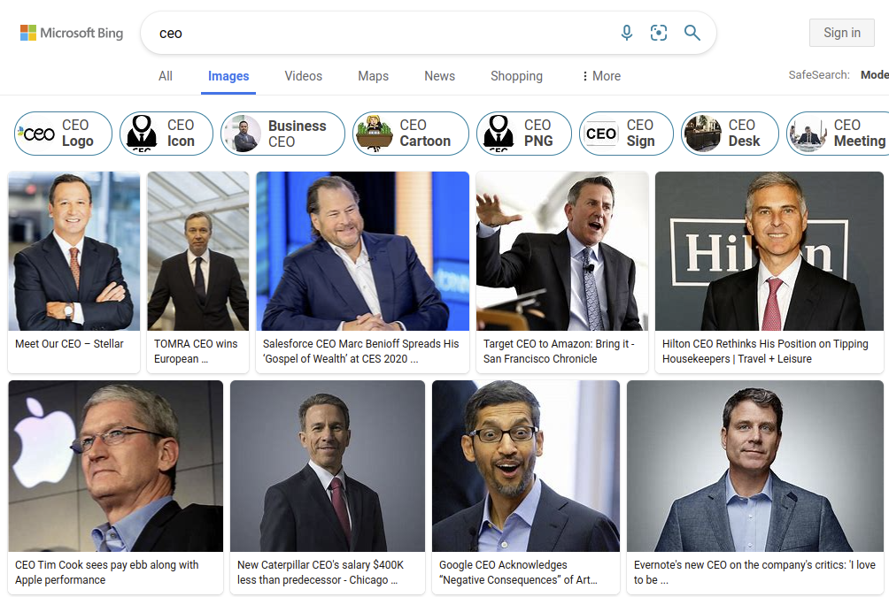

Chapter 26

# Fairness

Fairness is one of the most discussed topics in machine learning. Models trained with data can pick up on biases in that data and possibly even amplify existing biases. Unfair models can lead to products that simply do not work well for some subpopulations, that produce discrimination by reinforcing stereotypes, and that create inequality. There are lots and lots of examples of unfair models, such as medical diagnosis models that have low accuracy for anybody but white male adults, recidivism risk assessment models that may more often suggest to keep Black people incarcerated, and language models that reinforce gender stereotypes by assuming that male healthcare workers are doctors and female ones are nurses.

The concept of fairness is difficult to capture precisely. Over thousands of years philosophers have discussed what decisions are fair, and over hundreds of years societies have attempted to regulate certain (different) notions of fairness into law. The machine-learning community has extensively discussed how to measure fairness and how to change the machine-learning pipeline to optimize the model for such fairness measures. As with other responsible engineering concerns, fairness is clearly not just a model-level concern but requires reasoning about the entire system and how the system interacts with users and the rest of the world. Fairness needs to be discussed throughout all phases of the development process and during operations, which includes both ML and non-ML parts of the system. Such discussions are often necessarily political in nature—for instance, different stakeholders may have different priorities and conflicting preferences for fairness. 

In this chapter, we proceed in three steps. First, we start with an overview of common concerns and harms that are discussed in the context of fairness in machine learning and introduce different notions of fairness. Second, we give an overview of approaches to measure and improve fairness at the model level. Finally, we zoom out and discuss system-wide considerations, including the important role of requirements engineering and  process integration when it comes to fairness. 

The topic of fairness in machine learning is too nuanced and complex to be comprehensively covered in this chapter. At this point, there are thousands of papers published on machine-learning fairness each year and entire conferences dedicated to the topic. Following the notion of T-shaped professionals, we will provide an intuitive overview of the foundational concerns, which should help to have a sensible conversation on the topic and identify when to seek help and dive deeper. Also note that examples in this chapter are shaped by contemporary discourse and terminology used in the US at the time of writing, which may require some abstraction to translate to other cultural contexts.

## Scenario: Mortgage Applications

As a running example, we will use automated credit decisions for mortgage applications as part of the software infrastructure of a bank. A mortgage loan by a bank provides a large amount of money to a home buyer to be repaid over a lengthy period. To an applicant, access to credit can be a crucial economic opportunity, and exclusion can trap individuals with limited upward mobility. To a bank, whether to approve a mortgage application is a high-stakes decision, involving substantial financial risk. A bank needs to decide whether they believe the applicant will be able to repay the loan—if the applicant repays the loan, the bank makes a profit from interests and fees, but if the applicant defaults on the loan, the bank may lose substantial amounts of money, especially if the home is by then worth less than the loan.

Applicants will typically provide lots of information (directly or indirectly), such as income, other debt, and past payment behavior, and the value of the home, that the bank uses to predict whether the loan will be repaid and whether the expected profit is worth the risk for a specific application at a given interest rate. Information about past debt and payments is often compressed in a proprietary *credit score*, which generally intends to predict the applicant’s creditworthiness, tracked by third-party credit bureaus. 

Mortgage applications are usually decided by bank employees. There has been a documented history of discrimination in lending decisions in the US, especially practices known as [redlining](https://en.wikipedia.org/wiki/Redlining) where banks refused loans in certain neighborhoods or charged higher interest rates. Since credit provides economic opportunities and many families accumulate wealth through homeownership, discrimination in lending practices has contributed to significant [wealth disparities](https://en.wikipedia.org/wiki/Racial_inequality_in_the_United_States) between different population groups. For example, the [Federal Reserve](https://www.federalreserve.gov/publications/files/scf20.pdf) reports that in 2019 white families on average held 7.8 times more wealth than Black families in the US and earned 70 percent more income. These differences also have downstream consequences in mortgage applications.

<figure>

<figcaption>

Median family net worth and income by different subpopulations according to the Federal Reserve’s [Survey of Consumer Finances](https://www.federalreserve.gov/econres/scfindex.htm).

</figcaption>
</figure>

Automating mortgage decisions has the potential to be more objective, for example, excluding human bias and focusing only on factors that actually predict the ability to repay a loan based on past data. However, as we will discuss, it raises many questions about what is considered fair and whether a model trained on biased historic data can be fair.

## Fairness Concepts

There is no single universally accepted definition of fairness. In essence, fairness discourse asks questions about how to treat people and whether treating different groups of people differently is ethical. If two groups of people are systematically treated differently, this is often considered unfair. Unfair behavior of humans to other humans is often rooted in animosity or preference for certain salient attributes of members of a social group, such as gender, skin color, ethnicity or nationality, class, age, and sexual preferences. 

### Notions of Fairness and Unequal Starting Positions

**What is fair?**
 Different people may not necessarily agree on what is fair, and the notion of fairness can be context-dependent, so the same person may prefer different notions of fairness in different contexts. To sidestep difficult known associations and complexities of mortgage lending, we will first illustrate different views on fairness with a simple example of dividing a pie baked together by a group of people:

  * Equal slices: Every member of the group gets an equally sized slice of pie. The size of the slice is independent of each individual person’s attributes or preferences and independent of how much work they put into baking. Everybody in the group is considered equal, and such any difference in slice size would be considered unfair.

  * Bigger slices for active bakers: The group members recognize that some members were more active when baking the pie, whereas others mostly just sat back. They give larger pieces of pie to those people who were most active in baking. Giving everybody the same slice size would be considered unfair if members put in substantially different amounts of work.

  * Bigger slices for inexperienced members: The group gives bigger slices to members with less baking experience (e.g., children), because they have fewer opportunities to bake pie on their own and benefit more from the collective baking experience. Simply considering individual contributions while assuming that all group members have the same background and experiences would be considered unfair to those with fewer opportunities in the past.

  * Bigger slices for hungry people: The group recognizes that not all members in the group want the same amount of pie. So the group assigns larger pieces to those members who are more hungry. Other forms of dividing the pie would be considered unfair, because it does not consider the different needs of the individual members.

  * More pie for everybody: Everybody should have as much pie as they want. If necessary, the group bakes more until everybody is happy. As long as pie is a scarce resource that needs to be divided carefully, any form of division would be considered as unfair by somebody.

While the pie scenario is simple, it illustrates several contrasting, competing, and mutually exclusive views on fairness—independent of whether decisions are made by humans or by machines. Disagreements about fairness often arise from different considerations of what is fair. The critical point of disagreement is what attributes are considered relevant or off limits, for example, whether the amount of work invested or hunger should be considered when dividing pie and whether considering age or experience is inappropriate. The fact that some attributes can be chosen deliberately by participants, whereas others may be inert or fundamentally attached to a person’s identity or history can further complicate the discussion. 

Psychology experiments show that most people share a common intuitive understanding of what is fair in many situations. For example, when rewards depend on the amount of input and participants can choose their contributions, most people find it fair to split rewards proportionally to inputs—in our pie example, we might offer larger slices to more active bakers. Also, most people agree that for a decision to be fair, personal characteristics that do not influence the reward, such as sex or age, should not be considered when dividing the rewards. 

**Fairness with unequal starting positions.**
 Contention around what is fair arises particularly when people *start from different positions*, either individually or as a group. On the one hand, different starting positions can come from inert differences, for example, younger team members will have had (on average) fewer opportunities to gain baking experience. On the other hand, different starting positions often arise from past behavior, much of which may be influenced by past injustices, such as redlining in our mortgage application example contributing to unequal wealth distributions.

When different groups start from unequal starting positions, there are three mainstream perspectives on fairness:

  * **Equality (minimize disparate treatment):** All people should be treated uniformly and given the same chance to compete, regardless of their different starting positions. Fairness focuses on the decision procedure, not the outcomes. For example, we consider how much *effort* people put into baking, independent of ability. With regard to mortgage applications, we ensure that we make mortgage decisions purely based on the applicant’s expected ability to repay the loan, regardless of group membership—that is, we assess risk as objectively as possible and give everybody with the same level of risk the same access to credit. Equality may result in unequal outcomes across groups if inputs are not equally distributed, for example, when members of one group are more often at higher risk and thus receive less credit because they have, on average, lower income. From an equality lens, a decision focusing exclusively on relevant inputs, such as the ability to repay based on current income, is considered fair, because it gives everyone the same *opportunity* (toward equality of opportunity) based on individual attributes like income and wealth rather than based on group membership. The notion of a *meritocracy* is often associated with this equality-based concept of fairness.

  * **Equity (minimize disparate impact):** Assuming different people have different starting positions, an equity-based approach favors giving more resources to members of disadvantaged groups to achieve more equal outcomes. In the mortgage scenario, we might acknowledge that past injustices have caused wealth and income disparities between groups that we should reduce by accepting more risky loans from members of disadvantaged groups. Equity-based interventions may involve deliberately giving more resources to individuals or groups with worse starting positions, an approach also known as *affirmative action*. Equity-based fairness aims at *distributive justice* that reduces *disparate impacts* (toward equality of outcomes), independent of inputs and intentions. From an equity lens, fairness is achieved when *outcomes* like access to credit are similar across groups, usually by compensating for different starting positions.

  * **Justice:** Sometimes *justice* is listed as an aspirational third option that fundamentally removes the initial imbalance from the system, typically either by removing the imbalance before the decision or by removing the need to make a decision in the first place. For example, if we paid reparations for past injustices we might see similar wealth distributions across demographic groups; if all housing was publicly owned and provided as a basic right, we may not need to make mortgage decisions. Justice-driven solutions typically rethink the entire societal system in which the imbalance existed in the first place, beyond the scope of the product for which a model is developed.

<figure>

![A comic-style drawing of three people of different height trying to watch a baseball game over a fence. In the left panel, labeled quality, each person is standing on a box, but only the tall and medium height person can watch the game, whereas the shortest (and youngest) cannot see. In the second panel, labeled equity, the boxes are rearranged that the shortest person stands on two stacked boxes and the tallest person stands on the ground, bringing them all to roughly equal height and allowing all of them to just watch over the fence.](./img/26-equity-equality-comic.png)

<figcaption>

A common visualization of the difference between equality and equity when it comes to deciding how much support to provide to individuals starting from different positions. From: [Interaction Institute for Social Change](https://interactioninstitute.org/) | Artist: [Angus Maguire](http://madewithangus.com/).

</figcaption>
</figure>

Notice that discussions around equality and equity in fairness strongly depend on what attributes and inputs are considered and which differences are associated with merits or with systemic disadvantages of certain groups. It can already be controversial whether and to what degree a group starts from a disadvantaged position. A designer of a decision procedure—with or without machine-learned models—must fundamentally decide which approach to pursue for which attributes and inputs. Different approaches may be appropriate in different contexts. These discussions are often rooted in long traditions in philosophy and law. For example, as we will discuss, US legal literature around credit decisions knows both disparate treatment and disparate impact, with courts focusing more on disparate impact in recent decades. There is also a noticeable political split, where people with right-leaning politics tend to prefer equality-based fairness notions of a meritocracy and decry equity-based initiatives as reverse discrimination (discrimination against the majority group through disparate treatment), whereas left-leaning people tend to emphasize outcomes and equity-based fairness that challenge the status quo.

### Harms from Discriminatory Decisions

In a technical sense, we say that a decision procedure *discriminates* on an attribute if it uses that attribute in the decision-making process, but practically speaking, we care about avoiding *wrongful discrimination* where the use of the attribute for a decision is not justified, and the discrimination can lead to harms. Whether using an attribute in decision-making is *justified* is domain specific. For example, the use of the customer’s sex is determining whether to approve a mortgage violates antidiscrimination laws (in the US), but the use of a patient’s sex when diagnosing a medical issue may be highly relevant as the prevalence of some conditions are highly correlated to the patient’s sex (e.g., breast cancer, suicide). 

At this point, many examples of harms from machine-learned models have been shown in research and the popular press. They can generally be divided into harms of allocation and harms of representation.

**Harms of allocation.**
 If a model wrongfully discriminates against a demographic, it can withhold resources from that demographic or provide lower quality of service to that demographic. In our mortgage example, an automated system may (wrongfully) give fewer loans to some subpopulations. An automated resume screening system may (wrongfully) allocate [fewer interview slots for female applicants](https://www.reuters.com/article/us-amazon-com-jobs-automation-insight/amazon-scraps-secret-ai-recruiting-tool-that-showed-bias-against-women-idUSKCN1MK08G). A product may provide a low quality of service to some groups, such as a face recognition model in a photo sharing service that [performs poorly on darker-skinned photos](http://proceedings.mlr.press/v81/buolamwini18a/buolamwini18a.pdf). A recidivism prediction model may (wrongfully) suggest [higher recidivism risk for Black defendants](https://www.propublica.org/article/machine-bias-risk-assessments-in-criminal-sentencing) leading to longer prison sentences. 

<figure>

<figcaption>

Results from a study illustrating how commercial gender classification systems perform poorly for certain demographics, from 🗎 Buolamwini, Joy, and Timnit Gebru. "[Gender shades: Intersectional accuracy disparities in commercial gender classification](http://proceedings.mlr.press/v81/buolamwini18a/buolamwini18a.pdf)." In Conference on Fairness, Accountability and Transparency, pp. 77-91. 2018. [Online-only figure.]

</figcaption>
</figure>

**Harms of representation.**
 Even when decisions do not allocate resources, discriminatory decisions can cause harm by skewing the representation of certain groups in organizations, reinforcing stereotypes, and (accidentally) insulting and denigrating people. Examples include natural language systems that systematically depict [doctors as male and nurses as female](https://www.science.org/doi/full/10.1126/science.aal4230), advertising systems that serve ads [associating Black-identifying names with crime](https://dl.acm.org/doi/fullHtml/10.1145/2447976.2447990), and object detection in photo applications that [identifies Black people as gorillas](https://www.wired.com/story/when-it-comes-to-gorillas-google-photos-remains-blind/).

Note that wrongful discrimination in a single system can cause multiple forms of harm: for example, a hiring system ranking women systematically lower than men withholds resources, provides different quality of service to different populations, reinforces stereotypes, and may further existing disparities in representation.

### Sources of Bias

Machine learning trains models from data. Fairness issues often arise from bias in the training data that is then reproduced by the model. There are many different sources of bias from how data is sampled, aggregated, labeled, and processed. Understanding different sources of bias can help us be more conscientious when selecting data, defining data-collecting and labeling procedures, training models, and auditing models.

**Historical bias.**
 Training data tends to reflect the current state of the world, which may be influenced by a long history of bias, rather than the state of the world that the system designer may aspire to if they considered their goals carefully. For example, in 2022, less than 7 percent of Fortune 500 CEOs were women and barely 1 percent were Black, hence it is not surprising that a model trained on a random representative sample would associate the role CEO with white men, as may be reflected in the results of photo search engines. As Cathy O'Neil describes in *[Weapons of Math Destruction](https://bookshop.org/books/weapons-of-math-destruction-how-big-data-increases-inequality-and-threatens-democracy/9780553418835)*: “Big Data processes codify the past. They do not invent the future. Doing that requires moral imagination, and that’s something only humans can provide.” If the system designer aspires to break existing stereotypes, additional interventions are needed, such as intentionally balancing results across demographic groups, thus amplifying the representation of historically underrepresented groups. For example, Google’s photo search for CEO currently returns a picture of a female CEO first and several more women among the top results, but no Black CEOs until the second page of results. 

<figure>

<figcaption>

Bing’s image search results for “CEO” show only men in that role.

</figcaption>
</figure>

**Tainted labels.**
 Labels for training data are usually created, directly or indirectly, by humans, and those humans may be biased when they assign labels. For example, when bank employees are asked to rate the risk of a mortgage application, they might show their own bias for or against social groups in the labels they assign, such as giving lower risk scores to demographics they unconsciously consider more driven and successful. If labels are indirectly derived from actions, such as recording human-made mortgage decisions in a bank, biased human actions can result in tainted labels. If using past data, this becomes an instance of historical bias. In principle, any technique that can reduce bias in human decision-making, such as [using standardized processes](https://sdp.cepr.harvard.edu/blog/abating-racial-bias-rubrics) and [implicit bias training](https://hbr.org/2021/09/unconscious-bias-training-that-works), can reduce bias during the labeling process. 

**Skewed sample.**
 Many decisions go into how training data is created, including what to consider as the target distribution, how to sample from the target distribution, and what information to collect about each sample. As discussed in chapter *[Data Quality](16-data-quality.md)*, there is no such thing as “objective raw data”—even raw data is the result of many explicit or implicit decisions. Each decision about what data to include and how to record it may be biased and can skew the sample. For example, crime statistics used as data to model future crime are heavily skewed by decisions of where police look for crime and what kind of crime they look for: (1) If police assume that there is more crime in a neighborhood, they will patrol the neighborhood more and find more instances of crime, even if crime was equally distributed across neighborhoods. (2) If police look more for drug-related offenses rather than insider trading or wage theft, those offenses will show up more prominently in crime statistics and, thus, training data. That is, how data is collected will fundamentally influence training data and thus models, and bias in the sampling process can cause discriminatory decisions by the learned model. To reduce bias from skewed sampling, we must carefully review all decisions about what data is collected and how it is recorded.

**Limited features.**
 Decisions may be based on features that are predictive and accurate for a large part of the target distribution, but not for all. Such a model may have blind spots and provide poor quality of service for some populations. This is often the case when weak proxies are used as features when the intended quality is difficult to measure. For example, a system ranking applications for graduate school admissions may heavily rely on letters of recommendation and be well calibrated for applicants with letters from mentors familiar with the jargon of such letters in the US, but it may work poorly for international applicants from countries where such letters express support with different jargon. To reduce bias, we must carefully review all features and analyze how predictive they are for different subpopulations.

**Sample size disparity.**
 Training data may not be available equally for all parts of the target distribution, causing the model to provide much better quality of service for inputs represented with more training data. For example, racial and gender disparities in face recognition algorithms are caused by having much more training photos of white men than of other demographics. A subpopulation may be poorly represented in training data because the subpopulation is a small minority of the entire target distribution. For example, the religious group of Sikhs makes up less than 0.2 percent of the population of the US—hence, a random sample would include very few of them. In addition, a subpopulation may be poorly represented in training data due to bias in the data collection process. For example, a dataset of photos from social media will likely overrepresent people who consider themselves attractive because they self-select to post more pictures. Without intervention, models may be unable to distinguish the sparse data from minority populations from outliers or noise. To provide comparable levels of service across subpopulations, it may be necessary to intentionally oversample data from underrepresented populations. 

**Proxies.**
 To reduce wrongful discrimination, we may avoid collecting or removing sensitive attributes that should not influence the decision, such as gender, race, and ethnicity in lending decisions. Yet, machine learning is good at picking up on other features as proxies if they correlate with the removed attributes. For example, our mortgage model may use a person’s address or social media activity to probabilistically infer a person’s race and awards and extracurricular activities (e.g., “cheerleading,” “peer-mentor for first-generation college students,” “sailing team,” “classical music”) to probabilistically infer a person’s gender and social class. To reduce bias, we may need to carefully look for attributes that correlate with the removed attribute and either remove them too or account for the correlation statically in the training process. 

<figure>

<figcaption>

A map of racial/ethnic distribution in New York based on 2010 U.S. Census data. Each dot is 25 people: White (red dots), Black (blue dots), Asian (green dots), Hispanic (orange dots), and others (yellow dots) by [Eric Fisher](https://www.flickr.com/photos/walkingsf/5559914315/) (CC BY-SA 2.0). A person’s address can be used as a proxy for their race/ethnicity with reasonable confidence in many neighborhoods. [Online-only figure.]

</figcaption>
</figure>

**Feedback loops.**
 If a model learns iteratively or continuously with newer data, historic bias in training data can be reinforced through discriminatory decisions from a machine-learned model. For example, sending more police areas based on a crime prediction model will find more crime there simply by looking harder and hence create even more biased training data for the next update of the model. Feedback loops occur from interactions between the software system and its environment through actuators and sensors—anticipating feedback loops through careful requirements engineering (see chapter *[Gathering Requirements](06-gathering-requirements.md)*) is a first step to understand and mitigate vicious cycles of reinforcing bias.

<figure>

<figcaption>

A feedback loop in which bias in training data leads to biased decisions of the model, leading to biased outcomes in the real world, leading to biased telemetry producing more training data for the next model, reinforcing the bias.

</figcaption>
</figure>

### Legal Considerations

Philosophers and legal scholars have discussed notions of fairness over millennia, and psychologists and economists have studied what people perceive as fair in different contexts too. Through long political processes, some notions of fairness and discrimination have been defined in law and are legally binding for decisions in certain domains. These laws cover also decisions made by software systems and machine-learned models.

Specific details differ between jurisdictions, but the following characteristics are currently protected from discrimination and harassment by federal anti-discrimination law in the US:

  * race ([Civil Rights Act of 1964](https://en.wikipedia.org/wiki/Civil_Rights_Act_of_1964))

  * religion ([Civil Rights Act of 1964](https://en.wikipedia.org/wiki/Civil_Rights_Act_of_1964))

  * national origin ([Civil Rights Act of 1964](https://en.wikipedia.org/wiki/Civil_Rights_Act_of_1964))

  * sex, sexual orientation, and gender identity ([Equal Pay Act of 1963](https://en.wikipedia.org/wiki/Equal_Pay_Act_of_1963), [Civil Rights Act of 1964](https://en.wikipedia.org/wiki/Civil_Rights_Act_of_1964), and [Bostock v. Clayton](https://en.wikipedia.org/wiki/Bostock_v._Clayton_County))

  * age (forty and over, [Age Discrimination in Employment Act of 1967](https://en.wikipedia.org/wiki/Age_Discrimination_in_Employment_Act_of_1967))

  * pregnancy ([Pregnancy Discrimination Act of 1978](https://en.wikipedia.org/wiki/Pregnancy_Discrimination_Act))

  * familial status (preference for or against having children, [Civil Rights Act of 1968](https://en.wikipedia.org/wiki/Civil_Rights_Act_of_1968))

  * disability status ([Rehabilitation Act of 1973](https://en.wikipedia.org/wiki/Rehabilitation_Act_of_1973); [Americans with Disabilities Act of 1990](https://en.wikipedia.org/wiki/Americans_with_Disabilities_Act_of_1990))

  * veteran status ([Vietnam Era Veterans' Readjustment Assistance Act of 1974](https://en.wikipedia.org/wiki/Vietnam_Era_Veterans%27_Readjustment_Assistance_Act); [Uniformed Services Employment and Reemployment Rights Act of 1994](https://en.wikipedia.org/wiki/Uniformed_Services_Employment_and_Re-employment_Rights_Act_of_1994))

  * genetic information ([Genetic Information Nondiscrimination Act of 2008](https://en.wikipedia.org/wiki/Genetic_Information_Nondiscrimination_Act))

Certain domains are particularly regulated, often due to past issues with discrimination. For example, the *Fair Housing Act* ([Titles VIII and IX of the Civil Rights Act of 1968](https://en.wikipedia.org/wiki/Civil_Rights_Act_of_1968#Title_VIII%E2%80%93IX:_Fair_Housing_Act) and subsequent amendments) bans discrimination in decisions to sell or rent a dwelling based on race, color, religion, national origin, sex, sexual orientation, gender identity, disability status, and having children. The Fair Housing Act also bans discrimination for these attributes regarding sale and rental price and conditions, repair decisions, advertisement, and access to amenities. Other regulated domains include credit ([Equal Credit Opportunity Act](https://en.wikipedia.org/wiki/Equal_Credit_Opportunity_Act)), education ([Civil Rights Act of 1964](https://en.wikipedia.org/wiki/Civil_Rights_Act_of_1964); [Education Amendments of 1972](https://en.wikipedia.org/wiki/Education_Amendments_of_1972)), employment ([Civil Rights Act of 1964](https://en.wikipedia.org/wiki/Civil_Rights_Act_of_1964)), and public accommodations (e.g., hotels, restaurants, theaters, retail stores, schools, parks; [Title II of the Civil Rights Act of 1964](https://en.wikipedia.org/wiki/Title_II_of_the_Civil_Rights_Act_of_1964) and [Title III of the Americans with Disabilities Act of 1990](https://en.wikipedia.org/wiki/Americans_with_Disabilities_Act_of_1990#Title_III)).

In US courts, arguments in discrimination cases can include evidence of disparate treatment (e.g., documentation showing that a mortgage was denied because of the applicant’s gender) and evidence of disparate impact (e.g., evidence that a bank declines applications at a substantially higher rate from one group than another). Standards for evidence and how different forms of evidence are considered may depend on the specific case and case law surrounding it.

Since 2020, the US Federal Trade Commission (FTC) has started communicating explicitly that they consider existing anti-discrimination law to cover machine learning too. For example, an article  “[Aiming for Truth, Fairness, and Equity in Your Company’s Use of AI](https://www.ftc.gov/business-guidance/blog/2021/04/aiming-truth-fairness-equity-your-companys-use-ai)” in the FTC’s business blog includes: “The FTC Act prohibits unfair or deceptive practices. That would include the sale or use of—for example—racially biased algorithms.” Another article “[Using Artificial Intelligence and Algorithms](https://www.ftc.gov/business-guidance/blog/2020/04/using-artificial-intelligence-and-algorithms),” in the same blog, explicitly mentions the possibility of law enforcement action, “If, for example, a company made credit decisions based on consumers’ Zip Codes, resulting in a ‘disparate impact’ on particular ethnic groups, the FTC could challenge that practice under [the Equal Credit Opportunity Act].” 

## Measuring and Improving Fairness at the Model Level

In the machine-learning community, fairness discussions often focus on measuring a model’s fairness and on ways to improve measured fairness at the model level through interventions during data processing or training. The different notions of fairness, such as equality and equity, are reflected in different fairness measures. We illustrate three groups of measures that are commonly discussed, though many others have been proposed. 

We generally measure a model’s fairness with regard to one or more *protected attributes*—protected attributes are the subset of features that divide the demographic groups for which we are concerned about wrongful discrimination.

### Anti-Classification

Anti-classification is a simple fairness criterion asserting that a model *should not use the protected attributes when making predictions*. For example, a model for mortgage decisions should not use the protected attributes of race, gender, and age. Anti-classification is also known as *fairness through unawareness* or *fairness through blindness*, since the model should be blind to protected attributes*.* It is often considered as a weak or naive fairness criteria, since it does not account for *proxies*, that is, other features correlated with the protected attributes. For example, as discussed before, a mortgage model may learn racially biased decisions without access to the applicant’s race by relying on the applicant’s address as a proxy.

Anti-classification is trivially achieved by removing the protected attributes from the dataset before training. The protected attributes can also be removed at inference time by replacing their values in all inputs with a constant. An outsider without access to the training or inference code can also externally audit the model by searching for evidence that it uses the protected attribute in decision-making: technically, we simply search for violations of a *robustness invariant* that says the model should predict the same outcome for two inputs that only differ in the protected attributes. We can express this formally (see also chapter *[Model Quality](15-model-quality.md)*): We expect that the prediction of model *f* is the same for all possible inputs *x* independent of whether the protected attribute *A* of *x* has value 0 or 1: *∀x. f(x[A←0]) = f(x[A←1])*. We can now use any strategy to find inputs that violate this invariant from random sampling to adversarial attack search (see chapter *[Security and Privacy](28-security-and-privacy.md)*). If we find a single input that violates this invariant, we know that the model violates anti-classification.

In practice, anti-classification can be a good starting point to think about what features should be used for a decision procedure and which should be considered as protected attributes, but it should probably never be the end of the fairness discussions. 

### Group Fairness

Group fairness is a common name for fairness measures to assess to what degree groups defined by protected attributes *achieve similar outcomes*. It generally aligns with the fairness notions related to *equity* (equality of outcomes) and the *disparate impact* criteria in law. This fairness measure is also known as *demographic parity* and corresponds to the statistical property of *independence*. 

In a nutshell, group fairness requires that the probability of a model predicting a positive outcome should be similar for subpopulations distinguished by protected attributes. For example, a bank should accept mortgage applications at a similar rate for Black and white applicants. Formally, group fairness can be described as the independence of the predicted outcome Y’ with the protected attribute(s) A: P[ Y’=1 | A=1 ] = P[ Y’=1 ∣ A=0 ] or Y’ ⊥ A. Typically similar probabilities (within a given error margin) are accepted as fair; for example, disparate impact discourse in US employment law typically uses a *four-fifth rule* stating that selection rate of the disadvantaged group should be at least 80 percent of the selection rate of the other group (i.e., P[ Y’=1 | A=1 ] / P[ Y’=1 ∣ A=0 ] < 0.8).

Notice that group fairness focuses on outcomes, not on accuracy of the predictions. For example, our mortgage model may be considered fair according to group fairness if it accepts the 20 percent of applications with the lowest risks from white applicants but simply accepts 20 percent of all applications from Black applicants at random—the rate of positive outcomes is the same for both groups, even though the accuracy of granting mortgages according to risk differs significantly across groups. If the outcomes to be predicted are correlated with the protected attribute, for example, members of one group are actually more likely to repay the loan because they start with higher wealth and income, a perfect predictor with 100 perfect accuracy for all groups would *not* be considered fair as it would produce disparate outcomes across groups.

To test group fairness of a model, we simply compare the rate of positive outcomes across subpopulations. This is usually easy, as we do not even need to evaluate whether the predictions were accurate. Note though that we need to either use production data or assemble representative test data for each subpopulation. Since accuracy is not needed, monitoring group fairness in production is straightforward and usually worthwhile.

### Equalized Odds

Equalized odds is a fairness measure to assess to what degree a model *achieves similar accuracy* for groups defined by protected attributes, both in terms of false positive rate and false negative rate. It corresponds to the statistical property of *separation*. There are many variations of this measure that compare different measures of accuracy across groups under names such as *predictive parity* and *predictive equality.* These measures generally align with the fairness notion of *equality* (equality of opportunity) and *disparate treatment*. 

Intuitively, equalized odds simply states that the rate at which the model makes mistakes should be equal across different subpopulations. For example, when considering mortgage applications, we want to ensure we make loans to all subpopulations at similar risk levels, visible in similar rates of defaulted mortgages (i.e., false positives) and similar rates of denied mortgages that would actually have been repaid (i.e., false positives) in all subpopulations. Formally, assuming prediction Y’ and correct outcome (ground truth) Y and protected attribute A, we can state equalized odds as P[ Y’=1 ∣ Y=0, A=1 ] = P[ Y’=1 ∣ Y=0, A=0 ] and P[ Y’=0 ∣ Y=1, A=1 ] = P[ Y’=0 ∣ Y=1, A=0 ], or Y’ ⊥ A | Y. 

If one outcome of the decision is preferred over the other (e.g., receiving a mortgage, admission to college, being hired), we may worry much more about withholding positive outcomes than wrongly granting positive outcomes. In this context, it is common to emphasize equality of only the false negative rate, but not the false positive rate—this measure is known as *equal opportunity*. Yet other fairness measures of this family compare other accuracy measures across subgroups, such as the accuracy, false negative rate, and positive predictive value.

Equalized odds and related measures acknowledge the correlation of the protected attribute with other relevant features and allow making decisions based on the protected attribute to the extent that it is justified by the expected outcome to be predicted. This is considered fair even if it results in disparate impacts. For example, if mortgage applications from applicants with, on average, lower wealth and income default more often, then applications from demographics that have, on average, lower wealth and income are expected to have lower rates of accepted mortgage applications—the difference in outcomes is justified by the difference in risk between groups. Conversely, equalized odds will ensure that we will not give preferential treatment to one group by accepting more risky mortgage applications from that group. 

Like group fairness, evaluating equalized odds and similar fairness measures for models requires access to representative test data or production data. Unlike group fairness, it also requires knowledge of which predictions are correct, for which we often have labels in datasets but which can be challenging to establish in production. Especially false negatives can be notoriously difficult to measure accurately in a production system (see also chapter *[Testing and Experimenting in Production](19-testing-and-experimenting-in-production.md)*). 

<figure>

<figcaption>

Example from an offline evaluation of a model predicting whether an applicant will default on a mortgage loan. We cannot assess anti-classification from the error matrix, but it is easy to assure by not providing the gender feature to the model during training or inference. For group fairness, we do not care about accuracy but only about how often the model predicts a certain outcome. Here, the rate of positive (no default) predictions is almost identical for both groups, indicating that the model is fair according to group fairness. For equalized odds, we need to compare both false positive rate and false negative rate. While the false negative rate is comparable, the false positive rate is significantly worse for Black applicants. Thus, the model falls short of the equalized odds fairness goal—it accepts more risky applications from Black applicants.

</figcaption>
</figure>

### Improving Fairness & Fairness Tooling

Much research has investigated strategies to improve a model’s measured fairness. We can apply interventions at different stages of the machine-learning pipeline. 

**Model evaluation and auditing.**
 A lot of fairness research in machine learning initially focused on different ways to measure fairness. At this point, there are many academic and industrial toolkits that make it easy to measure fairness with various measures and visualize results, such as IBM’s *[AI Fairness 360](https://aif360.mybluemix.net/)*, Microsoft’s *[Fairlearn](https://fairlearn.org/)*, *[Aequitas](http://aequitas.dssg.io/)*, and *[Audit-AI](https://github.com/pymetrics/audit-ai#:~:text=audit%2DAI%20is%20a%20tool,of%20socially%20sensitive%20decision%20processes)*. Most of these can be easily integrated into data science code and test infrastructure to report fairness measures together with accuracy measures every time a model is trained. 

The term *auditing* is usually used to refer to an in-depth evaluation of a model’s fairness at a specific point in time. An audit may use the same evaluation data used in traditional accuracy evaluations to compute various fairness measures, but an audit may also collect new data or generate synthetic data. An audit may also analyze the training data, in particular to search for features that correlate with protected attributes. Beyond measures and statistical analyses, audits may also involve humans probing the system or anticipating fairness problems; often such external audits are performed by recruiting potential users from diverse backgrounds that can probe the system for problems from their own perspectives and experiences, for example through workshops or on crowdsourcing platforms.

If suspicion or evidence of unwanted bias is raised, various explainability techniques can be used to debug the source of the bias, for example, by identifying feature importance to see whether the model relies on protected attributes or features correlated with them. Chapter *[Explainability](25-explainability.md)* provides an overview of such techniques and more targeted techniques have been developed specifically for debugging fairness issues, such as Google’s [What-If Tool](https://pair-code.github.io/what-if-tool/).

**Model inference.**
 In many settings there are interventions for improving fairness of model predictions that can be applied in a postprocessing step to a trained model, without having to train a new model.

To ensure that a model does not use a protected attribute, we can simply replace the protected attribute with a fixed or a random value during inference, for example, assign gender “unknown” to the input data of all inference requests. This way, we can trivially achieve anti-classification for a model that had access to the protected attribute during training.

For group fairness and equalized odds, there is often substantial flexibility to adjust predictions by tweaking confidence thresholds separately for different subpopulations. It is common to select a threshold for a model deliberately to trade off between precision and recall or between false positive rate and false negative rate (see chapter *[Model Quality](15-model-quality.md)*), but here we select *different* thresholds for different groups as follows: 

To achieve group fairness, we can select separate thresholds for each group, such that the rate of positive predictions is comparable. For example, we accept only the least risky mortgage applications from one group but accept more risky loan applications from another group. Adjusting thresholds can be seen as a form of affirmative action. Technically, we set thresholds *t* and *u* for a prediction score *R* such that P[ R>t | A=1 ] = P[ R>u ∣ A=0 ].

We can also select different thresholds to achieve equalized odds. The key is to identify the pairs of thresholds at which both false positive rate and false negative rate align. Technically it is also possible to intentionally weaken the predictor for one group to match the lower prediction accuracy of another group, for example to intentionally randomly flip a certain number of predictions for the advantaged group.

<figure>

<figcaption>

An ROC curve plotted separately for two subpopulations. With decision thresholds we can trade off false positive rate and false negative rate. There may be a combination of thresholds (circle 1) where rates both match across both groups—with this combination of thresholds we achieve equalized odds. When intentionally weakening predictions for one group, many other points with equalized odds are possible (circle 2).

</figcaption>
</figure>

**Model training.**
 Model training approaches can optimize for different kinds of errors (or loss functions). Several researchers have explored how to incorporate fairness measures into the optimization process during training. In a sense, this is a specialized instance of incorporating domain knowledge in the training process. 

Many machine-learning algorithms also have mechanisms to weigh different rows of training data differently, for example, focusing training on those that have less known biases without entirely discarding the more biased ones.

**Data cleaning, feature engineering.**
 If we aim for anti-classification, we can simply remove the protected attributes from the training data during feature engineering. At this stage, we can also measure correlations to identify which features are proxies for the protected attribute and consider removing those proxies, too.

Beyond removing protected attributes, we can often attempt to partially correct for known biases in our training data. For example, we can discard training data that we know is biased due to historic bias, tainted examples, or skewed samples. We can try to identify what training data was produced as part of a previous prediction (feedback loop) and consider removal. We can attempt to detect limited features by identifying features that are predictive only for some subpopulations and remove them for subpopulations where they provide less accurate insights. If faced with sample size disparity, data augmentation strategies may provide a partial improvement to generate more training data for less represented groups.

Many recent approaches focus particularly on data debugging: starting with an unfair prediction, they use explainability techniques to identify causes of the unfairness. Such techniques can uncover biases in the data, such as tainted labels or skewed samples, or training data instances that have an outsized influence on predictions. With such understanding, we can then clean or modify the training data (e.g., remove outliers, remove biased samples) or collect additional data.

Finally, it is possible to normalize training data so that trained models will be more fair, typically by scaling features or weighing data samples from different subpopulations differently.

**Data collection.**
 Often, the highest leverage for improving model fairness is in the very first stage of the machine-learning pipeline during data collection. A model’s difference in accuracy for different subpopulations (violations of equalized odds and similar measures) is often caused by differences in the quantity and quality of training data for those subpopulations. Refining the data collection procedure and collecting additional data can often help to improve models for certain subpopulations. In particular, sample size disparity can be addressed with additional data collecting. If we are aware of skewed samples or limited features, we can revisit our protocols for sampling and data collection; if we are aware of tainted examples, we can invest more into ensuring that data labeling is less biased.

## Fairness is a System-Wide Concern

Almost all hard problems in fairness of systems with machine-learning components are system-wide problems that cannot be resolved solely at the model level. Key challenges include (1) *requirements engineering challenges* of how to identify fairness concerns, select protected attributes, design data collection and labeling protocols, and choose fairness measures, (2) *human-computer-interaction design challenges* of how to present results to users, fairly collect data from users, and design mitigations, (3) *quality assurance challenges* of evaluating how the entire system is fair and how this can be assured continuously in production, (4) *process integration challenges* to incorporate fairness work throughout the entire development process, from requirements, to design and implementation, and to evaluation and operation, and (5) *education and documentation challenges* of how to create awareness for fairness concerns and documenting fairness considerations and results, especially across teams with different backgrounds and priorities.

### Identifying and Negotiating Fairness Requirements

While measuring and improving fairness measures at the model level is interesting and well supported by tools, it can be challenging to identify what notion of fairness is relevant in the first place and what features should be considered as protected attributes. Different fairness criteria are mutually exclusive, and different stakeholders can have very different preferences. Identifying what notion of fairness to pursue in a system is a requirements engineering challenge that can be fraught with politics.

Requirements engineering for fairness usually starts with several fairly basic questions, many of which will be considered already as part of the normal requirements engineering process:

  * What is the goal of the system? What benefits does it provide and to whom?

  * What subpopulations (including minority groups) may be using or be affected by the system? What types of harms can the system cause with (wrongful) discrimination?

  * Who are the stakeholders of the system? What are the stakeholders’ views or expectations on fairness and where do they conflict? Are we trying to achieve fairness based on equality or equity? 

  * Does fairness undermine any other goals of the system (e.g., accuracy, profits, time to release)?

  * How was the training data collected and what biases might be encoded in the collection process or the data? What ability do we have to shape data collection?

  * Are there legal anti-discrimination requirements to consider? Are there societal expectations about ethics related to this product? What is the activist position?

In the mortgage scenario, these questions will quickly reveal issues of historical discrimination, legal requirements, conflicts between fairness and profits, and many others.

**Analyzing potential harms.**
 Software automation is often promoted to replace biased and slow human decision-making with more objective automated decisions that are free from bias—we have seen this motivation both for recidivism risk assessment and our mortgage scenario. However, humans designing the system can still create biased decision procedures, and, with machine learning, so can humans who influence the data with which the system’s models are trained and humans deciding what data is collected and how. Biased automated decisions can be more harmful than individual biased people, because the decisions can now be automated at significant scale, potentially harming more people. Automated decisions can be harder to appeal as they are made by seemingly objective software systems.

Responsible engineers should first understand how unfair predictions by a machine-learned model can cause harms, including possible harms of allocation and harms of representation. To that end, it is important to understand how the model within the system contributes to the outputs of the system, whether the system merely shows model predictions (e.g., showing credit information for manual review) or acts on predictions (e.g., declining mortgage applications).

Even well-intentioned teams, even dedicated central fairness teams, have blind spots and can be surprised by fairness issues affecting populations that they had not considered. It is unlikely that even diverse teams bring the lived experienced and nuanced cultural knowledge and domain knowledge to anticipate all fairness issues in a globally deployed product. To identify possible harms, engagement with affected stakeholders can be eye opening. For example, autistic customers might report that figurative speech in the mortgage application form is difficult to understand for them. Simple techniques such as describing the problem and intended solution to potential users, showing mockups of user interfaces, or providing interactive prototypes (possibly using a *[wizard of oz](https://en.wikipedia.org/wiki/Wizard_of_Oz_experiment)* design, where a human simulates the model to be developed) can surface different views and possible concerns. If access to stakeholders is limited or participants do not represent the diverse backgrounds expected well, *[personas](https://en.wikipedia.org/wiki/Persona_(user_experience))* can be effective to identify concerns of populations that may not be well represented among the developer team. The idea is to describe a representative fictional user from a certain target demographic and then ask given a specific task with the product to be developed: “What would that person do or think?” All these techniques are widely described in requirements engineering and design textbooks.

**Identifying protected attributes.**
 After anticipating potential harms from discrimination, responsible engineers will identify on what basis we may discriminate in the system and which attributes should be considered as protected attributes in the fairness discussion. Identifying protected attributes requires an understanding of the system’s target population and its subpopulations and how they may be affected by discrimination. 

Anti-discrimination law provides a starting point, listing attributes that could get developers of a system into legal trouble if discrimination can be shown. For mortgage lending, legal requirements are well established. However, there are also other criteria that may be considered as problematic for some tasks, even when not legally required, such as socioeconomic status in college admissions decisions, body height or weight in pedestrian detection systems, hair style or eye color in application screening systems, or preferences for specific sports teams in mortgage lending decisions. Protected attributes tend to relate to characteristics of humans, but we can conceptually also extend the discussion of protected attributes to animals (e.g., automation systems on farms) and inanimate objects (e.g., detecting flowers in photos).

Software engineers and data scientists may not always be aware of legal requirements and societal discourse around fairness and discrimination. As usual in requirements engineering, it is generally worthwhile to talk to a broad range of stakeholders, consult with lawyers, read relevant research, and involve experts to determine which protected attributes to consider for fairness concerns.

**Navigating conflicting fairness criteria.**
 The different fairness criteria discussed earlier are mutually exclusive in most settings—for example, a mortgage model that is fair according to equalized odds will not satisfy group fairness if disparities exist between groups. The conflict should not be surprising though, given how these measures correspond to very different notions of what is considered fair if groups start from different positions, whether inert or from past discrimination. Each notion of fairness can be considered unfair when seen from another’s fairness lens: treating everybody equally in a meritocracy will only reinforce existing inequalities, whereas uplifting disadvantaged communities can be seen as giving unfair advantages to people who contributed less, making it harder to succeed being from the advantaged group merely due to group status. 

Different stakeholders can prefer different fairness notions in ways that clash significantly. For example, in a user study at a big tech company, reported by [Holstein et al.](http://www.jennwv.com/papers/fairness-in-practice.pdf), search engine users felt that the developer’s attempts at improving fairness in image search (e.g., increasing representation in searches for “CEO,” as discussed earlier) amounted to unethical “manipulation” of search results: “*Users right now are seeing [image search] as ‘We show you [an objective] window into [...] society,’ whereas we do have a strong argument [instead] for, ‘We should show you as many different types of images as possible, [to] try to get something for everyone.’”*

Conflicts between different fairness criteria are difficult to navigate. Deciding on a fairness criteria is inherently political, weighing the preferences of different stakeholders. Equity-based fairness measures are often proposed by activists who want to change the status quo with technical means. Fairness goals may balance between multiple criteria and may explicitly tolerate some degree of unfairness.

In some contexts, the law can provide some guidance about what notion of fairness should be considered, such as: In employment discrimination cases, courts often use a notion of group fairness with the *four-fifth rule* to determine possible discrimination, checking whether hiring rates across subpopulations identified by (legally) protected attributes differ by more than 20 percent. Companies may then try to defend why these differences have a reason that are business necessity or job-related. Legal requirements for college admission decisions in the US are interpreted by some lawyers as following a fairness approach corresponding to *anti-classification*: the use of protected attribute including race, national origin, religion, sex, age, and disability is illegal, but the use of “race-neutral” criteria such as socio-economic status, first generation to college, prior attendance of historically Black colleges or universities (HBCUs), and field of study is generally considered as legal even when they highly correlate to protected attributes. In addition, the law carves out specific narrow exceptions where uplifting some groups is allowed, including the ability to use race in holistic reviewing of applications to favor applicants from underrepresented groups (affirmative action, struck down in 2023) and the ability to generally favor veterans over non-veterans.

There are also several attempts to provide guides that help to decide which fairness measure is suitable in a given situation, such as Aequita’s *[fairness tree](http://www.datasciencepublicpolicy.org/our-work/tools-guides/aequitas/)* or the *“[Which type of statistical fairness should you strive for?](https://www.aspentechpolicyhub.org/wp-content/uploads/2020/07/FAHL-Tree.pdf)”* flowchart from Aspen Technology Hub. These guides ask questions about whether to strive for equality in outcomes (e.g., group fairness) or in mistakes (e.g., equalized odds) and what kind of mistakes are more problematic to recommend a suitable fairness measure.

<figure>

<figcaption>

An excerpt of Aequita’s [fairness tree](http://www.datasciencepublicpolicy.org/our-work/tools-guides/aequitas/) suggesting different features measures for different kinds of problems.

</figcaption>
</figure>

The public controversy about the COMPAS recidivism-risk assessment tool (discussed in chapter *[Explainability](25-explainability.md)*) was in essence about which fairness measure to choose from the family of measures comparing accuracy across groups: it was clear that anti-classification and group fairness would not be suitable, but that fairness should be assessed in terms of equally accurately predicting recidivism risk across subpopulations. The widely discussed ProPublica article “[Machine Bias](https://www.propublica.org/article/machine-bias-risk-assessments-in-criminal-sentencing)” claimed that the commercial ML-based risk assessment tool COMPAS violates equalized odds (i.e., equal false positive rate and false negative rate), discriminating against Black defendants. The tool’s manufacturer responded that the tool is fair in that it has equal false discovery rates (or precision) and that this measure is more appropriate for punitive decisions, focusing on the question, “If the model labels you as high risk, do the chances that it was wrong in doing so depend on your race?” 

Given that the same model can be considered fair and unfair depending on which fairness measure is chosen, it is important to be deliberate about selecting a measure. Since such a decision is inherently political, and, likely, no decision will equally satisfy all stakeholders, it is important to provide a justification for the decision. 

**Fairness, accuracy, and profits.**
 Fairness often conflicts with model goals like accuracy and system goals like profits or user experience. Many approaches to improve fairness of a model reduce the model’s overall accuracy, because it limits access predictive features (anti-classification), because it enforces equal outcomes across groups where unbalanced outcomes would be more accurate (group fairness), or because it limits choices in confidence thresholds or artificially reduces the accuracy of the classifier for one group (equalized odds). Lower accuracy often comes with lower quality of service for users (on average) or lower profits for the owner of the system. For example, if we aim for group fairness in mortgage lending, we might accept more risky loans from a historically disadvantaged group or decline some profitable low-risk loans from the advantaged group. We strongly recommend exploring the excellent [interactive visualization](https://research.google.com/bigpicture/attacking-discrimination-in-ml/) by Wattenberg, Viégas, and Hardt on how different thresholds in a credit application scenario significantly affect profit under different fairness settings.

Arguably though, fairness is not always in conflict with accuracy and profits. First, fairer products may attract a larger customer base, increasing profits overall even if the accuracy for individual decisions may be lower. Conversely, unfair products may receive such bad media coverage that even very accurate predictions will not convince users to use the product. Second, activities that improve accuracy for one group to improve equalized-odds-like fairness measures, such as collecting more or better training data or engineering better features, can have a positive effect on the accuracy of the entire system. In this sense, unfairness can be an indicator that more work is needed to improve the model, which aligns well with more nuanced evaluations of models using slicing, as discussed in chapter *[Model Quality](15-model-quality.md)*. 

Again, we see inherent trade-offs and the need to negotiate conflicting goals from different stakeholders. Product owners usually have the power to prioritize their goals, and, without regulation or significant pressure from customers or media coverage, developers may have a hard time convincing management to focus on fairness when improving fairness reduces profitability of the product. However, activists and end users can influence such decisions too, and requirements engineers can make strong cases to justify a better design. Ideally, such conflicts are exposed during requirements engineering, where the team deliberates and documents how to trade off the different qualities at the system level. Fairness requirements are not fundamentally different from other requirements—we always need to navigate conflicting goals and trade-offs (see chapters *[Gathering Requirements](06-gathering-requirements.md)* and *[Quality Attributes of ML Components](09-quality-attributes-of-ml-components.md)*) but fairness requirements have the tendency to attract more public attention.

### Fairness Beyond Model Predictions

Fairness discussions often focus on the fairness of a machine-learned model, but it is always important to understand how such models are embedded into the software system and how that system is used within an environment. 

**Bias mitigation through system design.**
 A narrow focus on the model can miss opportunities to increase fairness by redesigning the system around the model, reframing the system goals, or mitigating bias with safeguards outside the model. There are several real-world examples of how interventions beyond the model have helped to avoid fairness problems by sidestepping or mitigating the problem with decisions in the larger system design: 

  * *Avoiding unnecessary distinctions:* If the distinction between two classes is fraud by bias or mistakes can be discriminatory, consider whether the distinction is actually necessary or a more general class can be created to unify concepts—this aligns with the notion of *justice* to address unequal starting positions discussed earlier. For example, in a photo captioning application, where the distinction between doctors and nurses was not particularly important, the system avoided issues with gender bias by adopting neutral unifying terminology “healthcare worker.”

  * *Suppress potentially problematic outputs:* If certain predictions are prone to cause discriminatory outputs, consider whether it is acceptable to suppress those outputs entirely. For example, a photo sharing system with an object detection model that, in rare cases, has misclassified people insultingly as apes has hard coded logic to never show any results relating to apes; this decision degraded system quality for animal photography but avoided discriminatory outputs in the primary use case of sharing photos of friends and families.

  * *Design fail-soft strategies:* Design the system to minimize harm even for the worst-case discriminatory prediction. For example, a system that detects cheating in an online tutoring setting chose to display negative emotion and offer supplementary exercises rather than calling out cheating directly, to reduce negative consequences for cases where the detector misclassified an instance; even if the predictor was biased, the harm of such bias is reduced. Similarly, the bank may decide not report negative mortgage lending decisions without manual review.

  * *Keep humans in the loop:* Avoid full automation but involve humans to correct mistakes and biases. For example, commercial services to create TV subtitles often have humans edit transcripts automatically generated by ML models, fixing mistakes and correcting for model biases that may create low-quality transcripts for certain dialects. In our mortgage lending scenario, the bank could manually review all applications from first-time homebuyers, lower-income individuals, or those with non-traditional employment if the model is known to be less accurate for them.

**Interactions of machine decisions and human decisions.**
 Machine-learned models often replace human judgment to scale a decision process or make it fairer by removing individual human bias. But how will humans interact with automated decisions, whether fair or not? For example, does the system take automated actions based on the decision or is a human kept in the loop? If a human is in the loop—either for the original decision or as part of an appeal process—does the human have enough information and time to properly review the system’s suggestion? Would a human have a chance to correct for bias in the decision procedure, or conversely, would the human be able to override a fair decision with their own biases? 

[Lally](https://www.tandfonline.com/doi/abs/10.1080/02723638.2021.1949142) discusses an illustrative example of this conflict for predictive policing algorithms: Individual police officers observed tend to use model predictions as pretext for investigations if they align with their personal biases and ignore them otherwise; hence, the model is used to selectively justify human bias, independent of whether the model itself is fair. Deploying the predictive policing system can signal objectivity, especially if the model has been audited for fairness. Even if using such a system does not change any outcomes, deploying it can make it harder to question existing human biases and hence cause more harm overall. Giving humans too much discretion in making mortgage lending decisions might lead to similar situations.

Understanding the larger context of the system and how various stakeholders interact with it or are affected by it is paramount when building fair systems. To this end, rigorous requirements engineering and human-centered design are important.

**Fairer data collection.**
 Many models make discriminatory decisions due to bias in the training data introduced during data collection. Understanding bias at the source of data collection is often much more effective than fixing unfair outcomes later in the model by adjusting thresholds. While data-science students often receive fixed datasets and have little influence over data collection, a majority of practitioners in data science projects often can influence the data collection process as discussed in chapter *[Data Quality](16-data-quality.md)*.

By conducting careful analysis of existing processes and requirements engineering for new ones, responsible engineers should consider how training data is collected and what biases may occur—this requires an explicit focus on the interface between the system and its environment and how the system senses information about its environment (see chapter *[Gathering Requirements](06-gathering-requirements.md)*). It is important to remember that there is no such thing as “raw and objective data” and that all data collection is shaped by decisions about what data to collect and how. For example, somebody made a decision about whether to include information about the applicant’s occupation or non-traditional sources of income and credit in a mortgage application. The list of sources of bias, including tainted labels, skewed samples, and sample size disparities, can be used as a checklist to inspect data-collection decisions. There may be significant opportunities to design better data-collection methods to achieve better data quality and also to collect data that better represents all target demographics. 

**Feedback loops.**
 Negative feedback loops often contribute to amplifying existing biases, such as automated loan decisions reinforcing existing wealth disparities and predicting policing algorithms further sending police to already overpoliced communities. 

Ideally, we anticipate negative feedback loops during requirements engineering or design of the system. As discussed in chapter *[Gathering Requirements](06-gathering-requirements.md)*, we can anticipate many feedback loops by analyzing how the system perceives the world (understanding the assumptions we make) and how the system affects the world, and whether those two interact through mechanisms in the environment. For example, our mortgage system may be regularly retrained on past data of mortgages and defaulted loans, where some data may have been influenced by past decisions of our models—it is clear that decisions of the system affect the real world in ways that can influence the training data. 

We may not be able to anticipate all feedback loops, but we can still anticipate that feedback loops may exist and invest in monitoring, as we will discuss below, so that we notice feedback loops when they manifest.

Once we anticipate or observe feedback loops, we can (re)design the system to break the feedback loop. The specific strategy will depend on the system, but may include (1) changing data collection methods to avoid collecting signals sensitive to feedback loops, (2) explicitly compensating for bias at the model or system level, and (3) stopping to build and deploy the system in the first place. In our mortgage scenario, we may discard training data of past automatically declined mortgage applications but only include those that underwent additional human review.

**Societal implications.**
 Automating decisions at scale can shift power dynamics at a societal scale. There are plenty of discussions about how this can be a source for good but also a path into dystopia. A key question is often: Who benefits from ML-based automation, and who bears the cost? We cannot comprehensively discuss this here, but we outline three examples.

Software products with machine-learning components can make abilities attainable to broad populations that previously required substantial training, hence improving access and reducing cost. For example, automation of medical diagnostics can make health care for rare conditions accessible outside of population centers with highly specialized physicians; automated navigation systems allow drivers new to an area to perform transportation services without relying on experienced, trained taxi drivers. At the same time, such products can displace skilled workers, who previously did these tasks, such as physicians and taxi drivers. Generally, such products can create incredible advances and cost savings, but also threaten existing jobs. Extrapolated, this leads to big foundational questions about who owns the software and how to build a society where the traditional notion of work may no longer be central because many jobs are automated.

Software products with machine-learning components rely heavily on data, and the way that such data is collected and labeled can be exploitative. Datasets are often assembled from online resources without compensating creators and labeling is often crowdsourced, paying poverty wages for tedious tasks. In low-resource settings like hospitals and fighting wildlife poaching, manual data entry is often assigned to field workers in addition to their existing tasks; at the same time these field workers do not benefit from the system, are not valued by the creators of the automated system, and are often manipulated through surveillance and gamification mechanisms.

Fairness issues in software products with machine-learning components are often raised by communities affected. Fairness work is often not prioritized within organizations developing the products, often performed by internal activists with little institutional support. This dynamic can place the cost of fighting for fairness primarily on populations that are already marginalized and disadvantaged.

It is easy for developers to justify that each single product has little impact on large societal trends. A single additional mortgage lender using some automation will not change the entire world. Given such arguments, the lack of enforced legal requirements, the higher development cost, the slower time to market, and even the possible decision to not release the product at all after a fairness review, it can be difficult to deviate from current industry practices and justify investing resources in building fairer products. However, responsible engineers should consider how their products fit into larger societal concerns and consider how their products can contribute to making the world better.

### Process Integration

Despite lots of academic and public discussion about fairness in machine learning, fairness tends to receive little attention in most concrete software projects with machine-learning components. Study after study shows that most teams do not actively consider fairness in their projects. In interviews, practitioners often acknowledge potential fairness concerns when asked, but also admit that they have not done anything about it—at most, they talk about fairness in aspirational terms for future phases of their projects. If any concrete fairness work is done at all, it is pushed primarily by individual interested team members acting as internal activists in organizations, but almost always without institutional support. Some large organizations (especially big-tech companies) have central teams for responsible machine learning, but they are often research focused and rarely have the power to broadly influence product teams.

**Barriers.**
 Practitioners who are interested in fairness and want to contribute to fairness in their products tend to report many organizational barriers (for details, see [Holstein et al.](http://www.jennwv.com/papers/fairness-in-practice.pdf), and [Rakova et al.](https://arxiv.org/abs/2006.12358)). 

First, fairness work is rarely a priority in organizations and is almost always reactive. Most organizations do not work on fairness until external pressures from media and regulators or internal pressure from activists highlighting fairness problems. Resources for proactive work are limited, and fairness work is rarely formally required, making it often appear as low priority and easy to ignore. Even if fairness is communicated as a priority publicly in a responsible AI initiative, accountability for fairness work is rare. With unclear responsibilities, fairness work can easily be skipped.

Second, especially outside of big-tech organizations, fairness work is often seen as ambiguous and too complicated for the organization’s current level of resources. Academic fairness measures are sometimes considered as too removed from real problems in specific products. Conversely, the field of fairness research keeps evolving quickly and fairness concerns that receive attention from media and public activists keep shifting, making it difficult to keep up. 

Third, a substantial amount of fairness work is volunteered by individuals outside of their official job functions. Fairness work is rarely organizationally rewarded when evaluating employee performance for promotions. Activists may be perceived as troublemakers. Individuals working on fairness typically rely on their personal networks to spread information rather than organizational structures.

Fourth, success of fairness work can be difficult to quantify in terms of improved sales or avoided public relations disasters. This lack of a success measure makes it hard to justify organizational investment in fairness. Fairness is rarely considered a key performance indicator of a product. Organizations often focus on short-term development goals and product success measures, whereas many fairness concerns relate to long-term outcomes, such as feedback loops, and avoiding rare disasters.

Fifth, technical challenges hinder those invested in improving fairness. Particularly data privacy policies that limit access to raw data and protected attributes can make diagnosing fairness issues challenging. Fairness work can be slowed by bureaucracy. Also, understanding whether fairness complaints of users correspond to just a normal rate of wrong predictions or systematic biases encoded in the model is a challenging debugging task. 

Finally, fairness concerns tend to be highly project specific, making it difficult to reuse actionable insights and tooling across teams.

**Improving process integration.**
 To go beyond the current reactive approach, organizations would benefit from instituting proactive practices as part of the development process throughout the entire organization, both at the model level and at the system level. Shifting from individuals pursuing fairness work to practices embedded in organizational processes can distribute the work across many shoulders and can hold the entire organization accountable for taking fairness seriously.

To ensure fairness work gets done, organizations can make it part of milestones and deliverables and assign concrete responsibilities to individual team members for their completion. This may include various steps, such as (1) mandatory sections in requirements documents about discrimination risks, protected attributes, and fairness goals, (2) required fairness measurement during continuous integration, (3) required internal or external fairness audits before releases, (4) setting service level objectives for fairness and required fairness monitoring and oversight in production, and (5) defining long-term fairness measures (beyond the model) as *key performance indicators* along with other measures of project success. If fairness work is tangible and part of expected work responsibilities, individuals working on fairness can also receive recognition for their work, for example, pointing to concrete contributions and improvements of concrete measures as part of employee performance evaluations. As usual, with process requirements, developers may start to push back and complain about bureaucracy if work becomes too burdensome or detached from their immediate job priorities. This perception can be partially mitigated by motivating the importance of fairness work, making fairness work lightweight, and bringing in experts.

For a change in processes to be effective, buy-in from management in the organization is crucial. The organization must indicate that it takes fairness seriously, not just with lofty mission statements, but by providing dedicated resources and by seriously considering fairness among other qualities when it comes to difficult trade-off decisions. A strong indicator of this commitment is demonstrating the willingness to, in the worst case, abort the entire project over ethical concerns. [Rakova et al.](https://arxiv.org/abs/2006.12358) summarized common aspirations as “[Respondents] imagined that organizational leadership would understand, support, and engage deeply with responsible AI concerns, which would be contextualized within their organizational context. Responsible AI would be prioritized as part of the high-level organizational mission and then translated into actionable goals down at the individual levels through established processes. Respondents wanted the spread of information to go through well-established channels so that people know where to look and how to share information.” Overcoming organizational inertia to get to such a place can be incredibly difficult, as many frustrated ML fairness advocates in various organizations can attest. Some have reported success with (1) framing investing in fairness work as a financially profitable decision to avoid later rework and reputational costs, (2) demonstrating concrete, quantified evidence of benefits from fairness work, (3) continuous internal activism and education initiatives, and (4) external pressure from customers and regulators.

Even when organizations are reluctant to be proactive, facing a concrete fairness problem and a public backlash can be a teaching moment for an organization. The past experience, especially if it was disruptive and costly, may be used to argue for more proactive fairness work going forward. A good starting point is to start an internal investigation or bring in consultants to discover blind spots and avoid future similar problems. An internal investigation of every incident is also a good organizational policy, even for mature teams, to improve their practices each time a problem slips through. 

**Assigning responsibilities in teams.**
 Currently, fairness work is often pursued by individuals isolated within projects, who try to convince other team members and the organization as a whole to pay attention to fairness. 

Fairness is a challenging and nuanced topic, and many teams may simply not have members with the right skills to conduct or even advocate for fairness work. While fairness and ethics concerns have a long history, they only recently have received widespread recognition in the machine-learning community. They are only now starting to be covered in machine-learning curricula. When solving concrete technical challenges, fairness concerns can seem like distractions pushed by activists with little practical relevance; practitioners may even start resenting the topic and treat it as just another compliance box to check. 

Rather than having everybody become an expert in fairness, we again argue for the notion of *T-shaped professionals*. Organizations like the bank in our scenario might be well suited to provide baseline awareness training on fairness for all developers and data scientists but recruit dedicated experts to help, as discussed in chapter *[Interdisciplinary Teams](21-interdisciplinary-teams.md)*. Such organizational structure can ensure that fairness gets taken seriously and fairness work gets done by specialists who can focus on fairness work, who collaborate with other fairness specialists, and who can stay up to date on recent research and public discourse, all while allowing other team members to focus on their primary tasks. 

A dedicated team for responsible machine learning can serve as the driving force, but it may be difficult to muster the resources outside of large organizations. Sometimes existing legal teams can be tasked with overseeing fairness work too. If given the mandate, either of these groups or even individuals with sufficient organizational backing can provide support, education, and oversight for development activities, and they can require and check evidence that fairness-related activities were actually completed as part of the process to hold product teams accountable. 

### Documenting Fairness at the Interface

While fairness is typically discussed at the model level, it affects the entire system design and hence touches multiple teams, including data scientists building the model, software engineers integrating the model into a product, user-experience designers designing human-AI interfaces, operators monitoring the system in production, and legal experts ensuring compliance with laws and regulations. As with all concerns that cross team boundaries, it is necessary to discuss and negotiate fairness issues across teams and document expectations and assurances at the interface between teams (a common theme throughout this book; see also chapters *[Thinking like a Software Architect](08-thinking-like-a-software-architect.md)*, *[Deploying a Model](10-deploying-a-model.md)*, and *[Interdisciplinary Teams](21-interdisciplinary-teams.md)*).

Ideally, all fairness requirements are documented as part of the system requirements and decomposed into fairness requirements for individual components. In particular, for components automating decisions, such as our mortgage lending decisions, requirements documentation should clearly identify what attributes are considered protected, if any, and which fairness criteria the component should be optimized for, if any. Results of a model’s fairness evaluation should be documented with the model or its API. The proposed documentation format of *[Model Cards](https://arxiv.org/abs/1810.03993)* (discussed previously in chapter *[Deploying a Model](10-deploying-a-model.md)*) provides a good template, emphasizing fairness concerns in asking model developers to describe the intended use cases and intended users of the model, the considered demographic factors, the accuracy results across subpopulations, the characteristics of the evaluation data used, and ethical considerations and limitations.

Many fairness issues arise from bias in the data collection process (as discussed earlier in this chapter). Hence, documenting both the process and assumptions underlying this process, as well as resulting data distributions, is important to communicate across teams and to avoid data scientists making wrong assumptions about the data they receive. Here, *[datasheets for datasets](https://arxiv.org/abs/1803.09010)* are a commonly discussed proposal for documenting dataset that tries to make explicit, among others, what the data tries to represent, how data was collected and selected, how it represents different subpopulations, what known noise and bias it contains, what attributes may be considered sensitive, and what consent process was involved in data collection, if any. A recent experiment by [Karen L. Boyd](http://karenboyd.org/Datasheets_Help_CSCW.pdf) provides encouraging evidence that the availability of a datasheet with a provided dataset for a machine-learning task can encourage ethical reasoning about limitations and potential problems in data. Several other formats for documenting data have been proposed with similar aims, including *[Dataset Nutrition Labels](https://arxiv.org/abs/1805.03677)* and *[Data Statements](https://direct.mit.edu/tacl/article/doi/10.1162/tacl_a_00041/43452/Data-Statements-for-Natural-Language-Processing)*.

### Monitoring

While some fairness issues can be detected with test data in offline evaluations, that test data may not be representative of real-world use in production, and some problems may emerge from how users use and interact with the system. Furthermore, model and user behavior may change over time as user behavior drifts. Some fairness problems may only become visible over time as small differences amplify through feedback loops. It is therefore important to evaluate fairness of a system in production and to continuously monitor the system.

If infrastructure already exists for evaluating model or system quality in production, as discussed in chapter *[Testing and Experimenting in Production](19-testing-and-experimenting-in-production.md)*, extending it toward fairness is fairly straightforward. The key to evaluating fairness in production is operationalizing the fairness measure of interest with telemetry data. If we have access to the protected attributes, such as gender or race, in the inference data or our user database, we can measure group fairness at the model level simply by monitoring the rate of positive predictions for different subpopulations and setting up alerts in case the rates diverge over time. For example, we can separately observe the rates at which our mortgage application model rejects applications by race. Instead of just analyzing predictions, we can also monitor user behaviors or outcomes, for example, monitoring whether song recommendations on a streaming platform lead to similar engagement for hispanic as nonhispanic customers. For equalized odds and related measures, we need to additionally identify (or approximate) the correctness of predictions, for example, by asking users, observing their reactions, or waiting for evidence in future data as discussed in chapter *[Testing and Experimenting in Production](19-testing-and-experimenting-in-production.md)*. Beyond observing predictions and outcomes, it is also worth keeping an eye on shifts in data distributions, as discussed in chapter *[Data Quality](16-data-quality.md)*. 

In production, it is worth providing paths for users to report problems and appeal decisions (see chapter *[Transparency and Accountability](29-transparency-and-accountability.md)*) and monitor for spikes in complaints. If our monitoring system alerts us of a sudden spike in complaints from one subpopulation, this might indicate a recent fairness problem that could be worth investigating with some urgency.

Finally, responsible engineers should prepare an incident response plan for unforeseen fairness issues (see chapter *[Planning for Operations](13-planning-for-operations.md)*). Being prepared for problems can help to deal with a potential backlash more effectively and minimize reputational harm. The plan should consider at least what to do on short notice (e.g., shut down a feature or the entire system, restore an old version, replace the model by a heuristic) and how to maintain communication lines in the face of external scrutiny. 

### Best Practices

Best practices for fairness in ML-enabled products are still evolving, but they include the activities discussed earlier. Recommendations almost always suggest to start early and be proactive about fairness, given that there is much more flexibility in early requirements and design phases than when trying to fix a problem in production with late tweaks to models or data. Especially requirements engineering and deliberate design of the data collection process are seen as essential levers to achieve fairness at the system relevel. Education always has a central role, in that awareness and buy-in are essential to take fairness work seriously, even if the actual work is mostly delegated to specialists.

Several researchers and practitioners have developed tutorials and checklists that can help with promoting and conducting fairness work. For example, the tutorials *[Fairness in Machine Learning](https://vimeo.com/248490141)*, *[Fairness-Aware Machine Learning in Practice](https://sites.google.com/view/fairness-tutorial)*, and *[Challenges of Incorporating Algorithmic Fairness into Industry Practice](https://www.microsoft.com/en-us/research/video/fat-2019-translation-tutorial-challenges-of-incorporating-algorithmic-fairness-into-industry-practice/)* cover many of the fairness notions, sources of bias, and process discussions covered also in this chapter. Microsoft’s *[AI Fairness Checklist](https://www.microsoft.com/en-us/research/project/ai-fairness-checklist/)* and *[Responsible AI Impact Assessment Template](https://blogs.microsoft.com/wp-content/uploads/prod/sites/5/2022/06/Microsoft-RAI-Impact-Assessment-Template.pdf)* walk through concrete questions to guide requirements collection and decision-making and suggests concrete steps throughout all stages, including deployment and monitoring.

## Summary

Automating decisions with machine-learned models raises concerns about unfair treatment of different subpopulations and the harms that such unfairness may cause. While machine learning is often positioned to be more objective than biased human decision-making, bias from the real world can creep into machine-learned models in many different ways and, if unchecked, an automated software system may mirror or reinforce existing biases rather than contribute to a fairer future.

Fairness is difficult to capture though. There are different notions of fairness that clash when discussing what is fair when there are inherent or historic differences between subpopulations: Should the system simply ignore group membership, should it ensure all groups receive service with similar accuracy, or should it acknowledge and actively counter existing inequalities? Each of these notions of fairness can be formalized and measured at the model level.

Yet, fairness analysis at the model level is not sufficient. Responsible engineers must consider how the model is used within a software system and how that system interacts with the environment. To take fairness work seriously, it needs to be integrated into the development process and it needs to be proactive. The key challenge in building fair systems (with and without machine learning) lies in requirements engineering and design: Identifying potential harms and negotiating fairness requirements, anticipating how feedback loops may arise, and designing mitigations to avoid harms. With machine learning, the data-collection process requires particular attention, since most sources of bias can be located there. Documentation and monitoring are important but often neglected when building and operating systems with interdisciplinary teams.

## Further Readings

  * A detailed discussion and analysis of fairness in mortgage lending: 🗎 Lee, Michelle Seng Ah, and Luciano Floridi. “[Algorithmic Fairness in Mortgage Lending: From Absolute Conditions to Relational Trade-offs](https://link.springer.com/article/10.1007/s11023-020-09529-4).” *Minds and Machines* 31, no. 1 (2021): 165–191.

  * A very accessible book with many case studies of bias and feedback loops of automated decision systems: 🕮 O'Neil, Cathy. *[Weapons of Math Destruction: How Big Data Increases Inequality and Threatens Democracy](https://bookshop.org/books/weapons-of-math-destruction-how-big-data-increases-inequality-and-threatens-democracy/9780553418835)*. Crown Publishing, 2017.

  * A book with detailed discussions of fairness measures: 🕮 Barocas, Solon, Moritz Hardt, and Arvind Narayanan. *[Fairness and Machine Learning: Limitations and Opportunities](http://www.fairmlbook.org)*. MIT Press, 2023

  * An extensive discussion of different sources of bias and different fairness notions: 🗎 Barocas, Solon, and Andrew D. Selbst. “[Big Data's Disparate Impact](https://dx.doi.org/10.2139/ssrn.2477899).” *California Law Review* 104 (2016): 671.

  * A survey with a comprehensive list of possible sources of bias: 🗎 Mehrabi, Ninareh, Fred Morstatter, Nripsuta Saxena, Kristina Lerman, and Aram Galstyan. “[A Survey on Bias and Fairness in Machine Learning](https://arxiv.org/abs/1908.09635).” *ACM Computing Surveys (CSUR)* 54, no. 6 (2021): 1-35.

  * A survey listing interventions at the model level to improve fairness: 🗎 Pessach, Dana, and Erez Shmueli. “[A Review on Fairness in Machine Learning](https://dl.acm.org/doi/full/10.1145/3494672).” *ACM Computing Surveys (CSUR)* 55, no. 3 (2022): 1–44.

  * An overview of the philosophical arguments and history around discrimination and fairness: 🗎 Binns, Reuben. “[Fairness in Machine Learning: Lessons from Political Philosophy](http://proceedings.mlr.press/v81/binns18a/binns18a.pdf).” In *Proceedings of the Conference on Fairness, Accountability, and Transparency*, pp. 149–159. PMLR, 2018.

  * Excellent tutorials on fairness in machine learning: 📰 Barocas, Solon and Moritz Hardt. “[Fairness in machine learning](https://vimeo.com/248490141).” [[slides](https://web.archive.org/web/20180513015316/https://mrtz.org/nips17/#/)] NIPS Tutorial 1, 2017. 📰 Bennett, Paul, Sarah Bird, Ben Hutchinson, Krishnaram Kenthapadi, Emre Kiciman, and Margaret Mitchell. “[Fairness-Aware Machine Learning: Practical Challenges and Lessons Learned](https://www.slideshare.net/KrishnaramKenthapadi/fairnessaware-machine-learning-practical-challenges-and-lessons-learned-wsdm-2019-tutorial).” WSDM Tutorial, 2019. 📰 Cramer, Henriette, Kenneth Holstein, Jennifer Wortman Vaughan, Hal Daumé III, Miroslav Dudík, Hanna Wallach, Sravana Reddy, Jean Garcia-Gathright. “[FAT* 2019 Translation Tutorial: Challenges of incorporating algorithmic fairness into industry practice](https://www.microsoft.com/en-us/research/video/fat-2019-translation-tutorial-challenges-of-incorporating-algorithmic-fairness-into-industry-practice/),” [[slides](https://drive.google.com/file/d/1rUQkVS0NzSH3IEqZDsczSxBbhYHbjamN/view)] FAT*19 Tutorial, 2019.

  * A book chapter discussing fairness measures and the ProPublica controversy: 🕮 Foster. Ian, Rayid Ghani, Ron S. Jarmin, Frauke Kreuter and Julia Lane. *[Big Data and Social Science: Data Science Methods and Tools for Research and Practice](https://textbook.coleridgeinitiative.org/)*. CRC Press, Chapter 11, 2nd edition, 2020.

  * Aequita’s fairness tree and Aspen Technology Hub’s flowchart for selecting fairness measures: 🔗 [http://www.datasciencepublicpolicy.org/our-work/tools-guides/aequitas/](http://www.datasciencepublicpolicy.org/our-work/tools-guides/aequitas/) 🔗 [https://www.aspentechpolicyhub.org/wp-content/uploads/2020/07/FAHL-Tree.pdf](https://www.aspentechpolicyhub.org/wp-content/uploads/2020/07/FAHL-Tree.pdf). 

  * A great interactive visualization of trade-offs and conflicts between different fairness goals in lending decisions: 📰 Wattenberg, Martin, Fernanda Viégas, and Moritz Hardt. “[Attacking Discrimination with Smarter Machine Learning](https://research.google.com/bigpicture/attacking-discrimination-in-ml/).” 

  * Papers discussing the broad necessary scope of fairness considerations beyond the model, focusing on the high leverage in changing the problem framing: 🗎 Passi, Samir, and Solon Barocas. “[Problem Formulation and Fairness](https://arxiv.org/abs/1901.02547).” In *Proceedings of the Conference on Fairness, Accountability, and Transparency*, pp. 39–48. 2019. 🗎 Skirpan, Michael, and Micha Gorelick. “[The Authority of ‘Fair’ in Machine Learning](https://arxiv.org/abs/1706.09976).” arXiv preprint:1706.09976, 2017.

  * A provocative paper illustrating the dangers of narrowly focusing only on fairness measures at the model level: 🗎 Keyes, Os, Jevan Hutson, Meredith Durbin. “[A Mulching Proposal: Analysing and Improving an Algorithmic System for Turning the Elderly into High-Nutrient Slurry](https://dl.acm.org/doi/pdf/10.1145/3290607.3310433).” *CHI Extended Abstracts*, 2019.

  * Emphasizing the need to consider the broader context of how a model is used when discussing fairness and how moral philosophy can guide discussions: 🗎 Bietti, Elettra. “[From Ethics Washing to Ethics Bashing: A View on Tech Ethics from Within Moral Philosophy](https://dl.acm.org/doi/pdf/10.1145/3351095.3372860).” In *Proceedings of the Conference on Fairness, Accountability, and Transparency*, pp. 210–219. 2020.

  * Observations how users of ML-based systems ignore or only selectively use results, sometimes to confirm their own biases, for predictive policing and recidivism risk assessment: 🗎 Lally, Nick. “[‘It Makes Almost no Difference Which Algorithm You Use’: On the Modularity of Predictive Policing](https://www.tandfonline.com/doi/abs/10.1080/02723638.2021.1949142).” *Urban Geography* 43, no. 9 (2022): 1437–1455. 🗎 Pruss, Dasha. “[Ghosting the Machine: Judicial Resistance to a Recidivism Risk Assessment Instrument](https://arxiv.org/abs/2306.06573).” In *Proceedings of the Conference on Fairness, Accountability, and Transparency*, pp. 312–323. 2023.

  * An interview study and survey of practitioners exploring fairness challenges in production systems across the entire lifecycle: 🗎 Holstein, Kenneth, Jennifer Wortman Vaughan, Hal Daumé III, Miro Dudik, and Hanna Wallach. “[Improving Fairness in Machine Learning Systems: What Do Industry Practitioners Need?](http://users.umiacs.umd.edu/~hal/docs/daume19fairness.pdf)” In *Proceedings of the Conference on Human Factors in Computing Systems (CHI)*, 2019.

  * Another interview study on fairness work in practice, cataloging current practices and highlighting aspirations, often with a strong focus on organizational practices and process integration: 🗎 Rakova, Bogdana, Jingying Yang, Henriette Cramer, and Rumman Chowdhury. “[Where Responsible AI Meets Reality: Practitioner Perspectives on Enablers for Shifting Organizational Practices](https://arxiv.org/abs/2006.12358).” *Proceedings of the ACM on Human-Computer Interaction* 5, no. CSCW1 (2021): 1–23.

  * An interview study focusing on fairness challenges in smaller organizations: 🗎 Hopkins, Aspen, and Serena Booth. “[Machine Learning Practices Outside Big Tech: How Resource Constraints Challenge Responsible Development](https://doi.org/10.1145/3461702.3462527).” In *Proceedings of the Conference on AI, Ethics, and Society (AIES)*, 2021.

  * A paper developing and presenting a fairness checklist for practitioners: 🗎 Madaio, Michael A., Luke Stark, Jennifer Wortman Vaughan, and Hanna Wallach. “[Co-Designing Checklists to Understand Organizational Challenges and Opportunities around Fairness in AI](http://www.jennwv.com/papers/checklists.pdf).” In *Proceedings of the Conference on Human Factors in Computing Systems (CHI),* 2020. 

  * Microsoft’s Responsible AI Impact Assessment Template with guiding questions to explore responsible AI issues: 🔗 [https://www.microsoft.com/en-us/ai/tools-practices](https://www.microsoft.com/en-us/ai/tools-practices). 

  * Several papers surveyed fairness tools and studied how developers are using them: 🗎 Lee, Michelle Seng Ah, and Jat Singh. “[The Landscape and Gaps in Open Source Fairness Toolkits](https://dl.acm.org/doi/abs/10.1145/3411764.3445261).” In *Proceedings of the Conference on Human Factors in Computing Systems (CHI)*, 2021. 🗎 Deng, Wesley Hanwen, Manish Nagireddy, Michelle Seng Ah Lee, Jatinder Singh, Zhiwei Steven Wu, Kenneth Holstein, and Haiyi Zhu. “[Exploring How Machine Learning Practitioners (Try to) Use Fairness Toolkits](https://dl.acm.org/doi/abs/10.1145/3531146.3533113).” In *Proceedings of the Conference on Fairness, Accountability, and Transparency*, pp. 473–484. 2022.

  * Examples of debugging approaches at the model level to find subpopulations with unfair predictions: 🗎 Tramer, Florian, Vaggelis Atlidakis, Roxana Geambasu, Daniel Hsu, Jean-Pierre Hubaux, Mathias Humbert, Ari Juels, and Huang Lin. “[FairTest: Discovering Unwarranted Associations in Data-Driven Applications](https://core.ac.uk/download/pdf/249325231.pdf).” In *European Symposium on Security and Privacy (EuroS&P)*, pp. 401–416. IEEE, 2017. 🗎 Chung, Yeounoh, Neoklis Polyzotis, Kihyun Tae, and Steven Euijong Whang. “[Automated Data Slicing for Model Validation: A Big Data-AI Integration Approach](https://arxiv.org/abs/1807.06068).” *IEEE Transactions on Knowledge and Data Engineering*, 2019.

  * Various proposals for documentation of fairness considerations in datasets and models: 🗎 Gebru, Timnit, Jamie Morgenstern, Briana Vecchione, Jennifer Wortman Vaughan, Hanna Wallach, Hal Daumé Iii, and Kate Crawford. “[Datasheets for Datasets](https://arxiv.org/abs/1803.09010v8).” *Communications of the ACM* 64, no. 12 (2021): 86–92. 🗎 Holland, Sarah, Ahmed Hosny, Sarah Newman, Joshua Joseph, and Kasia Chmielinski. “[The Dataset Nutrition Label](https://arxiv.org/abs/1805.03677).” *Data Protection and Privacy* 12, no. 12 (2020): 1. 🗎 Bender, Emily M., and Batya Friedman. “[Data Statements for Natural Language Processing: Toward Mitigating System Bias and Enabling Better Science](https://direct.mit.edu/tacl/article/doi/10.1162/tacl_a_00041/43452/Data-Statements-for-Natural-Language-Processing).” *Transactions of the Association for Computational Linguistics* 6 (2018): 587–604. 🗎 Mitchell, Margaret, Simone Wu, Andrew Zaldivar, Parker Barnes, Lucy Vasserman, Ben Hutchinson, Elena Spitzer, Inioluwa Deborah Raji, and Timnit Gebru. “[Model Cards for Model Reporting](https://arxiv.org/abs/1810.03993).” In *Proceedings of the Conference on Fairness, Accountability, and Transparency*, pp. 220–229. 2019.

  * A human-subject experiment observing how ethical sensitivity and decision-making can be supported by datasheets: 🗎 Boyd, Karen L. “[Datasheets for Datasets Help ML Engineers Notice and Understand Ethical Issues in Training Data](http://karenboyd.org/Datasheets_Help_CSCW.pdf).” *Proceedings of the ACM on Human-Computer Interaction* 5, no. CSCW2 (2021): 1–27.

---
*As all chapters, this text is released under <a href="https://creativecommons.org/licenses/by-nc-nd/4.0/">Creative Commons BY-NC-ND 4.0</a> license.*
*Last updated on 2024-06-13.*
