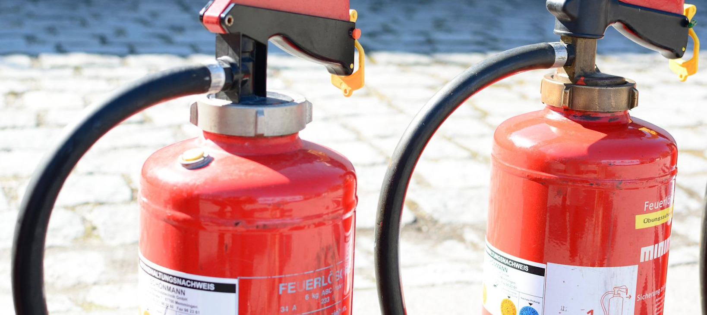
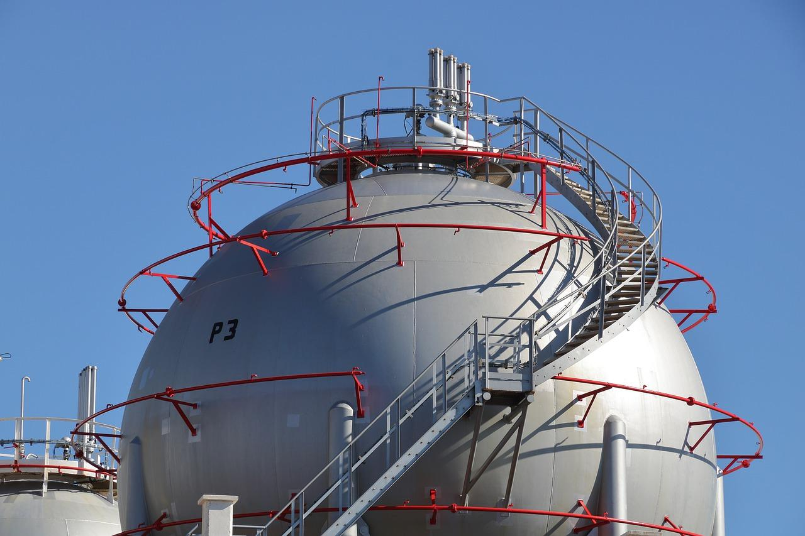

Chapter 27

# Safety

Safety is the prevention of system failure or malfunction that results in (1) death or serious injury, (2) loss of or severe damage to property, or (3) harm to the environment or society. Safety engineering is often associated with systems that have substantial potential for harm if things go wrong, such as nuclear power plants, airplanes, and autonomous vehicles. Developers not working on such traditional safety-critical systems often pay little attention to safety concerns. This is a mistake: even when a software system is unlikely to kill somebody, it may cause harm at a smaller scale, such as contributing to mental health problems with machine-curated social media feeds, creating noise pollution with a malfunctioning smart alarm, or causing stress with inappropriate recommendations on a video sharing site. Safety is a relevant quality for most software systems, including almost every system that uses machine learning.

Safety is fundamentally a system property. Software *by itself* cannot be unsafe, and neither can machine-learned models. However, safety issues can emerge when software interacts with the environment, either by direct actuation, such as a controller accelerating a vehicle, or by presenting results upon which humans take actions, such as medical software suggesting an unsafe radiation treatment to a physician. Therefore, safety engineering always needs to consider the entire system and how it interacts with the environment, and we cannot assure safety just by analyzing a machine-learned model.

Machine learning tends to complicate safety considerations since machine-learned models do not have meaningful functional specifications and may make mistakes. We may not even be able to say what correctness even means. Hence, as discussed repeatedly throughout this book, we should consider models fundamentally as unreliable components in a system. Hence, the challenge is how to build safe systems even if some components are unreliable.

## Safety and Reliability

A system is *safe* if it prevents *accidents*, where an accident is an undesired or unplanned event that causes *harm*. Beyond physical injuries to people and disastrous property damage, harms may include stress, financial loss, polluting the environment, and harm to society more broadly, such as causing poverty and polarization. Systems can rarely guarantee absolute safety where no accidents can ever happen. Instead, safety engineering focuses on reducing the risk of accidents, primarily by avoiding hazardous conditions that can enable accidents and by reducing harm when accidents still occur. Safety engineering aims to demonstrate that the system overall provides acceptable low levels of risks. For example, we may accept an autonomous sidewalk delivery robot as generally safe enough even when some accidents still happen in rare cases if we can demonstrate that accidents are indeed rare and occur much less frequently than accidents caused by human operators.

*Reliability* refers to the absence of defects in a system or component, often quantified as the mean time between failures. That is, reliability refers to whether the system or its components perform as specified and how often they make mistakes, with the idea that accidents can be avoided if there are no mistakes. In principle, techniques like *formal verification* can even guarantee (at substantial cost) that software behaves exactly as specified (see chapter *[Quality Assurance Basics](14-quality-assurance-basics.md)*). For hardware, given physical properties, such guarantees are harder to establish, but we can typically make stochastic claims about reliability. However, reliability of components is usually not sufficient to achieve safety, since accidents often happen (a) from unanticipated interactions of components even when each component works as specified, (b) from incorrect assumptions, and (c) from operating a system beyond its specified scenario. Conversely, it is possible to build safe systems with unreliable components, by introducing safety mechanisms in the system design.

<figure>

<figcaption>

Improving reliability of the walls of the gas storage tank is not enough to assure safety. [Online-only figure.]

</figcaption>
</figure>

To illustrate how safety and reliability are separate properties, let us borrow the non-software example of a pressure tank storing flammable gas from Nancy G. Leveson: making the walls of the tank thicker increases the reliability of the vessel in terms of making it less likely to burst—but when failure still occurs it may happen at much higher pressure with higher potential for harm from a violent explosion. To achieve safety, it may be more productive to invest in safety mechanisms that help to return the system to a fail-safe state, rather than to increase reliability of the components: adding a pressure valve that releases gas if the pressure gets too high avoids creating a situation where the pressure is so high that a rupture of the tank causes significant harm, thus achieving safety despite using only less reliable, thinner walls for the tank.

When it comes to software and machine learning, focusing too much on reliability can similarly undermine safety. We may reduce the frequency with which a software or model makes a mistake, but when that mistake eventually happens it still causes harm. By only focusing on improving reliability, we may miss opportunities to improve the system with safety mechanisms that ensure that mistakes do not lead to accidents or at least attempt to reduce the harm caused by the mistake. 

## Improving Model Reliability

Discussions of safety and machine learning focus quickly on model accuracy and robustness, which both relate to reliability rather than safety. For example, in many projects in industry, in the government sector, and in academia, we have seen immense interest in discussing *model robustness* as a safety strategy (which is really about reliability, as we will discuss), often to the exclusion of any broader safety considerations. We will provide a quick overview of how accuracy and robustness relate to reliability, since both are prominent in safety discussions by academics and practitioners. 

### Model Accuracy

All activities to improve the accuracy of models will help with reliability. The model will make fewer mistakes, thus reducing the frequency with which a model's mistake can lead to an accident, which may help reduce harm.

Improving model accuracy is typically the core competency of a data scientist. These activities may include collecting better data, data augmentation, better data cleaning and feature extraction, better learning algorithms, better hyperparameter selection, and better accuracy evaluations.

Similarly, all testing activities described in chapter *[Model Quality](15-model-quality.md)* can help better understand the frequency of mistakes. Activities include gaining a better understanding of the supported target distribution where mistakes are rare, evaluating how far the model generalizes, and evaluating whether mistakes are biased to specific subpopulations or corner cases. For example, developers of autonomous vehicles spend a lot of effort anticipating corner cases, such as [sinkholes](https://commons.wikimedia.org/wiki/File:This_bus_sinks_half_into_pothole_(48976903958).jpg), [unusual road configurations](https://www.trafficengineering.com/the-magic-roundabout/), and art made of [traffic signs](https://uncoveringpa.com/penndot-road-sign-sculpture-garden-meadville) and [traffic lights](https://en.wikipedia.org/wiki/Traffic_Light_Tree). Once weak spots are anticipated, we can collect or augment corresponding training and training data. In particular, we can curate test data *slices* to evaluate reliability for corner cases that otherwise would show up rarely in test sets and affect overall model accuracy only marginally.

### Model Robustness

Machine-learned models often have brittle decision boundaries where small modifications to the input can result in drastic changes in the predicted output. For example, a traffic-sign-detection model might detect a stop sign just fine, except when the image is slightly rotated, when lighting is poor, when it is foggy, or when the sensor is aging. This brittleness particularly has received attention because it can be intentionally exploited in attacks, as we will discuss in more detail in the next chapter, chapter *[Security and Privacy](28-security-and-privacy.md)*, but it can also be problematic in a safety context when the model’s predictions are unreliable in the presence of minor disturbances.

<figure>

<figcaption>

An example of an intentional attack of a traffic sign detection system: by attaching small stickers to a stop sign in deliberate locations, the model detects the sign as a speed limit sign instead. That is, the model’s predictions are not robust to small changes in the input. Image from 🗎 Eykholt et al. "[Robust Physical-World Attacks on Deep Learning Visual Classification](https://openaccess.thecvf.com/content_cvpr_2018/html/Eykholt_Robust_Physical-World_Attacks_CVPR_2018_paper)." In Proceedings of the Conference on Computer Vision and Pattern Recognition. 2018.

</figcaption>
</figure>

Robustness in machine learning has received much attention in research, possibly because it can be expressed as a formal property against which models can be tested with various methods. In a nutshell, robustness can be expressed as the invariant *∀x,x’. d(x, x’) < ε ⇒ f(x) = f(x’)* for a model *f* with input *x*, some distance function *d,* and a maximum distance *ε*: This invariant states that all inputs in the *direct neighborhood* of the given input of interest should yield the same prediction.

In a safety context, we usually care about robustness with regard to perturbations to the input that can occur randomly or due to anticipated root causes. For a traffic sign predictor, this might include a certain degree of random noise, but also predictable effects like lower contrast due to weather and light conditions, blurry images due to rain on the camera sensor, or rotation due to tilted signs or sensors. For each of these anticipated changes, custom distance functions can be defined to capture the intended neighborhood for which the predictions should be stable. The key challenge in analyzing robustness is identifying the right distance function to answer *“Robust against what?”*

<figure>

<figcaption>

A model with a decision boundary (black line) correctly detects the original stop sign and many other images in the neighborhood as a stop sign, but not all nearby images; for example, the image with several black and white stickers is not detected as a stop sign. As a whole, the prediction of the original image is not considered robust, because some neighboring inputs pass across the decision boundary of the model.

</figcaption>
</figure>

To make practical use of robustness, we must check *at inference time* whether the current prediction is robust within the defined neighborhood—that is, whether all neighboring inputs also yield the same prediction. If the prediction is robust, we have more confidence in its correctness. If the prediction is not robust, say, because the model predicts a different output for a slightly blurred version of the input, the system may not want to rely on the prediction. How exactly the system should handle a non-robust prediction is up to the system designer. For example, the system may rely on a redundant fail-over component or involve a human.

Note that robustness is usually determined for a given input and neighborhood around that input, but not for the model as a whole. A model is never fully robust, since there are always inputs near a decision boundary. It is possible (and actually quite common) to measure average robustness of a model across many inputs, or measure how hard it is to find non-robust inputs with a given search strategy, but it is not always obvious how to interpret such a measure when making a reliability or even safety claim. Assessment of model-wide robustness can be seen as a form of behavioral model testing, as discussed in chapter *[Model Quality](15-model-quality.md)*, for example, identifying that a model generally is poor at handling certain kinds of perturbations, such as blurry or tilted images.

<figure>

<figcaption>

No nontrivial model is fully robust: in any model with a decision boundary, there are some non-robust inputs near the decision boundary with neighboring inputs on the other side of the decision boundary.

</figcaption>
</figure>

There is much research and tooling on model robustness, especially for deep neural networks. These approaches often use verification techniques (e.g., [abstract interpretation](https://dl.acm.org/doi/pdf/10.1145/3290354) or [randomized smoothing](https://arxiv.org/abs/1902.02918)) to make confident claims about whether an input is robust within a given neighborhood defined by a distance function. Unfortunately, these approaches are usually computationally very expensive, often with costs equivalent to several thousand model inferences, making it challenging to deploy these techniques as practical tools in production code. Robustness can be a building block when building a safe system, for example, to detect when to switch to a fail-over system, but it does not allow us to make safety claims about the system by itself. *Robustness is fundamentally about reliability, not safety.*

### Models are Unreliable Components

As discussed at-length throughout this book, it is best to always consider machine-learned models as unreliable components. Even when improving reliability by improving accuracy, supporting more corner cases, or strengthening robustness, mistakes will still happen eventually. It seems unlikely that we will be able to increase the reliability of a machine-learned model to the point that mistakes are so rare that we do not have to worry about them, especially if resulting accidents can cause serious harm.

While improving model reliability is a worthy endeavor, it must not distract us from considering safety of the entire system, beyond the model. It might even be a good idea to take a lesson from chaos engineering (see chapter *[Testing and Experimenting in Production](19-testing-and-experimenting-in-production.md)*) and intentionally inject wrong model predictions in production to instill a duty to ensure safety despite occasional wrong predictions, whether injected or natural. The observation that we can build safe systems with unreliable components is good news for software products with ML components, because we have a chance to build safe systems with unreliable ML components, as we will discuss in the remainder of this chapter.

## Building Safer Systems

To build safe software systems, it is important to consider the entire system and how it interacts with the environment. It requires serious engagement with requirements analysis, thinking through potential hazards, and designing the system to mitigate mistakes—ideally in an organization that embraces safety as a cultural norm. Resulting safety claims are usually supported by evidence of success in the field and compliance with best practices.

### Anticipating Hazards and Root Causes

Beyond just improving component reliability, safety engineering looks at the entire system. It typically proceeds in four steps: (1) identify relevant hazards and safety requirements, (2) identify potential root causes of hazards, (3) develop a mitigation strategy for each hazard, and (4) provide evidence that the mitigations are properly implemented and effective. 

A *hazard* is a common safety-engineering term to describe a system condition in which a harmful accident can happen—the hazard is necessary, but not sufficient for an accident. For example, “an autonomous sidewalk delivery robot going too fast while not recognizing pedestrians” is a hazardous condition that can lead to a crash, but being in the hazardous condition does not cause harm in every case. Safety engineering is about preventing accidents by ensuring that systems do not enter a hazardous condition. 

It can be difficult to clearly and causally attribute why a system enters a hazardous condition or what exactly caused an accident. For example, “an autonomous sidewalk delivery robot going too fast while not recognizing pedestrians” could be caused by wrongly recognizing appropriate speed for the current road conditions, by wrong predictions of a pedestrian-detection model, by a bug in the speed controller, or by a hardware malfunction of the brakes, among other possible causes. Often there are multiple mistakes that enable the hazard and that may be causally responsible for an accident. Basic events that cause or contribute to a hazard are typically called *root causes*.

When thinking about safety, a good starting point is identifying hazards and their root causes. There are many *hazard analysis* techniques to systematically identify these, including fault tree analysis, failure mode and effects analysis (FMEA), and hazard and operability study (HAZOP), which we already discussed in chapter *[Planning for Mistakes](07-planning-for-mistakes.md)*.

Hazard analysis can generally proceed in two directions:

  * *Forward analyses* start with possible mistakes (root causes), typically at the component level, and analyze whether hazards can arise from those mistakes. For example, for every machine-learned model, we should ask (a) *in what ways a prediction may be wrong* and (b) *what hazards may arise from a wrong prediction*. Similarly, we should inspect our assumptions about the environment and the reliability of our sensors and actuators (see chapter *[Gathering Requirements](06-gathering-requirements.md)*), and *what hazards can arise from wrong assumptions*. FMEA and HAZOP, introduced in chapter *[Planning for Mistakes](07-planning-for-mistakes.md)*, are both forward analyses.

  * *Backward analyses* start from hazards and trace backward what mistakes (root causes) may cause the hazard. The hazards we analyze can be informed by actual accidents that have happened or by hypothetical ones. Fault tree analysis (introduced in chapter *[Planning for Mistakes](07-planning-for-mistakes.md)*) is often used for this backward analysis, identifying the various conditions that can lead to the hazard.

Forward and backward analysis can be interleaved in different ways, for example, using FMEA to identify possible hazards from wrong model predictions (forward analysis) and then identifying whether those hazards can also be caused in different ways (backward analysis).

In many domains, we do not need to start entirely from scratch. Existing accident reports in similar systems can provide various accidents and hazards as starting points for backward analyses, and existing error classifications of machine-learned models can similarly help to guide forward analyses by providing a list of plausible root causes to analyze. In well-understood domains like aviation, vehicles, and medical systems, existing safety standards often include lists of common hazards (e.g., [ISO 26262](https://www.iso.org/standard/43464.html), [ISO 21448](https://www.iso.org/standard/70939.html), [IEEE P700x](https://ethicsinaction.ieee.org/p7000/), [UL 4600](https://ul.org/UL4600)), even when most of them were developed before the broad adoption of machine learning.

Note that no hazard analysis technique can provide guarantees that all hazards and root causes are identified. They are intended as structured approaches to think systematically through possible failures—they cannot replace human expertise, experience, and creativity. 

**Hazard prioritization.**
 In risk management, risks are typically ranked by the likelihood of an accident multiplied by the severity of the harm caused. Therefore, hazards that are more likely to occur and hazards that have more potential for harm are typically prioritized in the design process. It is usually not necessary to exactly quantify the likelihood and harm. Most commonly, rough categorizations based on some judgment and estimation into rough categories like “likely,” “unlikely,” “very unlikely,” and “mild,” “severe,” and “very severe” are already sufficient to identify which hazards should be addressed most urgently and which hazards expose an acceptably low level of risk. 

### Hazard Mitigation

To achieve safety, the system must be *designed* to be safe by designing mitigations into the system. Hazard analysis identifying hazards and root causes can help in the design process, because it directs attention to the specific places where mistakes can have harmful consequences and need to be mitigated. Some mitigations may eliminate a hazard entirely, but most will aim to make harm less likely by increasing the number of independent conditions that need to occur to enter a hazardous state. As usual, it is easier to design safety into a system rather than trying to patch safety problems detected during testing.

We already discussed various design strategies to mitigate mistakes in chapter *[Planning for Mistakes](07-planning-for-mistakes.md)*: 

  * *Keeping humans in the loop:* Identify mechanisms for humans to oversee the system.

  * *Undoable actions:* Provide mechanisms to undo automated actions and mechanisms to appeal decisions.

  * *Guardrails:* Introduce safety controls outside the model to prevent unsafe actions.

  * *Mistake detection and recovery:* Install an independent system to detect mistakes and intervene.

  * *Redundancy:* Use redundancy to guard against random (hardware) mistakes.

  * *Containment and isolation:* Ensure mistakes of components are handled locally and do not spread to other components of the system.

These are all classic safety-engineering techniques and provide essential building blocks when designing safe systems. 

We argue that to achieve safety of a system, hazard analysis and hazard mitigation should be the key focus during system development. Improving reliability through model accuracy and robustness are important building blocks, but safety fundamentally relies on understanding what happens when component mistakes still occur.

### Demonstrating Safety

For any nontrivial system, it is impossible to fully *guarantee* safety. Safety engineering focuses on avoiding hazards and thus reducing the chance of accidents and their harms, but some risks usually remain. Even if formal methods are used to formally prove some safety properties (which is complicated by the lack of specifications for ML models), wrong assumptions about the environment, incomplete requirements, or behavior not captured in the formal model can still leave the chance for accidents. 

Instead of attempting safety guarantees, practitioners usually aim to *demonstrate an acceptable level of safety*. Usually, different forms of evidence can be provided:

  * *Evidence of safe behavior in the field:* Extensive field trials can demonstrate that accidents are rare. For example, autonomous vehicles are extensively tested first in simulation, then on closed test tracks, and finally on public roads (with a human driver to take over if things go wrong) to demonstrate safe behavior. Medical devices typically are tested in medical trials under controlled and monitored conditions to demonstrate safety. Field trials tend to be expensive and require elaborate monitoring to avoid accidents if the product is not actually safe. To provide high confidence in safety in settings with many rare corner cases, field trials often have to be quite lengthy. 

  * *Evidence of responsible (safety) engineering process:* Evidence of following a rigorous engineering process can provide confidence that the developers have anticipated and mitigated many hazards. For example, the designers of a smart medical device can show that they performed hazard analysis and built hazard mitigation into the product for all identified hazards. 

Typically, a combination of the two strategies are used to provide confidence in a system’s safety, without ever providing guarantees. A number of domain-specific standards for safety certification prescribe specific process steps and documentation for how to provide evidence of safety tests and safe engineering practices. For example, when approving novel (smart) medical devices in the US, the Food and Drug Administration requires evidence (a) of reliability of the model in an offline evaluation, (b) of safety and efficacy of the entire product in a clinical trial, and (c) of compliance with state-of-the-art engineering processes.

**Documenting evidence with assurance (safety) cases.**
 Assurance cases (or safety cases) are a common format for documenting arguments and evidence for safety of a system. An assurance case is essentially a structured argument that breaks a safety claim into arguments and then provides evidence for each argument. 

<figure>

<figcaption>

An excerpt of an assurance case example: the main claim is broken down into subclaims, each of which is connected to evidence.

</figcaption>
</figure>

An assurance case helps to decompose a main safety claim hierarchically into manageable claims for which it is feasible to collect assurance evidence. The evidence can come in many different forms, including (1) results of field testing, offline testing, inspection, and formal verification, (2) expert opinion, (3) evidence of design mechanisms that mitigate problems, and (4) evidence of process compliance and process quality. To evaluate an assurance case, we then need to ask whether the evidence is strong enough for each (leaf) claim, whether the subclaims combined are sufficient to support the parent claim, and whether any subclaims are missing. For autonomous vehicles, Aurora has developed and released an [extended assurance case structure](https://safetycaseframework.aurora.tech/) of claims and subclaims and explained [their rationale](https://aurora.tech/blog/aurora-unveils-first-ever-safety-case-framework), which can provide a good illustration of the typical kinds of claims made.

<figure>

<figcaption>

For autonomous vehicles, Aurora has developed and released an [extended assurance case structure](https://safetycaseframework.aurora.tech/) of claims and subclaims and explained [their rationale](https://aurora.tech/blog/aurora-unveils-first-ever-safety-case-framework). While evidence is not made public with these documents, they provide extensive examples of the kind of reasoning used to argue for safe behavior of autonomous vehicles. [Online-only figure.]

</figcaption>
</figure>

Assurance cases have many proponents and have seen some adoption but also have received some criticism. Proponents point out many benefits: An assurance case provides an explicit structure for safety arguments that third-party auditors can navigate, inspect, and refute. It provides flexibility and explicit traceability between high-level claims, low-level claims, and corresponding evidence. The structure of a safety case may be reused across similar products, hence encouraging reuse of best practices. This kind of structure can also be extended beyond safety claims for security, reliability, and other properties. Critics point out limitations: Reasoning is often informal and requires judgment. How much evidence is sufficient for a subclaim may require negotiation between developers and evaluators. Evaluators may be prone to confirmation bias and accept provided evidence rather than critically questioning whether any hazards are missing from the analysis or whether any claims interact in unanticipated ways. If abused, an assurance case can be misinterpreted as a proof and can signal a level of confidence that is not justified.

### Safety Culture

Safety engineering faces the risk of turning into a checkbox compliance exercise, especially when needed to demonstrate compliance with some regulation like FDA approval for medical devices. If safety is not taken seriously, but seen only as a necessary box to check when releasing products, developers go through the motions and minimally follow the prescribed procedures and produce the paperwork needed, but do so only as required without critical engagement. For example, they may somewhat follow a hazard analysis procedure such as FMEA and produce some tables showing some potential hazards, possibly only the ones the developers have already mitigated. They might do so without creativity and without investing real effort. Checkbox compliance might be sufficient to shield them from liability when an accident happens, but it barely contributes to actual safety.

If safety is taken seriously in a product, it shows in a *safety culture* in the team. The team is committed to achieving safety as a core priority, visible in internal goal statements, in public mission statements, and, importantly, also in everyday practice. When competing demands rest on the project and trade-offs need to be made, a team with a robust safety culture will avoid shortcuts that compromise safety and choose the safer path, even if it takes longer to develop or sacrifices functionality in the product. 

Openness, trust, and avoiding blame are crucial elements of a healthy safety culture. Instead of blaming individuals responsible when safety concerns surface, appreciate that somebody has identified a problem and then focus on how to improve the product. Ideally, explore how to improve the process to avoid future similar problems. With this mindset, accidents are not seen as failures but as learning opportunities, triggering in-depth investigations on how to improve. A safety culture fosters an environment where developers avoid hiding mistakes, where developers feel empowered to think deeply about potential problems, and where everybody feels comfortable raising concerns and dissenting opinions.

As with all forms of team culture (see chapter *[Interdisciplinary Teams](21-interdisciplinary-teams.md)*), establishing cultural norms takes effort and changing culture is a slow and difficult process that usually requires strong leadership.

## The AI Alignment Problem

We believe that most practical safety concerns in ML-enabled systems are best addressed through traditional safety engineering with careful hazard analysis and careful hazard mitigation through system design. In the popular press and also part of the research community, a lot of attention is placed on potential scenarios of automated systems finding loopholes and achieving their given tasks with unintended and possibly disastrous consequences—known commonly as the *alignment problem*. We have already seen how challenging it can be to align model goals, user goals, and system goals in chapter *[Setting and Measuring Goals](05-setting-and-measuring-goals.md)*. The extreme examples of the alignment problem involve dystopian scenarios with existential risk to humankind, for example, as in the *[Terminator](https://www.slowboring.com/p/the-case-for-terminator-analogies)* movies where a defense AI system decides to consider all humanity as a threat and thus launches a nuclear attack. Another common example is the *[paperclip maximizer](https://knowyourmeme.com/memes/paperclip-maximizer)*, an AI tasked to produce paper clips, but given enough autonomy that it prioritizes paper clip production over everything else, eventually consuming all resources on the planet. 

The alignment problem describes the challenge of creating an objective function for a given task that an AI should perform or support, such that the way the task is encoded aligns with how humans *intend* the AI to perform the task. In a nutshell, this is a requirements engineering problem of specifying the right requirements for the system. A problem occurs when the AI’s objective function only partially captures the real requirements of the task, particularly when it does not consider *negative side effects* as costs. For example, a sidewalk robot with the objective function to reach a goal fast might drive at dangerously high speeds and might endanger cyclists in bike lanes. Obeying speed limits and not interfering with other traffic may have been intended, but if not explicitly captured in the objective function, the system may ignore those implicit requirements. Technically the dangerous behavior of the sidewalk robot may meet the given (incomplete) requirements, but it does not match the designer’s intent. 

If we anticipated the negative side effects, we could encode them as constraints or costs in the objective function. However, AI algorithms are often very good at finding loopholes to achieve the goal that designers did not anticipate, a process also known as *reward hacking*. Examples of such loopholes [are common](https://docs.google.com/spreadsheets/u/1/d/e/2PACX-1vRPiprOaC3HsCf5Tuum8bRfzYUiKLRqJmbOoC-32JorNdfyTiRRsR7Ea5eWtvsWzuxo8bjOxCG84dAg/pubhtml), especially in game AIs, including (1) a [Tetris AI](http://www.cs.cmu.edu/~tom7/mario/mario.pdf) that learns to pause the game indefinitely to avoid losing, (2) a [racing game AI](https://openai.com/blog/faulty-reward-functions/) that learns that going in circles to hit a few targets repeatedly gives more points than competing in the race, and (3) an AI [finding and exploiting bugs](https://arxiv.org/pdf/1802.08842.pdf) in games.

Defining an objective function that takes all requirements into account can be very challenging, since it requires understanding and expressing requirements very precisely, anticipating all potential loopholes. Humans generally use common sense to reason about corner cases and tend to not enumerate all possible exceptions. There are many specific problems, including hard to observe goals, abstract rewards, and feedback loops, that make it difficult or even impossible to write objective functions that fully align with the real intention.

Many of these problems occur especially in the context of *reinforcement learning*, where an AI learns incrementally from interacting with the environment. Most examples and discussions of the alignment problem relate to AIs in computer games and (simulated) robots, where AI algorithms can freely and repeatedly explore actions. When exploration happens in the real world, there are additional questions of how to safely explore the world and of how to scale human oversight. These problems will become more severe the more autonomy we give AI-driven systems, especially if we were to make advances toward *artificial general intelligence*. However, even without reinforcement learning and artificial general intelligence, it is worth asking questions about potential harms from misaligned objective functions as part of the hazard analysis for any software systems with machine-learning components.

While the alignment problem is popularly discussed and an interesting conceptual problem, we think it is not usually a serious safety concern for the kind of software products with machine-learning components we discuss in this book. However, if we ever get to artificial general intelligence, the alignment problem might become much more important, possibly even posing existential risks.

## Summary

Safety concerns the prevention of harm at small and large scale from system failure or malfunction—not just serious injury and death, but also property damage, environmental pollution, stress, and societal harms. Even if machine-learned models were very reliable, reliability alone is not sufficient to assure safety. Safety is a system property that requires an understanding of how components in the system interact with each other and with the environment; it cannot be assured at the software level or the model level alone. 

Safety engineering focuses on designing systems in a way that they minimize risks of accidents. This typically relies heavily on design strategies that avoid and mitigate hazards that could lead to accidents. Hazard analysis techniques can help to anticipate many problems and to design corresponding mitigations. Model robustness is a heavily discussed research topic that can improve the reliability of the machine-learning components and provide a building block when engineering safe systems. While safety guarantees are rare, it is common to demonstrate safety and document claims and evidence in structured form in assurance cases.

Whether AI systems will eventually pose existential threats because they solve tasks we give them in ways we did not anticipate is at the core of the alignment problem. While it may not be a concern for the kind of ML-enabled systems mostly covered in this book, it is worth having an eye on this discussion, especially when increasing the autonomy of systems.

## Further Readings

  * A paper surveying safety engineering for ML systems in automotive engineering: 🗎 Borg, Markus, Cristofer Englund, Krzysztof Wnuk, Boris Duran, Christoffer Levandowski, Shenjian Gao, Yanwen Tan, Henrik Kaijser, Henrik Lönn, and Jonas Törnqvist. “[Safely Entering the Deep: A Review of Verification and Validation for Machine Learning and a Challenge Elicitation in the Automotive Industry](https://www.atlantis-press.com/journals/jase/125905766).” *Journal of Automotive Software Engineering*. Volume 1, Issue 1, Pages 1–19. 2019

  * An extensive discussion of safety engineering broadly, including safety culture and the interplay between reliability and safety: 🕮 Leveson, Nancy G. [*Engineering a Safer World: Systems Thinking Applied to Safety*](https://direct.mit.edu/books/book/2908/Engineering-a-Safer-WorldSystems-Thinking-Applied). The MIT Press, 2016.

  * A paper on safety engineering and architectural safety patterns for autonomous vehicles: 🗎 Salay, Rick, and Krzysztof Czarnecki. “[Using Machine Learning Safely in Automotive Software: An Assessment and Adaption of Software Process Requirements in ISO 26262](https://arxiv.org/pdf/1808.01614).” arXiv preprint 1808.01614, 2018.

  * Another paper discussing different safety strategies for autonomous vehicles: 🗎 Mohseni, Sina, Mandar Pitale, Vasu Singh, and Zhangyang Wang. “[Practical Solutions for Machine Learning Safety in Autonomous Vehicles](https://arxiv.org/abs/1912.09630).” *SafeAI Workshop at AAAI*, 2020.

  * Examples of many papers focused on formally verifying robustness properties of deep neural network models: 🗎 Huang, Xiaowei, Marta Kwiatkowska, Sen Wang, and Min Wu. “[Safety Verification of Deep Neural Networks](http://qav.comlab.ox.ac.uk/papers/hkww17.pdf).” In *International Conference on Computer Aided Verification*. Springer, 2017. 🗎 Wong, Eric, and Zico Kolter. “[Provable Defenses Against Adversarial Examples via the Convex Outer Adversarial Polytope](http://proceedings.mlr.press/v80/wong18a/wong18a.pdf).” In *International Conference on Machine Learning*, pp. 5286–5295. PMLR, 2018. 🗎 Cohen, Jeremy, Elan Rosenfeld, and Zico Kolter. “[Certified Adversarial Robustness via Randomized Smoothing](http://proceedings.mlr.press/v97/cohen19c/cohen19c.pdf).” In *International Conference on Machine Learning*, pp. 1310–1320. PMLR, 2019. 🗎 Singh, Gagandeep, Timon Gehr, Markus Püschel, and Martin Vechev. “[An Abstract Domain for Certifying Neural Networks](https://files.sri.inf.ethz.ch/website/papers/DeepPoly.pdf).” *Proceedings of the ACM on Programming Languages* 3, no. POPL (2019): 1–30.

  * A survey paper listing many recent robustness verification techniques (in Sec 4): 🗎 Huang, Xiaowei, Daniel Kroening, Wenjie Ruan, James Sharp, Youcheng Sun, Emese Thamo, Min Wu, and Xinping Yi. “[A Survey of Safety and Trustworthiness of Deep Neural Networks: Verification, Testing, Adversarial Attack and Defence, and Interpretability](https://arxiv.org/abs/1812.08342).” *Computer Science Review* 37 (2020).

  * An extended version of the discussion on the limits of focusing only on model robustness in safety discussions: 📰 Kaestner, Christian. “[Why Robustness is not Enough for Safety and Security in Machine Learning](https://towardsdatascience.com/why-robustness-is-not-enough-for-safety-and-security-in-machine-learning-1a35f6706601).” Toward Data Science, [blog post], 2021.

  * A well-known, but very model-centric position paper discussing safety problems in reinforcement learning: 🗎 Amodei, Dario, Chris Olah, Jacob Steinhardt, Paul Christiano, John Schulman, and Dan Mané. “[Concrete Problems in AI Safety](https://arxiv.org/pdf/1606.06565.pdf).” arXiv preprint 1606.06565, 2016.

  * Examples of AIs finding loopholes to exploit games: 🗎 Murphy VII, Tom. “[The First Level of Super Mario Bros. is Easy with Lexicographic Orderings and Time Travel… After That It Gets a Little Tricky](https://www.cs.cmu.edu/~tom7/mario/mario.pdf).” In *SIGBOVIK*, 2023. 📰 Clark, Jack, and Dario Amodei. “[Faulty Reward Functions in the Wild](https://openai.com/research/faulty-reward-functions).” OpenAI Blog, 2016. 🗎 Chrabaszcz, Patryk, Ilya Loshchilov, and Frank Hutter. “[Back to Basics: Benchmarking Canonical Evolution Strategies for Playing Atari](https://arxiv.org/abs/1802.08842).” arXiv preprint 1802.08842, 2018.

---
*As all chapters, this text is released under <a href="https://creativecommons.org/licenses/by-nc-nd/4.0/">Creative Commons BY-NC-ND 4.0</a> license.*
*Last updated on 2024-06-13.*
