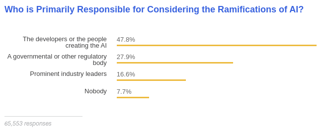

Chapter 29

# Transparency and Accountability

The final areas of concern in responsible AI engineering that we discuss relate to transparency and accountability, both often important to enable users to build *trust* in the system and enable *human agency* and *dignity*. Both concepts are multi-faceted and build on each other. In a nutshell, transparency describes to which degrees users are made aware that they are subject to decisions made with inputs from model predictions and to what degree they can understand how and why the system made a specific decision. Accountability refers to what degree humans can oversee and correct the system and who is considered culpable and responsible in case of problems. 

## Transparency of the Model’s Existence

Users are not always aware that software systems use machine-learning components to make decisions, for example, to select and curate content. For example, according to Motahhare Eslami’s [2015 study of Facebook users](https://www.ideals.illinois.edu/bitstream/handle/2142/55298/Algorithms_2014.pdf?sequence=2), 62 percent of users were unaware that Facebook automatically curates their feeds instead of simply showing all friends' posts in chronological order—when users learned about the algorithmic curation, they reacted with surprise and anger: “Participants were most upset when close friends and family were not shown in their feeds [...] participants often attributed missing stories to their friends’ decisions to exclude them rather than to Facebook News Feed algorithm.” Interestingly, following up with the same users later, they found that knowing about the automatic curation did not change their satisfaction level with Facebook, and it led to more active engagement and a feeling of being in control.

There are many examples where systems make automated decisions (e.g., filtering, ranking, selecting) but do not make it transparent that such decisions are made at all or are made based on predictions of a machine-learned model. For example, there are several independent reports of managers who were now aware that many applicants for a job opening were automatically discarded by an automated screening tool, and surveys show that most users do not realize how restaurant review sites like Yelp filter which reviews they are showing (officially to reduce spam).

<figure>

![Screenshot of a thread of three messages on Twitter from 2019 reading "A friend of mine has been trying to hire a new employee for her department in a medium-sized org. After advertising several times with few applicants, and a couple of rounds of interviews, the new employee is less than great. Then she discovered there were other applicants ..." -- "Among them was someone she knows personally, who has a spot-on CV, loads of experience, lives locally and would be the perfect person for the job. So she goes to HR to ask why that application was never sent through to her dept. The answer – she didn't score well. " -- "It turns out the HR dept adopted screening software that asks a bunch of random questions that applicants must answer quickly, the results of which determine a suitability score. Only those deemed suitable are sent through to the department for interview."](./img/29-tweet-hiring.png)

<figcaption>

A [public example](https://twitter.com/TheWrongNoel/status/1194842728862892033) of managers being surprised by an automated screening tool used by the HR department in an organization without the hiring manager’s knowledge. [Online-only figure.]

</figcaption>
</figure>

In many situations like loan applications, policing decisions, or sentencing decisions, it may also not be obvious to the affected individuals to what degree decisions are made by humans, by manually specified algorithms, by machine-learned models, or by a combination of those, blurring the lines of responsibilities. To increase transparency, a system should indicate how decisions decisions are made, providing a justification for a decision or decision procedure if possible. Technical approaches can provide insights into what steps have been automated and how the world would look under different decisions, for example, by designing a user interface where users can optionally see elements that were automatically filtered or where text explicitly indicates that elements are curated based on the user’s profile (e.g., “we think you’ll like”) rather than providing a comprehensive view of all elements. 

Hiding or obfuscating the existence of automated decisions in a system does not give users a chance to understand the system and does not give them a mechanism to appeal wrong decisions. While we could argue that hiding the model reduces friction for users of the system and may enable a smoother user experience, as in the Facebook case above, users may feel deceived when they learn about the hidden model. Responsible designers should be very deliberate about when and how to make the existence of a model transparent and how not doing so may undermine the agency of users.

## Transparency of How the Model Works

Even when a system makes it clear in the user interface that decisions are automated, users may not have an understanding of how the system works. Humans exposed to inscrutable decisions can experience a loss of control and autonomy. If humans are supposed to be able to appeal a wrong or unfair decision, they need to have some understanding of how the decision was made to point out problems.

Users tend to form a *mental model* of how a machine-learning system learns and makes decisions—those mental models may be more or less correct. For example, they might expect that spam filters look for certain words for phrases from messages previously marked as spam and judges may incorrectly think that a recidivism risk assessment model judges an individual’s character against the severity of the crime based on the most similar past case. Good design can explicitly foster a good mental model. Especially *explanations* (see chapter *[Explainability](25-explainability.md)*) often play an important role here, providing partial information about what information a model considers and how it weights different factors. For example, a spam filter might show the most predictive words in the filtered message and the recidivism risk assessment tool might indicate the factors considered and nearby decision boundaries (e.g., with anchors). When users have a basic understanding of how a system works, what its capabilities and limitations are, they can learn to use it better and are more satisfied even when the system makes occasional mistakes. Notice that explanations of the model may need to go far beyond reasons for a specific prediction and include design decisions, scenarios, data descriptions, what evaluation and fairness audits were performed, and much more, possibly even training in AI literacy to interpret explanations correctly.

Transparency in how the model works may be essential to build *trust* in human-AI collaborations. The concept of trust has long been studied in social science, both between humans and between humans and machines, and now also with machines that make decisions based on machine-learned models. Trust is the idea that the user believes that the system has the user’s interest in mind and accepts potential *risks* from the system’s mistakes. Trust is efficient in that users do not need to double-check every single decision, but granting too much unwarranted trust exposes users to a lot of risk. In an ideal setting, users learn when they can trust the system and how much and when they need to verify the results.

Users can build trust from repeated positive experiences, demonstrating that the system works. Another path toward trust is understanding how the system was built and evaluated. Specifically, users may only trust the system once they believe they have a reasonable understanding of its capabilities and limitations, and thus they can *anticipate* how the system will work and can accept the risks that they expose themselves to. Users who do not trust the system will seek other ways to mitigate the risks, for example, by avoiding the system. Explanations can foster trust by shaping a mental model and allowing users to better anticipate decisions and risks. In contrast, facing an inscrutable algorithm, users with also develop a mental model but start to mistrust the system if it does not behave as their mental model predicts. 

### Driving Behavior and Gaming Models with Transparency

Transparency about how decisions are made can help users adapt their behavior toward more preferable decisions in the future. In contrast, without transparency, users may be guessing and use a trial-and-error approach to build a mental model, which is tedious and may be unreliable. However, designers are often concerned about providing explanations to end users, especially counterfactual examples, as those users may exploit them to game the system. For example, users may temporarily put money in their account if they know that a credit approval model makes a positive decision with this change, a student may cheat on an assignment when they know how the autograder works, or a spammer might modify their messages if they know what words the spam detection model looks for.

If models use robust, causally related features, explanations may actually encourage intended behavior. For example, a recidivism risk prediction model may only use features that are difficult or impossible to game, because they describe inert characteristics or past behavior. If people changed their behavior to get arrested less in order to receive more lenient bail decisions, this would shape behavior in an intended way. As another example, a model that grades students based on work performed rather than on syntactic features of an answer requires students who want to receive a good grade to actually perform the work required—thus, a student trying to game the system will do exactly what the instructor wants which is known as *[constructive alignment](https://en.wikipedia.org/wiki/Constructive_alignment)* in pedagogy. 

Models become prone to gaming if they use weak proxy features, which many models do. Many machine-learned models pick up on weak correlations and may be influenced by subtle changes, as work on adversarial examples illustrate (see chapter *[Security and Privacy](28-security-and-privacy.md)*). For example, we may not have robust features to detect spam messages and just rely on word occurrences, which is easy to circumvent when details of the model are known. Similarly, we likely do not want to provide explanations of how to circumvent a face recognition model used as an authentication mechanism or safeguards of a large language model, as those do not rely on meaningful features either.

Protecting models by not revealing internals and not providing explanations is akin to *[security by obscurity](https://en.wikipedia.org/wiki/Security_through_obscurity)*. It may provide some level of security, but users may still learn a lot about the model by just querying it for predictions, as many explainability techniques do. Increasing the cost of each prediction may make attacks and gaming harder, but not impossible. Protections through using more reliable features that are not just correlated but *causally* linked to the outcome is usually a better strategy, but of course this is not always possible.

Responsible engineers should deliberate to what degree they can and should make the reasons behind automated decisions transparent, both to steer positive behavior change and to prevent gaming.

### Designing User Interfaces with Explanations

Explanations discussed in chapter *[Explainability](25-explainability.md)* are often technical and used by experts, and study after study shows that end users do not want technical details and would not expect to understand them. Approaches to design explanations for end users are still emerging and very task dependent, and beyond the scope of this book. 

When designing end-user explanations as a transparency mechanisms, it is important to identify the goal, whether it is to foster human-AI collaboration with appropriate levels of trust, whether it is to support appealing decisions, or mainly just to foster a sense of autonomy and dignity. The success of any solution must be established with a user study in the lab or with actual users, for example, measuring whether users correctly know when to challenge or overturn an automated decision.

For high-stakes decisions that have a rather large impact on users (e.g., recidivism, loan applications, hiring, housing), transparency is more important than for low-stakes decisions (e.g., spell checking, ad selection, music recommendations). For high-stake decisions explicit explanations and communicating the level of certainty can help humans verify the decision and generated justifications can be scrutinized, however inherently interpretable models may provide more trust. In contrast, for low-stakes decisions, automation without explanation could be acceptable or explanations could be used to allow users to provide more targeted feedback on where the system makes mistakes—for example, a user might try to see why the model changed spelling, identify a shortcut learned, and give feedback for how to revise the model. Google’s *[People + AI Guidebook](https://pair.withgoogle.com/research/)* provides several good examples on deciding when to provide explanations and how to design them. 

In some settings users ask for more transparency than just explanations of individual predictions. For example, a [recent study](https://research.google/pubs/pub48431/) analyzed what information radiologists want to know to trust an automated cancer prognosis system to analyze radiology images. The radiologists voiced many questions that go far beyond local explanations, such as: (1) How does it perform compared to human experts? (2) What is difficult for the AI to know? Where is it too sensitive? What criteria is it good at recognizing or not good at recognizing? (3) What data (volume, types, diversity) was the model trained on? (4) Does the AI assistant have access to information that I don’t have? Does it have access to any ancillary studies? Is all used data shown in the user interface? (5) What kind of things is the AI looking for? What is it capable of learning? (“Maybe light and dark? Maybe colors? Maybe shapes, lines?”; “Does it take into consideration the relationship between gland and stroma? Nuclear relationship?”)  (6) Does it have a bias a certain way, compared to colleagues? 

Clearly, there is no single transparency approach that works for all systems, but user-experience designers will likely need to study user needs and explore and validate solution-specific designs.

## Human Oversight and Appeals

We argued repeatedly that mistakes are unavoidable with machine-learned models. Even when users are aware of the existence of an automated decision procedure and even when they are given an explanation, they may not agree with the decision and may seek a way to appeal the decision. The inability to appeal—of not getting others to overwrite a wrong automated decision—can be deeply frustrating. It also raises concerns about human agency and dignity. Some regulators consider a requirement for *human oversight* and a *right to an explanation* as a remedy.

Automated decisions based on machine learning are often used precisely when decisions are automated at a scale where human manual decision-making is too expensive or not fast enough. In many such cases, reviewing every decision is not feasible. Even hiring enough humans just to handle complaints and appeals may appear prohibitively expensive. For example, content moderators and fraud detection teams on large social-media platforms routinely report poor working practices rushing to review the small percentage of postings reported by automated tools or users; they have no power to act proactively. 

Automated decisions are often promoted as more objective, evidence-based, and consistent than human decision-making. Bringing human oversight into these decisions, even just on appeal, could reintroduce the biases and inconsistencies that were to be avoided in the first place. At the same time, sociologists argue that *[street-level bureaucrats](https://en.wikipedia.org/wiki/Street-level_bureaucracy)*, that is, people who represent a government entity at a local level and have some discretion in how to implement rules when interpreting a specific case, are essential for societies to function and for bureaucracies to be accepted. Human oversight and discretion may be needed in many systems to be accepted.

Human-in-the-loop designs are a common mitigation strategy for model mistakes, as discussed in chapter *[Planning for Mistakes](07-planning-for-mistakes.md)*. It may be advisable to design mechanisms for manually reviewing and overriding decisions and to establish a process for complaints and appeals, staffed with a support team to respond to such requests. Responsible engineers should consider whether the costs for human oversight are simply the cost of responsibly doing business—if those costs are too high, maybe the product itself is not viable in the planned form. Upcoming regulation like the EU AI Act may even require *human oversight* for some domains, such as hiring and law enforcement, but it is not clear yet what specific designs would be considered compliant.

To enable users to appeal decisions, explanations, or at least justifications, may be important. For example, a system might be transparent about what information was used as input for a decision to allow users to check the accuracy of the data;  explanations of individual predictions might allow end users to spot possible shortcuts or identify sources of unfair decision; explanations might suggest to end users that the model lacks important context information for a case that should be brought up in an appeal. A *right to an explanation* is frequently discussed among regulators as a neccessary step to make appeals effective. In the US, banks need to provide an explanation when declining a loan (independent of whether they use machine learning), and in the European Union a right to explanation was part of earlier drafts of the General Data Protection Regulation (GDPR). However many open questions remain about how regulators can ensure that those explanations are effective, rather than companies providing meaningless compliance answers.

## Accountability and Culpability

A final question is *who* is held accountable or culpable if things go wrong. Here, terms of accountability, responsibility, liability, and culpability all overlap in common use, with some taking on a more legal connotation (liability, culpability) and others more to ethical aspirations (accountability, responsibility).

Questions of accountability and culpability are essentially about assigning blame—which might guide questions such as who is responsible for fixing an issue and who is liable to pay for damages. It may involve questions such as: Who is responsible for unforeseen harms caused by the system? Does it matter whether the harms could have been anticipated with a more careful risk analysis? Who is responsible for ensuring the system is tested enough before it is released? Who is responsible for ensuring fairness and robustness of the system? Who is responsible for thinking through the consequences of deploying the system in the world, including feedback loops and negative externalities (e.g., addiction, polarization, depression)? Who is responsible for deciding who may buy or use a system (e.g., weapons, surveillance technology)? 

There is no clear general answer to any of these questions. Software developers have long been successful mostly avoiding liability for their bugs. Interpretation of existing legal and regulatory frameworks is evolving, and more regulation and policy guidance are still being developed.  

It is often easy to blame “the algorithm” or “the data” with phrases like *“it’s a software problem, nothing we can do.”* However, we should recognize that problems originate from human decisions that go into the development of the system or risk mitigation steps that were or were not implemented in the system. As discussed, system designers should always assume that predictions from machine-learned models may always be wrong, thus we cannot simply blame the system or model but need to focus on those that build the system, how the system was designed and evaluated, and what mitigation strategies have been developed.

It is also easy to blame problems on models or data created by others, like problems in public datasets or third-party foundation models accessed through APIs. While supply chains may obfuscate some responsibility, typically the producer of the product who integrates third-party components is ultimately responsible for the overall product—this is common in other domains too, where car manufacturers are liable for delivering the car with defective tires and hospitals are responsible for correctly integrating and operating various medical systems. Producers may try to contractually get assurances from their suppliers, but usually they have to assume the full risk from third-party components and carefully decide whether they can responsibly rely on them and whether they can mitigate their potential problems.

A [large scale survey](https://insights.stackoverflow.com/survey/2018/#ethics) with responses from more than sixty-thousand developers on StackOverflow in 2018 indicated that most respondents (58 percent) consider upper management to be ultimately responsible for code that accomplishes something unethical, but also 80 percent indicate that developers have an obligation to consider the ethical implications for their code, and 48 percent indicate that developers who create artificial intelligence are responsible for considering its ramifications.

<figure>

<figcaption>

Results from the [2018 StackOverflow Survey](https://insights.stackoverflow.com/survey/2018/#technology-and-society) on who should be responsible AI. [Online-only figure.]

</figcaption>
</figure>

Responsible organizations should also consider the direct and indirect implications of their technology more broadly. While individuals and organizations may sometimes have limited ability to control how their data or tool will be used by others, they often have levers through licenses, deciding what to work on, and deciding to whom to sell to, as visible for example in the 2020 [decision](https://www.npr.org/2020/06/22/881845711/tech-companies-are-limiting-police-use-of-facial-recognition-heres-why) of several large tech companies to no longer sell facial-recognition software to law enforcement.

Finally, we can ask for accountability from government agencies in that they should enforce existing regulations or create new regulations. For example, we can call for stricter privacy rules or clear safety standards for self-driving cars. Actual regulation promises better enforcement and a path toward holding producers liable for damages, rather than relying on self-regulation that is not legally binding. In the meantime, journalists and academics may act as watchdogs to identify and broadly communicate problems, for example, around algorithmic discrimination.

## Summary

Transparency describes to what degree users are aware of the fact that machine learning is used to automate decisions and to what degree users can understand how decisions are made. Transparency is important to maintain human agency and dignity and build trust in the system. However, developers must be careful in how they design transparency mechanisms to avoid manipulating users and enabling users to game the system. In addition, automated decisions that cannot be appealed in cases of mistakes can be deeply frustrating, hence it is often advisable to design mechanisms to check and supervise automated decisions or at least provide a pathway for appeals. Finally, while legal liability might not always be clear, responsible organizations should clarify responsibilities for ethical issues to identify who is held accountable, which in many cases will involve the developers of the models and systems.

## Further Readings

  * Guidance on user interaction design for human-AI collaboration, including a discussion how explainability interacts with mental models and trust depending on the confidence and risk of systems: 🕮 Google PAIR. *[People + AI Guidebook](https://pair.withgoogle.com/guidebook/)*. 2019.

  * A study highlighting the negative consequences of a lack of transparency of algorithmic curation in Facebook: 🗎 Eslami, Motahhare, Aimee Rickman, Kristen Vaccaro, Amirhossein Aleyasen, Andy Vuong, Karrie Karahalios, Kevin Hamilton, and Christian Sandvig. “[I Always Assumed that I Wasn't Really that Close to [Her]: Reasoning about Invisible Algorithms in News Feeds](http://social.cs.uiuc.edu/papers/pdfs/Eslami_Algorithms_CHI15.pdf).” In *Proceedings of the Conference on Human Factors in Computing Systems (CHI)*, pp. 153–162. ACM, 2015.

  * A useful framing of trust in ML-enabled systems, considering risk and transparency: 🗎 Jacovi, Alon, Ana Marasović, Tim Miller, and Yoav Goldberg. “[Formalizing Trust in Artificial Intelligence: Prerequisites, Causes and Goals of Human Trust in AI](https://arxiv.org/abs/2010.07487).” In *Proceedings of the Conference on Fairness, Accountability, and Transparency,* pp. 624–635. 2021.

  * A study finding that users will build their own (possibly wrong) mental model if the model does not provide explanations: 🗎 Springer, Aaron, Victoria Hollis, and Steve Whittaker. “[Dice in the Black Box: User Experiences with an Inscrutable Algorithm](https://arxiv.org/abs/1812.03219).” *AAAI Spring Symposium,* 2017.

  * A study showing how explanations can let users place too much confidence into a model: 🗎 Stumpf, Simone, Adrian Bussone, and Dympna O’Sullivan. “[Explanations Considered Harmful? User Interactions with Machine Learning Systems](http://www.doc.gold.ac.uk/~mas02mg/HCML2016/HCML2016_paper_2.pdf).” In *Proceedings of the Conference on Human Factors in Computing Systems (CHI),* 2016.

  * A study analyzing questions that radiologists have about a cancer prognosis model to identify design concerns for explanations and overall system and user interface design: 🗎 Cai, Carrie J., Samantha Winter, David Steiner, Lauren Wilcox, and Michael Terry. “[‘Hello AI’: Uncovering the Onboarding Needs of Medical Practitioners for Human-AI Collaborative Decision-Making](https://dl.acm.org/doi/abs/10.1145/3359206).” In *Proceedings of the ACM on Human-Computer Interaction* 3, no. CSCW (2019): 1–24.

  * A study of how hard it is to change organizational culture around fairness: 🗎 Rakova, Bogdana, Jingying Yang, Henriette Cramer, and Rumman Chowdhury. “[Where Responsible AI Meets Reality: Practitioner Perspectives on Enablers for Shifting Organizational Practices](https://arxiv.org/abs/2006.12358).” *Proceedings of the ACM on Human-Computer Interaction* 5, no. CSCW1 (2021): 1–23.

  * An example of user interface design to explain a classification model: 🗎 Kulesza, Todd, Margaret Burnett, Weng-Keen Wong, and Simone Stumpf. “[Principles of Explanatory Debugging to Personalize Interactive Machine Learning](https://core.ac.uk/download/pdf/190821828.pdf).” In *Proceedings of the International Conference on Intelligent User Interfaces,* pp. 126–137. 2015.

  * An essay discussing how transparency may be intrinsically valuable to foster human dignity: 🗎 Colaner, Nathan. “[Is Explainable Artificial Intelligence Intrinsically Valuable?](https://link.springer.com/article/10.1007/s00146-021-01184-2)” *AI & SOCIETY* (2022): 1–8.

  * An overview of regulation in the EU AI act and how transparency requires much more than explaining predictions: 🗎 Panigutti, Cecilia, Ronan Hamon, Isabelle Hupont, David Fernandez Llorca, Delia Fano Yela, Henrik Junklewitz, Salvatore Scalzo et al. “[The Role of Explainable AI in the Context of the AI Act](https://dl.acm.org/doi/abs/10.1145/3593013.3594069).” In *Proceedings of the Conference on Fairness, Accountability, and Transparency,* pp. 1139–1150. 2023.

  * A survey of empirical evaluations of explainable AI for various tasks, illustrating the wide range of different designs and different forms of evidence: 🗎 Rong, Yao, Tobias Leemann, Thai-Trang Nguyen, Lisa Fiedler, Peizhu Qian, Vaibhav Unhelkar, Tina Seidel, Gjergji Kasneci, and Enkelejda Kasneci. “[Towards Human-Centered Explainable AI: A Survey of User Studies for Model Explanations](https://arxiv.org/abs/2210.11584).” *IEEE Transactions on Pattern Analysis and Machine Intelligence* (2023).

  * An example of a study finding that users do not ask for explanations of individual predictions or decisions, but rather mostly request information related to privacy: 🗎 Luria, Michal. “[Co-Design Perspectives on Algorithm Transparency Reporting: Guidelines and Prototypes](https://dl.acm.org/doi/abs/10.1145/3593013.3594064).” In *Proceedings of the Conference on Fairness, Accountability, and Transparency*, pp. 1076–1087. 2023.

  * An essay on the role of human judgment in decision-making, how most bureaucracies have mechanisms to give local representatives some discretion to make exceptions depending on specific contexts, and how such mechanisms are missing in most ML-based systems: 🗎 Alkhatib, Ali, and Michael Bernstein. “[Street-Level Algorithms: A Theory at the Gaps Between Policy and Decisions](https://dl.acm.org/doi/10.1145/3290605.3300760).” In *Proceedings of the Conference on Human Factors in Computing Systems (CHI),* 2019.

  * Legal scholars discuss various angles of how a right to an explanation or human oversight might or might not be derived from GDPR: 🗎 Wachter, Sandra, Brent Mittelstadt, and Luciano Floridi. “[Why Right to Explanation of Automated Decision-Making does Not Exist in the General Data Protection Regulation](https://academic.oup.com/idpl/article-pdf/doi/10.1093/idpl/ipx005/17932196/ipx005.pdf).” *International Data Privacy Law* 7, no. 2 (2017): 76–99. 🗎 Bayamlıoğlu, Emre. “[The Right to Contest Automated Decisions under the General Data Protection Regulation: Beyond the So‐Called ‘Right to Explanation’](https://onlinelibrary.wiley.com/doi/full/10.1111/rego.12391).” *Regulation & Governance* 16, no. 4 (2022): 1058–1078. 🗎 Kaminski, Margot E. “[The Right to Explanation, Explained](https://btlj.org/data/articles2019/34_1/05_Kaminski_Web.pdf).” In *Research Handbook on Information Law and Governance,* pp. 278–299. Edward Elgar Publishing, 2021.

---
*As all chapters, this text is released under <a href="https://creativecommons.org/licenses/by-nc-nd/4.0/">Creative Commons BY-NC-ND 4.0</a> license.*
*Last updated on 2024-06-13.*
